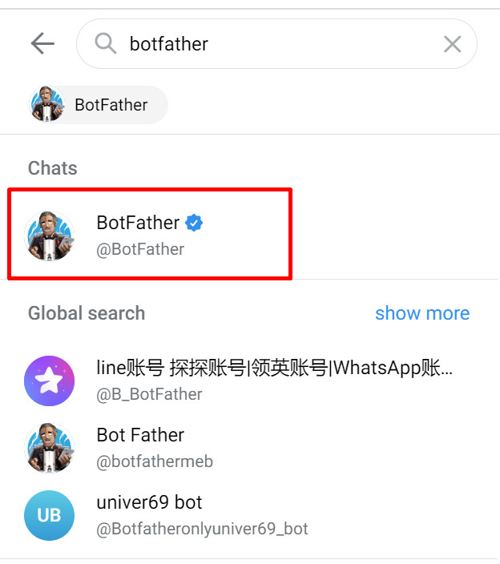
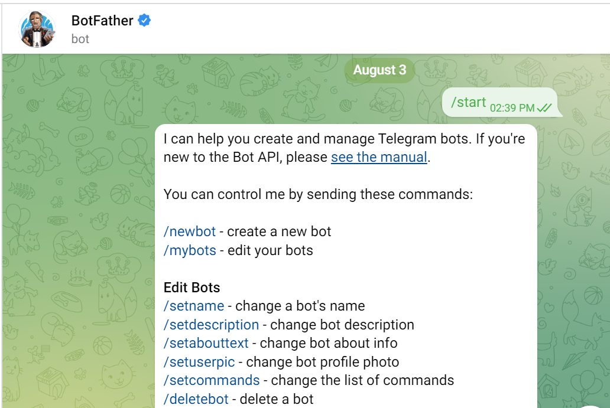
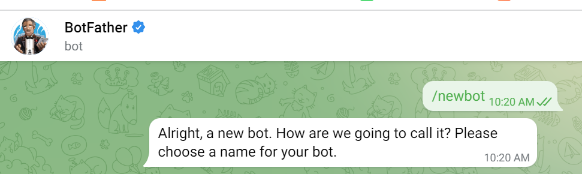
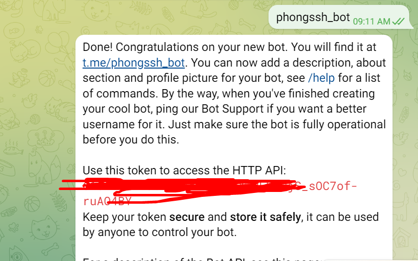
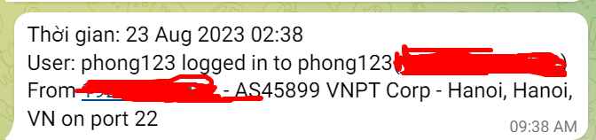

# ***1. Tìm hiểu về Bot Telegram***
## ***1.1 Bot Telegram là gì***
Bot Telegram là phần mềm tự động tương tác với người dùng trong ứng dụng Telegram
Bot Telegram là giống như một robot có sẵn trong ứng dụng nhằm giúp người dùng tạo lập và quản lý các bot.

## ***1.2 Chức năng của Bot***

Bot Telegram là một chương trình được lập trình để tự động hóa các tương tác giữa người dùng và ứng dụng Telegram. Bot Telegram có thể được sử dụng để thực hiện các nhiệm vụ đơn giản hoặc phức tạp, bao gồm gửi tin nhắn, đăng bài viết, tìm kiếm thông tin, cập nhật tin tức và thực hiện các tác vụ khác.
## ***1.3 Cách khởi tạo Telegram Bot***
1. Tại thanh tìm kiếm hãy nhập Botfather
2. Click vào Botfather có tích xanh.

3. Nhập `/start` để bắt đầu 

4. Nhập `/newbot` để bắt đầu tạo bot


5. Nhập tên bot cần tạo



# ***2. Viết script “Hello world!!!” để Bot gửi qua Telegram***
1. Tạo file hello.sh
2. Cấp quyền thực thi cho file hello.sh ```chmod +x hello.sh```
3. chạy file hello.sh ```./hello.sh```


# ***3. Viết script cảnh báo có user ssh vào máy ảo***
1. Cài đặt ```jq```

```apt-get -y install jq```
2. Tạo file scrip sshbot.sh

```vi /etc/profile.d/sshbot.sh```
3. Thêm thông tin vào file sshbot.sh
4. Cấp quyền thực thi cho sshbot.sh
```chmod +x /etc/profile.d/sshbot.sh```

4. Đăng nhập lại và kiểm tra 



# ***Viết script thông báo ngày sinh nhật của các thành viên thực tập***

1. Tạo file sinhnhat.sh và file sinhnhat.txt
2. Cấp quyền cho file sinhnhat.sh
3. Thêm thông tin vào file sinhnhat.sh và thông tin ngày sinh nhật vào file sinhnhat.txt

4. Tao
# ***Tài liệu tham khảo***
<https://news.cloud365.vn/script-3-giam-sat-truy-cap-ssh-vao-he-thong/>


