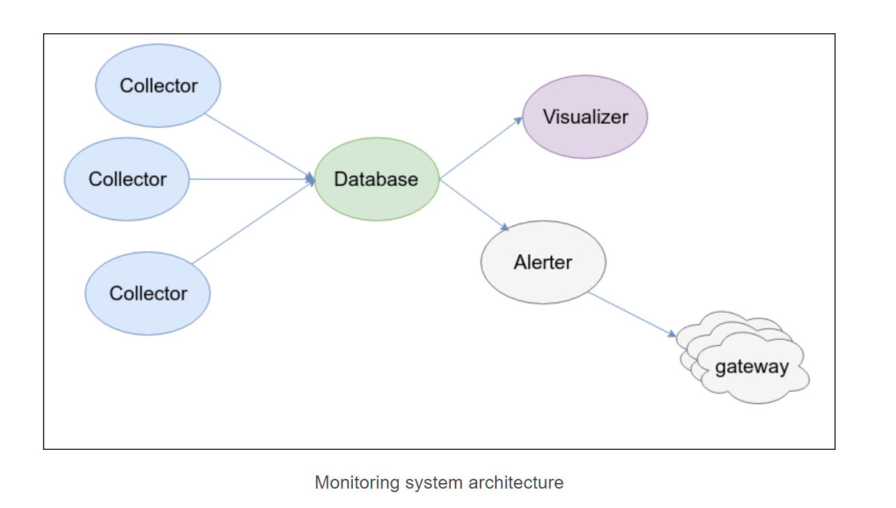

# ***Khái niệm***
Monitoring trong Linux là quá trình giám sát và theo dõi hoạt động của hệ thống Linux, bao gồm cả phần cứng và phần mềm, để đảm bảo sự ổn định, hiệu suất và bảo mật của hệ thống. Monitoring giúp người quản trị hệ thống có cái nhìn tổng quan về các thành phần và hoạt động của hệ thống để phát hiện và xử lý các vấn đề sớm, tránh sự cố và giảm thiểu thời gian chết hệ thống.
# ***Ứng dụng monitoring***
1. Giám sát tài nguyên hệ thống: Theo dõi sử dụng CPU, bộ nhớ, đĩa cứng, mạng và các tài nguyên khác để xác định hiệu suất hệ thống và phát hiện tình trạng quá tải.

2. Giám sát tiến trình: Theo dõi các tiến trình đang chạy trên hệ thống, kiểm tra tình trạng hoạt động, sử dụng tài nguyên và xác định các tiến trình gây ra vấn đề.

3. Giám sát log: Theo dõi các tập tin log của hệ thống để phát hiện thông tin quan trọng, lỗi, cảnh báo và hoạt động bất thường.

4. Giám sát mạng: Theo dõi lưu lượng mạng, kết nối và các giao thức mạng để phát hiện sự cố, tấn công mạng và theo dõi hiệu suất mạng.

5. Giám sát bảo mật: Theo dõi các lỗ hổng bảo mật, các cuộc tấn công và các hoạt động đáng ngờ để đảm bảo an ninh của hệ thống.
# ***Thành phần***

1. Collector: Được cài trên các máy agent (các máy muốn monitor), có nhiệm vụ collect metrics của host và gửi về database. Ví dụ: Cadvisor, Telegraf, Beat, ...
2. Database: Lưu trữ các metrics mà colletor thu thập được, thường thì chúng ta sẽ sử dụng các time series database. Ví dụ ElasticSearch, InfluxDB, Prometheus, Graphite (Whisper)
3. Visualizer: Có nhiệm vụ trực quan hóa các metrics thu thập được qua các biểu đồ, bảng, .... Ví dụ: Kibana, Grafana, Chronograf
4. Alerter: Gửi thống báo đến cho sysadmin khi có sự cố xảy ra

