# ***Lệnh `top`***
Lệnh "top" là một công cụ dòng lệnh được sử dụng để hiển thị thông tin về tài nguyên hệ thống và quá trình đang chạy trên hệ thống. Khi chạy lệnh "top", bạn sẽ thấy một giao diện tương tự bảng điều khiển, hiển thị các thông số cơ bản như tải CPU, sử dụng bộ nhớ, quá trình đang chạy và nhiều thông tin khác.
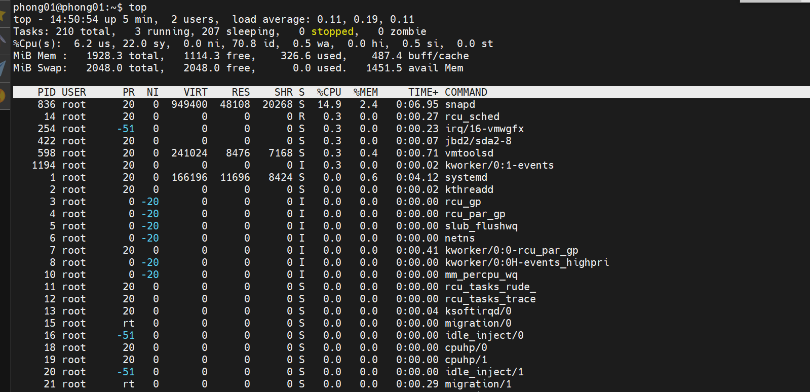
## ***Các thông số quan trọng mà `top` hiển thị bao gồm:***
1. Câu lệnh này trả về các thông tin:
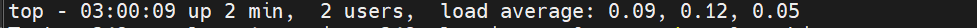
- `top` câu lệnh thực hiện
- `03:00:09` thời gian hệ thống
- `up 2 min` thời gian truy cập hệ thống
- `Load everage` cho ta thấy được trung bình khối lượng công việc hệ thống phải xử lý trong mỗi khoảng thời gian 1 phút, 5 phút và 15 phút

2. Câu lệnh này trả về các thông tin:
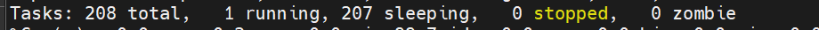
- `208 total`: Tổng số tiến trình
- `1 running`: Tiến trình đang chạy
- `207 sleeping`: Tiến trình đang chờ hoạt động
- `0 stopped`: Tiến trình đã dừng
- `0 zombie`: Tiến trình con đang hoạt động mà tín hiệu đã đã dừng
3. Câu lệnh này trả về các thông tin:

```%Cpu(s):  0.0 us,  0.2 sy,  0.0 ni, 99.7 id,  0.0 wa,  0.0 hi,  0.2 si,  0.0 st```
- ```%Cpu(s)```: Tỷ lệ sử dụng CPU cho các loại hoạt động khác nhau
- ```0.0 us```: Không có thời gian CPU được sử dụng cho các tiến trình người dùng.
- ```0.2 sy```: 0.2% thời gian CPU được sử dụng cho các hoạt động hệ thống.
- ```0.0 ni```: Không có thời gian CPU được sử dụng cho các tiến trình có ưu tiên thay đổi.
- ```99.7 id```: 99.7% thời gian CPU không được sử dụng (trạng thái rảnh).
- ```0.0 wa```: Không có thời gian CPU chờ đợi I/O hoàn thành.
- ```0.0 hi```: Không có thời gian CPU được sử dụng cho kết nối phần cứng.
- ```0.2 si```: 0.2% thời gian CPU được sử dụng cho các tác vụ phần mềm.
- ```0.0 st```: Không có thời gian CPU bị gián đoạn
4. Câu lệnh này trả về các thông tin:

```MiB Mem :   1928.3 total,   1337.4 free,    288.9 used,    302.0 buff/cache```
- ```MiB Mem```: Thông tin về sử dụng bộ nhớ
- ```1928.3 total```: Tổng dung lượng bộ nhớ trong hệ thống là 1928.3 MiB.
- ```1337.4 free```: Có 1337.4 MiB bộ nhớ tự do, chưa được sử dụng.
- ```288.9 used```: Có 288.9 MiB bộ nhớ đã được sử dụng.
- ```302.0 buff/cache```: Có 302.0 MiB bộ nhớ đang được sử dụng cho bộ đệm (buffer) và bộ nhớ cache.

5. Câu lệnh này trả về các thông tin

```MiB Swap:   2048.0 total,   2048.0 free,      0.0 used.   1456.3 avail Mem```
- ```MiB Swap```: Thông tin về sử dụng Swap (phân vùng trao đổi) trong hệ thống
- ```2048.0 total```: Tổng dung lượng Swap có sẵn trong hệ thống là 2048.0 MiB.
- ```2048.0 free```: Có 2048.0 MiB Swap không được sử dụng.
- ```0.0 used```: Không có Swap nào đã được sử dụng.
- ```1456.3 avail Mem```: Có 1456.3 MiB bộ nhớ khả dụng cho các quá trình trong hệ thống.


- %CPU: Phần trăm sử dụng CPU của mỗi quá trình.
- %MEM: Phần trăm sử dụng bộ nhớ của mỗi quá trình.
- VIRT: Tổng lượng bộ nhớ ảo sử dụng bởi quá trình.
- RES: Lượng bộ nhớ thực tế đang sử dụng bởi quá trình.
- SHR: Lượng bộ nhớ được chia sẻ bởi quá trình.
- PID: ID của quá trình.
- USER: Người dùng sở hữu quá trình.
- COMMAND: Tên của quá trình.

## ***Các option lệnh `top`***
1.  `-d <delay>`: Thiết lập thời gian chờ giữa các lần làm mới của giao diện top. Mặc định là 3 giây.
ví dụ: ```top -d 5```

2. `-n <iterations>`: Đặt số lần làm mới giao diện top trước khi thoát.
ví dụ: ```top -n 10```

3. `-p <pid(s)>`: Hiển thị thông tin chỉ về các quá trình có các PID được chỉ định, thay vì hiển thị tất cả các quá trình.
ví dụ: ```top -p 1234,5678```
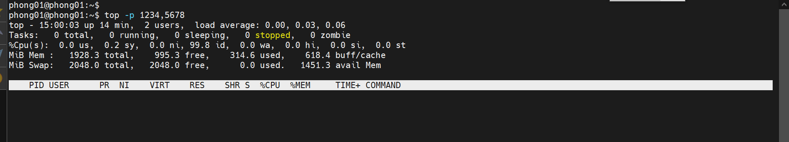
4. `-c`: Hiển thị tên đầy đủ của các tiến trình thay vì chỉ hiển thị tên ngắn gọn.
ví dụ: ```top -c```
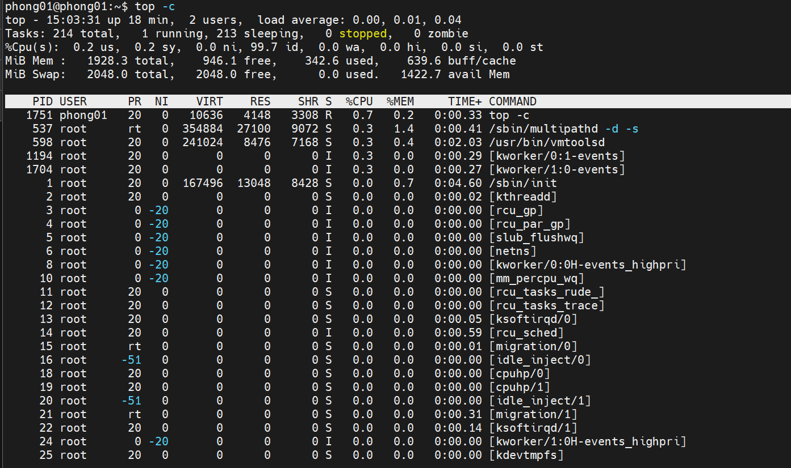
5. `-u <username>`: Chỉ hiển thị các quá trình thuộc về người dùng cụ thể.
ví dụ: ```top -u phong01```

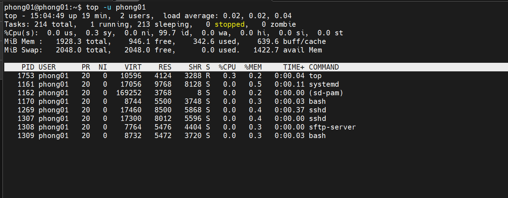


## ***Sắp xếp quy trình***
```M```. _ Sắp xếp theo %MEMcột.
```N```. _ Sắp xếp theo PIDcột.
```T```. _ Sắp xếp theo TIME+cột.
```P```. _ Sắp xếp theo %CPUcột.

## ***Thay đổi nội dung đầu ra***
### ***Thống kê lõi CPU riêng lẻ***
Nhấn phím `1` trên bàn phím cho phép bạn xem số liệu thống kê riêng cho từng lõi CPU. Nhấn phím 1 liên tục để chuyển đổi số liệu thống kê cốt lõi.
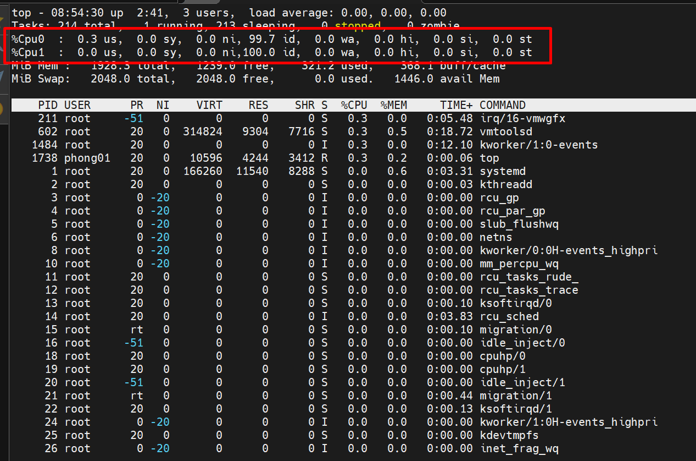
### ***Biểu đồ sử dụng CPU***
Nếu bạn muốn biểu diễn đồ họa về mức sử dụng CPU, biểu thị từng mức sử dụng lõi CPU. Bật hoặc tắt biểu đồ bằng cách nhấn `t` .
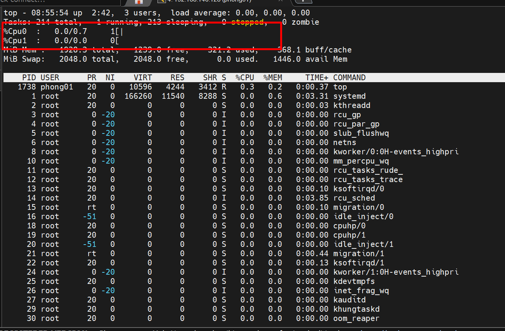
Để thay đổi hiển thị biểu đồ thành các ký tự khối liền nét, nhấn `t `lần nữa.
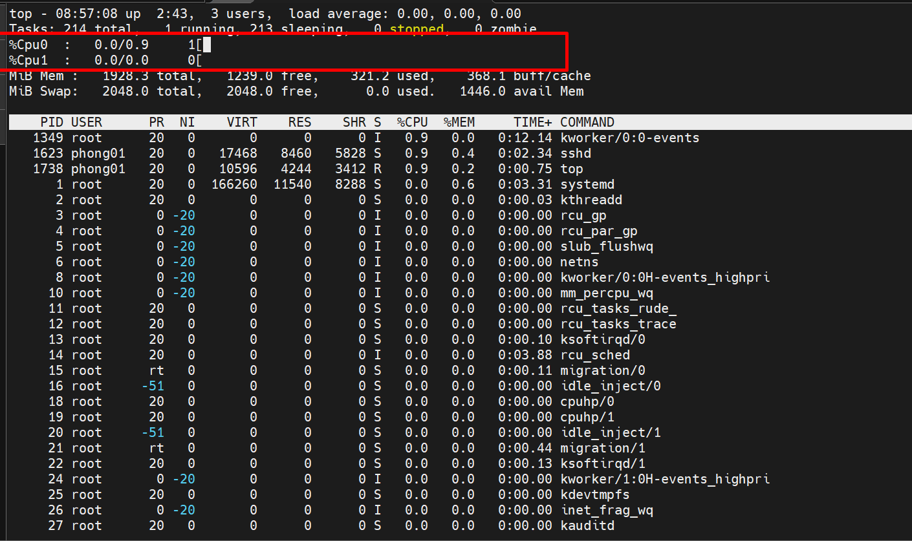
Nhấn t lần nữa để xóa phần hiển thị CPU và tóm tắt tác vụ.
### ***Biểu đồ sử dụng bộ nhớ***
Lệnh này cũng hỗ trợ các tùy chọn hiển thị đồ họa của bộ nhớ và các dòng bộ nhớ trao đổi. Để có được hình ảnh trực quan về việc sử dụng bộ nhớ , hãy nhấn `m` . Xóa các dòng bằng cách nhấn m lần nữa.
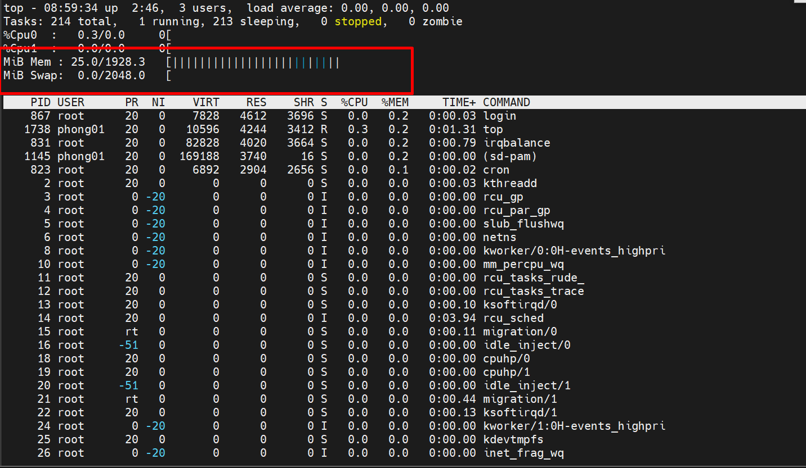
### ***Thay đổi màu văn bản***
Nhấn phím `z` để thêm màu cho màn hình. Theo mặc định, màu sẽ chuyển sang màu đỏ. 
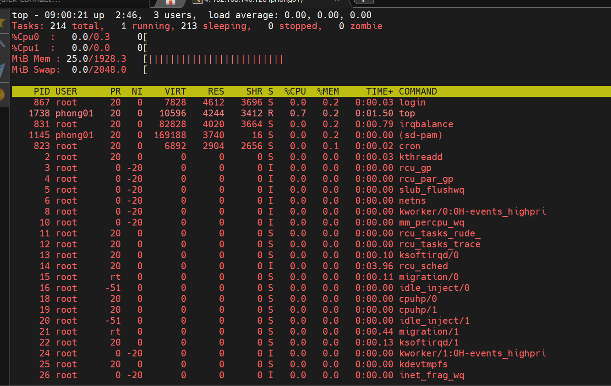
Để tùy chỉnh thêm các thành phần hiển thị và chọn màu khác, hãy làm theo các bước bên dưới:
1. Mở trang cài đặt màu bằng cách nhấn Z 
2. Chọn thành phần hiển thị bạn muốn thay đổi bằng cách nhấn:

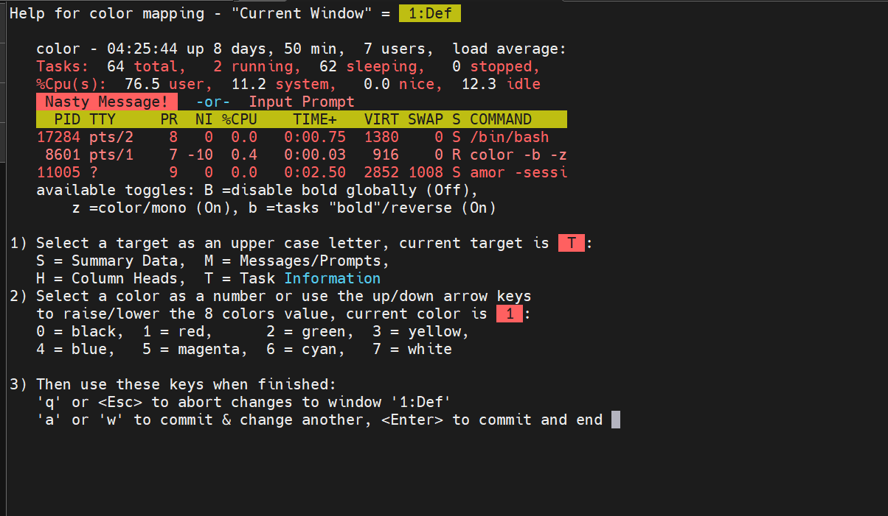

- S. _ Vùng dữ liệu tóm tắt
- M. _ Tin nhắn và lời nhắc.
- H. _ Tiêu đề cột.
- T. _ Thông tin nhiệm vụ trong danh sách quy trình.

1. Chọn màu cho phần tử được chọn bằng một trong các phím sau:

- 0 . Đen.
- 1 . Màu đỏ.
- 2 . Màu xanh lá.
- 3 . Màu vàng.
- 4 . Màu xanh da trời.
- 5 . Màu đỏ tươi.
- 6 . Lục lam.
- 7 . Trắng.

### ***Hiển thị dòng lệnh quy trình****
Để xem dòng lệnh đầy đủ thay vì tên tiến trình, hãy nhấn phím `c `. Để chuyển trở lại hiển thị tên quy trình, nhấn c lần nữa.
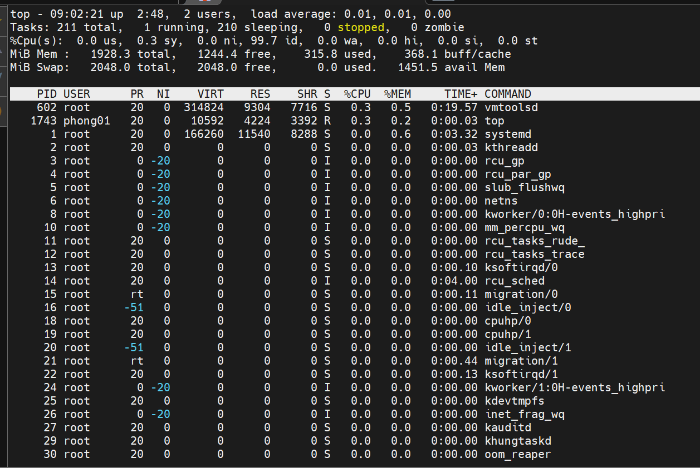
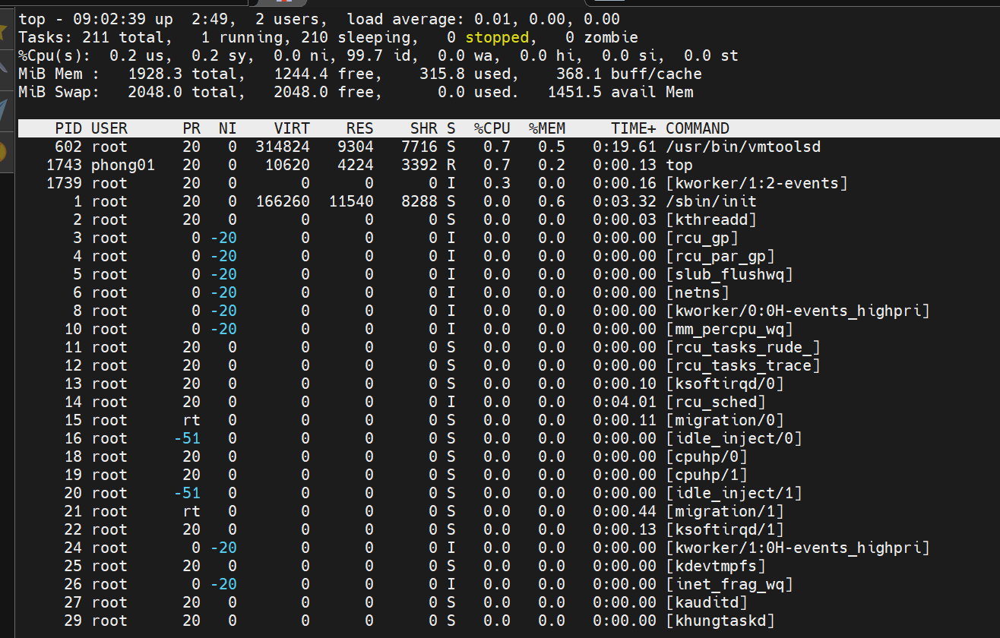
### ***Xem phân cấp quy trình***
Để xem tiến trình nào được khởi chạy hoặc sinh ra bởi các tiến trình khác, hãy nhấn phím `V`
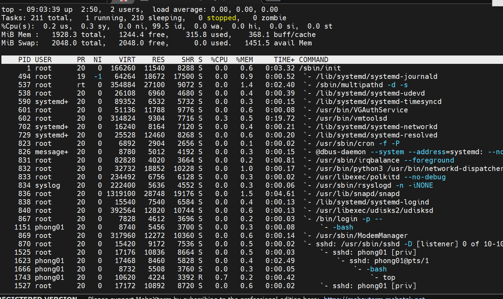
### ***Hiển thị các tác vụ đang hoạt động***
Để lọc đầu ra và chỉ hiển thị các tác vụ đang hoạt động, hãy nhấn phím `l`.
### ***Giới hạn số quy trình***
Nhấn phím `n` để giới hạn số tiến trình ở đầu ra. Bất kể số lượng tiến trình đang hoạt động. topnhắc bạn nhập số lượng quy trình bạn muốn xem.
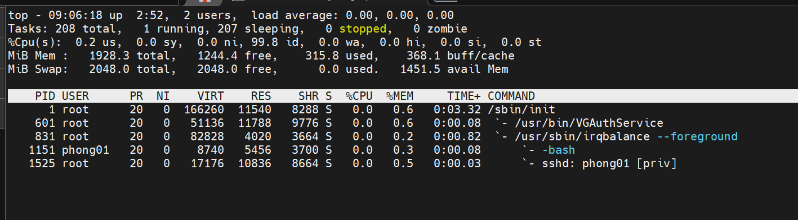

### ***Quy trình lọc***
Tính năng bộ toplọc cho phép sử dụng biểu thức lọc để giới hạn những quy trình nào sẽ xem trong danh sách. Kích hoạt tùy chọn bộ lọc bằng cách nhấn phím `o` . Chương trình sẽ nhắc bạn nhập biểu thức lọc
