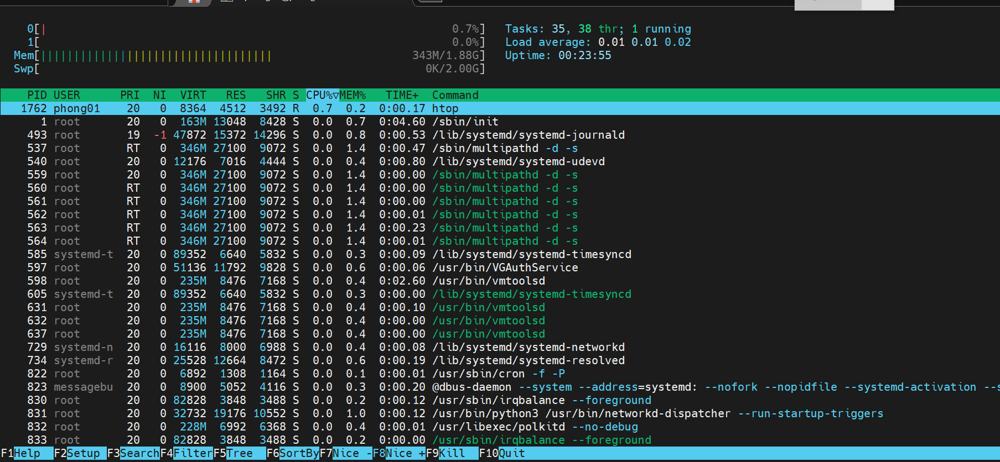
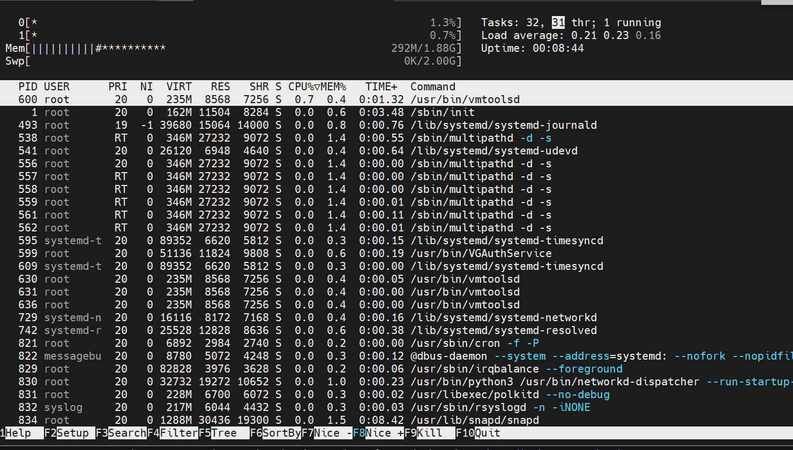
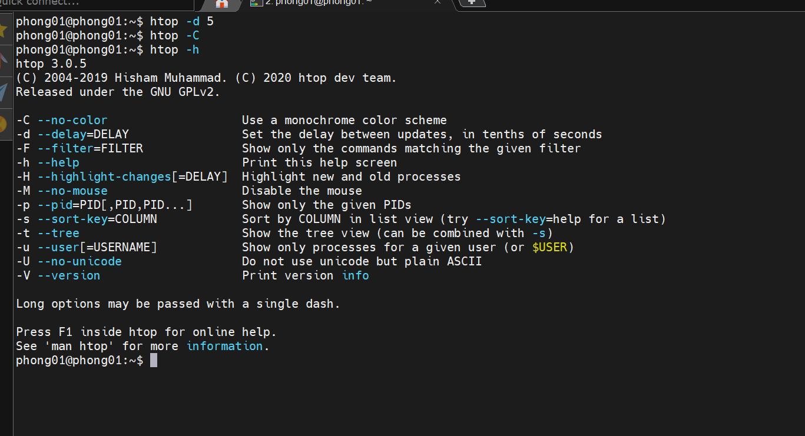
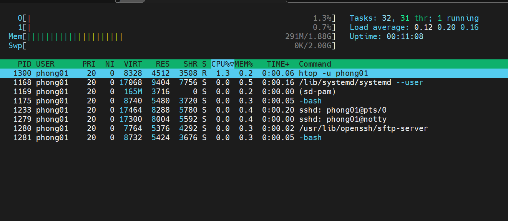
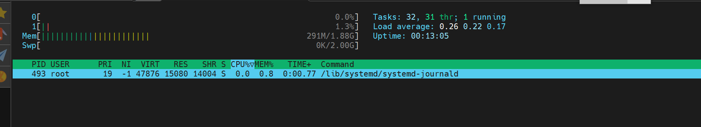
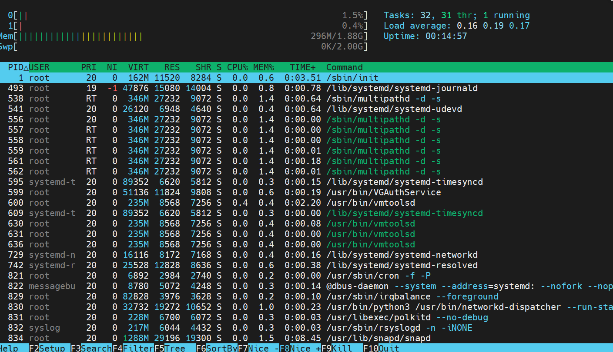

# ***Lệnh `htop`***
Lệnh `htop` là một công cụ dòng lệnh được sử dụng để hiển thị thông tin về tài nguyên hệ thống và quá trình đang chạy trên Linux. `htop` cung cấp một giao diện tương tác người dùng đồ họa (có màu sắc) và có nhiều tính năng mở rộng so với lệnh `top`.

## ***Các thông số xuất hiện***
### ***Mức dùng CPU***
Thanh tiến trình CPU thẻ hiện mức dùng CPU của hệ thống. Số lượng thanh tiến trình CPU tương ứng với số lượng CPU/Core của máy chủ. Thanh tiến trình bao gồm các màu khác nhau. Mỗi màu thể hiện một ý nghĩa riêng:

- Xanh lam: các tiến trình độ ưu tiên thấp
- Xanh lục: các tiến trình người dùng (user)
- Đỏ: các tiến hành hạt nhân (kernel)
- Vàng: thời gian IRQ
- Đỏ tươi: thời gian Soft IRQ
- Xám: thời gian chờ IO

### ***Mức dùng bộ nhớ RAM***
Bên dưới thanh tiến trình CPU là thanh bộ nhớ RAM và Swap. Hai thanh này cũng có các màu sắc thể hiện một ý nghĩa:

- Xanh lục: bộ nhớ đã dùng
- Xanh dương: bộ nhớ đệm
- Vàng: bộ nhớ cache

### ***Tải trung bình***
Systemload hay còn gọi là load thể hiện số công việc hiện tại hệ thống đang thực thi
Load everage cho ta thấy được trung bình khối lượng công việc hệ thống phải xử lý trong mỗi khoảng thời gian 1 phút, 5 phút và 15 phút
### ***Thông tin tiến trình***

Ý nghĩa từng cột giá trị như sau:

- `PID`: Số PID của tiến trình. Mỗi tiến trình sẽ có PID riêng
- `USER`: Chủ sở hữu tiến trình
- `PRI`: Độ ưu tiên của tiến trình. Số càng thấp thì mức độ ưu tiên càng cao
- `NI`: Giá trị nice value của tiến trình, ảnh hưởng đến độ ưu tiên của tiến trình đó
- `VIRT`: Bộ nhớ ảo đang được sử dụng cho tiến trình
- `RES`: Bộ nhớ RAM vậy lý đang được sử dụng, đo bằng kylobytes
- `SH`: Bộ nhớ chia sẻ mà tiến trình đang sử dụng
- `S`: Trạng thái hiện tại của tiến trình (zombied, sleeping, running, uninterruptedly sleeping, traced)
- `% CPU`: Phần trăm tài nguyên CPU đang được tiến trình sử dụng
- `% MEM`: Phần trăm bộ nhớ RAM đang được tiến trình sử dụng
- `TIME +`: Thời gian bộ xử lý mà tiến trình đã sử dụng
- `COMMAND`: Tên lệnh bắt đầu tiến trình

### ***Các option sử dụng***
1. `–d – delay` (hiển thị độ trễ giữa các bản cập nhật, tính bằng 1/10 giây).
```htop -d 5```

2. `–C – no-color` (chế độ đơn sắc)
```htop -C```

3. `–h – help` (hiển thị thông báo trợ giúp và thoát)

```htop -h```

4. `–u – user=USERNAME` (chỉ hiển thị các tiến trình của một người dùng nhất định)

```htop -u phong01```

5. `–h – pid=PID` (chỉ hiển thị các PID đã cho)

```htop -p 493```

6. `–s – sort-key COLUMN` (Sắp xếp theo cột này)

```htop -s PID```

