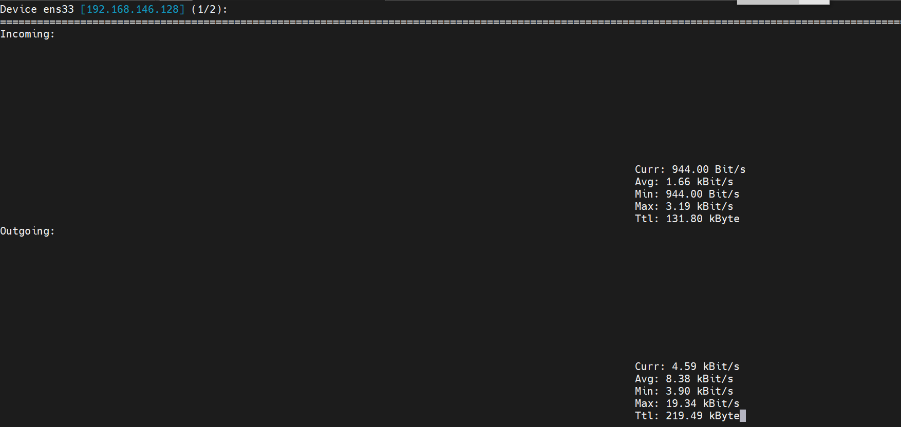
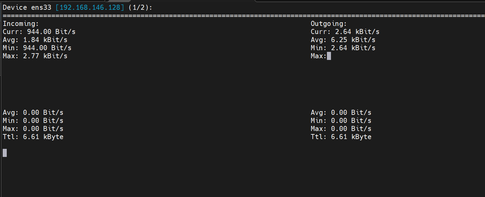
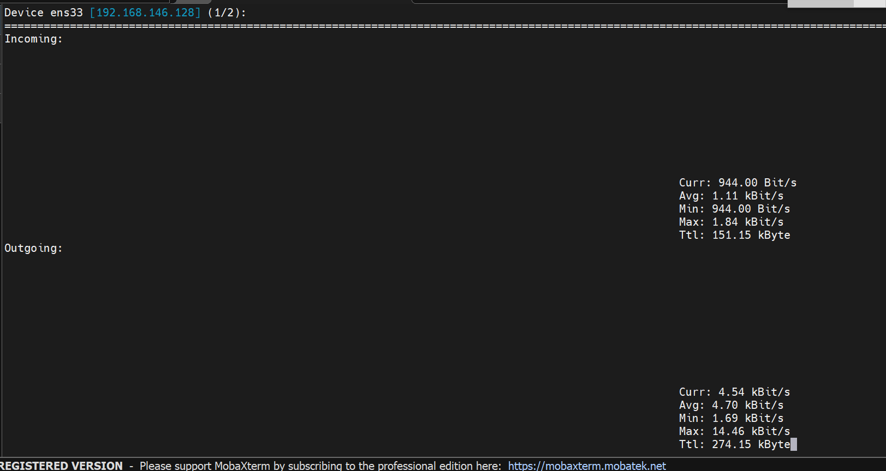
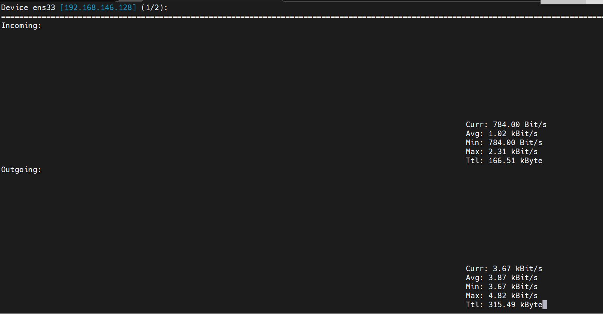

# ***khái niệm***
`nload` là một công cụ trên Linux để theo dõi lưu lượng mạng và mức băng thông sử dụng thời gian thực. Nó giúp bạn theo dõi lưu lượng IN(đến) và OUT(đi) bằng cách sử dụng đồ thị và cung cấp nhiều thông tin bổ sung như tổng lượng dữ liệu được truyền tải và mức sử dụng mạng trung bình/tối thiểu/tối đa.


## ***Các thông tin hiển thị***
1. Incoming và Outgoing: Nload hiển thị lưu lượng mạng đến (incoming) và đi (outgoing) trên giao diện mạng được chỉ định. Đây là các chỉ số chính để theo dõi lưu lượng mạng.
2. Current: Nload hiển thị lưu lượng mạng hiện tại (current) tại thời điểm hiển thị.
3. Total: Nload hiển thị tổng lưu lượng mạng (incoming + outgoing) trên giao diện mạng.
4. Average: Nload tính toán và hiển thị lưu lượng mạng trung bình (average) trong một khoảng thời gian nhất định.

   
## ***Các option:***
- 1. -m: Hiển thị nhiều card cùng lúc

```nload -m```

- 2. -a: đặt độ dài tính bằng giây của cửa sổ thời gian để tính trung bình (mặc định là 300)

```nload -a 400```


- 3. -t: Thay đổi thời gian làm mới interval theo mili giây. Mặc định là 500 (nếu giảm xuống dưới 100 thì giá trị sẽ không chính xác.)

```nload -ma 400 -t 600```

- 4. devices: Có thể chỉ định card mạng cụ thể bằng lệnh sau: (Mặc định là tất cả các card mạng)


``` nload devices ens33```

