# ***khái niệm***
Lệnh free cung cấp thông tin  dung lượng bộ nhớ chiếm dụng (tổng dung lượng đã chiếm dụng, chưa chiếm dụng, tổng dung lượng bộ nhớ...)
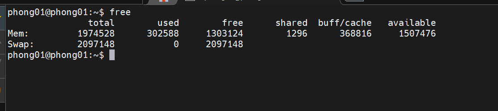

## ***các thông tin hiển thị***
1. `Total` – Con số này đại diện cho tổng dung lượng bộ nhớ có thể được sử dụng bởi các ứng dụng.
2. `used` – Bộ nhớ đã sử dụng. Nó được tính như sau: `used = total - free - buffers - cache`
3. `free` – Bộ nhớ trống / không sử dụng.
4. `shared` – Cột này có thể bị bỏ qua vì nó không có nghĩa. Nó ở đây chỉ để tương thích ngược.
5. `buff / cache` – Bộ nhớ kết hợp được sử dụng bởi bộ đệm hạt nhân và bộ đệm trang và phiến. Bộ nhớ này có thể được lấy lại bất cứ lúc nào nếu ứng dụng cần. Nếu bạn muốn bộ đệm và bộ đệm được hiển thị trong hai cột riêng biệt, hãy sử dụng tùy chọn -w.
6. `available` – Ước tính dung lượng bộ nhớ có sẵn để khởi động các ứng dụng mới mà không cần hoán đổi.

## ***Các option sử dụng***
1. `-b, --bytes`– Hiển thị đầu ra theo byte.

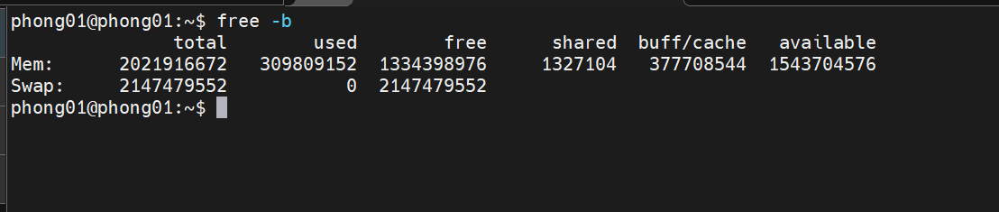
2. --kilo – Hiển thị đầu ra theo kilobyte (1KB = 1000byte).

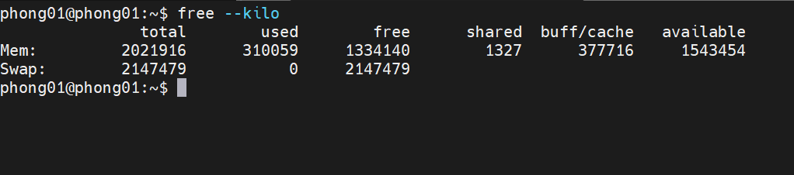
3. `--mega` – Hiển thị đầu ra tính bằng megabyte.

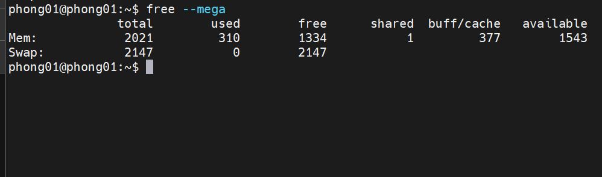
4. `--giga` – Hiển thị đầu ra tính bằng gigabyte.
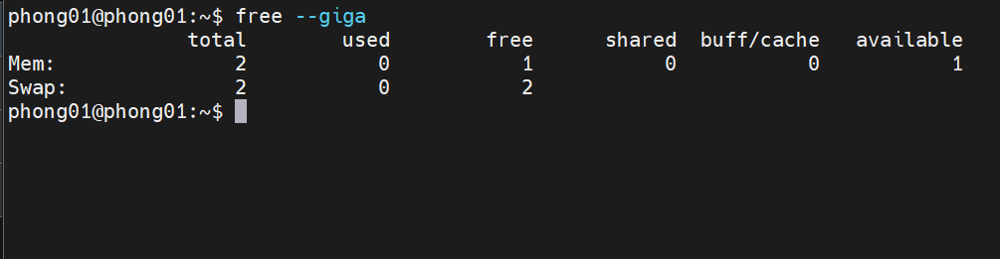

5. `--tera` – Hiển thị đầu ra tính bằng terabyte.

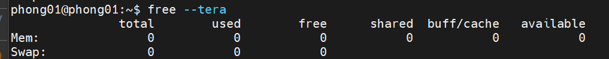
6. `-k, --kibi`– sản lượng hiển thị ở kibibytes. (1KiB = 1024byte). Đây là đơn vị mặc định.

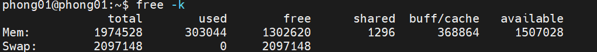
7. `-m, --mebi`– sản lượng hiển thị ở mebibytes.

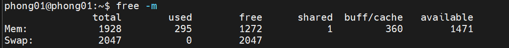
8. `-g, --gibi`– sản lượng hiển thị ở gibytes.
9.  `--tebi` – Hiển thị đầu ra tính bằng tebibyte.

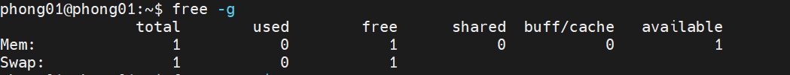
10. `--pebi` – Hiển thị đầu ra theo pebibyte

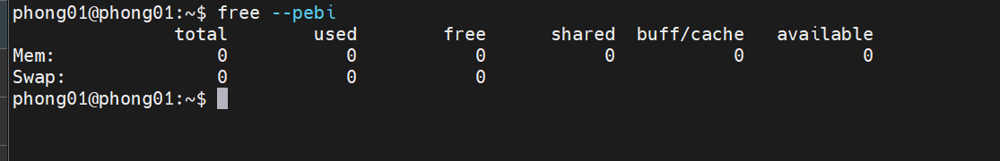
11.  `-h`: Hiển thị đầu ra theo megabyte và gigabyte
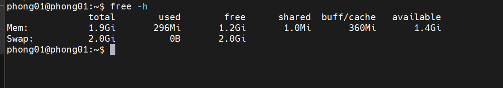

