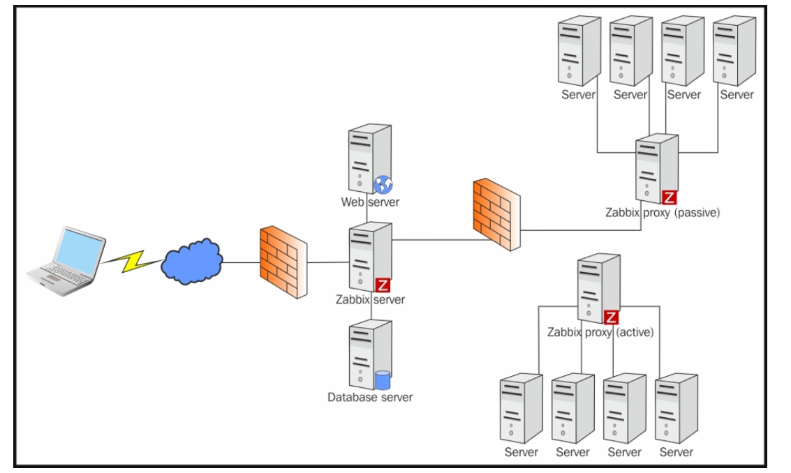

# ***Tìm hiểu Zabbix***
1. Zabbix được tạo ra bởi Alexei Vladyshev và đang được Zabbix SIA tích cực phát triển và hỗ trợ
2. Zabbix là giải pháp phân tán nguồn mở cấp doanh nghiệp 
3. Zabbix là phần mềm theo dõi tình trạng và tính toàn vẹn của nhiểu tham số của mạng và máy chủ
4. Zabbix sử dụng cơ chế thông báo linh hoạt cho phép người dùng cấu hình cảnh báo qua e-mail cho các hoạt động. Điều này cho phép phản ứng nhanh với các sự cố máy chủ
5. Zabbix cung cấp các tính năng báo cáo và trực quan hóa dữ liệu dựa trên dữ liệu đã lưu trữ

## ***Các tính năng của Zabbix***
## ***Ưu điểm của Zabbix***
1. Giám sát server và thiết bị mạng
2. Dễ dàng thao tác và cấu hình 
3. Hỗ trợ máy chủ Window, Linux...
4. Đáng tin cậy trong việc chứng thực người dùng
5. Linh hoạt trong việc phân quyền người dùng
6. Thông báo sự cố qua email và SMS
7. Có biểu đồ theo dõi và báo cáo
8. Mã nguồn mở và chi phí thấp

## ***Các thành phần cơ bản của Zabbix***

### ***Zabbix Server***
Đây là thành phần trung tâm của phần mềm Zabbix.Zabbix-server có thể kiểm tra các dịch vụ mạng từ xa thông qua các báo cáo của Zabbix agent gửi về cho Zabbix-server và từ đó nó sẽ lưu trữ tất cả các cấu hình cũng như các số liệu thông kê
### ***Zabbix-agent***
Để giám sát chủ động các thiết bị cục bộ và các ứng dụng trên hệ thống mạng. Zabbix-agent sẽ được cài lên trên server và từ đó Zabbix-agent sẽ thu thập thông tin hoạt động từ Server mà nó đang chạy và báo cáo dữ liệu này đến Zabbix-server để xử lý
### ***Web interface***
Để dễ dàng truy cập dữ liệu theo dõi và sau đó cấu hình từ giao diện web cung cấp. Giao diện là một phần của Zabbix-server

# ***Tài liệu tham khảo***

<https://hocchudong.com/zabbix-phan-1-gioi-thieu-ve-giai-phap-giam-sat-zabbix/>
<https://viblo.asia/p/tong-quan-ve-zabbix-KE7bGo04v5e2>
<https://nhanhoa.com/tin-tuc/zabbix-la-gi.html>