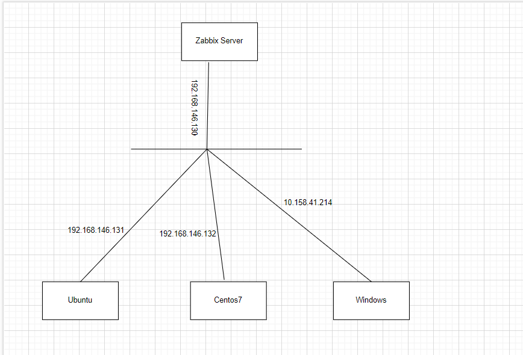
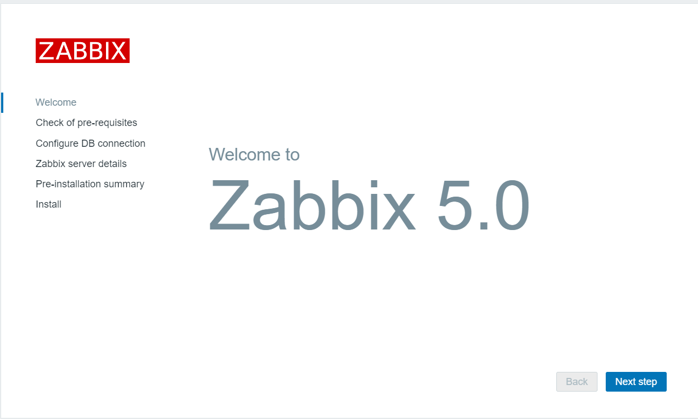
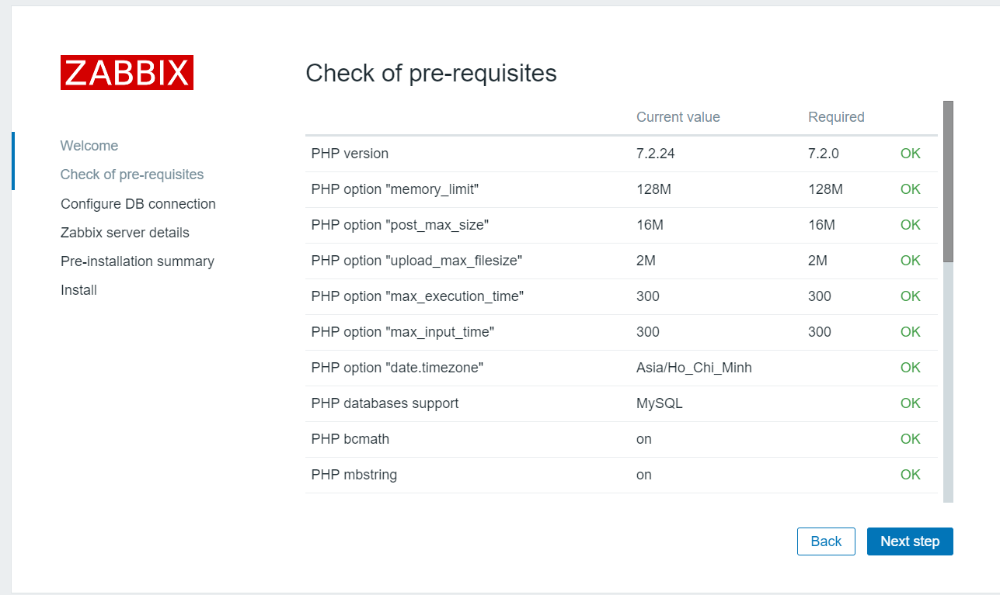
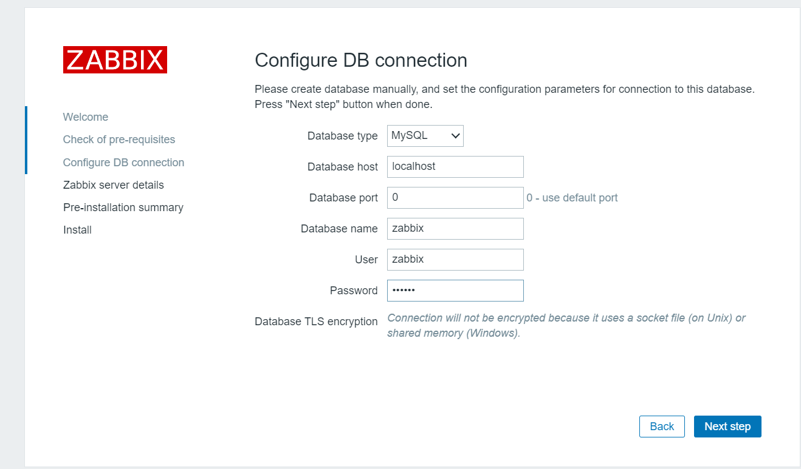
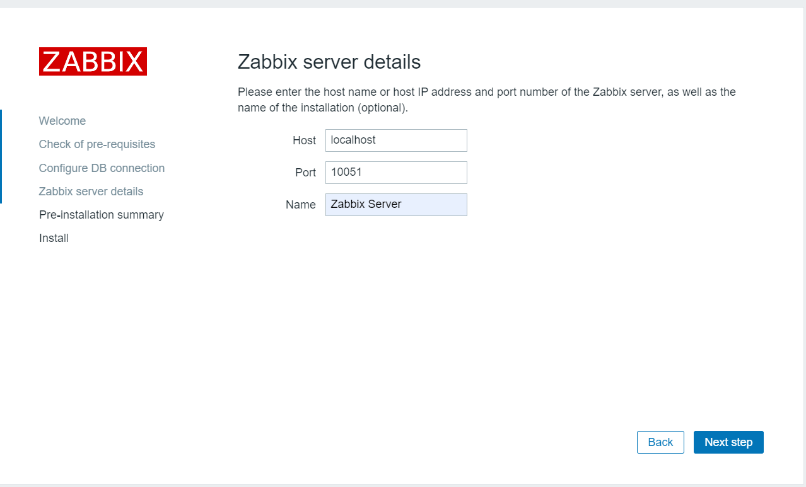
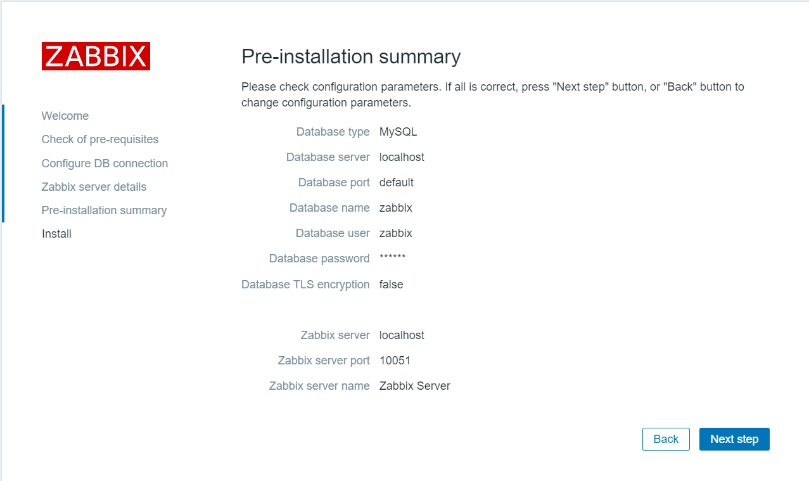
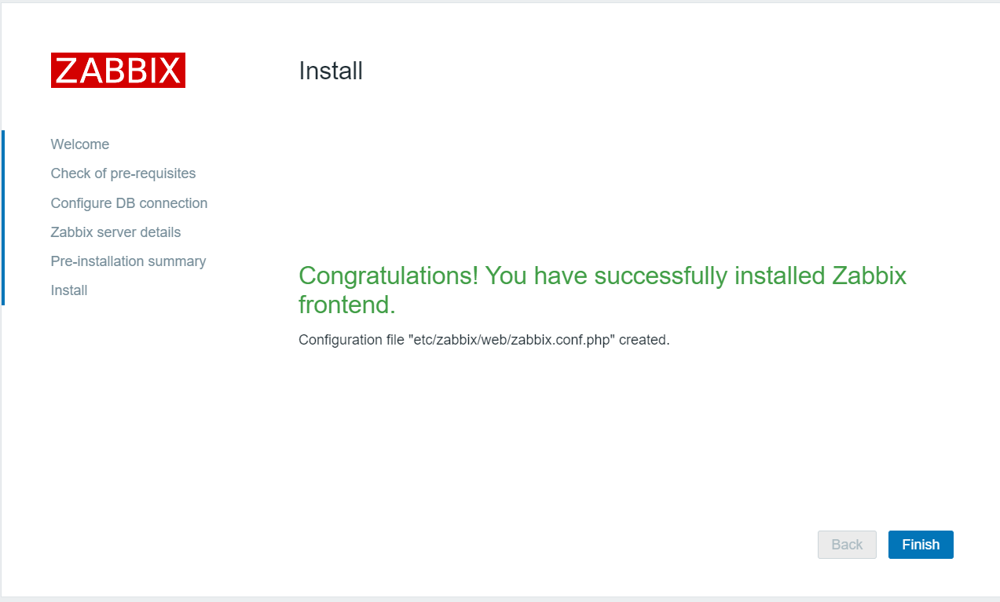
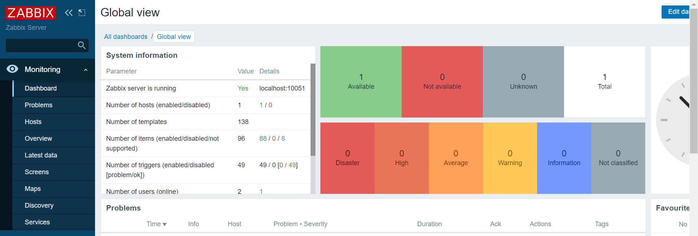

# ***Mô hình triển khai***



# ***1.Thực hiện tắt Firewalld và SElinux***
```
systemctl disable firewalld
systemctl stop firewalld
sed -i 's/SELINUX=enforcing/SELINUX=disabled/g' /etc/sysconfig/selinux
setenforce 0
```
# ***2. Cài đặt MariaDB 10.5***
## ***2.1 Tạo Repo MariaDB***
```
cat << EOF > /etc/yum.repos.d/MariaDB.repo
[mariadb]
name = MariaDB
baseurl = http://yum.mariadb.org/10.5/centos7-amd64
gpgkey=https://yum.mariadb.org/RPM-GPG-KEY-MariaDB
gpgcheck=1 
EOF
```
## ***2.2 Cài đặt MariaDB***
```
yum -y install MariaDB-server MariaDB-client
systemctl start mariadb
systemctl enable mariadb
systemctl status mariadb
```
## ***2.3 Tạo Database cho Zabbix***
```
mysql -u root -p
create database zabbix character set utf8 collate utf8_bin;
create user zabbix@localhost identified by 'zabbix';
grant all privileges on zabbix.* to zabbix@localhost;
quit;
```
# ***3. Cài đặt zabbix server***
## ***3.1 Cài đặt bằng package. Cài đặt gói cấu hình***
```
rpm -Uvh https://repo.zabbix.com/zabbix/4.4/rhel/7/x86_64/zabbix-release-4.4-1.el7.noarch.rpm
```
## ***3.2 Cài đặt Zabbix Server***
```
yum -y install zabbix-server-mysql
```
## ***3.3 Import databases***
```
zcat /usr/share/doc/zabbix-server-mysql*/create.sql.gz | mysql -uzabbix -p zabbix
```
## ***3.4 Cấu hình zabbix-server***
```
DBHost=localhost
DBName=zabbix
DBUser=zabbix
DBPassword=zabbix
```
Trong đó:

- DBHost: localhost (cài trên cùng host với zabbix-server)
- DBName: Tên của database
- DBUser=Tên của user databases tạo ở trên
- DBPassword: Password của user databases tạo ở trên

## ***3.5 Khởi động dịch vụ zabbix-server***
```
systemctl start zabbix-server
systemctl enable zabbix-server
```

## ***3.6 Khởi động lại dịch vụ httpd***
```
service httpd restart
```
# ***4. Truy cập và cấu hình zabbix-web***
Mở trình duyệt web và truy cập http://IP-server/zabbix bạn sẽ thấy như sau:

Chọn ***Next step***

Chọn ***Next step***

Điền đúng các thông tin khai báo, Chọn ***Next step***

Chọn ***Next step***

Chọn ***Next step***

Chọn ***Finish***



# ***Tài liệu tham khảo***
<https://hocchudong.com/zabbix-phan-2-huong-dan-cai-dat-zabbix-server-zabbix-agent-tren-centos7/>
<https://viblo.asia/p/zabbix-1-cai-dat-zabbix-server-50-tren-centos-7-Rk74avxkJeO>
<https://kb.kdata.vn/zabbix-cai-dat-zabbix-server-tren-centos-7-701/>