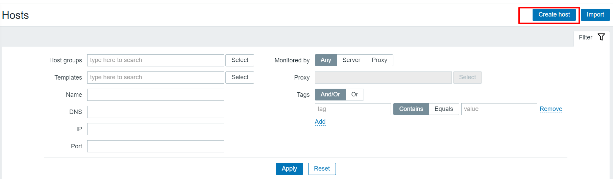
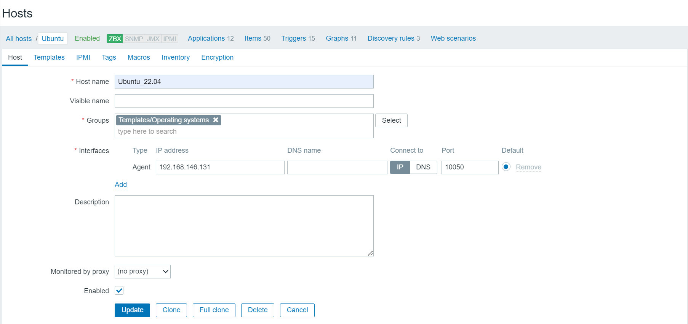
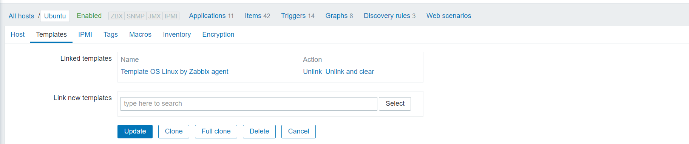
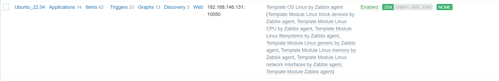
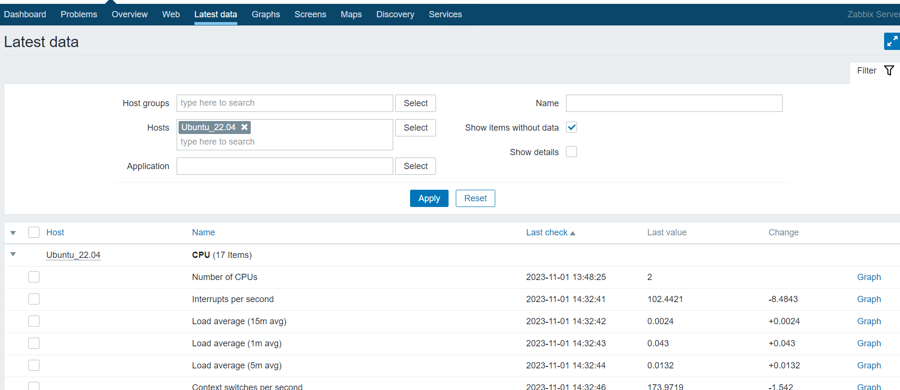

# ***1. Cài đặt kho lưu trữ Zabbix***
```
wget https://repo.zabbix.com/zabbix/5.0/ubuntu/pool/main/z/zabbix-release/zabbix-release_5.0-2+ubuntu22.04_all.deb
dpkg -i zabbix-release_5.0-2+ubuntu22.04_all.deb
apt update
```
# ***2. Cài đặt zabbix-agent***
```
apt install zabbix-agent
```
# ***3. Cấu hình zabbix-agent***'
```
vi /etc/zabbix/zabbix_agentd.conf
```
Chỉnh sửa các thông số
```
ListenIP=IP-agent
ListenPort=10050
Server=IP-server
ServerActive=IP-server
```
# ***4. Khởi động lại hệ thống***
```
systemctl restart zabbix-agent
systemctl enable zabbix-agent
```
# ***4. Giám sát zabbix-agent trên zabbix-web***
## ***4.1 Thực hiện thêm host giám sát trên zabbix-web***
Đăng nhập vào zabbix-web chọn: ***Configuration -> Host -> Create host***

Điền thông tin về host

Chuyển sang tab `Templates` chọn template phù hợp với host sau đó chọn `Add`

Kết quả sau khi Add host thành công như sau:

Kiểm tra đã có dữ liệu giám sát hay chưa chọn: ***Monitoring -> Latest data -> Chon host***.


# ***Tài liệu tham khảo***
<https://hocchudong.com/zabbix-phan-3-huong-dan-cai-dat-zabbix-agent-tren-ubuntu-18-04/>
<https://tecadmin.net/how-to-install-zabbix-agent-on-ubuntu-22-04/>