# ***Cài đặt zabbix-agent windows***
## ***1. Tải về gói cài đặt zabbix-agent***
Truy cập vào link sau để thực hiện tài gói zabbix-agent cho Windows và chọn gói phù hợp
```
https://www.zabbix.com/download
```
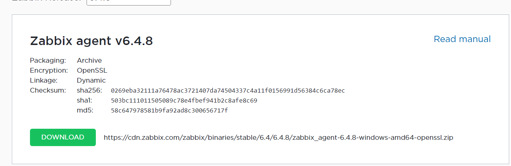
## ***2. Giải nén gói cài đặt***
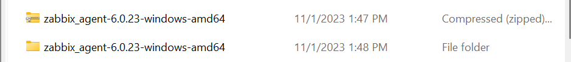
## ***3. Trong ổ C, tạo một thư mục có tên là zabbix***
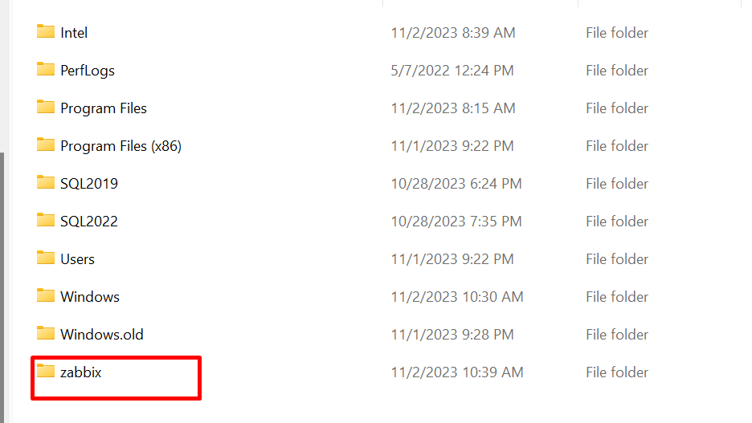
## ***4. Trong thư mục vừa giải nén, ta copy các thư mục con trong đó sang thư mục C:\zabbix\ vừa tạo***

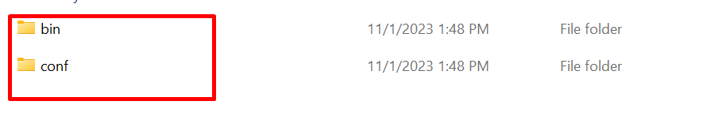
## ***5. Cấu hình file config***
Chỉnh sửa các thông số sau

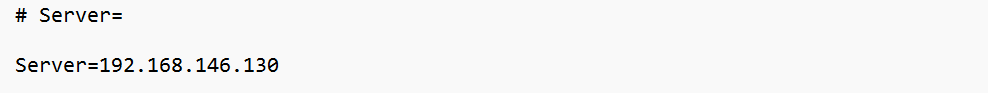
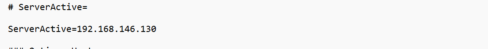

## ***6. Vào cmd và thực hiện lệnh sau để cài đặt zabbix-agent***
```
cd C:\zabbix\bin\
.\zabbix_agentd.exe -c C:\zabbix\conf\zabbix_agentd.conf --install
```
## ***7. Khởi động dịch vụ zabbix-agent***
```
.\zabbix_agentd.exe --start
```

## ***8. Mở port firewall cho port 10050***
Tìm kiếm ```Windows Defender Firewall with Advanced Security``` và thực hiện theo các hướng dẫn sau
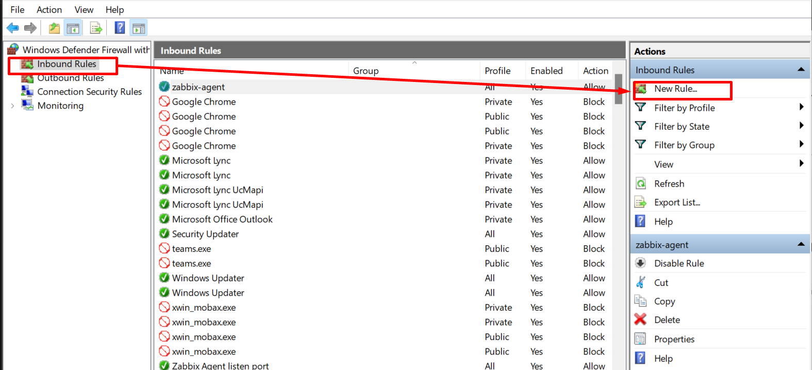
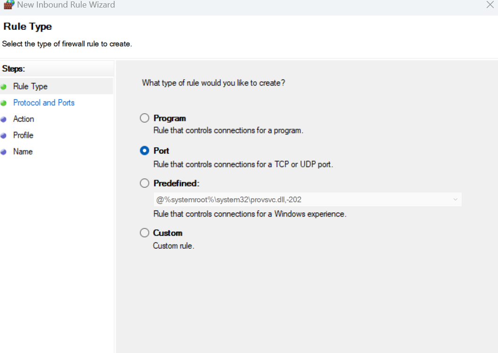
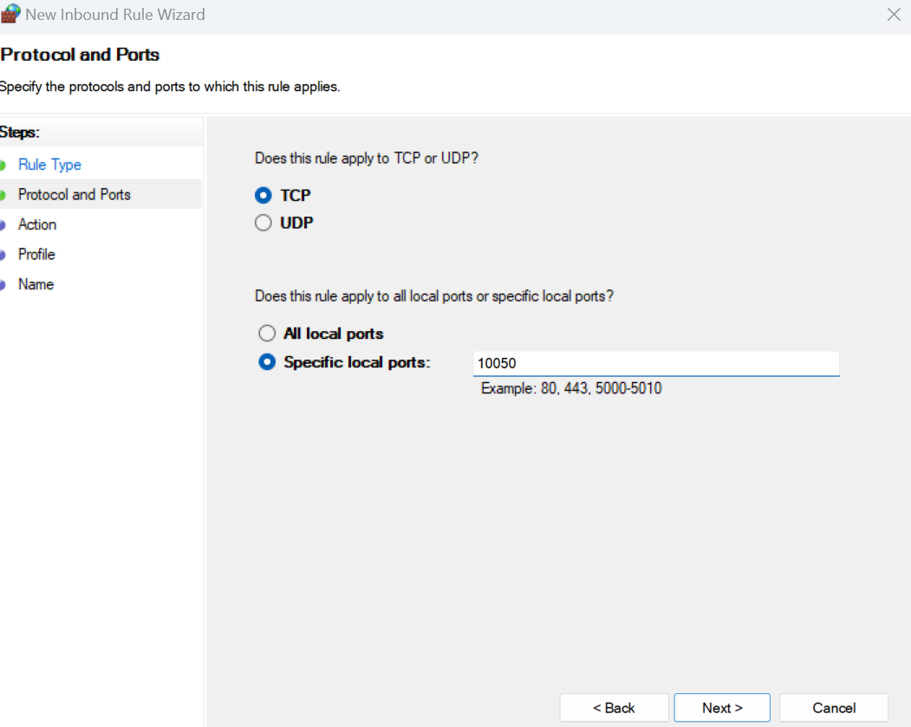
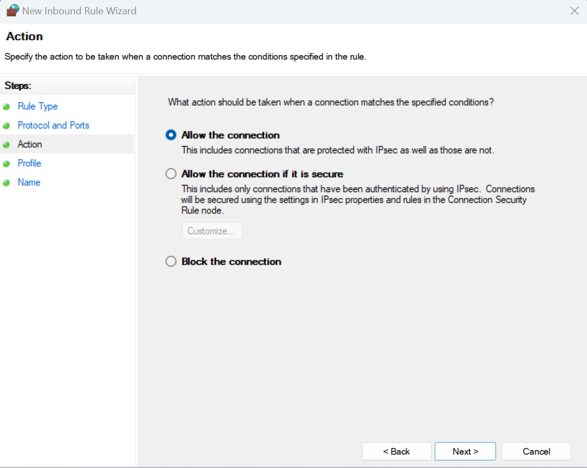
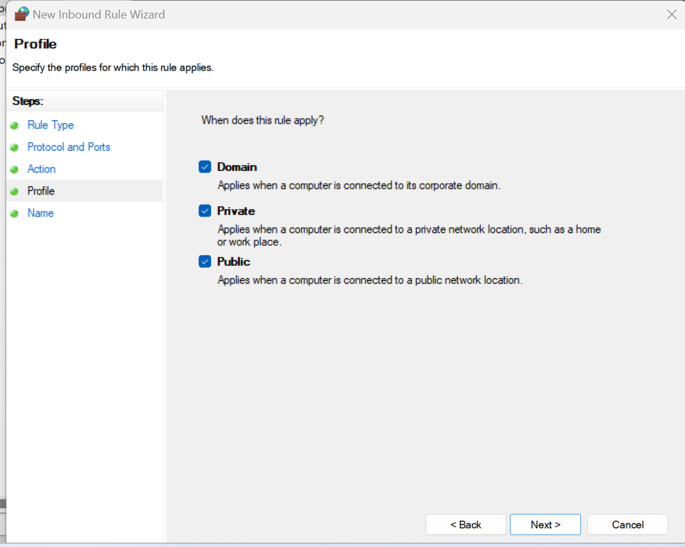
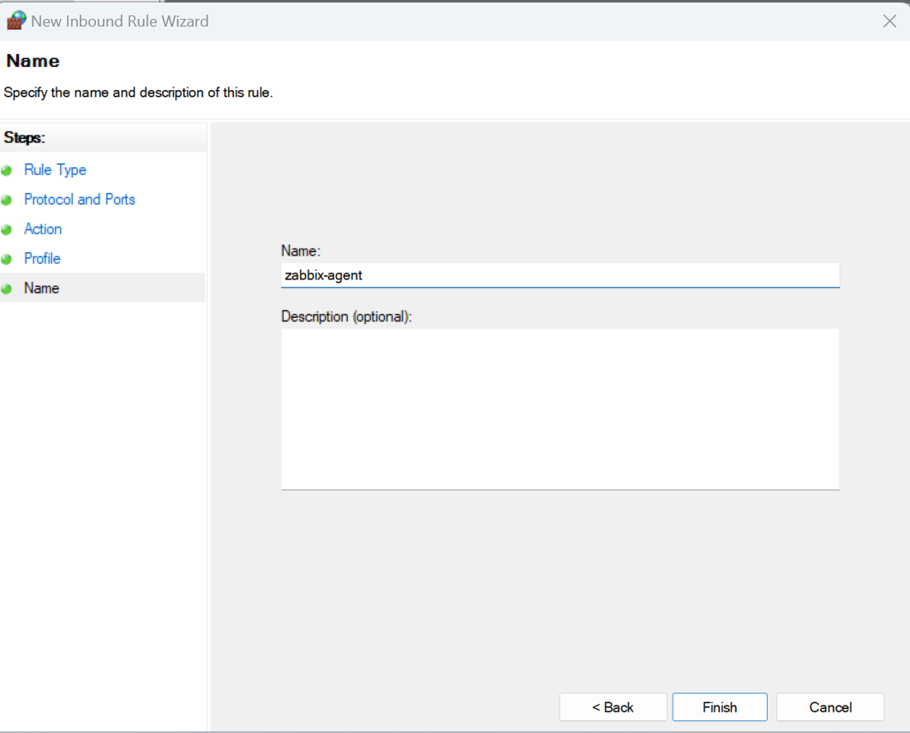
## ***9. Add host Windows trên Zabbix Web***
1. Trên giao diện web Zabbix, tạo một host mới
2. Điền các thông tin của host mới
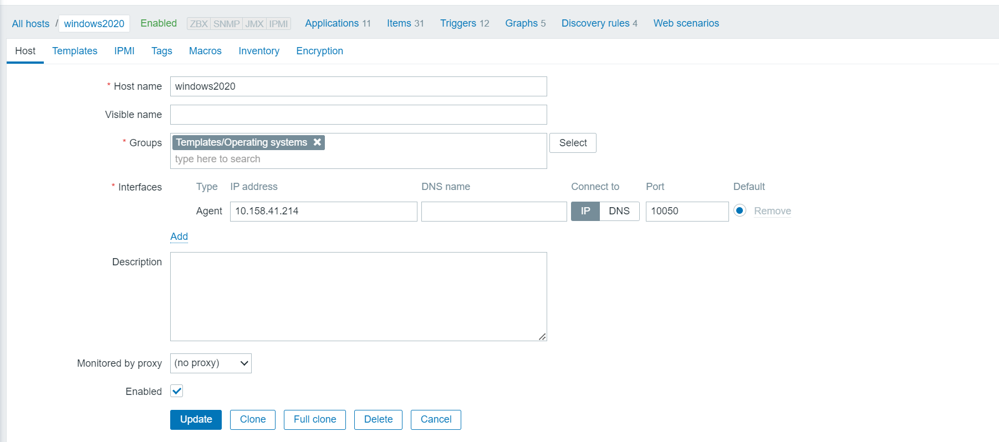
3. Chuyển sang tab Templates chọn template phù hợp với host sau đó chọn Add.
4. 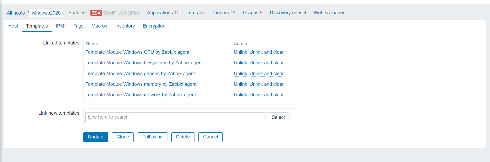

1. Kết quả sau khi Add host thành công như sau:
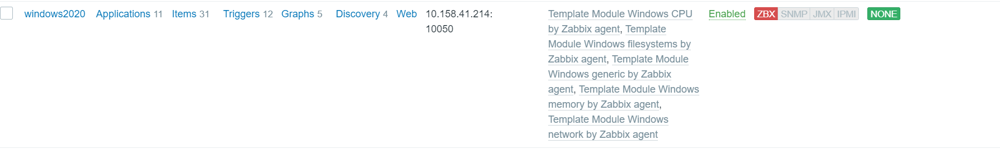
# ***Tài liệu tham khảo***
<https://news.cloud365.vn/zabbix-giam-sat-windows-server-bang-zabbix-agent/>
<https://viblo.asia/p/zabbix-4-thiet-lap-giam-sat-may-chu-windows-server-bang-zabbix-server-3kY4gnxeVAe>