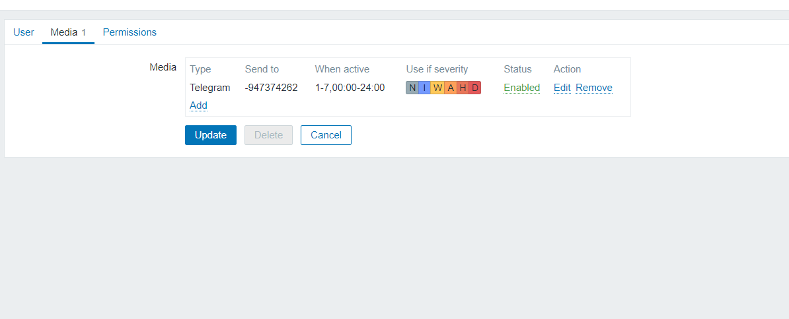

# ***Thiết lập Zabbix***
1. Trong phần "Administration > Media types", nhập media_telegram.yaml.
Định cấu hình loại phương tiện được thêm vào: Sao chép và dán mã thông báo bot telegram của bạn vào trường "Telegramtoken".

2. Sau khi config xong ta và phần test để test congfig đã ăn chưa bằng id của nhóm hoặc ID cá nhân

3. Để nhận thông báo trong Telegram, bạn cần tạo người dùng Zabbix và thêm phương tiện với loại Telegram. Trong trường "Sent to" Nhập ID người dùng Telegram ID hoặc ID nhóm thu được trong quá trình thiết lập Telegram.

4. Và kết quả 

# ***Tài liệu tham khảo***
<https://viblo.asia/p/zabbix-62-canh-bao-qua-telegram-GAWVpoy3L05>
<https://suncloud.vn/cau-hinh-zabbix-gui-canh-bao-den-telegram>