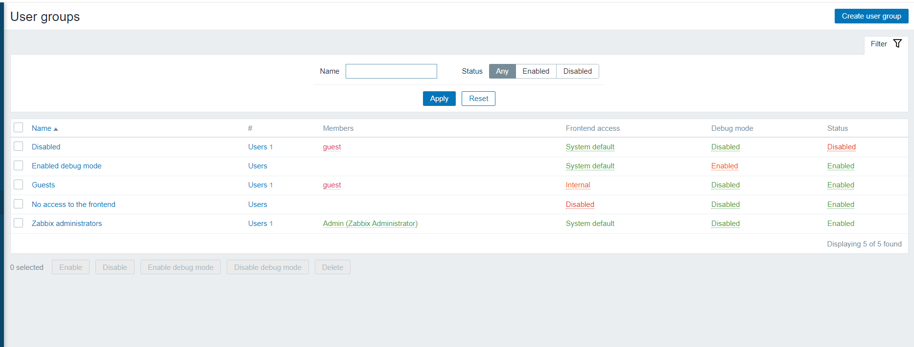

# ***1. Dashboard zabbix***
Đây là giao diện tổng quan khi cài đặt zabbix thành công. Gồm nhiều mục lớn như Monitoring, Inventory, Reports, Configuration, Administrator. Trong các tab lớn sẽ bao gồm nhiều task thành phần nhỏ hơn.

# ***2. Tab Monitoring***

## ***2.1 Dashboard***
- Dashboard: Là giao diện hiển thị các dashboard trực quan để người quản trị nhìn trực tiếp, người quản trị có thể tạo ra rất nhiều các dashboard khác nhau, nhưng tại một tab screen chỉ có thể xem được 1 dashboard bất kỳ nào đó.

Từ Dashboard có thể nhanh chống liên kết đến các thành phần như Graphs, Screens, Map bằng cách thêm các thành phần mong muốn vào mục Favourite graphs, Favourite Screen và Favourite map.

- Problems: Tất cả các vấn đề xảy ra với các host trong các group thống kê theo thời gian.

## ***2.2. Problems***
Problems: Hiển thị các vấn đề đối với từng device mà zabbix server thu thập dữ liệu về. Hỗ trợ cơ chế lọc theo ý người quản trị.

Có thể lọc theo các tiêu chí sau và có thể export ra file csv để lưu trữ lại.
Show: Recent problems (Hiển thị vấn đề hiện tại đang gặp phải), Problems (Hiển thị các vấn đề đã gặp phải), History (Lịch sử các vấn đề đã gặp phải).

Host group, Host, Application, Trigger, Problem, Host inventory, Tags, Show hosts in maintenance... là các lựa chọn để lọc thông tin, có thể lọc theo một tiêu chí hoặc kết hợp nhiều tiêu chí.
## ***2.3. Overview***
Overview: Là sự tổng hợp thông tin về data zabbix zerver thu thập được, có thể lọc them group -> host -> Kiểu data.
## ***2.4. Latest data***
Latest data: Dữ liệu mới nhất mà zabbix server thu thập được.

## ***2.5. Triggers***
Triggers: Là một điều kiện khi thỏa mãn điều kiện của Triggers mà người lập trình đặt ra thì sẽ thực hiện một hành động nào đó tiếp theo.

## ***2.6. Graphs***
Graphs: Là các thông tin dữ liệu được biểu diễn dưới dạng biểu đồ theo thời gian thực ví dụ như trafiic qua interface của thiết bị, thông tin về tình trạng CPU, RAM, ổ cứng… Các thông tin này được định nghĩa trong các templates.

Hỗ trợ lọc theo group -> host -> Dạng graph

Tại một thời điểm chỉu xem được 1 thông số dạng graph của 1 server. Cung cấp cái nhìn đơn lẻ về một đối tượng nhất định cần giám sát

## ***2.7 Maps***
Maps: Là thành phân cung cấp khả năng giám sát hệ thống dưới hình thức mô hình mạng. Giúp người quản trị có cái nhìn tổng quan về hệ thống sống mạng dưới dạng sơ đồ, trong trường hợp có sự cố sẽ giúp người quản trị đánh giá tầm ảnh hưởng của thiết bị gặp sự cố và đưa ra giải pháp phù hợp.

# ***3. Tab Configuration***
## ***3.1 Host group***
Host group: Tập hợp lại các host có chung một mục đích sử dụng hoặc người quản trị tâp hợp lại để phục vụ một mục đích quản lý chung.

## ***3.2 Templates***
Templates: Đây là tập hợp các thực thể có thể áp dụng cho các Host, một Template sẽ chứa trong nó các tập lệnh để truy vấn lấy dữ liệu, hiển thị thông tin dữ liệu lấy được, thông tin tình trạng thiết bị, hiển thị và thông báo lỗi…
Trong mỗi Template, các tệp lệnh được chia thành: items, triggers, graphs, applications, screens (có từ Zabbix 2.0),low-level discovery rules (có từ Zabbix 2.0), web scenarios (có từ Zabbix 2.2). Tùy theo giám sát thiết bị, dịch vụ, ứng dụng… nào thì các thành phần này được thiết lập khác nhau.

Có thể import template tự viết vào.

## ***3.3 Host***
Host: Là một máy tính, server, vps, chạy các hệ điều hành khác nhau hoặc một thực thể trong hệ thống mạng như là máy in, máy chấm công, máy photo, máy camera có hỗ trợ các giao thức mà monitor zabbix cung cấp.

## ***3.4 Action***
Action: Nơi cấu hình, lựa chọn các kiểu thông báo khi có sự kiện xảy ra bởi cấu hình trigger. Người dùng phải tự định nghĩa các action theo mục đích.

## ***3.5 Discovery***
Thiết lập range IP, nếu trong range có có thiết bị nào mà cài đặt các giao thức mà Zabbix server hỗ trợ thì sẽ tự động thu thập data về

# ***4. Tab Administrator***
Chức năng của của tab Administrator là để cấu hình chung cho zabbix đối với user có quyền Admin
## ***4.1 General***
Mục này cho phép người quản trị cấu hình tùy chỉnh giao diện cho Zabbix Webinterface.

Có thể tùy chỉnh rất nhiều giao diện như :
- GUI: Cung cấp một số tùy chỉnh mặc định liên quan đến giao diện người dùng.
- Default theme: Chủ đề mặc định của giao diện. Thường là màu xanh da trời.

- Dropdown first entry: Chọn nó là mục đầu tiên trong Drop down.

- Search/Filter elements limit: Số lượng tối đa hiển thị các hàng trong tìm kiếm và lọc.

- Max count of elements to show inside table cell: Giới hạn hiển thị trong bảng.

- Enable event acknowledges: Cho phép các event trong Zabbix kích hoạt.

- Show events not older than (in days): Cho phép hiển thị trạng thái Trigger bao nhiêu ngày.

- Max count of events per trigger to show: Số event được kích hoạt tối đa trong màn hình trạng thái.

## ***4.2 Proxies***
Cho phép cấu hình các Proxy trên giao diện Zabbix

Name: Tên của Proxy.

Mode: Chế độc của Proxy (active hoặc passive).

Encryption: Mã hóa kết nối từ Zabbix Server đến Proxy.

Last seen (age): Thời gian tại thời điểm kết nối cuối cùng với Proxy.

Host count: Số Host mà Proxy quản lý.

Item count: Số lượng Item mà Proxy sử dụng.

Required performance (vps): Hiệu suất Proxy.

Host: Danh sách các host mà proxy quản lý.

 ## ***4.3 Authentication*** 
 Phương pháp xác thực người dùng Zabbix : Thẩm định nội bộ, LDAP và HTTP
 
 ## ***4.4 User groups***
 Quản lý các nhóm trong Zabbix
  
  ## ***4.5 Users***
  Tùy chỉnh các tài khoản user cho zabbix
   
   Có thể tạo thêm các user khác với việc phân quyền tương ứng.
   ## ***4.6 Media types***
   Các kênh alert
    
## ***4.7 Queue***
Thông tin về hàng đợi trong quá trình cập nhật dữ liệu về từ các nguồn agent.
   