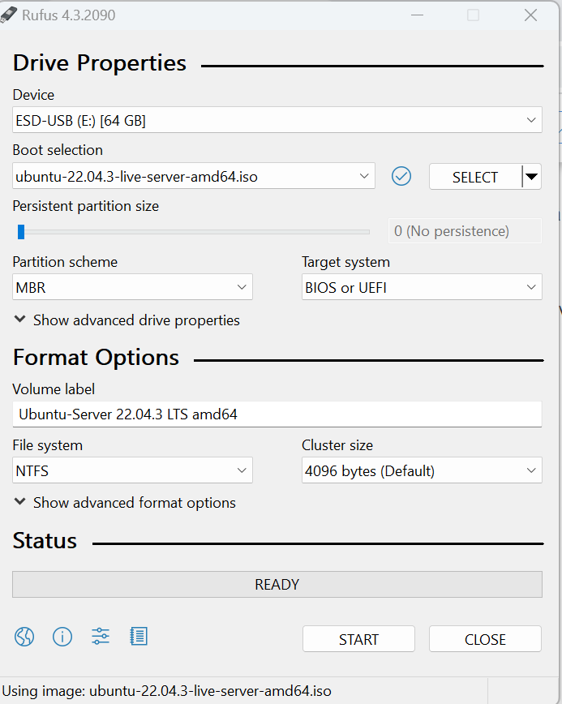

# ***USB Boot là gì***
USB Boot là một thiết bị lưu trữ thông thường(như USB hoặc ổ cứng ngoài) có "ISO image" của hệ điều hành được lưu trên đó.
Thông thường, bất cứ khi nào bạn khởi động máy tính của mình, nó sẽ khởi động từ hệ điều hành được lưu trữ trên ổ cứng bên trong. Tuy nhiên, bằng cách chạy USB có khả năng boot, bạn có thể khởi động máy tính của mình bằng ISO image của USB
# ***Tạo USB Boot bằng Rufus***
## ***Để tạo USB boot cài ubuntu bằng Rufus bạn cần***
1. File ISO bộ cài đặt ubuntu mà bạn muốn boot
2. USB trống với dung lượng >4GB
3. Tiện ích Rufus

## ***Các bước tạo USB boot bằng Rufus sẽ như sau***
### ***Bước 1: Mở Rufus, thiết lập thông số tạo USB boot***
Tại giao diện của Rufus, mục Device chọn USB của mình. Trong Boot selection chọn Disk or ISO image, rồi nhấn SELECT để tìm kiếm và chọn file ISO.
(1): Chọn vào tên USB của bạn.
(2): Nhấn vào SELECT để chọn file ISO (file cài đặt) Ubuntu bạn đã tải về trước đó.
(3): Partition scheme: Lúc này bạn cần nhấn tổ hợp phím Alt + E để kích hoạt tính năng ẩn tạo USB 2 phân vùng.
(4): Target system: Hệ thống tự động chọn vào BIOS or UEFI.
(5): Volume Lable: Đặt tên USB Boot của bạn, gợi ý hãy đặt tên sao cho có ý nghĩa nhất, ví dụ:  UBUNTU Server 22.04.
(6): File System: Chọn NTFS (khuyến nghị).
