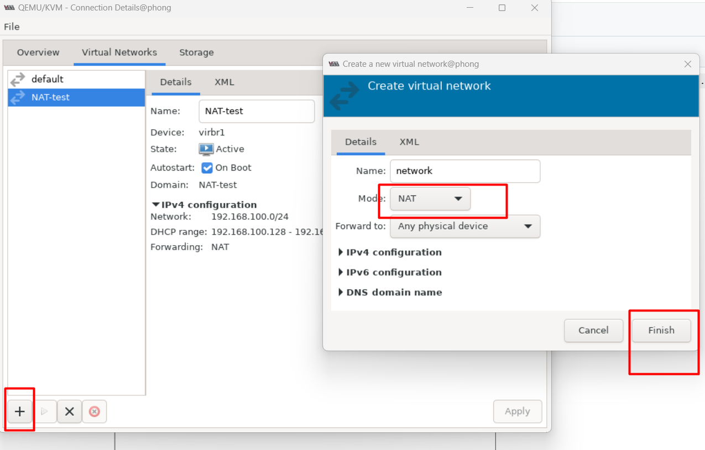

# ***Các chế độ card mạng trong KVM***
KVM cung cấp các mô hình mạng trong việc ảo hóa network. Các mô hình bao gồm:
- NAT
- Host-only
- Linux-bridge
## ***Mô hình mạng NAT***
- Với mô hình này KVM thực hiện ánh xạ một dải địa chỉ để cung cấp cho máy ảo.

- Dải địa chỉ ta có thể chọn tùy ý. Với mô hình này máy ảo của ta có thể giao tiếp với internet.

- Nhưng có một chú rằng từ VM của ta có thể ping được ra ngoài internet nhưng máy bên ngoài sẽ không thấy được VM của ta chính vì vậy ta không thể ping từ bên ngoài đến VM sử dụng mô hình mạng NAT.

### ***Cách cấu hình***
Mặc định, sau khi cài đặt xong KVM, ta sẽ có một mạng ảo NAT mang tên default, thường mang dải địa chỉ IP `192.168.122.x`.

Ta có thể add một mạng ảo với mô hình NAT khác. Ở đây, ta sẽ dùng virt-manager để thực hiện

Mở Virt-manager bằng câu lệnh virt-manager:

Chọn Edit -> Connection Details. Chọn tab Virtual network, ta thấy danh sách các mạng ở bên trái. Để thêm mạng, ta click biểu tưởng + :

Nhập tên cho mạng

Reboot máy và kiểm tra IP xem đã đúng dải mạng chưa

## ***Mô hình mạng Host-only***
- Với mô hình mạng kiểu này cũng cho phép ta cấp phát địa chỉ tùy ý giống với mô hình NAT.

- Máy ảo không thể nói chuyện với máy tính bên ngoài.

- Nó chỉ có thể trao đổi với các máy trong cùng mạng bên trong server vật lý và trao đổi với đươc máy chủ vật lý.

### ***Cách cấu hình***
Tương tự cách tạo mạng NAT. Nhưng khi đến bước chọn kiểu mạng, ta sẽ chọn mục Isolated virtual network

Sau khi tạo thành công, ta sẽ thấy mạng vừa tạo :

## ***Mô hình mạng Linux-bridge***
Đây là công nghệ cung cấp switch ảo để giải quyết vấn đề ảo hóa Network bên trong các máy vật lý. Ta có thể thấy có một con switch được tạo ra nằm bên trong của máy vật lý.
Các VM kết nối đến dây để có thể liên lạc được với nhau. Nếu muốn liên lạc ra bên ngoài ta có thể kết nối con switch này với card mạng trên máy vật lý của ta. Có thể kết nối switch với 1 hoặc nhiều port.
