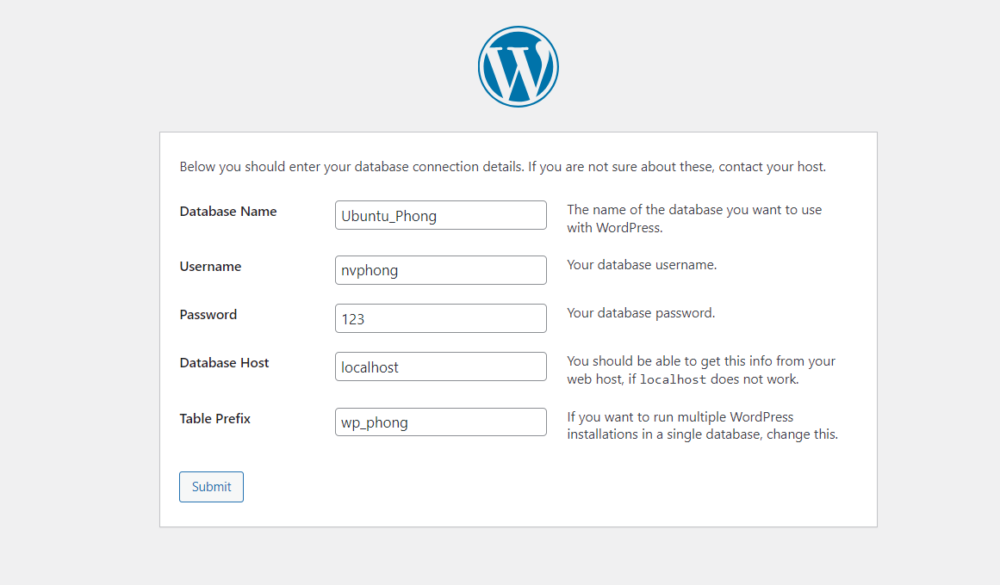

# ***Tìm hiểu các thông tin về bashshell***
## ***1. BashShell là gì***
Bashshell là một shell (môi trường thực thi lệnh) dòng lệnh phổ biến trên các hệ điều hành như Linux và macOS. Bashshell cho phép người dùng thực thi các lệnh và chương trình, tạo và quản lý các tập tin và thư mục, và thực hiện các tác vụ hệ thống khác.
## ***2. Cách tạo 1 file bashshell***
1. Tạo một tập tin mới bằng cách sử dụng lệnh sau: `touch test.sh`

2. Thêm nội dung của script bash vào tập tin bằng cách viết các lệnh bash vào đó. Mở file vừa tạo ở trên Ví dụ:
```
vi test.sh
echo "phong"
```

3. Lưu và đóng tập tin bằng cách bấm `:wq`

4. Để cho phép tập tin được thực thi, chạy lệnh sau trên terminal: `chmod +x test.sh` Lệnh này sẽ thêm quyền thực thi cho tập tin bashshell.
## ***3. Cách chạy 1 file bashshell***
Sử dụng câu lệnh
```
./test.sh
```
## ***4. Biến và tham số***
Trong Bash shell biến được sử dụng phổ biến để lưu trữ các giá trị và kết quả tính toán. Có hai loại biến chính trong Bash shell là `biến địa phương (local variable)` và `biến toàn cục (global variable)`.

### ***4.1 Biến địa phương***
Biến địa phương (local variable) là biến được khai báo và sử dụng trong một phạm vi cục bộ, thường là trong một hàm hoặc một script con. Biến địa phương chỉ có thể được truy cập và sử dụng trong phạm vi của nó, và khi thoát khỏi phạm vi đó thì biến sẽ không còn tồn tại nữa. Để khai báo một biến địa phương, ta sử dụng cú pháp sau:
`variable_name="variable_value"`
ví dụ
```
#!/bin/bash

# Khai báo biến địa phương
function local_variable_example {
    local message="Xin chào"
    echo $message
}

# Thực thi hàm
local_variable_example

# Thử truy cập biến ngoài phạm vi của hàm
echo $message
```
### ***4.2 Biến cục bộ***
Biến toàn cục (global variable) là biến có thể được truy cập và sử dụng trong toàn bộ phạm vi của script hoặc shell. Biến toàn cục được khai báo bên ngoài các hàm và có thể được truy cập và sử dụng trong toàn bộ script. Để khai báo một biến toàn cục, ta sử dụng cú pháp sau:
`export variable_name="variable_value"`
ví dụ
```
#!/bin/bash

# Khai báo biến toàn cục
export global_message="Xin chào"

# Khai báo hàm
function global_variable_example {
    echo $global_message
}

# Thực thi hàm
global_variable_example

# Thử thay đổi giá trị của biến toàn cục
global_message="Chào mừng đến với Bash shell"

# Thực thi hàm một lần nữa
global_variable_example
```
## ***5. Lệnh điều kiện***
Trong Bash shell, lệnh "if" được sử dụng để kiểm tra một điều kiện và thực hiện một hành động nào đó nếu điều kiện đúng hoặc sai
```
if [ condition ]
then
    # Thực hiện hành động nếu điều kiện đúng
else
    # Thực hiện hành động nếu điều kiện sai
fi
```


# ***4. Viết 1 script bashshell “Hello World”***
```
#!/bin/bash
echo Hello, World!
```

# ***5. Viết 1 script bashshell thực hiện cài đặt tự động HTTP trên Ubuntu 22.04***

Thêm các thông tin sau vào file `test.sh`
```
#!/bin/bash

# Cập nhật và nâng cấp hệ thống
sudo apt update
sudo apt upgrade -y

# Cài đặt Apache HTTP Server
sudo apt install apache2 -y

# Khởi động Apache và cấu hình để tự động khởi động cùng hệ thống
sudo systemctl start apache2
sudo systemctl enable apache2

# Cấu hình tường lửa để cho phép truy cập HTTP qua cổng 80
sudo ufw allow 80/tcp

# Hiển thị thông báo cài đặt hoàn tất
echo "Cài đặt Apache HTTP Server hoàn tất"
```
Sau đó lưu lại và chạy lệnh `./test.sh`


# ***6. Viết script bashshell cài đặt wordpress***
## ***Cài đặt trên centos7***
Tạo một file test.sh
`touch test.sh`
***Thêm thông tin sau vào file test.sh***

```
#!/bin/bash
# Cài đặt Apache
yum install httpd -y


## Kích hoạt dịch vụ httpd
systemctl enable httpd

## Bật dịch vụ httpd
systemctl status httpd

## Khởi động dịch vụ httpd
systemctl start httpd

##  Kiểm tra xem Firewall có chặn kết nối đến Apache không
firewall-cmd --list-all | grep http

## Cấu hình tường lửa để cho phép truy cập HTTP qua cổng 80
firewall-cmd --add-service=http --permanent
firewall-cmd --reload

## Hiển thị thông báo cài đặt hoàn tất
echo "Cài đặt Apache HTTP Server hoàn tất"

# Cài đặt Mariadb
yum install mariadb-server

## Bật dịch vụ Mariadb
systemctl enable mariadb
systemctl start mariadb

## Kiểm tra dịch vụ Mariadb
systemctl status mariadb

## Tạo database sử dụng cho wordpress
mysql -u root -p -e "CREATE DATABASE phongnv;"

## Tạo user sử dụng cho wordpress
mysql -u root -p -e "CREATE USER 'phongnv07'@'localhost' IDENTIFIED BY '123';"

## Cấp quền cho database
mysql -u root -p -e "GRANT ALL PRIVILEGES ON phongnv.* TO 'phongnv07'@'localhost';"
mysql -u root -p -e "FLUSH PRIVILEGES;"

## Hiển thị thông báo cài đặt Mariadb hoàn tất

echo "Cài đặt Mariadb hoàn tất"


# Cài đặt wordpress

## Cài đặt công cụ download wget
yum install wget -y

## Thay đổi thư mục hiện tại thành thư mục web
cd /var/www/html

## Tải xuống tệp WordPress mới nhất bằng cách chạy lệnh sau
wget https://wordpress.org/latest.tar.gz

## Giải nén tệp WordPress trong thư mục hiện tại:
tar xvzf latest.tar.gz

## Di chuyển các tệp từ thư mục wordpress vào thư mục web:
mv /var/www/html/wordpress/* /var/www/html

## Thay đổi tệp cấu hình WordPress bằng cơ sở dữ liệu đã tạo.
mv wp-config-sample.php wp-config.php

## Sửa tên database trong file cấu hình wp-config.php
sudo sed -i "s/database_name_here/phongnv/g" /var/www/html/wp-config.php

## Sửa tên user vào trong file cấu hình wp-config.php
sudo sed -i "s/username_here/phongnv07/g" /var/www/html/wp-config.php

## sửa mật khẩu user vào trong file cấu hình wp-config.php
sudo sed -i "s/password_here/123/g" /var/www/html/wp-config.php

## Hiện thị thông tin cài đặt wordpress hoàn tất
echo "Hoàn tất cấu hình wordpress"
# Cài đặt PHP
## Thêm kho lưu trữ EPEL và REMI
sudo yum -y install https://dl.fedoraproject.org/pub/epel/epel-release-latest-7.noarch.rpm
sudo yum -y install https://rpms.remirepo.net/enterprise/remi-release-7.rpm
sudo yum -y install yum-utils
sudo yum-config-manager --enable remi-php74


## Cập nhật hệ thống
sudo yum update

## Cài đặt PHP
sudo yum install php php-cli
yum install php php-mysql


## Thêm thông tin vào file cấu hình /var/www/html/info.php
echo "<?php phpinfo(); ?>" | sudo tee -a /var/www/html/info.php

## Hiện thị thông báo cài đặt wordpress hoàn tất 
echo "Hoàn tất quá trình cài đặt wordpress"
```
# ***Bashscrip thực hiện cài đặt wordpress trên ubuntu và centos***
## ***Các bước thực hiện***
1. Tạo 1 file test.sh: `touch test.sh`
2. Phân quyền thực thi cho file test.sh: `chmod +x test.sh`
3. Thêm thông tin bên dưới vào file test.sh
4. Sau khi thêm xong lưu lại và tiến hành chạy `./test.sh`


```
#!/bin/bash

# Kiểm tra xem script được chạy với quyền root hay không
if [[ $EUID -ne 0 ]]; then
    echo "Script này cần chạy với quyền root."
    exit 1
fi
# Tạo database và user trên MySQL / MariaDB
function create_database(){
    mysql -u root -p -e "CREATE DATABASE phongnv;"
    mysql -u root -p -e "CREATE USER 'phongnv07'@'localhost' IDENTIFIED BY '123';"
    mysql -u root -p -e "GRANT ALL PRIVILEGES ON phongnv.* TO 'phongnv07'@'localhost';"
    mysql -u root -p -e "FLUSH PRIVILEGES;"
}
# Cài đặt các gói cần thiết trên Ubuntu
function install_packages_ubuntu(){
    apt-get update
    # Cài đặt apache2
    apt install apache2 -y
    systemctl enable apache2
    systemctl status apache2
    systemctl start apache2
    echo "Cài đặt Apache HTTP Server hoàn tất"
    # cài đặt mariadb
    apt install mariadb-server
    systemctl enable mariadb
    systemctl start mariadb
    systemctl status mariadb
    echo "Cài đặt Mariadb hoàn tất"
    # cài đặt php
    sudo apt install php libapache2-mod-php
    sudo apt install php-cli
    sudo apt install php-cgi
    sudo apt install php-mysql
    sudo apt install php-pgsql
    cd /var/www/html/
    touch info.php
    echo "<?php phpinfo(); ?>" | sudo tee -a /var/www/html/info.php
    sudo cp /etc/apache2/sites-available/000-default.conf /etc/apache2/sites-available/wordpress.conf
    # thay đổi thông tin `html` sang `wordpress``
    sudo sed -i "s/html/wordpress/g" /etc/apache2/sites-available/wordpress.conf
    # Thêm thông tin `ServerName localhost`` dưới dòng `DocumentRoot \/var\/www\/wordpress`
    sudo sed -i '/DocumentRoot \/var\/www\/wordpress/a \   ServerName localhost ' /etc/apache2/sites-available/000-default.conf
    sudo a2ensite wordpress.conf
    sudo a2dissite 000-default.conf
    echo "Hoàn tất quá trình cài đặt php"

    # Tải và cài đặt WordPress
     cd /var/www/html
     wget -O /tmp/wordpress.tar.gz https://wordpress.org/latest.tar.gz
     sudo tar -xzvf /tmp/wordpress.tar.gz -C /var/www
     sudo chown -R www-data.www-data /var/www/wordpress
     systemctl restart apache2

     echo "Hoàn tất cấu hình wordpress"

}

# Cài đặt các gói cần thiết trên CentOS
function install_packages_centos(){

    # Cài đặt apache

    yum install httpd -y
    systemctl enable httpd
    systemctl status httpd
    systemctl start httpd

    firewall-cmd --list-all | grep http
    firewall-cmd --add-service=http --permanent
    firewall-cmd --reload
    # Cài đặt Mariadb
    yum install mariadb-server
    systemctl enable mariadb
    systemctl start mariadb
    systemctl status mariadb
    echo "Cài đặt Mariadb hoàn tất"
    # Tạo database
    mysql -u root -p -e "CREATE DATABASE phongnv;"
    mysql -u root -p -e "CREATE USER 'phongnv07'@'localhost' IDENTIFIED BY '123';"
    mysql -u root -p -e "GRANT ALL PRIVILEGES ON phongnv.* TO 'phongnv07'@'localhost';"
    mysql -u root -p -e "FLUSH PRIVILEGES;"

    # Cài đặt wordpress

    yum install wget -y
    cd /var/www/html
    wget https://wordpress.org/latest.tar.gz
    tar xvzf latest.tar.gz
    mv /var/www/html/wordpress/* /var/www/html
    mv wp-config-sample.php wp-config.php
    # Cấu hình database
    sudo sed -i "s/database_name_here/phongnv/g" /var/www/html/wp-config.php
    sudo sed -i "s/username_here/phongnv07/g" /var/www/html/wp-config.php
    sudo sed -i "s/password_here/123/g" /var/www/html/wp-config.php
    echo "Hoàn tất cấu hình wordpress"
    # cài đặt php
    sudo yum -y install https://dl.fedoraproject.org/pub/epel/epel-release-latest-7.noarch.rpm
    sudo yum -y install https://rpms.remirepo.net/enterprise/remi-release-7.rpm
    sudo yum -y install yum-utils
    sudo yum-config-manager --enable remi-php74
    sudo yum update
    sudo yum install php php-cli
    yum install php php-mysql
    echo "<?php phpinfo(); ?>" | sudo tee -a /var/www/html/info.php
    systemctl restart httpd
    echo "Hoàn tất quá trình cài đặt php"
    
}

# Chạy script cài đặt trên Ubuntu
function ubuntu_install() {
    install_packages_ubuntu
    create_database
}

# Chạy script cài đặt trên CentOS
function centos_install() {
    install_packages_centos
    create_database
}

# Kiểm tra phiên bản hệ điều hành và chạy script tương ứng
if [[ $(grep -oP '(?<=^ID=).+' /etc/os-release) == "ubuntu" ]]; then
    ubuntu_install
elif [[ $(grep -oP '(?<=^ID=).+' /etc/os-release) == "centos" ]]; then
    centos_install
else
    echo "Hệ điều hành không được hỗ trợ."
    exit 1
fi

echo "Cài đặt WordPress đã hoàn tất."

```
# ***Cài đặt trang wordpress***
Mở trình duyệt internet và nhập địa chỉ ip sẽ xuất hiện trang wordpress như hình

 Nhấp vào "Let's go" để bắt đầu

nhập thông tin cơ sở dữ liệu mà bạn đã cấu hình trước đó



cung cấp một số thông tin chung về trang web mới của bạn

Truy cập vào trang 

# ***Tài liệu tham khảo***
<https://viblo.asia/p/lap-trinh-shell-bash-script-1VgZvER9KAw>
<https://viblo.asia/p/cach-tao-va-su-dung-bash-script-co-ban-trong-ubuntu-Qbq5QpAJlD8>
<https://linuxconfig.org/ubuntu-20-04-wordpress-with-apache-installation>


