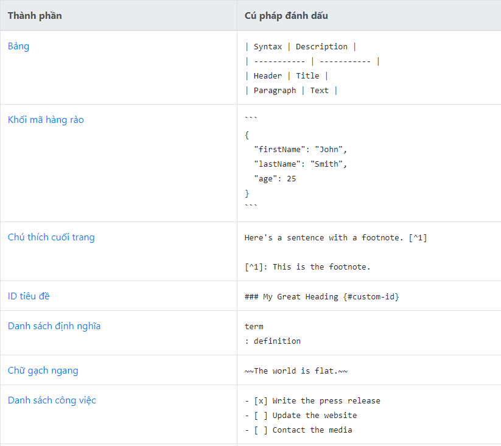

# 1.Markdown là gì
Markdown là ngôn ngữ đánh dấu văn bản , dùng để trình bày bài viết của mình một cách mạch lạc , rõ ràng .
# 2.Lý do sử dụng 
Ngôn ngữ đánh dấu văn bản phổ biến , cách dùng đơn giản tiện dụng 
# 3.Cách sử dụng 
- Cú pháp cơ bản 

| Thành phần      | Cú pháp      |
|-----------      |----------    |
| Heading         | # H1         |
| Heading         | ## H2        |
| Heading         | ### H3       |
| Heading         | #### H4      |
| In đậm          | **indam**    |
| In nghiêng      | *innghieng*  |
| In đậm + nghiêng| ***damnghieng***|
| inlide code     | `inlide code`|
| tạo khối        | > blockquote |
| tạo danh sách   |1. First item |
|                 |2. Second item|
|                 |3. Third item |
| kẻ ngang        |------------- |
| link            |[title](https://www.example.com)|
| ảnh             |``````|
| nổi bật         |``` NỔI BẬT ``` |


- Một số cú pháp mở rộng





[Link tham khảo 1 ](https://www.markdownguide.org/cheat-sheet/)

[Link tham khảo 2 ](https://topdev.vn/blog/markdown-la-gi-cach-su-dung-markdown/#dung-cho-chen-image)


