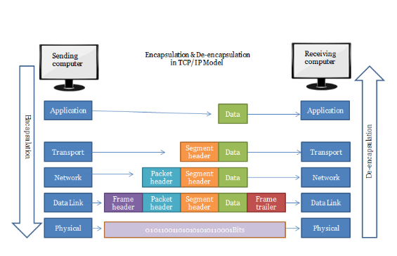

# 1.Mô hình TCP/IP là gì
<p>TCP/ IP (Transmission Control Protocol/ Internet Protocol - Giao thức điều khiển truyền nhận/ Giao thức liên mạng), là một bộ giao thức trao đổi thông tin được sử dụng để truyền tải và kết nối các thiết bị trong mạng Internet. TCP/IP được phát triển để mạng được tin cậy hơn cùng với khả năng phục hồi tự động.<p>
TCP/IP gồm 2 giao thức chính 

- TCP: Có chức năng xác định các ứng dụng và tạo ra các kênh giao tiếp .TCP cũng có chức năng quản lý các thông tin khi được chia nhỏ để truyền tải qua internet. Giao thức này sẽ tập hợp các thông tin này theo đúng thứ tự, đảm bảo truyền tải thông tin chính xác tới địa chỉ đến. 
- IP: Đảm bảo thông tin được truyền đến đúng địa chỉ. IP sẽ gán các địa chỉ và định tuyến từng gọi thông tin. Mỗi mạng sẽ có 1 địa chỉ IP để xác định được chính xác nơi chuyển/nhận thông tin, dữ liệu.

# 2.Nguyên lý hoạt động 
<p> TCP/IP là sự kết hợp giữa 2 giao thức. Trong đó IP (Giao thức liên mạng) cho phép các gói tin được gửi đến đích đã định sẵn, bằng cách thêm các thông tin dẫn đường vào các gói tin để các gói tin được đến đúng đích đã định sẵn ban đầu. Và giao thức TCP (Giao thức truyền vận) đóng vai trò kiểm tra và đảm bảo sự an toàn cho mỗi gói tin khi đi qua mỗi trạm. Trong quá trình này, nếu giao thức TCP nhận thấy gói tin bị lỗi, một tín hiệu sẽ được truyền đi và yêu cầu hệ thống gửi lại một gói tin khác. Quá trình hoạt động này sẽ được làm rõ hơn ở chức năng của mỗi tầng trong mô hình TCP/IP. <p>

# 3.Cấu tạo và chức năng
Một mô hình TCP/IP tiêu chuẩn bao gồm 4 lớp được chồng lên nhau, bắt đầu từ tầng thấp nhất là Tầng vật lý (Physical) → Tầng mạng (Network) → Tầng giao vận (Transport) và cuối cùng là Tầng ứng dụng (Application).


Tầng 1: Tầng truy cập (Network Access Layer) tầng này có thể coi là một tầng riêng biệt hoặc cũng có thể tách nó thành 2 tầng vật lý và tầng liên két dữ liệu như trong mô hình OSI.Nó được sử dụng để truyền gói tin từ tầng mạng đến các Host trong mạng.Các thiết bị vật lý như : Switch, cáp mạng, card mạng HBA-Host Bus Adapter là các thành phần truy cập.

Tầng 2: Tầng mạng (Internet Layer-IP) trên mô hình TCP/IP có vai trò chính là giải quyết vấn đề dẫn đến các gói tin đi qua các mạng để đến đúng đích.
Các giao thức chính trong tầng là IP, ICMP và ARP.
- IP – Internet Protocol
- ICMP – Internet Control Message Protocol
- IGMP- Internet Group Management Protocol

Tầng 3: Tầng vận chuyển (Transport Layer-TCP) đảm nhận nhiệm việc phân nhỏ các gói tin có kích thước lớn khi gửi và tập hợp lại khi nhận, tính toàn vẹn cho dữ liệu (không lỗi, không mất, đúng thứ tự) là yếu tố được đảm bảo.Nếu để ý thì bạn sẽ thấy chức năng của tầng vận chuyển ở giao thức TCP/IP cũng giống với tầng vận chuyển của mô hình OSI.

Tầng 4: Tầng ứng dụng (Application Layer) là nơi các chương trình mạng như Web Browser,Mail User Agent làm việc để liên lạc giữa các node mạng.Do mô hình TCP/IP không có tầng nào nằm giữa các tầng ứng dụng và tầng vận chuyển, nên tầng Application của TCP/IP bao gồm các giao thức hoạt động như tầng trình diễn và giao dịch trong OSI.

Những giao thức được sử dụng ở mỗi lớp
- Với Application Layer, FTP truyền các File ASCII hoặc nhị phân theo 2 chiều. HTTP truyền nội dung giữa Server và Client, SMTP phân phối thư điện tử, DNS hỗ trợ truy nhập Internet,…

- Transport Layer: UDP tăng tốc độ truyền tải, TCP đảm bảo truyền dữ liệu một cách an toàn,…

- Lớp Internet: ICMP sẽ thông báo lỗi nếu truyền dữ liệu bị hỏng, IP sẽ gán địa chỉ cho dữ liệu trước khi truyền và định tuyến chúng tới đích,…

- Link Layer sử dụng Wi-Fi, Ethernet, Token Ring, Fiber Distributed Data Interface ( FDDI).
# 4. Các giao thức TCP/IP phổ biến
## 4.1 HTTP (Hypertext Tranfer protocal)
HTTP là một trong những phương thức phổ biến hiện nay. Giao thức này giúp truyền các thông tin dữ liệu giữa các website, thường là web client và web server. Việc truyền dữ liệu sẽ không được bảo mật. HTTP sẽ truyền các dữ liệu thường file ảnh hoặc tệp HTML….

## 4.2 HTTPS (Hypertext Tranfer protocal secure)
Đây là giao thức cực kỳ phổ biến. Giống với Http, Https cũng được sử dụng để truyền thông tin dữ liệu giữa 1 web client và 1 web server. Tuy nhiên, việc truyền thông tin dữ liệu sẽ được bảo mật. Đây là ưu điểm nổi bật của giao thức Http so với https.
## 4.3 FTP - File Transfer Protocol
FTP là giao thức có phần ít phổ biến hơn. Tuy nhiên, bạn cũng không thể bỏ qua khi tìm hiểu TCP/IP là gì. Đây là giao thức giúp kết nối 2 hoặc nhiều máy tính trên môi trường internet. Giao thức này hoạt động trên cổng số 20 và 21. Thông qua FTP, các máy con có thể truy cập internet để gửi dữ liệu tới máy chủ, đồng thời, lấy các dữ liệu đó. Dù ở khoảng cách xa, FTP vẫn giúp người dũng có thể dễ dàng truy cập vào máy chủ để nhận dữ liệu. 

# 5. So sánh mô hình TCP/IP với OSI


```Điểm giống ```

- Cùng sử dụng kỹ thuật chuyển Packet
- Đều có lớp Network và lớp Transport
- Đều có kiến trúc phân lớp, vì chúng đều được xây dựng dựa trên các lớp, nói cách khác là đều phân tầng như nhau.
- Đều đơn giản hóa quá trình khắc phục sự cố bằng cách chia nhỏ chức năng phức tạp thành các phần giản đơn.
- Bên cạnh những điểm giống nhau, Mô hình TCP IP và OSI còn có rất nhiều điểm riêng. Bảng so sánh dưới đây sẽ giúp bạn hiểu rõ.

```Điểm khác```

|Nội dung| Mô hình OSI | Mô hình TCP/IP|
|--------|-------------|---------------|
|Đơn vị phát triển|ISO (Tổ chức tiêu chuẩn quốc tế)|Bộ quốc phòng(DoD)|
|Số tầng| 7 tầng| 4 tầng|
|Ý nghĩa|Là mô hình lý thuyết,được sử dụng cho hệ thống máy tính|Là mô hình Server/client(máy chủ-khách) dùng để truyền dữ liệu qua internet|
|Mức độ sử dụng|Ít người dùng|Phổ biến toàn cầu |
|Phương pháp tiếp cận|Theo chiều dọc|Theo chiều ngang|
|Thiết kế |Phát triển mô hình trước rồi mới phát triển giao thức|Phát triển giao thức trước rồi phát triển mô hình |
|Truyền thông |Hỗ trợ cả không dây và định tuyến|Hỗ trợ truyền thông không kết nối từ tầng mạng|
|Kết hợp giữa các tầng|Mỗi tầng 1 nhiệm vụ không có kết hợp giữa các tầng |Trong tầng ứng dụng có tầng trình diễn và tầng phiên được kết hợp với nhau |
|Tính phụ thuộc|Giao thức độc lập |Phụ thuộc vào giao thức|
# 6. Quy trình hoạt động của mô hình TCP/IP
```Bên gửi```
- Tầng 4 (application): Người dùng đưa thông tin vào máy tính ( hình ảnh , văn bản). Data sẽ được gửi xuống tầng vận chuyển     
- Tầng 3 (transport): Data ở đây sẽ được chia nhỏ thành các Segment,cấu trúc đầy đủ của segment lúc này là Header chứa thông tin điều khiển và sau đó là dữ liệu . Các Segment tiếp tục được chuyển xuống tầng Internet.
- Tầng 2 (internet): Các Segment ở đây sẽ được đóng gói Packet với phần Header chứa thông tin tầng mạng. Các Packet tiếp tục được đóng vào các Frames được định tuyến đi đến đích chỉ định ban đầu
- Tầng 1 (physical): Ở đây Frame sẽ được mã hóa thành chuỗi nhị phân 

```Bên nhận```
- Tầng 1 (physical):Máy nhận kiểm tra quá trình đồng bộ và đưa các chuỗi bit nhị phân vào vùng đệm rồi gửi thông báo đã nhận dữ liệu
- Tầng 2 (internet): Tại đây thông tin sẽ được kiểm tra xem frame có bị lỗi không, nếu lỗi thì hủy và gửi lại. Kiểm tra các định tuyến, thông tin tầng mạng có đúng địa chỉ hay không, nếu đúng sẽ chuyển lên transport
- Tầng 3 (transport):Hỗ trợ phục hồi và xử lý lỗi , ghép các gói tin lại 
- Tầng 4 (application): Gỡ bỏ những header còn lại để nhận được dữ liệu bên gửi
 

> Bắt tay ba bước ( Three way handshake)
> Bước 1 (SYN): Bước đầu khi máy khách muốn kết nối với máy chủ , máy khách sẽ gửi một tin nhắn SYN segment(Số thứ tự đồng bộ hóa) để thông báo cho máy chủ rằng máy khách có thể bắt đầu liên lạc với trình tự nào. Tin nhắn SYN bao gồm các thông tin SEQ#(Đánh dấu thứ tự tin gửi tăng dần ),ACK#(chứa số SEQ# kế tiếp cuả thiết bị đích ),SYN#(chỉ 0 hoặc 1 tùy theo dạng tin nhắn ). 
> Bước 2(SYN+ACK) : Máy chủ gửi tin nhắn trả lời yêu cầu  bằng tin nhắn SYN-ACK biểu thị bằng số thứ tự mà nó có khả năng bắt đầu các phân đoạn đó 
> Bước 3(ACK): Sau khi nhận được tin nhắn đồng ý , máy khác sẽ gửi tin nhắn ACK thông báo nhận được đến với máy chủ và tạo kết nối 


Sau khi hoàn thành bắt tay ba bước chúng ta có thể gửi các phân đoạn Segment với nhau . Ví dụ máy cá nhân gửi Segment X tới máy chủ , máy chủ sẽ gửi lại 1 ACK Segment x thôn báo nhận được thành công . Ngược lại máy chủ gửi 1 Segment Y tới máy khách thì máy khách cũng gửi 1 ACK Segment Y ngược lại máy chủ thông báo nhận được thành công . Trong trường hợp 1 thời gian nhất định máy tính gửi không nhận được tin nhắn ACK Segment từ máy nhận thì sẽ tự động gửi lại .

> Ưu điểm của Three way handshake
> - Có chơ chế báo nhận 
> - Cơ chế đảm bảo tin cậy 
> - Phục hồi dữ liệu bị mất trên đường truyền 
> - Các segment được đánh số thứ tự nên khi nhận sẽ đảm bảo thứ tự các gói tin 
> - Có cơ chế kiểm soát luồng , nhằm đảm bảo không làm quá tải bên nhận 
> - Kiểm soát tắc nghẽn giúp việc truyền dữ liệu không làm tắc nghẽn mạng 
> - Hỗ trợ truyền và nhận cùng lúc nhiều Segment
> 

# 7. Phân biệt UDP vs TCP 
## TCP là gì   
TCP ( Transmission Control Protocol) là giao thức tạo các kết nối giữa các máy tính được kết nối mạng , qua đó có thể trao đổi các dữ liệu hoặc các gói tin . Giao thức đảm bảo gói tin truyền đi đáng tin cậy và đúng trình tự   
## UDP là gì  
UDP (User Datagram Protocol) là giao thức quan trọng trong mô hình TCP/IP . UDP giúp máy tính gửi đi các gói tin ngắn được gọi là datagram tới máy khác . UDP không cung cấp sự tin cậy hay đúng thứ tự khi gửi 1 gói tin tới máy khác , các gói tin có thể không đúng thứ tự hoặc mất mà không có thông báo .Tuy nhiên tốc độ gửi đi của UDP lại nhanh hơn TCP vì gửi các gói tin nhỏ , vậy nên UDP phù hợp với các truy vấn nhỏ số lượng lớn yêu cầu   
## So sánh giữa TCP và UDP 

| Tính năng | TCP | UDP |
|-----------|-----|-----|
|Trạng thái kết nối | Yêu cầu kết nối đã thiết lập để truyền dữ liệu ( Phải ngắt kết nối sau khi đã được truyền )| Không kết nối , không yêu cầu mở , không duy trì hoặc chấm dứt kết nôi|
|Trình tự dữ liệu | Có trình tự | Không trình tự |
|Cung cấp dữ liệu đến đích | Đảm bảo | Không đảm bảo |
|Truyền lại gói dữ liệu bị mất | Truyền lại được | Không truyền lại được |
|Kiểm tra lỗi | Kiểm tra lỗi mở rộng và xác nhận dữ liệu| Tổng kiểm tra cơ bản |
|Tốc độ | Chậm hơn UDP | Nhanh hơn TCP|  

 Tư liệu tham khảo.

[1] [https://www.totolink.vn/article/149-mo-hinh-tcp-ip-la-gi-chuc-nang-cua-cac-tang-trong-mo-hinh-tcp-ip.html](https://www.totolink.vn/article/149-mo-hinh-tcp-ip-la-gi-chuc-nang-cua-cac-tang-trong-mo-hinh-tcp-ip.html)

[2] [https://tenten.vn/tin-tuc/tcp-ip-la-gi/#1_TCPIP_la_gi](https://tenten.vn/tin-tuc/tcp-ip-la-gi/#1_TCPIP_la_gi)

[3] [https://fpttelecom.com/blog/mo-hinh-osi/](https://fpttelecom.com/blog/mo-hinh-osi/)

[4] [https://fptcloud.com/tcp-ip-la-gi/](https://fptcloud.com/tcp-ip-la-gi/)

[5] [https://thietbimangcisco.vn/tim-hieu-dac-diem-2-mo-hinh-truyen-thong-osi-va-tcp-ip-v-322-330-5216.html](https://thietbimangcisco.vn/tim-hieu-dac-diem-2-mo-hinh-truyen-thong-osi-va-tcp-ip-v-322-330-5216.html)

[6] [https://xaydungso.vn/blog/giai-thich-tcp-va-ip-la-gi-va-cach-chung-hoat-dong-trong-mang-vi-cb.html](https://xaydungso.vn/blog/giai-thich-tcp-va-ip-la-gi-va-cach-chung-hoat-dong-trong-mang-vi-cb.html)

[7] [https://viblo.asia/p/tim-hieu-co-ban-ve-mo-hinh-tcpip-RQqKLkJp57z](https://viblo.asia/p/tim-hieu-co-ban-ve-mo-hinh-tcpip-RQqKLkJp57z)