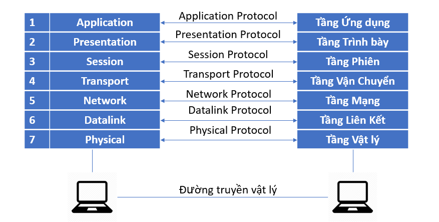
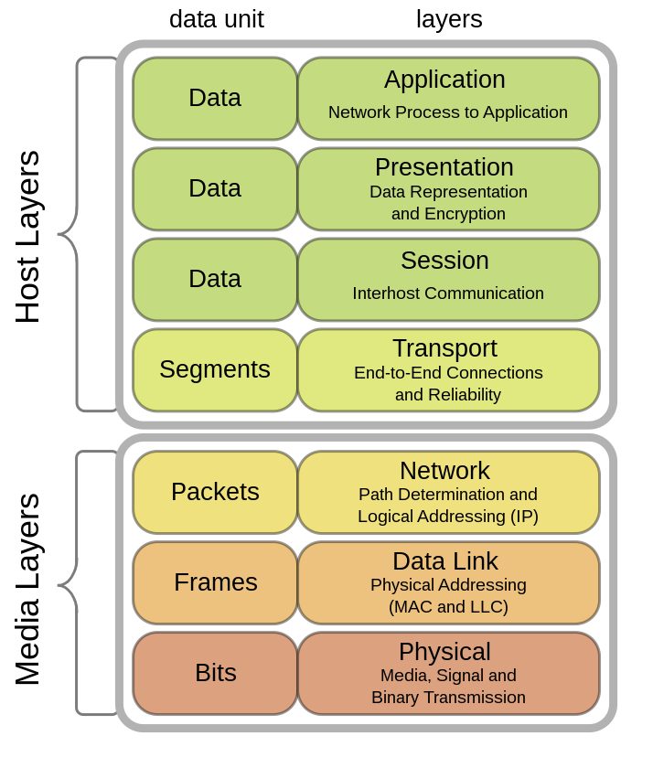
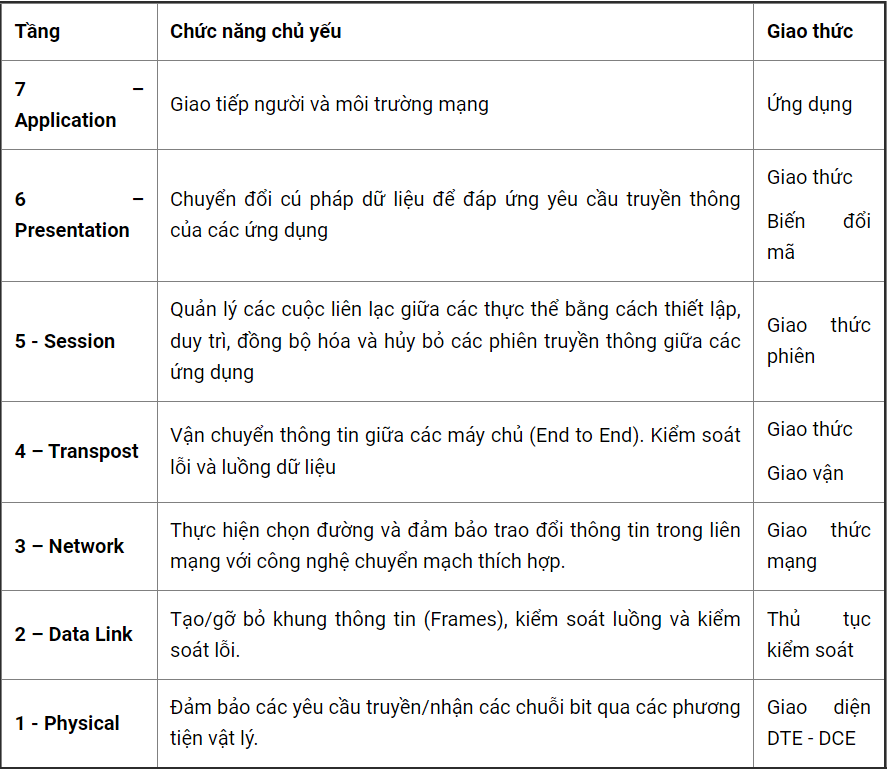

# 1. Mô hình OSI là gì
## 1.1 Định nghĩa

 Mô hình OSI ( open system interconection reference model ) là mô hình tham chiếu kết nối các hệ thống mở , được tạo lên bởi nguyên lý phân tầng .Mỗi tầng giải quyết một vấn đề hẹp của tiến trình truyền thông . Mô hình này có nhiệm vụ thiết lập kết nối truyền thông và thiết kế giao thức mạng giữa các máy tính 

## 1.2 Nhiệm vụ và chức năng

 Mô hình OSI là thiết kế dùng để tham chiếu đến các kết nối giữa các máy tính với nhau . Các giao thức giữa các tầng với nhau , đồng thời trao đổi dữ liệu 

## 1.3 Các giao thức sử dụng trong mô hình OSI
- Giao thức hướng liên kết :Trước khi truyền dữ liệu , 2 thành phần cùng tầng trong 2 hệ thống cần thiết lập 1 liên kết logic . Đồng nhất các tham số trong quá trình truyền dữ liệu , cắt/hợp dữ liệu.Thiết lập liên kết logic sẽ được nâng cao độ tin cậy và an toàn trong quá trình trao đổi dữ liệu
- Giao thức không liên kết :Dữ liệu được truyền độc lập trên các tuyến khác nhau. Với các giao thức không liên kết chỉ có giai đoạn duy nhất truyền dữ liệu.

# 2. Cấu tạo và chức năng các tầng
Mô hình OSI bao gồm 7 tầng
Tầng 1 đến 4 có nhiệm vụ di chuyển dữ liệu
Từ tầng 5 – 7 thực hiện nhiệm vụ chuyển tiếp dữ liệu và các nhiệm vụ đặc thù khác 

    

## 2.1 Tầng vật lý (Physical Layer)
- Tầng vật lý định nghĩa tất cả các đặc tả về điện và vật lý cho các thiết bị, bao gồm các thiết bị phần cứng thực hiện chức năng truyền tải dữ liệu như Router, cáp , phích cắm, nguồn điện
- Có nhiệm vụ ứng đối với các đòi hỏi về dịch vụ từ tầng liên kết dữ liệu, thiết lập hoặc ngắt kết nối điện với một phương tiện truyền thông
- Tầng vật lý tham gia vào quá trình mà ở đó các dữ liệu được chia sẻ hiệu quả giữa nhiều người dùng với nhiệm vụ điều khiển lưu lượng , giải quyết tranh chấp tài nguyên 

## 2.2 Tầng liên kết dữ liệu ( Data Link )
Đây là nơi các thiết bị chuyển mạch (switches) và các cầu nối (bridge) hoạt động, chức năng chủ yếu của tầng liên kết dữ liệu là thực hiện thiết lập các liên kết, duy trì và hủy bỏ các liên kết dữ liệu. Kiểm soát lỗi và kiểm soát lưu lượng , nó giống với tầng mạng có nhiệm vụ
- Gửi thông tin từ nơi này đến nơi khác
- Hỗ trợ dữ liệu truyền đi giữa các thiết bị trong cùng một mạng
- Phát hiện và sửa chữa các lỗi trong tầng vật lý ( nếu có )

## 2.3 Tầng mạng ( Network)
- Tầng mạng có nhiệm vụ đáp ứng các yêu cầu của tầng giao vận cũng như đưa ra yêu cầu với tầng liên kết dữ liệu bên dưới,chọn đường đi (routing) cho các gói tin nguồn tới đích có thể trong cùng một mạng hoặc khác mạng nhau
- Đánh địa chỉ cho các gói tin , dịch địa chỉ logic sang địa chỉ vật lý
- Cung cấp thuật toán dò đường cho router, xác định đường truyền vật lý tốt nhất cho dữ liệu
- Giúp truyền dữ liệu giữa các máy tính nếu ở 2 mạng khác nhau 

## 2.4 Tầng giao vận ( Transport )
- Tầng giao vận chịu trách nhiệm lập kết nối giữa 2 máy tính với nhau 
- Có thể theo dõi và truyền lại những gói tin thất bại 
- Nhận dữ liệu từ tầng phiên và truyển xuống Network đồng thời nhận dữ liệu đã xử lý truyền lại cho tầng phiên 
- Chịu trách nhiệm kiểm soát và sửa lỗi , điều khiển lưu lượng dữ liệu ,đảm bảo dữ liệu truyền đi trọn vẹn , chính xác và không gây quá tải cho bên nhận

## 2.5 Tầng phiên (Session)
Tầng phiên cho phép người sử dụng trên các máy khác nhau thiết lập, duy trì và đồng bộ phiên truyền thông giữa họ với nhau. Nói cách khác tầng phiên thiết lập “các giao dịch” giữa các thực thể đầu cuối.
- Cung cấp các nhu cầu dịch vụ cho tầng diễn hoạt 
- Cung cấp liên kết giữa 2 đầu cuối sử dụng dịch vụ phiên sao cho trao đổi dữ liệu một cách đồng bộ và sau khi kết thúc thì giải phóng liên kết 
- Hỗ trợ hoạt động đơn công (single), bán song công (half-duplex) hoặc song công (duplex)

## 2.6 Tầng diễn hoạt (Presentation)
Cung cấp một giao diện tiêu chuẩn cho tầng ứng dụng, tầng này có nhiệm vụ phiên dịch , nén , giải nén , giải mã , mã hóa dữ liệu 
- Phiên dịch dữ liệu để tầng ứng dụng hiểu
- Mã hóa dữ liệu gửi đi và giải mã dữ liệu nhận được
- Nén dữ liệu trước khi truyền xuống tầng dưới

## 2.7 Tầng ứng dụng (Application)
Tầng ứng dụng là tầng gần với người sử dụng nhất. Nó cung cấp phương tiện cho người dùng truy nhập các thông tin và dữ liệu trên mạng thông qua chương trình ứng dụng. Tầng này là giao diện chính để người dùng tương tác với chương trình ứng dụng, và qua đó với mạng

**Bảng tóm tắt chức năng các tầng**

# 3. Quy trình hoạt động mô hình 
``Phía máy gửi`` 
- Tầng 7 (application): Người dùng đưa thông tin vào máy tính ( hình ảnh , văn bản)
- Tầng 6 (presentation): Chuyển dữ liệu thành một dạng chung để mã hóa dữ liệu
- Tầng 5 (session): Xác nhận, bổ sung thông tin cần thiết cho phiên giao dịch
- Tầng 4 (transport): Dữ liệu được cắt ra thành nhiều Segment và cũng bổ sung thông tin về phương thức vận chuyển dữ liệu để đảm bảo tính bảo mật 
- Tầng 3 (network): Segment tiếp tục được cắt ra thành nhiều Package và bổ sung thông tin định tuyến , xác định đường đi cho gói dữ liệu
- Tầng 2 (datalink): Package được cắt nhỏ ra thành các Frame và bổ sung thông tin kiểm tra gói tin 
- Tầng 1 (phisical): Frame được chuyển thành chuỗi nhị phân để truyền thông tin đến máy nhận 

``Phía máy nhận``
- Tầng 1 (phisical): Máy nhận kiểm tra quá trình đồng bộ và đưa các chuỗi bit nhị phân vào vùng đệm rồi gửi thông báo cho tầng Datalink là đã nhận dữ liệu
- Tầng 2 (datalink): Kiểm tra các lỗi trong Frame máy gửi tạo ra bằng cách kiểm tra FCS có trong gói tin được gắn phía máy nhận , nếu có lỗi thì frame đó bị hủy. Sau đó kiểm tra địa chỉ Mac Address xem có trùng địa chỉ máy nhận không, nếu đúng thì gỡ bỏ Header của tầng datalink để chuyển lên network
- Tầng 3 (network): Kiểm tra xem địa chỉ trong gói tin này có phải là địa chỉ của máy nhận hay không.Nếu đúng địa chỉ máy nhận, tầng Network sẽ gỡ bỏ Header của nó và tiếp tục chuyển đến tầng Transport để tiếp tục qui trình.
- Tầng 4 (transport): Hỗ trợ phục hồi lỗi và xử lý lỗi bằng cách gửi các gói tin ACK, NAK. Tầng này tiếp tục sắp xếp các thứ tự phân đoạn và đưa dữ liệu đến tầng Session
- Tầng 5 (session): Đảm bảo các dữ liệu trong gói tin nhận được toàn vẹn. Tiến hành gỡ bỏ Header của tầng Session và tiếp tục gửi lên ầng Presentation.
- Tầng 6 (presentation): Xử lý gói tin bằng cách chuyển đối các định dạng dữ liệu cho phù hợp. Sau khi hoàn thành sẽ tiến hành gửi lên tầng Application.
- Tầng 7 (application): Tiến hành xử lý và gỡ bỏ Header cuối cùng. Khi đó ở máy nhận sẽ nhận được dữ liệu của gói tin được truyền đi.

*Danh mục tài liệu tham khảo*

[1] [https://www.totolink.vn/article/136-mo-hinh-osi-la-gi-chuc-nang-cua-cac-tang-giao-thuc-trong-mo-hinh-osi.html](https://www.totolink.vn/article/136-mo-hinh-osi-la-gi-chuc-nang-cua-cac-tang-giao-thuc-trong-mo-hinh-osi.html)

[2] [https://vi.wikipedia.org/wiki/M%C3%B4_h%C3%ACnh_OSI](https://vi.wikipedia.org/wiki/M%C3%B4_h%C3%ACnh_OSI)

[3] [https://fpttelecom.com/blog/mo-hinh-osi/](https://fpttelecom.com/blog/mo-hinh-osi/)

[4] [https://suncloud.vn/mo-hinh-osi](https://suncloud.vn/mo-hinh-osi)

[5][https://www.digistar.vn/quy-trinh-truyen-goi-tin-trong-mo-hinh-osi/](https://www.digistar.vn/quy-trinh-truyen-goi-tin-trong-mo-hinh-osi/)