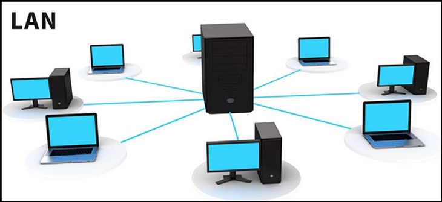
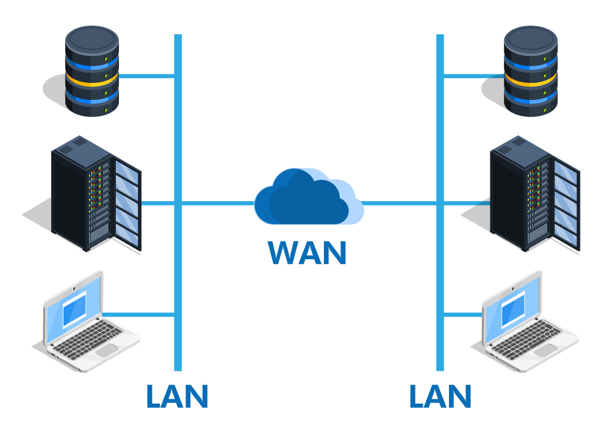
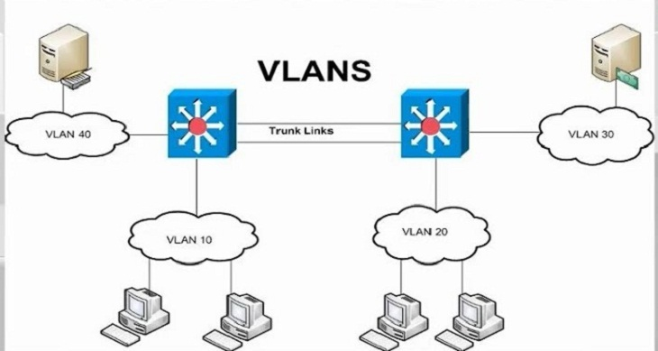
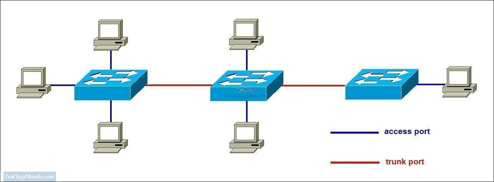
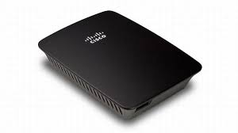
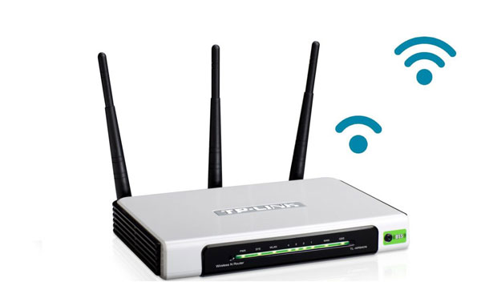
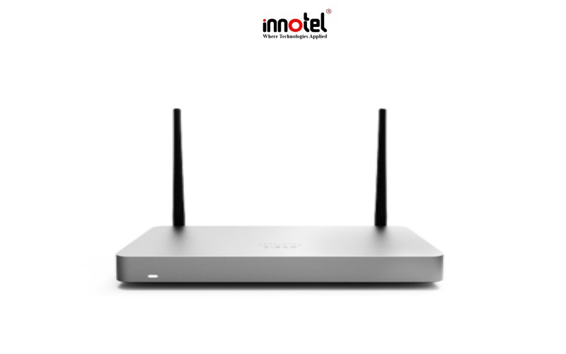
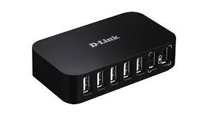
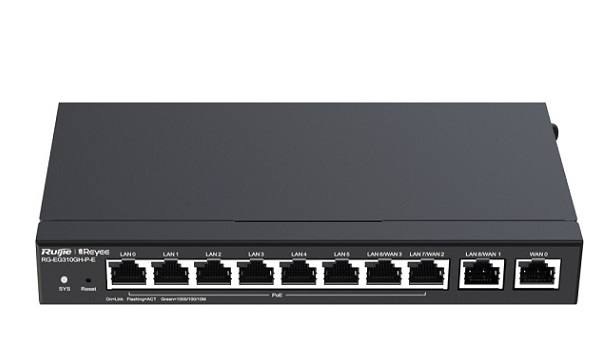
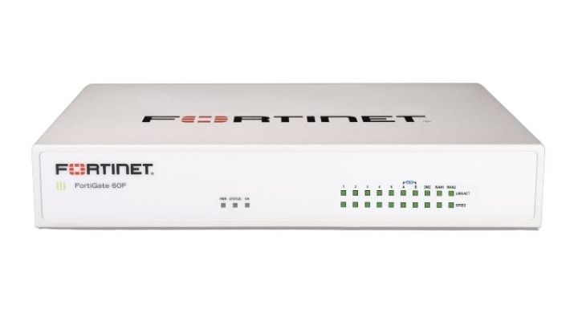

# 1 VLAN là gì 
## 1.1 Mạng LAN là gì 
LAN là một mạng cục bộ ( Local Area Network ) được hiểu là sự kết hợp của nhiều thiết bị được kết nối lại với nhau trong một hệ thống mạng tại một khu vực nhất định ( công ty , trường học , nhà ở ...) Việc ghép nối các thiết bị trong cùng một hệ thống cho phép các thiết bị này trao đổi dữ liệu với nhau một cách nhanh chóng và dễ dàng .  

Những thiết bị trong cùng mạng LAN có thể kết nối với nhau thông qua sợi cáp mạng . Gộp nhiều mạng LAN có thể truy cập với nhau tạo ra một mạng lưới rộng lớn hơn được gọi là WAN (Wide Area Network) và để giao tiếp với nhau , các thiết bị được kết nối với một hoặc nhiều thiết bị thu phát tín hiệu mạng (Router)

## 1.2 VLAN là gì   
- VLAN là viết tắt của Virtual local area network hay còn gọi là mạng LAN ảo, cho phép chia một con Switch vật lý thành nhiều con Switch ảo, trên một con Switch sẽ tạo được từ VLAN 0 đến VLAN 4095 ( 4096 VLAN ) . Mạng LAN ảo (VLAN) là một nhóm các máy tính được kết nối với cùng một mạng không ở gần nhau . Sử dụng VLAN cho phép sử dụng tài nguyên hiệu quả và có thể hữu ích khi có quá nhiều thiết bị trên một mạng .  

VLAN 0 và 4095 : không được sử dụng 
VLAN 1 : VLAN default
VLAN 2-1001: normal range (có thể sử dụng được)
VLAN 1002-1005: VLAN default , dùng để kết nối đến hệ thống mạng khác như : FDDI , token Ring, ( không kết nối được system Ethernet)
VLAN 1006-4094 : VLAN extended range(dùng cho các Switch Transparent)

- Khác biệt giữa VLAN và LAN 

|Đặc Điểm | LAN | VLAN |
|---------|------|-----|
|Định nghĩa|Mạng cục bộ LAN là một tập hợp các máy tính và thiết bị ngoại vi được liên kết trong một khu vực địa lý cụ thể | VLAN là một mạng LAN ảo tùy chỉnh được tạo thành từ một hoặc nhiều mạng LAN|
|Độ trễ| Độ trễ mạng LAN lớn hơn | Đô trễ VLAN giảm xuống |
|Chi phí | Cao hơn | Thấp hơn |
|Cách thức hoạt động | Các gói mạng được Broadcast gửi tới từng thiết bị trong mạng LAN |Các gói mạng trong VLAN chỉ được gửi đến một địa chỉ Broadcast duy nhất |
|Giao thức |Sử dụng giao thức FDDI | Sử dụng giao thức STP , VTP,ISP|
 
## 1.3 Phân loại VLAN 
- Static VLAN (VLAN tĩnh)
Static VLAN được tạo ra bằng cách gán các cổng của mỗi Switch thành một mạng VLAN. Mỗi cổng nằm trên một VLAN và chỉ giao tiếp, kết nối với những VLAN được chỉ định. Trong nhiều trường hợp các VLAN tĩnh có thể thay đổi nhanh chóng bằng thủ công hoặc tự động hóa mạng.

- Dynamic VLAN (VLAN động)
Khác với Static VLAN, Dynamic VLAN được tạo ra dựa trên loại lưu lượng hoặc thiết bị tạo ra lưu lượng. Thông thường kỹ sư mạng sẽ dùng phần mềm điển hình cisco work 2000 để tạo ra Dynamic VLAN. Một cổng có thể gán cho một VLAN dựa trên địa chỉ Mac nguồn của loại thiết bị đính kèm.
## 1.4 Công dụng của VLAN
**Tiết kiệm băng thông của hệ thống mạng**: VLAN chia mạng LAN thành nhiều đoạn (segment) nhỏ, mỗi đoạn đó là một vùng quảng bá (broadcast domain). Khi có gói tin quảng bá (broadcast), nó sẽ được truyền duy nhất trong VLAN tương ứng. Do đó việc chia VLAN giúp tiết kiệm băng thông của hệ thống mạng.
**Tăng khả năng bảo mật**: Do các thiết bị ở các VLAN khác nhau không thể truy nhập vào nhau (trừ khi ta sử dụng router nối giữa các VLAN).
**Dễ dàng thêm hay bớt máy tính vào VLAN**: Việc thêm một máy tính vào VLAN rất đơn giản, chỉ cần cấu hình cổng cho máy đó vào VLAN mong muốn.
**Giúp mạng có tính linh động cao**: VLAN có thể dễ dàng di chuyển các thiết bị. Giả sử trong ví dụ trên, sau một thời gian sử dụng công ty quyết định để mỗi bộ phận ở một tầng riêng biệt. Với VLAN, ta chỉ cần cấu hình lại các cổng switch rồi đặt chúng vào các VLAN theo yêu cầu. VLAN có thể được cấu hình tĩnh hay động. Trong cấu hình tĩnh, người quản trị mạng phải cấu hình cho từng cổng của mỗi switch. Sau đó, gán cho nó vào một VLAN nào đó. Trong cấu hình động mỗi cổng của switch có thể tự cấu hình VLAN cho mình dựa vào địa chỉ MAC của thiết bị được kết nối vào
## 1.5 Cách thức hoạt động động của VLAN
Một VLAN được xác định trên các Switch bằng một ID VLAN . Mỗi cổng trên một Switch sẽ được gán cho một hoặc nhiều VLAN ID , trường hợp không được chỉ định thì nó sẽ được chuyển tới một VLAN mặc định . Mỗi VLAN sẽ cung cấp quyền truy cập dữ liệu cho tất cả các thiết bị kết nối với cổng Switch phù hợp với VLAN ID của nó  
ID VLAN sẽ được dịch sang thẻ VLAN bằng một thẻ 12 bit xác định tối đa 4096 VLAN trên mỗi miền truyển mạch . IEEE sẽ chịu trách nhiệm gắn VLAN theo tiêu chuẩn 802.1Q . Switch sẽ thêm thẻ VLAN cho khung Ethernet. Với Static VLAN, switch sẽ chèn thẻ được liên kết với ID VLAN của cổng nhập . Riêng Danamic VLAN , Switch sẽ chèn thẻ được liên kết với ID của thiết bị đó hoặc loại lưu lượng nó tạo ra   
Các khung Ethernet được gắn thẻ sẽ chuyển tiếp về địa chỉ MAC đích của chúng (chỉ chuyển tiếp đến các cổng có liên kết VLAN )Lưu lượng quảng bá (broadcast), unicast, multicast đều được chuyển tiếp đến các cổng trong VLAN.
Đường trung kế kết nối (Truck) giữa các switch nhận biết được VLAN nào trải dài trên switch. Truck còn đóng vai trò truyền lưu lượng truy cập cho các VLAN được sử dụng ở hai phía đầu, cuối của nó. Khi một khung chạm đến switch đích thì thẻ VLAN sẽ bị xóa trước khi khung được truyền tới máy tính đích.
Spanning Tree Protocol ( STP )là một giao thức được dùng để ngăn chặn sự lặp vòng giữa các switch trong mỗi miền lớp 2 (Ethernet). Mỗi VLAN sẽ chạy một STP riêng biệt, không phụ thuộc lẫn nhau. Nếu cấu trúc liên kết giữa nhiều VLAN giống nhau thì có thể chạy STP đa trường hợp để giảm chi phí STP.

# 2.Tìm hiểu về Trunk 
## 2.1 Khái niệm 
Trong hệ thống mạng truyền thông, người ta dùng trunk để chỉ đường trung kế kết nối giữa các thiết bị đầu cuối, trạm con,… Đường trung kế được hiểu là đường truyền hoặc liên kết được thiết kế để mang nhiều tín hiệu. Đồng thời để cung cấp quyền truy cập mạng giữa hai điểm.Trunk thường kết nối các trung tâm chuyển mạch trong một hệ thống truyền thông. Các tín hiệu có thể truyền tải bất kỳ loại dữ liệu truyền thông.
## 2.2 Phân loại 
- Chuẩn DOT1Q hay 802.1q, 2 chuẩn này do IEEE đề ra
- Chuẩn ISL do Cisco đề ra. Thế nhưng không phải dòng sản phẩm nào của Cisco cũng hỗ trợ chuẩn ISL. Chính vì vậy hiện nay chuẩn dot1q được sử dụng phổ biến hơn so với các chuẩn còn lại

## 2.3 Phân biệt giữa Access port và Trunk port
- Access port ( Cổng truy cập): Cổng có thể được gán cho một VLAN duy nhất. Loại giao diện này được cấu hình trên các cổng chuyển đổi được kết nối với các thiết bị đầu cuối như máy trạm, máy in hoặc điểm truy cập.
- Trunk port ( Cổng trung kế): Cổng được kết nối với switch khác nhau. Loại giao diện này có thể mang lưu lượng của nhiều VLAN, do đó cho phép bạn mở rộng các VLAN trên toàn bộ mạng của mình. Các khung được gắn thẻ bằng cách gán VLAN ID cho mỗi khung khi chúng đi qua giữa các công tắc.

# 3. Các thiết bị mạng 
Một hệ thống mạng sẽ bao gồm các thành phần chính sau

*Hub – Khuếch đại thông tin qua nhiều cổng
**Repeater** – Khuếch đại tín hiệu
**Switch** – Thiết bị chuyển mạch
**Gateway** – Kết nối các mạng giao thức khác nhau trong hệ thống
**Modem** – Giao tiếp mạng ISP
**Bridge** – Kết nối các mạng trong hệ thống lại với nhau
**Router** – Kết nối mạng IP

## 3.1 Bridge
Bridge là thiết bị mạng thuộc lớp thứ 2 trong mô hình OSI (Data Link Layer). Bridge được sử dụng để ghép giữa 2 mạng với nhau. Để tạo thành một mạng lớn.Khi có một gói tin từ một máy tính thuộc mạng này gửi đến một máy tính thuộc mạng khác. Bridge sẽ sao chép lại gói tin. Và gửi nó tới mạng đích.
Bridge là hoạt động trong suốt. Các máy tính thuộc các mạng khác nhau có thể gửi các thông tin qua lại với nhau đơn giản. Mà không cần biết sự có mặt của Bridge. Bridge chỉ kết nối được những mạng cùng loại. Việc sử dụng Bridge cho những mạng tốc độ cao sẽ khó nếu chúng nằm xa nhau.

## 3.2 Repeater
Repeater là một cách thức tiếp sóng mà không cần dùng đến đường truyền kết nối các thiết bị vào Modem bằng dây dẫn. Repeater tiếp sóng từ modem wifi giúp mạng wifi truyền đi xa hơn.
Repeater là thiết bị ở lớp 1 (Physical Layer) trong mô hình OSI. Repeater có vai trò khuếch đại tín hiệu vật lý ở đầu vào và cung cấp tín hiệu ở đầu ra để có thể đến được điểm xa hơn trên mạng.

## 3.3 Router 
Router (bộ định tuyến) là thiết bị mạng có chức năng chuyển tiếp dữ liệu giữa các mạng máy tính. Nói một cách dễ hiểu: router thực hiện điều phối dữ liệu trên Internet, các dữ liệu này sẽ được gửi theo dạng gói từ router này sang router khác thông qua các mạng nhỏ được kết nối với nhau thành một hệ thống mạng liên kết. Gói dữ liệu sẽ được truyền tiếp qua các router cho đến khi chúng tới được điểm đích. Router là một thiết bị mạng thuộc lớp 3 của mô hình OSI (Network Layer).

Cấu tạo của router thông thường gồm:

- Cổng WAN: Trên tất cả các router đều có cổng này, nó cung cấp lớp mạng riêng và dải IP mặc định cho thiết bị (cổng này sẽ có màu xanh hoặc vàng để dễ phân biệt).
- Cổng LAN: Mỗi router sẽ được trang bị từ 2 cổng LAN trở lên. Đây là cổng mà người dùng có thể kết nối trực tiếp từ router tới máy tính PC, tivi, laptop,... thông qua dây cáp mạng Ethernet. Tùy từng loại router mà tốc độ tối đa truyền tải dữ liệu của cổng LAN sẽ khác nhau.
- Ăng-ten: Một router wifi sẽ có 2 loại anten là anten trong và anten ngoài. Số lượng râu anten càng nhiều thì tốc độ phát sóng wifi càng cao.

## 3.4 Switch
Switch hay bộ chuyển mạch là một thiết bị quan trọng trong hệ thống mạng, nó dùng để kết nối các đoạn mạng với nhau tạo thành một mô hình sao (Star). Switch sẽ đóng vai trò trung tâm, các thiết khác như: máy tính, máy in,... sẽ được kết nối về đây và tạo ra một đường trung chuyển dữ liệu. Ngoài ra, switch còn được tích hợp công nghệ Full Duplex giúp mở rộng băng thông của đường truyền, điều mà các thiết bị khác không thể làm được.

Switch Layer 2 và Switch Layer 3 là các khái niệm được sử dụng dựa trên mô hình OSI để mô tả và giải thích chức năng của từng switch khi tham gia vào hệ thống mạng. Trong mô hình OSI, Switch Layer 2 tương ứng với lớp Data Link và Switch Layer 3 tương ứng lớp Network.

***Switch Layer 2*** là các thiết bị chuyển mạch thường được sử dụng để kết nối xuống các thiết bị đầu cuối, cung cấp kết nối mạng tới các thiết bị nhưng PC, Laptop, máy in, camera, server ... Switch Layer 2 được thiết kế tuân thủ theo các quy chuẩn của lớp Data Link.

***Switch Layer 3*** là các thiết bị chuyển mạch thường được sử dụng cho các hệ thống Core hoặc Distribution để kết nối các switch access (switch layer 2) hoặc kết nối sang các mạng khác. Switch Layer 3 được thiết kế tuân thủ theo các quy chuẩn của lớp Network trong mô hình OSI.

## 3.5 Hub
Hub là thiết bị mạng cơ bản nhất kết nối nhiều PC hoặc kết nối các thiết bị mạng khác với nhau. Không giống như bộ chuyển mạch Switch hoặc bộ định tuyến Router, Hub không có bảng định tuyến hoặc thông tin về nơi gửi và phát tất cả dữ liệu mạng trên mỗi kết nối.

Hub và Switch đóng vai trò như một kết nối trung tâm với tất cả các thiết bị mạng của bạn và xử lý một kiểu dữ liệu gọi là khung. Khi nhận được một khung, nó được khuếch đại và sau đó truyền đến cổng của máy tính đích.

Trong một bộ tập trung Hub, một Frame được truyền đi hoặc “broadcast” tới tất cả các cổng của nó. Hub không có cách nào phân biệt cổng nào sẽ được gửi đến. Chuyển nó đến tất cả các cổng đảm bảo rằng nó sẽ đạt đến đích dự kiến của nó. Điểm này đặt rất nhiều lưu lượng truy cập trên mạng và có thể dẫn đến thời gian phản hồi mạng kém.

Hub sở hữu nhiều cổng từ 4 lên tới 24 cổng, và được coi như là một Repeater nhiều cổng. Khi thông tin được truyền tín hiệu vào một cổng của Hub, các cổng khác cũng sẽ nhận được thông tin ngay lập tức.

Hiện nay có 2 loại Hub phổ biến là Active Hub và Smart Hub:

***Active Hub***: loại Hub này thường được dùng phổ biến hơn rất nhiều, cần được cấp nguồn khi hoạt động. Active Hub dùng để khuếch đại tín hiện đến và chia ra những cổng còn lại để đảm bảo tốc độ tín hiệu cần thiết khi sử dụng.
***Smart Hub***: nó cũng có chức năng làm việc tương tự như Active Hub, nhưng được tích hợp thêm chip có khả năng tự động kiểm tra lỗi trên mạng.

So với switch, hub chậm hơn vì nó có thể gửi hoặc nhận thông tin không chỉ cùng một lúc, mà tốn nhiều hơn một hub.

## 3.6 Gateway
Chức năng chính của thiết bị Gateway là kết nối các máy tính với nhau một cách dễ dàng ngay cả khi những thiết bị này không sử dụng chung một giao thức. Ví dụ như Gateway có thể kết nối máy tính sử dụng giao thức IP với máy tính sử dụng giao thức SNA, IPX,..
Ngoài ra, thiết bị này còn có khả năng phân biệt các giao thức. Vì vậy, thường được ứng dụng trong việc chuyển thư điện tử từ mạng này sang mạng khác kể cả đường truyền xa.
Tài liệu tham khảo  

## 3.7 Firewall 
Firewall (tường lửa) là một hệ thống an ninh mạng, nó hoạt động dựa trên phần cứng hoặc phần mềm được tích hợp sẵn trong thiết bị, sử dụng các quy tắc để kiểm soát lưu lượng ra/vào trong hệ thống. Tường lửa hoạt động như một rào chắn, ngăn chặn các cuộc tấn công mạng từ bên ngoài vào hệ thống mạng gia đình.

Firewall giúp ngăn chặn các nguồn truy cập trái phép từ bên ngoài vào hệ thống mạng, không cho các nguồn truy cập từ bên ngoài đăng nhập vào khi chưa được phép.

[1] [https://maychusaigon.vn/vlan-la-gi/](https://maychusaigon.vn/vlan-la-gi/)
[2] [https://bkhost.vn/blog/vlan/](https://bkhost.vn/blog/vlan/)
[3] [https://quantrimang.com/cong-nghe/vlan-la-gi-lam-the-nao-de-cau-hinh-mot-vlan-tren-switch-cisco-64830](https://quantrimang.com/cong-nghe/vlan-la-gi-lam-the-nao-de-cau-hinh-mot-vlan-tren-switch-cisco-64830)
[4] [https://hocmangcoban.blogspot.com/2014/05/vtp-vlan-trunking-protocol.html](https://hocmangcoban.blogspot.com/2014/05/vtp-vlan-trunking-protocol.html)
[5] [https://itforvn.com/tu-hoc-ccnax-bai-7-spanning-tree/](https://itforvn.com/tu-hoc-ccnax-bai-7-spanning-tree/)\
[6] [https://securityzone.vn/t/bai-19-tim-hieu-giao-thuc-spanning-tree-protocol.163/](https://securityzone.vn/t/bai-19-tim-hieu-giao-thuc-spanning-tree-protocol.163/)
[7] [https://digicenter.com.vn/trunk-la-gi/](https://digicenter.com.vn/trunk-la-gi/)
[8] [https://trogiupnhanh.com/phan-biet-su-khac-nhau-giua-access-va-trunk-port/](https://trogiupnhanh.com/phan-biet-su-khac-nhau-giua-access-va-trunk-port/)