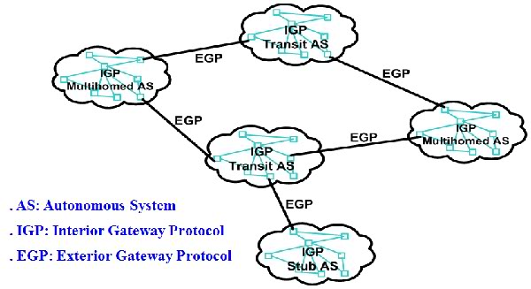

# Các giao thức định tuyến 
IP Routing là tập hợp các giao thức mà quyết định đường đi của luồng dữ liệu xuyên qua mạng từ điểm nguồn đến điểm đích.
Một router sử dụng bảng định tuyến của nó để quyết định router tiếp theo để chuyển gói dựa vào địa chỉ IP đích của gói

## 1.Hệ thống tự quản AS (Autonomous System)
- Stub AS: chỉ có một kết nối duy nhất tới một AS khác. Bất kỳ data được gửi hay nhận ra ngoài mạng đều đi qua kết nối này
- Transit AS: có nhiều kết nối đến nhiều AS khác. Nó cho phép trung chuyển data từ một AS này đến một AS khác
- Multihomed AS: nó cũng có nhiều kết nối đến các AS khác, nhưng không đóng vai trò trung chuyển, nghĩa là nó không cho phép một data đi vào một kết nối của nó rồi đi ra một kết nối khác.

## 2.Mô hình mạng tổng thể

- IGP (Interior Gateway Protocol) cho phép những router bên trong một AS gửi data từ một router đến một router khác
- EGP (Exterior Gateway Protocol) cho phép các router bên trong một AS chọn router tốt nhất trong các router biên để gửi data sang các AS khác.

## 3.Routing Information Protocol(RIP)
Routing Information Protocol (RIP) là giao thức định tuyến động sử dụng số bước nhảy làm thước đo định tuyến để tìm đường đi tốt nhất giữa mạng nguồn và mạng đích. Đây là giao thức định tuyến vectơ khoảng cách có giá trị AD là 120 và hoạt động trên lớp Mạng của mô hình OSI. RIP sử dụng số cổng 520.
- RIP là một giao thức IGP để phân phối thông tin định tuyến giữa các router bên trong một AS
- RIP là một giao thức định tuyến vecto khoảng cách
- Mỗi router khởi tạo bảng định tuyến với một danh sách các kết nối trực tiếp với các router gần nhất.
- Mỗi router sẽ flood bảng định tuyến của nó trên toàn AS
- Khi một router nhận được một thông tin từ router khác, nó sẽ update bảng định tuyến của mình để cuối cùng nó đảm bảo rằng có thể biết được tất cả các router khác.
- Trong bảng định tuyến của router, mỗi đích đến có một thuộc tính gọi là metric cost, đó là khoảng cách vecto từ router đến đích.
- Nếu một router có thể chọn nhiều hop để gửi data tới đích, nó sẽ quyết định chọn một hop dựa vào so sánh các metric phải trả khi gửi data .

## 4.IGRP (Interior Gateway Routing Protocol)

IGRP là giao thức định tuyến dạng classful, nghĩa là không chứa subnet mask trong các thông tin cập nhật định tuyến (routing update). Do không có khả năng mang các thông tin update nên dẫn đến có một vài hạn chế trong các thiết kế mạng dùng giao thức này. Các giao thức nhóm classful gồm RIPv1 và IGRP. Các đặc điểm của một giao thức classful gồm
- Thực hiện quá trình summary ở ranh giới các mạng
- Các routes được trao đổi giữa các mạng được summary theo địa chỉ của IANA.
- Bên trong một network, các lớp mạng con trao đổi với nhau bởi router mà không cần giá trị mask. Do đó giá trị subnet mask phải có cùng giá trị cho tất cả các interface trong cùng mạng.
Nếu có một entry trong bảng định tuyến cho một subnet cụ thể, gói IP sẽ được chuyển về địa chỉ đích đó. Nếu địa chỉ đích là không biết, datagram sẽ bị drop. Nếu ta có cấu hình default-network cho router, default network sẽ được dùng. Tuy nhiên default-network chỉ được dùng trong classful routing nếu router không có kiến thức về mạng đíc ở bất kỳ mức nào. Như vậy nếu major network là biết, gói IP sẽ bị drop cho dù có một mạng default network.
Ở chế độ mặc định, IGRP tính toán metric dựa trên các thông số băng thông (bandwidth) và độ trễ (delay). IGRP có thời gian cập nhật dài hơn RIP, có khả năng hỗ trợ cân bằng tải với metric không bằng nhau. IGRP không hỗ trợ discontiguous network, VLSM.

## 5.EIGRP (Enhanced Interior Gateway Routing Protocol)
EIGRP là giao thức định tuyến dạng lai giữa distance vector và link state. EIGRP là một phát triển riêng của Cisco nhằm khắc phục các nhược điểm của RIP/IGRP và có những ưu điểm như dễ cấu hình, độ hội tụ nhanh, tiết kiệm tài nguyên mạng khi trao đổi thông tin, sử dụng địa chỉ multicast để liên lạc, khả năng sử dụng hiệu quả băng thông, hỗ trợ VLSM và vấn đề mạng không liên tục (discontiguous network).
Các giao thức định tuyến nhóm classless được thiết kế để khắc phục các hạn chế của định tuyến classful, trong đó bao gồm các đặc điểm sau:
- Không gian địa chỉ được sử dụng hiệu quả
- Hỗ trợ VLSM. Các cổng của router trong cùng một network có thể có các giá trị subnet mask khác nhau
- Hỗ trợ cho việc sử dụng CIDR
- Các route có thể được summary.
EIGRP và IGRP có cùng cách tính metric, tuy nhiên metric của EIGRP bằng metric của IGRP nhân với 256 do IGRP có trường metric là 24 bit trong khi EIGRP có trường metric là 32 bit:
EIGRP Metric = IGRP Metric * 256

## 6.OSPF (Open Shortest Path First)

- OSPF là giao thức IGP để phân phối các thông tin định tuyến bên trong một mạng AS. OSPF là một giao thức định tuyến trạng thái liên kết.
- Thông tin của topo mạng sẽ được các router tính toán chọn đường đi tốt nhất để gửi data đến đích, thường dựa vào thuật toán Dijkstra.
- Thuận lợi chính của giao thức trạng thái liên kết là các router biết được các thông tin về topo mạng, nên nó có thể tính toán được đường đi tốt nhất mà thõa mãn các yêu cầu đặc biệt.
- Bất lợi của nó là nếu có thêm các router của mạng thì sẽ làm tăng lên số lượng và tần số của bảng tin update và cũng kéo dài thời gian tính toán chọn đường.

## 7.BGP (Border Gateway Protocol)
- BGP là một giao thức EGP được thiết kết để phân phối thông tin định tuyến giữa các AS.
- BGP là một giao thức định tuyến vecto khoảng cách.
- Bảng định tuyến chứa tất cả các đích mà router biết và địa chỉ hop tiếp theo mà router phải gửi để đến đích cũng như metric cost của con đường đó.
- Nếu một router có thể chọn nhiều hop để gửi data tới đích, nó sẽ quyết định chọn một hop dựa vào so sánh các metric phải trả khi gửi data

*Tài liệu tham khảo *

[1] [https://thegioimang.vn/dien-dan/threads/c%C3%A1c-giao-th%E1%BB%A9c-%C4%91%E1%BB%8Bnh-tuy%E1%BA%BFn-routing-protocol.34/](https://thegioimang.vn/dien-dan/threads/c%C3%A1c-giao-th%E1%BB%A9c-%C4%91%E1%BB%8Bnh-tuy%E1%BA%BFn-routing-protocol.34/)