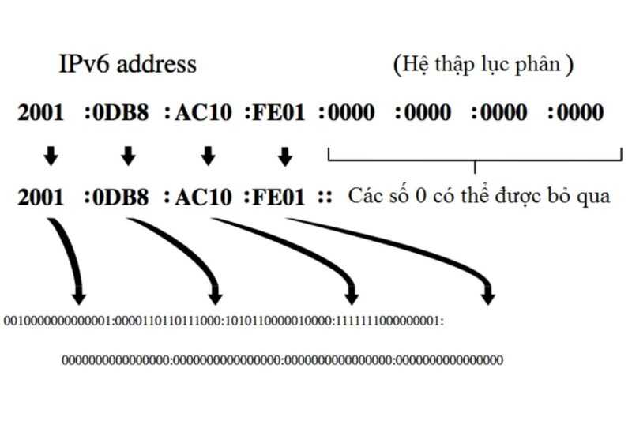
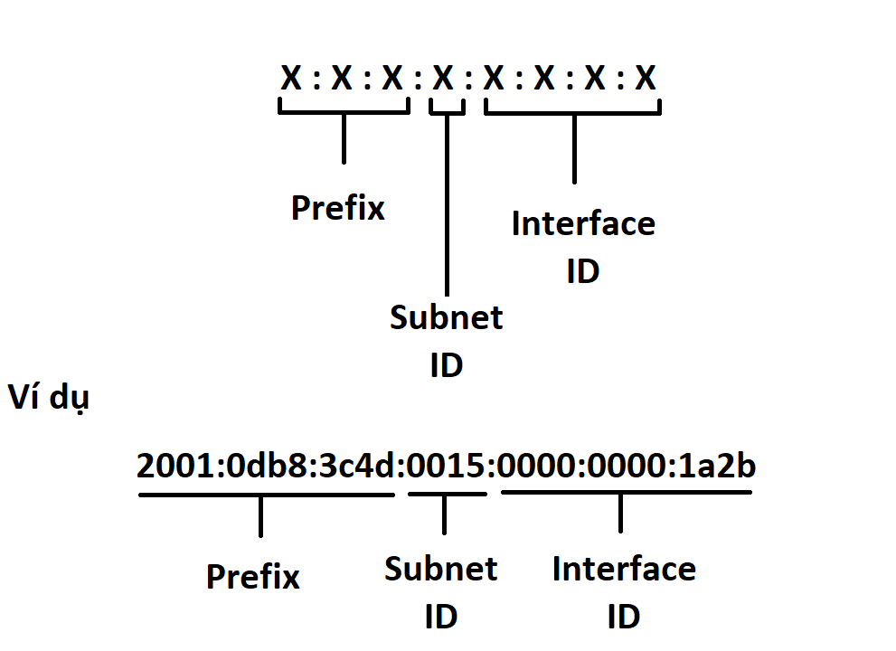
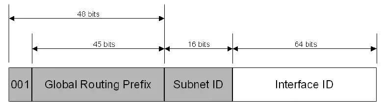
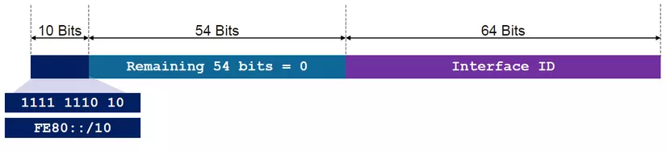
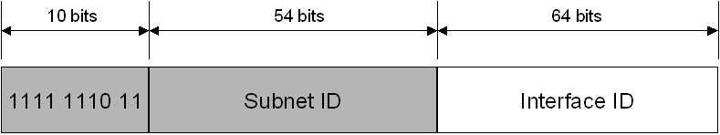
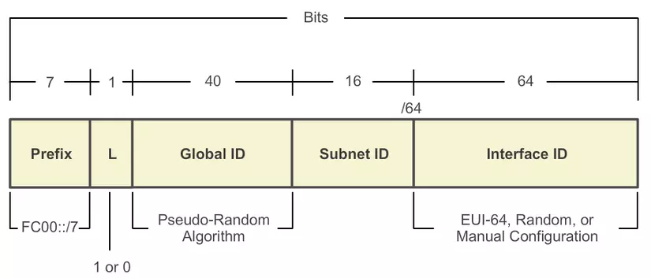
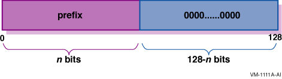

# 1. IPv6 là gì 
IPv6 ( Internet Protocal version 6 ) là phiên bản mới nhất của giao thức Internet(IP), giao thức truyền thông cung cấp một hệ thống định vị vị trí cho các máy tính trên mạng và định tuyến lưu lượng trên internet. 

# 2. Cấu trúc - thành phần IPv6
## 2.1 Cấu trúc IPv6
Một IPv6 có cấu trúc gồm 128 bit, và phân thành 8 nhóm . Mỗi nhóm gồm 16 bit ,mỗi nhóm được biểu diễn bằng 4 số hexa giữa các nhóm có sự phân chia bởi dấu ":"  
Ví dụ một địa chỉ IPv6 được biểu diễn theo cấu trúc sau :  
FEDC:BA98:768A:0C98:FEBA:CB87:7678:1111  
 
Những địa chỉ này lớn , khả năng cung cấp địa chỉ cho nhiều node và cung cấp cấu trúc phân cấp linh hoạt , nhưng nó không dễ viết ra .Vì thế có 1 số nguyên tắc nhằm rút ngắn lại cách biểu diễn 1 địa chỉ IPv6 
- Cho phép bỏ các số 0 nằm trước mỗi octet
- Thay bằng số 0 với nhóm toàn số 0
- Thay bằng dấu "::" cho các nhóm liên tiếp toàn số 0

Ví dụ : 1080:0000:0000:0070:0000:0989:CB45:345F sẽ được rút gọn là 
1080::70:0:989:CB45:345F hoặc 1080:0:0:70::989: CB45:345F

## 2.2 Thành phần IPv6
Một địa chỉ IPv6 được chia thành 3 phần: site prefix, subnet ID, interface ID.

- Site prefix: là số được gán đến website bằng một ISP. Theo đó, tất cả máy tính trong cùng một vị trí sẽ được chia sẻ cùng một site prefix. Site prefix hướng tới dùng chung khi nó nhận ra mạng của bạn và cho phép mạng có khả năng truy cập từ Internet.
- Subnet ID: là thành phần ở bên trong trang web, được sử dụng với chức năng miêu tả cấu trúc trang của mạng. Một IPv6 subnet có cấu trúc tương đương với một nhánh mạng đơn như subnet của IPv4.
- Interface ID: có cấu trúc tương tự ID trong IPv4. Số này nhận dạng duy nhất một host riêng trong mạng. Interface ID (thứ mà đôi khi được cho như là một thẻ) được cấu hình tự động điển hình dựa vào địa chỉ MAC của giao diện mạng. ID giao diện có thể được cấu hình bằng định dạng EUI-64.

# 3. Phân loại IPv6
## 3.1 Unicast Address
Một địa chỉ unicast là một địa chỉ duy nhất trên internet. Một gói tin có đích đến là 1 địa chỉ unicast thì gói tin đó sẽ được chuyển đến 1 interface duy nhất có địa chỉ đó. Có các loại địa chỉ sau thuộc Unicast:
### 3.1.1 Global Unicast Address
Global Unicast Address Là địa chỉ IPv6 toàn cầu (tương tự như địa chỉ public của IPv4). Phạm vi định vị của GUA là toàn hệ thống IPv6 trên thế giới và là duy nhất trên internet.
  - 3 bit đầu luôn có giá trị là 001 (Prefix=2000::/3 đến 3FFF::/3)
  - Muốn sử dụng thì cần nhà mạng cung cấp 
  - Global Routing Prefix: gồm 45 bit. Là địa chỉ được cung cấp cho công ty, cơ quan, tập đoàn hay một tổ chức nào đó khi đăng ký địa chỉ IPv6 public.
  - Subnet ID: Gồm 16 bit, dùng để chia mạng con trong tổ chức của mình.
  - Interface ID: Gồm 64 bit, dùng để gán cho các thiết bị 

### 3.1.2 Link-local Address
Link-local Address là địa chỉ được sử dụng cho những node trên 1 link duy nhất. Tự động cấu hình, tìm kiếm neighbor. Router không được chuyển tiếp gói tín có địa chỉ nguồn hoặc đích là link-local ra khỏi phạm vi liên kết. Bao gồm các địa chỉ dùng cho các host trong cùng 1 link và quy trình xác định các node (Neighbor Discovery Process), qua đó các node trong cùng link cũng có thể liên lạc với nhau. Phạm vi sử dụng của LLA là trong cùng 1 link (do đó có thể trùng nhau ở link khác). Khi dùng HĐH Windows, LLA được cấp tự động như sau:

  - Dạng địa chỉ link-local sẽ là FE80::/10 với 10 bit đầu cố định 1111 1110 010
  - Là địa chỉ trên cổng Router, nhưng chi được biết đến bởi các Router trên đoạn link đó , ngoài đoạn link đó thì không ping được đến nhau
  - Địa chỉ link-local sẽ tự động sinh ra khi đặt địa chỉ IPv6 cho interface theo quy tắc sau 
      - Bổ đôi địa chỉ MAC và chèn FF:FE vào giữa 
      - Đảo ngược bit số 7 từ trái sang từ 1 thành 0 hoặc 0 thành 1 
      - Ghép FE80 vào đầu , nếu chưa đủ 8 octet của IPv6 thì thêm :: vào sau FE80

### 3.1.3 Site Local Address
Site Local Address được sử dụng trong hệ thống nội bộ (Intranet) tương tự các địa chỉ Private IPv4 (10.X.X.X, 172.16.X.X, 192.168.X.X). Phạm vi sử dụng Site-Local Addresses là trong cùng Site.

  - 1111 1110 11: 10 bit đầu là giá trị cố định (Prefix=FEC0/10)
  - Subnet ID: gồm 54 bit dùng để xác định các subnet trong cùng site.
  - Interface ID: Gồm 64 bit là địa chỉ của các interface trong subnet. Lưu ý: Hai dạng địa chỉ Unicast (LLA và SLA) vừa trình bày trên được gọi chung là các địa chỉ unicast nội bộ (Local Use Unicast Address). Với cấu trúc như thế thì các Local Use Unicast Address có thể bị trùng lặp (trong các Link khác hoặc Site khác). Do vậy khi sử dụng các Local Use Unicast Address có 1 thông số định vị được thêm vào là Additional Identifier gọi là Zone ID.

### 3.1.4 Unique-Local Addresses
Đối với các tổ chức có nhiều Site, Prefix của SLA có thể bị trùng lặp. Có thể thay thế SLA bằng ULA (RFC 4193), ULA là địa chỉ duy nhất của một Host trong hệ thống có nhiều Site với cấu trúc:

  - 1111 110: 7 bit đầu là giá trị cố định FC00/7. L=0: Local. → Prefix = FC00/8.
  - Global ID: Địa chỉ site. Có thể gán thêm tuỳ ý.
  - Subnet ID: Địa chỉ subnet trong site.

## 3.2 Multicast Address: 
- Trong địa chỉ IPv6 không còn tồn tại khái niệm địa chỉ Broadcast. Mọi chức năng của địa chỉ Broadcast trong IPv4 được đảm nhiệm thay thế bởi địa chỉ IPv6 Multicast.
- Địa chỉ Multicast giống địa chỉ Broadcast ở chỗ điểm đích của gói tin là một nhóm các máy trong một mạng, song không phải tất cả các máy. Trong khi Broadcast gửi trực tiếp tới mọi host trong một subnet thì Multicast chỉ gửi trực tiếp cho một nhóm xác định các host, các host này lại có thể thuộc các subnet khác nhau.
- Host có thể lựa chọn có tham gia vào một nhóm Multicast cụ thể nào đó hay không (thường được thực hiện với thủ tục quản lý nhóm internet - Internet Group Management Protocol), trong khi đó với Broadcast, mọi host là thành viên của nhóm Broadcast bất kể nó có muốn hay không.

## 3.3 Anycast Address: 
- Một địa chỉ anycast được đăng kí cho nhiều cổng (trên nhiều node). Một gói tin được gởi đến một địa chỉ anycast là được chuyển đến chỉ một trong số các cổng này, thường là gần nhất.
- Địa chỉ Anycast được gán cho một nhóm các giao diện (thông thường là những nodes khác nhau), và những gói tin có địa chỉ này sẽ được chuyển đổi giao diện gần nhất có địa chỉ này. Khái niệm gần nhất ở đây dựa vào khoảng cách gần nhất xác định qua giao thức định tuyến sử dụng. Thay vì gửi 1 gói tin đến 1 server nào đó, nó gửi gói tin đến địa chỉ chung mà sẽ được nhận ra bởi tất cả các loại server trong loại nào đó, và nó tin vào hệ thống định tuyến để đưa gói tin đến các server gần nhất này.
- Trong giao thức IPv6, địa chỉ anycast không có cấu trúc đặc biệt. Các địa chỉ Anycast nằm trong một phần không gian của địa chỉ unicast. Do đó, về mặt cấu trúc địa chỉ Anycast không thể phân biệt với địa chỉ Unicast. Khi những địa chỉ Unicast được gán nhiều hơn cho một giao diện nó trở thành địa chỉ Anycast. Đối với những node được gán địa chỉ này phải được cấu hình với ý nghĩa của địa chỉ anycast. Trong cấu trúc của bất kỳ một địa chỉ anycast đều có một phần tiền tố P dài nhất để xác định phạm vi (vùng) mà địa chỉ anycast đó gán cho các giao diện. Theo cấu trúc này, tiền tố P cho phép thực hiện các qui tắc định tuyến đối với địa chỉ anycast như sau:

    - Đối với phần phía trong của mạng (vùng): Các giao diện được gần các địa chỉ anycast phải khai báo trong bảng định tuyến trên router của hệ thống đó là những mục riêng biệt với nhau.
    - Đối với giao tiếp bên ngoài mạng: khai báo trên router chỉ gồm một mục là phần tiền tố P (có thể hiểu phần tiền tố này định danh cho một subnet của mạng trong). Chú ý: Trong trường hợp phần tiền tố P của địa chỉ anycast là một tập các giá trị 0. Khi đó các giao diện được gán địa chỉ anycast này không nằm trong một vùng ("vùng" ở đây được hiểu là vùng logic). Do vậy phải khai báo trên các bảng định tuyến như đối với dạng địa chỉ Global Unicast (nghĩa là phải khai báo riêng rẽ từng giao diện). Qua cơ chế định tuyến đối với dạng địa chỉ Anycast mô tả ở trên ta thấy mục đích thiết kế của loại địa chỉ Anycast để hỗ trợ nhưng tổ chức mà cấu trúc mạng của nó được chia theo cấu trúc phân cấp. Trong đó địa chỉ anycast được gán cho các router - mà các router này được chia thành các vùng hay các "đoạn". Khi một gói tin đến router cấp cao nhất trong hệ thống nó sẽ được chuyển đến đồng thời các router trong một "đoạn”.
    - Sử dụng địa chỉ anycast có những hạn chế như sau:
      - Một địa chỉ anycast không được sử dụng làm địa chỉ nguồn của một gói tin IPv6.
      - Một địa chỉ anycast không được phép gán cho một host IPv6 do vậy nó chỉ được gán cho một router IPv6. Có một loại địa chỉ anycast đặc biệt được sử dụng để định danh cho một subnet. Cấu trúc của loại địa chỉ này như sau:
  

## 3.4 Địa chỉ IPv6 đặc biệt
- 0:0:0:0:0:0:0:0: Được gọi là địa chỉ không xác định. Địa chỉ này không thật sự được gán cho một giao diện nào. Một host khi khởi tạo có thể sử dụng địa chỉ này như là địa chỉ nguồn của nó trước khi nó biết được địa chỉ thật của nó. Một địa chỉ không xác định không bao giờ có thể đóng vai trò là địa chỉ đích trong ghi tin IPv6 hay trong phần header của quá trình định tuyến.
- 0:0:0:0:0:0:0:1: Được gọi là địa chỉ loopback. Một nodes có thể sử dùng địa chỉ này để gửi một gói tin IPv6 cho chính nó. Địa chỉ loopback không bao giờ được sử dụng như địa chỉ nguồn của bất kỳ ghi tin IPv6 nào để gửi ra ngoài nodes. Một gói tin với địa chỉ loopback là địa chỉ đích sẽ không bao giờ có thể ra khỏi node đó.  

# 4. Dual Stack
## 4.1 Dual stack là gì 
Dual-stack là cách thức thực thi đồng thời cả hai giao thức IPv4 và IPv6. Thiết bị hỗ trợ cả 2 giao thức IPv4 và IPv6, cho phép hệ điều hành hay ứng dụng lựa chọn một trong hai giao thức cho từng phiên liên lạc (Theo tiêu chuẩn mặc định là ưu tiên cho IPv6 ở nơi có thể sử dụng IPv6).

## 4.2 Cơ chế hoạt động
Một cách để một node triển khai IPv6 và vẫn duy trì sự tương thích với node IPv4 đó là sử dụng song song 2 giao thức IPv4 và IPv6. Một node sẽ cấu hình cả 2 giao thức được gọi là node IPv6/IPv4. Node này có thể liên lạc với IPv6 sử dụng gói tin IPv6 và với IPv4 sử dụng gói tin IPv4. Node IPv6/IPv4 thường nằm ở 2 đầu của nút mạng IPv4 trong mô hình chuyển đổi IPv6 và IPv4. Một node IPv6/IPv4 phải được cấu hình cả địa chỉ IPv6 và IP4. Địa chỉ IPv4 tương thích có thể được xem như một địa chỉ duy nhất, nó có thể sử dụng như một địa chỉ IPv6 hay một địa chỉ IPv4. Toàn bộ 128 bit biểu diễn địa chỉ IPv6, trong đó 32 bit bậc thấp biểu diễn địa chỉ IPv4.

## 4.3 Ưu nhược điểm của Dual stack
- Ưu điểm:
  + Đây là cơ chế cơ bản nhất để nút mạng có thể hoạt động đồng thời với cả hai giao thức nên nó được hỗ trợ trên nhiều nền tảng hệ điều hành khác nhau: Window, Linux, FreeBSD,…
  + Cơ chế này dễ triển khai, cho phép duy trì các kết nối bằng cả hai giao thức IPv4 và IPv6.

- Nhược điểm:
  + Cấu hình mạng có thể sử dụng hai bảng định tuyến và hai quy trình định tuyến thuộc hai giao thức định tuyến.
  + Cơ chế này chỉ có thể áp dụng cho các hệ thống mạng nhỏ (tổ chức, doanh nghiệp,…), không thể áp dụng mạng Internet toàn cầu.  

***Tài liệu tham khảo***

  [1] [https://wiki.matbao.net/ipv6-la-gi-cach-doi-dia-chi-ipv4-sang-ipv6-va-nguoc-lai/#cau-truc-cua-address-prefixes](https://wiki.matbao.net/ipv6-la-gi-cach-doi-dia-chi-ipv4-sang-ipv6-va-nguoc-lai/#cau-truc-cua-address-prefixes)  
  [2] [https://vinahost.vn/ipv6-la-gi/#ftoc-heading-8](https://vinahost.vn/ipv6-la-gi/#ftoc-heading-8)  
  [3] [https://viblo.asia/p/tim-hieu-ve-ipv6-3P0lPyDG5ox](https://viblo.asia/p/tim-hieu-ve-ipv6-3P0lPyDG5ox)   
  [4] [https://vnpro.vn/thu-vien/co-che-dual-stacks-trong-chuyen-doi-ipv4-sang-ipv6-2396.html](https://vnpro.vn/thu-vien/co-che-dual-stacks-trong-chuyen-doi-ipv4-sang-ipv6-2396.html)  