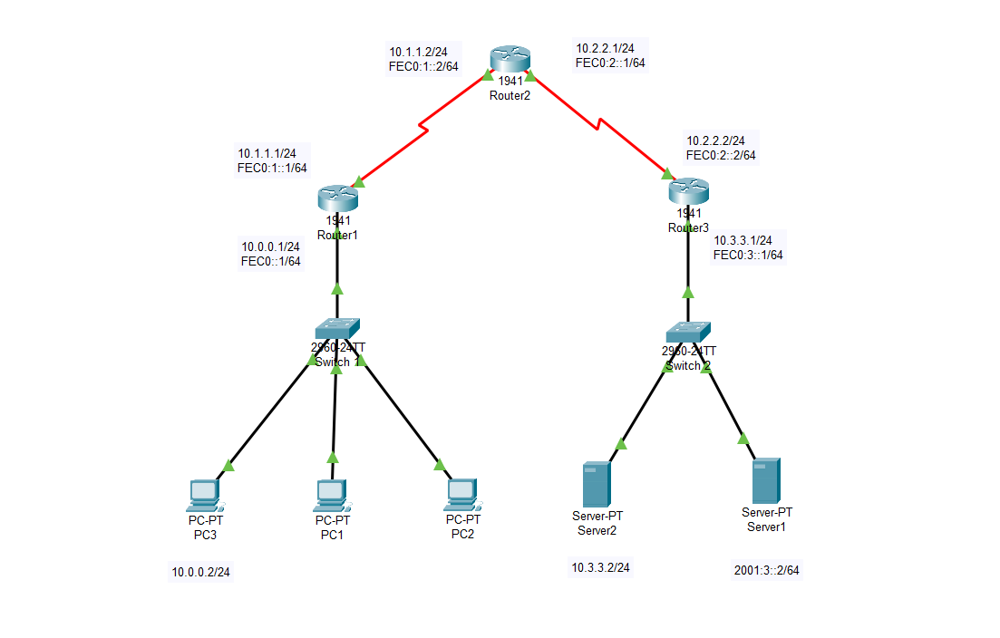
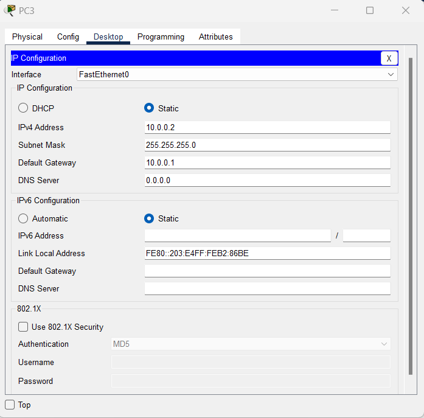
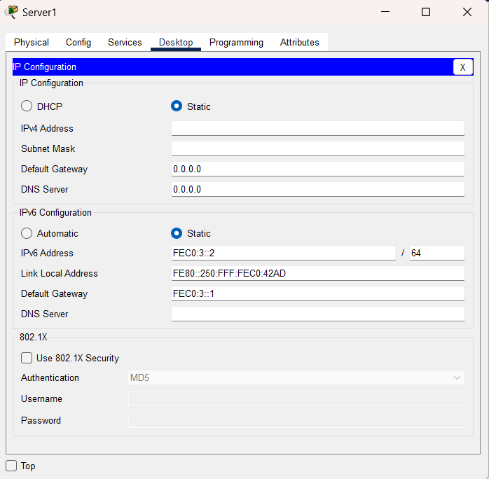
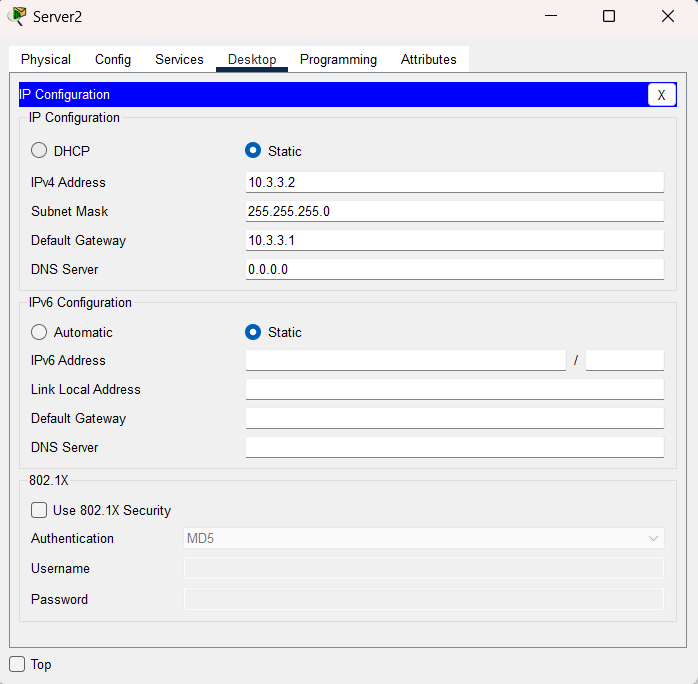
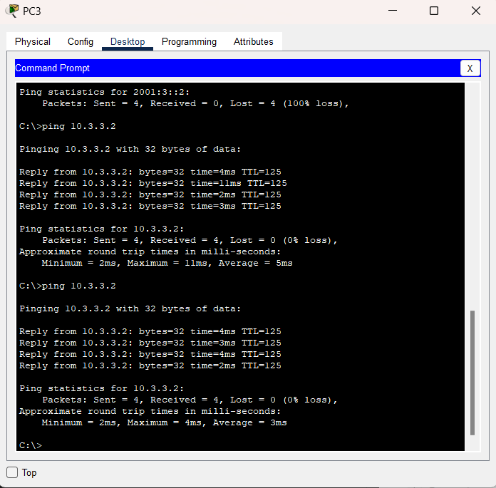
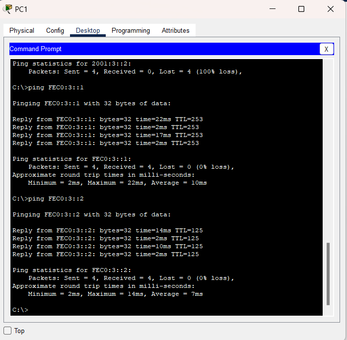

# LAB DUAL STACK 
## Data truyền từ PC1 đến Server 
## Cấu hình bài LAB

## Cấu hình trên Router
### Trên Router 1

***Đặt dải địa chỉ IPv4 và IPv6***

>Router>enable
Router#configure terminal
Router(config)#hostname R1
R1(config)#interface serial 0/0/0
R1(config-if)#ip add 10.1.1.1 255.255.255.0
R1(config-if)#ipv6 address FEC0:1::1/64
R1(config-if)#no shut
R1(config)#interface gigabitEthernet 0/0
R1(config-if)#ip add 10.0.0.1 255.255.255.0
R1(config-if)#ipv6 add 2001::1/64
R1(config-if)#no shut

***Cấu hình định tuyến đường đi***
>R1(config)#router rip
R1(config-router)#network 10.0.0.0
R1(config-router)#exit
R1(config)#ipv6 unicast-routing 
R1(config)#ipv6 router rip vnpt
R1(config-rtr)#exit
R1(config)#interface serial 0/0/0
R1(config-if)#ipv6 rip vnpt enable 
R1(config-if)#exit
R1(config)#interface gigabitEthernet 0/0
R1(config-if)#ipv6 rip vnpt enable 
R1(config-if)#exit
R1(config)#end
R1#copy run startup-config

### Trên Router 2

***Đặt dải địa chỉ IPv4 và IPv6***
>Router>enable
Router#configure terminal
Router(config)#hostname R2
R2(config)#interface serial 0/0/0
R2(config-if)#ip add 10.1.1.2 255.255.255.0
R2(config-if)#ipv6 address FEC0:1::2/64
R2(config-if)#no shut
R2(config)#interface serial 0/0/1
R2(config-if)#ip add 10.2.2.1 255.255.255.0
R2(config-if)#ipv6 add 2001:2::1/64
R2(config-if)#no shut

***Cấu hình định tuyến đường đi***
>R2(config)#router rip
R2(config-router)#network 10.0.0.0
R2(config-router)#exit
R2(config)#ipv6 unicast-routing 
R2(config)#ipv6 router rip vnpt
R2(config-rtr)#exit
R2(config)#interface serial 0/0/0
R2(config-if)#ipv6 rip vnpt enable 
R2(config-if)#exit
R2(config)#interface serial 0/0/1
R2(config-if)#ipv6 rip vnpt enable 
R2(config-if)#exit
R2(config)#end
R2#copy run startup-config

### Trên Router 3

***Đặt dải địa chỉ IPv4 và IPv6***

>Router>enable
Router#configure terminal
Router(config)#hostname R3
R3(config)#interface serial 0/0/1
R3(config-if)#ip add 10.2.2.2 255.255.255.0
R3(config-if)#ipv6 address FEC0:2::2/64
R3(config-if)#no shut
R3(config)#interface gigabitEthernet 0/0
R3(config-if)#ip add 10.3.3.1 255.255.255.0
R3(config-if)#ipv6 add 2001:3::1/64
R3(config-if)#no shut

***Cấu hình định tuyến đường đi***
>R3(config)#router rip
R3(config-router)#network 10.0.0.0
R3(config-router)#exit
R3(config)#ipv6 unicast-routing 
R3(config)#ipv6 router rip vnpt
R3(config-rtr)#exit
R3(config)#interface serial 0/0/1
R3(config-if)#ipv6 rip vnpt enable 
R3(config-if)#exit
R3(config)#interface gigabitEthernet 0/0
R3(config-if)#ipv6 rip vnpt enable 
R3(config-if)#exit
R3(config)#end
R3#copy run startup-config

## Cấu hình địa chỉ trên PC3

## Cấu hình địa chỉ trên server 1

## Cấu hình địa chỉ trên server 2

## Ping thử IPv4

## Ping thử IPv6
