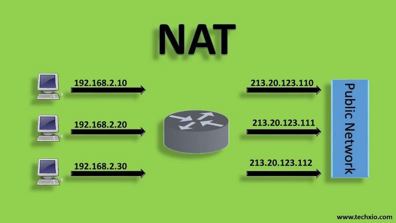

# TÌM HIỂU VỀ NAT
## 1.NAT là gì 
NAT (network address translation) giúp địa chỉ mạng cục bộ (private) truy cập được đến mạng công cộng (internet)

## 2.Chức năng chính của NAT
Trong một hệ thống mạng , NAT giữ vai trò di chuyển các gói tin giữa các lớp mạng khác nhau . Cụ thể , NAT cần chuyển đổi địa chỉ IP trong từng gói tin và chuyển đến router cùng một số thiết bị mạng khác 
Trong quá trình chuyển gói tin từ mạng công cộng (public) ngược lại NAT, NAT cần thay đổi IP đích sang dạng IP nội bộ , sau đó mới chuyển đi 
Ngoài ra NAT họat động tương tự như một tường lửa , hỗ trợ bảo mật IP của thiết bị , giả sử máy tính bị gián đoạn khi kết nối với internet , IP public khi đó sẽ lập tức chuyển đổi thành IP thay thế mạng cục bộ 

## 3.IP public và IP private
- IP Public
IP Public là IP ngoại miền , được cung cấp bởi nhà mạng . Mỗi ip luôn mang tính duy nhất , điều này đồng nghĩa người dùng không thể tự ý thay đổi địa chỉ IP 

- IP Private
Mỗi thiết bị hoạt động trong hệ thống mạng nội bộ LAN đều có một địa chỉ IP private riêng .Các IP Private trong cùng hệ thống mạng LAN có thể kết nối với nhau thông qua thiết bị mạng router nhưng không thể kết nối trực tiếp với mạng internet bên ngoài. Muốn kết nối được, các IP Private này phải chuyển đổi thành địa chỉ IP Public thông qua kỹ thuật NAT.

## 4.Phân loại NAT

### 4.1. Static NAT
Static NAT (Network Address Translation) là một phương pháp NAT mà cho phép ánh xạ một địa chỉ IP tĩnh (công cộng) tới một địa chỉ IP tĩnh (riêng) cụ thể trên mạng nội bộ.

Khi sử dụng Static NAT, địa chỉ IP công cộng được cấu hình trên router hoặc firewall để được ánh xạ tới địa chỉ IP riêng của thiết bị trên mạng nội bộ. Điều này cho phép thiết bị trong mạng nội bộ có thể được truy cập từ mạng bên ngoài với địa chỉ IP công cộng được cấu hình.

Một số ứng dụng của Static NAT bao gồm:

Cho phép các máy chủ trong mạng nội bộ được truy cập từ mạng bên ngoài với địa chỉ IP công cộng.
Cho phép các ứng dụng yêu cầu địa chỉ IP tĩnh được hoạt động trên mạng nội bộ.
Cung cấp tính bảo mật cao hơn bằng cách ẩn địa chỉ IP thực của các thiết bị trong mạng nội bộ khỏi mạng bên ngoài.

### 4.2. Dynamic NAT
Dynamic NAT (Network Address Translation) là một phương pháp NAT mà cho phép các địa chỉ IP tĩnh được ánh xạ tới các địa chỉ IP công cộng tạm thời theo yêu cầu.

Khi sử dụng Dynamic NAT, một bộ đệm địa chỉ IP công cộng được cấu hình trên router hoặc firewall để phục vụ việc ánh xạ địa chỉ IP. Khi một thiết bị trong mạng nội bộ yêu cầu truy cập mạng bên ngoài, router sẽ chọn một địa chỉ IP công cộng tạm thời từ bộ đệm địa chỉ IP và ánh xạ nó tới địa chỉ IP tĩnh của thiết bị trong mạng nội bộ. Sau khi kết thúc phiên làm việc, địa chỉ IP công cộng tạm thời sẽ được trả về vào bộ đệm để tái sử dụng.

Một số ứng dụng của Dynamic NAT bao gồm:

Giúp tăng tính bảo mật bằng cách ẩn địa chỉ IP thực của các thiết bị trong mạng nội bộ khỏi mạng bên ngoài.
Giúp tiết kiệm địa chỉ IP công cộng bằng cách sử dụng chúng tạm thời thay vì cấp phát địa chỉ IP tĩnh cho mỗi thiết bị trong mạng nội bộ.
Cho phép nhiều thiết bị trong mạng nội bộ sử dụng chung một địa chỉ IP công cộng.

### 4.3. NAT Overload
NAT Overload, còn được gọi là Port Address Translation (PAT), là một dạng của Network Address Translation (NAT) mà cho phép nhiều địa chỉ IP tĩnh trong mạng nội bộ được ánh xạ tới một địa chỉ IP công cộng duy nhất bằng cách sử dụng các cổng khác nhau.

Khi một thiết bị trong mạng nội bộ yêu cầu truy cập mạng bên ngoài, router NAT sẽ ánh xạ địa chỉ IP và số cổng của thiết bị nội bộ tới một địa chỉ IP và một số cổng khác nhau trên địa chỉ IP công cộng. Các cổng này được sử dụng để phân biệt các kết nối khác nhau của các thiết bị nội bộ trên cùng một địa chỉ IP công cộng.

Một số ưu điểm của NAT Overload bao gồm:

Giúp tiết kiệm địa chỉ IP công cộng bằng cách sử dụng cùng một địa chỉ IP công cộng cho nhiều thiết bị trong mạng nội bộ.
Giúp tăng tính bảo mật bằng cách ẩn địa chỉ IP thực của các thiết bị trong mạng nội bộ khỏi mạng bên ngoài.
Cho phép nhiều thiết bị trong mạng nội bộ sử dụng cùng lúc một địa chỉ IP công cộng để truy cập mạng bên ngoài.

## 5.SNAT và DNAT
- SNAT 
SNAT là viết tắt của Source Network Address Translation. SNAT thường được sử dụng khi máy chủ nội bộ/private cần bắt đầu kết nối với máy chủ bên ngoài/public. Thiết bị thực hiện NAT thay đổi địa chỉ IP riêng của máy chủ nguồn thành IP Public. Nó cũng có thể thay đổi cổng nguồn trong TCP/ UDP.
Một tình huống điển hình của SNAT là khi được yêu cầu thay đổi địa chỉ hay cổng riêng thành public khi các gói rời khỏi mạng. Về thứ tự hoạt động, SNAT xuất hiện sau khi quyết định định tuyến được đưa ra. Bên cạnh đó, khi có nhiều máy chủ trên mạng “bên trong” muốn truy cập vào “bên ngoài”, SNAT sẽ được sử dụng.

- DNAT
DNAT là viết tắt của Destination Network Address Translation. Nó có chức năng thay đổi địa chỉ đích trong IP của gói tin.
Ngoài ra, DNAT cũng có thể thay đổi cổng đích trong TCP / UDP. Ứng dụng điển hình của nó là chuyển hướng các gói đến với đích là một địa chỉ/ cổng public, đi đến một địa chỉ/ cổng IP private bên trong mạng.
Người dùng qua internet truy cập máy chủ web được lưu trữ trong trung tâm dữ liệu là một ví dụ điển hình mà DNAT được sử dụng để ẩn địa chỉ private. Đồng thời, thiết bị NAT chuyển IP đích public mà người dùng internet có thể truy cập thành địa chỉ IP private của máy chủ web.

- Phân biệt SNAT và DNAT

|   |SNAT|DNAT|
|---|-----|-------|
|Viêt tắt| Source NAT|Destination NAT|
|Thuật ngữ|SNAT đổi địa chỉ IP của nguồn kết nối thành công cộng.Ngoài ra có thể đổi cổng nguồn trong TCP / UDP.Thường được dùng bởi người dùng nội bộ.|DNAT đổi địa chỉ đích trong IP.Có thể thay đổi cổng đích trong TCP / UDP.Thường sử dụng khi cần chuyển hướng các gói đến có đích là địa chỉ/ cổng public đến địa chỉ / cổng IP private bên trong mạng.|
|Trường hợp sử dụng|Khi một client bên trong mạng LAN hay sau firewall muốn sử dụng internet.|Khi một website được lưu trữ bên trong trung tâm dữ liệu, sau firewall cần cho người dùng bên ngoài (public) kết nối đến thông qua mạng .|
|Thay đổi về địa chỉ|SNAT thay đổi địa chỉ nguồn của gói đi qua thiết bị NAT.|DNAT thay đổi địa chỉ đích của gói đi qua Router.|
|Thứ tự hoạt động|Sau khi quyết định định tuyến được thực hiện.|Trước khi xác định việc định tuyến.|
|Luồng giao tiếp|Xảy ra khi bên trong mạng được bảo mật bắt đầu giao tiếp với bên ngoài.|Xảy ra khi mạng không an toàn bên ngoài (public network) bắt đầu giao tiếp với bên trong (private network).|
|Đơn/ đa máy chủ|SNAT cho phép nhiều máy chủ bên trong mạng truy cập vào bất ký máy chủ nào bên ngoài.|DNAT cho phép máy chủ bên ngoài truy cập vào một máy chủ bên trong.|

*Tài liệu tham khảo*

[1] [https://vietnix.vn/nat-la-gi/](https://vietnix.vn/nat-la-gi/)
[2] [https://fptcloud.com/nat-la-gi/](https://fptcloud.com/nat-la-gi/)