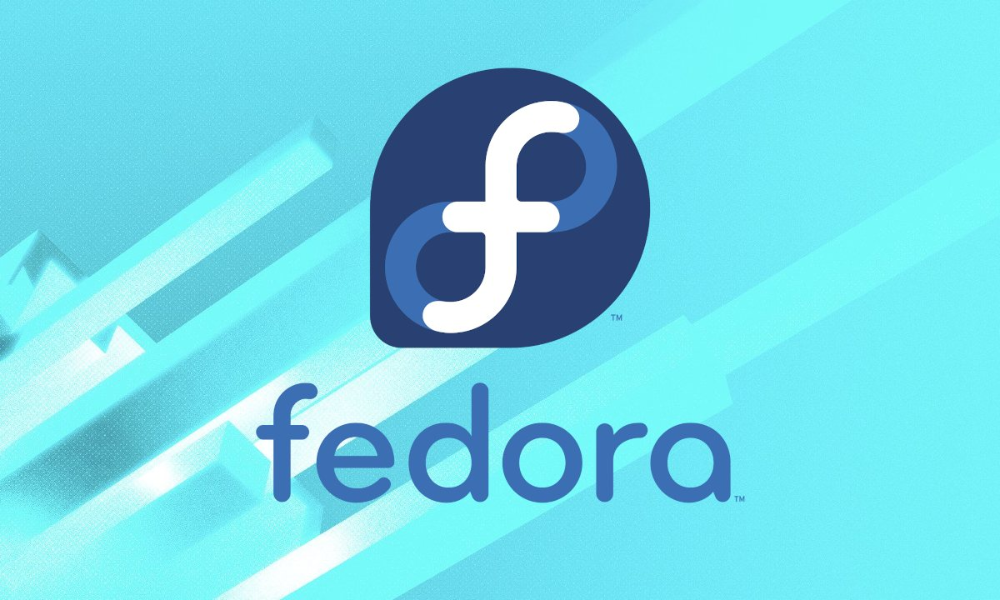

# Lý thuyết về Linux

## 1.Linux là gì 
***Định nghĩa***
Linux là một hệ điều hành máy tính được phát triển từ năm 1991, dựa trên hệ điều hành Unix và viết bằng ngôn ngữ C.

Đây là một hệ điều hành được phát hành miễn phí và có nhiều ưu điểm vượt trội nên thường được sử dụng nhiều hơn là Windows hay những hệ điều hành nào khác. Hiện nay, Linux được đánh giá là một hệ điều hành máy tính được sử dụng rộng rãi và được tin tưởng bởi các hãng công nghệ lớn , trong đó có IBM và Dell

***Lịch sử hình thành***

Lịch sử của Linux bắt đầu vào năm 1991 với sự bắt đầu của một dự án cá nhân của sinh viên Phần Lan Linus Torvalds để tạo ra một hệ điều hành tự do mới. Kể từ đó, các kết quả của hệ điều hành Linux đã được tăng trưởng liên tục trong suốt lịch sử của nó. Kể từ khi phát hành mã nguồn của nó lần đầu vào năm 1991, nó đã phát triển từ một số nhỏ các tập tin viết bằng C theo một giấy phép cấm phân phối thương mại đến các phiên bản 3.10 vào năm 2013 với hơn 16 triệu dòng mã nguồn, và đến bản phát hành 4.15 năm 2008 nó đã lên có 23.3 triệu dòng lệnh.
Hiện nay, Linux được chia ra thành các phiên bản như: Ubuntu, Linux Mint, Fedora, Debian,… nhưng phần lớn người sử dụng nhiều vẫn là Ubuntu. Linux là một trong những ví dụ nổi bật nhất của phần mềm nguồn mở và của việc phát triển mã nguồn mở. Mã nguồn có thể được dùng, sửa đổi và phân phối – thương mại hoặc phi thương mại – bởi bất kỳ ai, theo các điều khoản của giấy phép tương ứng, ví dụ như GNU General Public License.

## 2.Cấu trúc hệ điều hành Linux

- **Kernel**: Hay còn được gọi là phần Nhân, là phần quan trọng và được ví như trái tim của HĐH Linux. Phần kernel quan trọng nhất của máy tính có nhiệm vụ chứa các module, thư viện để quản lý và giao tiếp với phần cứng và các ứng dụng.
- **Shell**: Shell là một chương trình có chức năng thực thi các lệnh (command) từ người dùng hoặc từ các ứng dụng yêu cầu– tiện ích yêu cầu chuyển đến cho Kernel xử lý. Shell được coi là cầu nối để kết nối Kernel và Application, phiên dịch các tập lệnh từ Application gửi đến Kernel để thực thi.
- **Applications**: Là các ứng dụng và tiện ích mà người dùng cài đặt trên Server. Ví dụ: ftp, samba, Proxy,…

## 3.Ưu và nhược điểm của hệ điều hành Linux 

*Ưu điểm*
- Miễn phí, được hỗ trợ những ứng dụng văn phòng LibreOffice và OpenOffice. 
- Có tính bảo mật cao,tất cả các phần mềm mã độc, virus,… đều không thể hoat động trên Linux. 
- Linux hỗ trợ cho máy cấu hình yếu, không sợ xảy ra tình trạng lag, giật, không hoạt động,… trên những máy tính với cấu hình không cao. 
- Khi sử dụng Linux, người dùng có thể linh hoạt trong việc chỉnh sửa hệ điều hành theo nhu cầu của mình. Là một ưu điểm rất hữu ích trong quá trình sử dụng của các lập trình viên.

*Nhược điểm*

- Những nhà phát triển về phần mềm hiện tại vẫn chưa để tâm tới hệ điều hành vô cùng tiềm năng này vì vậy số lượng những phần mềm được hỗ trợ ở thời điểm hiện tại vẫn còn đang hạn chế. 
- Một số những nhà sản xuất hiện tại vẫn không phát triển driver để hỗ trợ cho nền tảng Linux.
- Khó tiếp cận và làm quen khi bạn đã quá quen thuộc với Windows thì khi chuyển sang Linux bạn cần một thời gian để có thể làm quen được hệ điều hành này.

# 4.Công dụng và cách hoạt động

***Công dụng-Tính năng***

- Quản lý và điều phối các tài nguyên của hệ thống.
- Giúp người dùng có thể nhìn thấy hầu như mọi dòng code trong Linux. Hỗ trợ tốt nhất cho việc chỉnh sửa và phát triển hệ điều hành dựa trên nhu cầu riêng của khách hàng.
- Miễn phí mọi tính năng và không cần mua bản quyền.
- Giao diện đa dạng, tính bảo mật cao, thường xuyên được nâng cấp lên phiên bản mới.
- Đặc biệt, hệ điều hành Linux tương đối nhẹ. Do đó, các máy có cấu hình yếu vẫn có thể hoạt động ổn định trên hệ điều hành này.

# 5.Các hệ điều hành Linux đã phát hành 

***Ubuntu***

Ubuntu hiện tại đang làm một bản phân phối vô cùng hiện đại và được nhiều người dùng biết tới. Mục tiêu của nó đó chính là đem đến cho người dùng những trải nghiệm tốt nhất ngay trên máy chủ và máy tính. Hiện tại Ubuntu đã được cải tiến để phù hợp với tất cả yêu cầu của người dùng. Nhưng nó vẫn không làm mất đi những bản sắc riêng của bản thân.

***Linux Mint***
Hiện tại đây đang là một trong các phiên bản phân phối đang được yêu thích nhất và được xây dựng ở trên nền tảng. Chính vì vậy nó đang kế thừa hầu hết những phần mềm và phương tiện sở hữu độc quyền.

***Debian***
Debian đang là 1 hệ điều hành gồm có những phần mềm mã nguồn mở hoàn toàn miễn phí và hiện tại vẫn luôn được nhóm cộng đồng lập trình viên vô cùng yêu thích. Dù phát hành những phiên bản mới thường xuyên tuy nhiên Debian có một nhược điểm đó chính là cập nhật khá chậm so với những bản phân phối khác.

***Fedora***
Fedora Đang là một phần mềm khá phổ biến và tập trung chủ yếu vào những phần mềm miễn phí vì vậy người dùng khi sử dụng thường xuyên gặp những khó khăn liên quan tới quá trình cài đặt những trình điều khiển về đồ họa độc quyền. Phiên bản này ở thời điểm hiện tại vẫn không ngừng được phát triển và cải tiến thêm. 

***CentOS/Red Hat Enterprise Linux***

Red Hat Enterprise Linux là một bản phân phối Linux thương mại dành cho máy chủ và máy trạm, được phát triển dựa trên Fedora, nhưng có một nền tảng ổn định và được hỗ trợ lâu dài hơn.

***OpenSUSE/SUSE Linux Enterprise***

OpenSUSE là một trong những bản phân phối khá mạnh của Linux. Đây được đánh giá là một trong những bản phân phối thân thiện nhất của hệ điều hành này với người dùng

***Mageia/Mandriva***
Mageia với thiết kế linh hoạt, gọn nhẹ, đơn giản hết mức có thể. Mageia được xem là “tiền bối” trong số các bản phân phối của Linux. Bên cạnh đó, Mageia còn cung cấp các tệp cấu hình sạch được thiết kế giúp người dùng chỉnh sửa một cách dễ dàng.

***Slackware Linux***

Slackware là bản phân phối lâu đời nhất của của Linux, hiện vẫn được duy trì sử dụng và đều đặn đưa ra các bản phát hành mới.

***Puppy Linux***
Puppy Linux là một bản phân phối khá nổi tiếng của Linux được phát triển dựa trên Slackware. Puppy Linux được thiết kế để trở thành một hệ điều hành nhỏ, nhẹ, có khả năng hoạt động mượt trên các máy tính cũ.

# 6.Khác biệt giữa Linux và Window

**Bảng so sánh**

|Đặc điểm |Linux|Window|
|---------|-----|------|
|Cấu trúc file|Cây dữ liệu|Thư mục|
|Registry|không có |có|
|Trình quản lý gói|Quản lý gói(package manager)|.exe|
|Giao diện|Giao diện thay đổi được|Giao diện gắn liền hê thống|
|Tài khoản và quyền user|Rugular, Administrator(root),service|Administrator, Standard, Child , Guest|
|Một số thiết lập điều khiển khác |Phù hợp cho lướt web, chat, email|Phù hợp với mọi nhu cầu |

***Cấu trúc file***
Cấu trúc của Linux khác hoàn toàn so với Windows. Nó được phát triển trên một mã gốc riếng với các nhà phát triển riêng lẻ. Với Linux thì các thư mục My Document ở ổ đĩa C và D được thay thế bằng cây dữ liệu. Các ổ đĩa sẽ được đặt vào đó kể cả thư mục Home và Desktop.

***Không sử dụng Registry***
Registry là một cơ sở dữ liệu chủ cho mọi thiết lập nằm trên máy tính với chức năng nắm giữ thông tin ứng dụng, mật khẩu, thiết bị,… Tuy nhiên trong Linux lại không sử dụng registry mà các dữ liệu được sử dụng dưới dạng module. Trong khi đó, Linux lưu dữ liệu người dùng thì Linux lưu các thiết lập của mình trên cơ sở chương trình phân cấp người dùng.

***Quản lý gói***
Với Linux, các chương trình sẽ được cài đặt dưới dạng .exe như Windows mà được tập hợp trong một chương trình quản lý gói (Package manager). Với tính năng này, người dùng không phải lên các trình duyệt web để tải nữa, mà chỉ cần tìm kiến trong các kho dữ liệu của trình quản lý gói và thực hiện tải về.

***Thay đổi được giao diện***
Giao diện Linux hoàn toàn tách rời với hệ thống lõi. Bạn có thể thay đổi giao diện mà không cần lo lắng về vấn đề cài đặt các chương trình. Có nhiều giao diện như GNOME, KDE hay Unity và nhiều giao diện khác để bạn có thể lựa chọn phù hợp.

***Tài khoản và quyền user***
Linux có ba loại user gồm:

- Regular: Đây là tài khoản user thông thường được tạo khi cài đặt Ubuntu các file được lưu trữ trong /home là thư mục chính của tài khoản này. Loại user này, không có quyền truy cập vào các thư mục của user khác.
- Root: Đây là tài khoản được tạo khi cài đặt Linu. Loại user này có thể truy cập vào những file bị giới hạn quyền, cài đặt phần mềm và có quyền quản trị. Với tài khoản này, bạn có thể cài đặt phần mềm, thay đổi file hệ thống, hoặc thực hiện các tác vụ cần quyền quản trị bất kỳ lúc nào.
- Service: Linux là hệ điều hành chính trong máy chủ. Các dihcj vụ như Apache, Squid, email,… đều có những tài khoản dịch vụ cá nhân riêng. Giúp năng tính bảo mật cho máy tính của bạn.

Windows sẽ có 4 loại user: Administrator, Standard, Child và Guest.

*Tài liệu tham khảo*
[1] [https://fptcloud.com/linux-la-gi/](https://fptcloud.com/linux-la-gi/)
[2] [https://vietnix.vn/linux-la-gi/](https://vietnix.vn/linux-la-gi/)
[3] [https://wiki.matbao.net/linux-la-gi-tong-hop-moi-kien-thuc-ve-he-dieu-hanh-linux/](https://wiki.matbao.net/linux-la-gi-tong-hop-moi-kien-thuc-ve-he-dieu-hanh-linux/)
[4] [https://itviec.com/blog/linux/#:~:text=Linux%20cung%20c%E1%BA%A5p%20c%C3%A1c%20ch%E1%BB%A9c,l%C3%BD%20v%C3%B9ng%20ch%E1%BB%A9a%20hi%E1%BB%87u%20qu%E1%BA%A3.](https://itviec.com/blog/linux/#:~:text=Linux%20cung%20c%E1%BA%A5p%20c%C3%A1c%20ch%E1%BB%A9c,l%C3%BD%20v%C3%B9ng%20ch%E1%BB%A9a%20hi%E1%BB%87u%20qu%E1%BA%A3.)