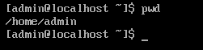
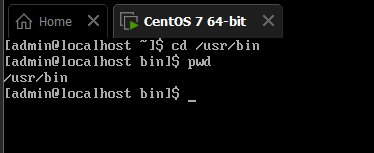
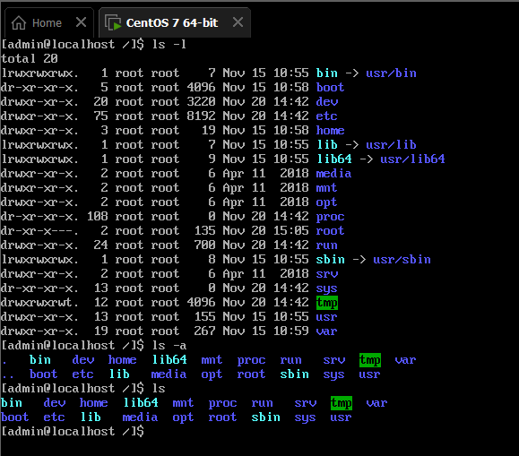

terminal: command line làm việc với thư mục (ls, cd, pwd, push, pop, mkdir)
# 1.Terminal là gì 
## 1.1.Khái niệm
Ứng dụng Terminal cho phép bạn có thể điều khiển máy tính của mình bằng dấu nhắc lệnh. Terminal còn là giao diện dòng lệnh giúp quá trình sử dụng trở nên nhanh hơn. Tuy nhiên, để sử dụng Terminal bạn cần nắm rõ các dòng lệnh cũng như chức năng cơ bản của nó.
Với Linux: Terminal là chương trình phần mềm được cài đặt sẵn trên hệ điều hành Linux, nó cho phép người dùng có thể giao tiếp với máy tính thông qua các câu lệnh được chạy. Vì vậy, Terminal còn được gọi là một trong những chương trình giao diện cửa sổ dòng lệnh.

## 1.2.Một số tính năng
- Giao diện dòng lệnh : Terminal cung cấp một giao diện dòng lệnh cho phép người dùng nhập các lệnh và xem kết quả trực tiếp 
- Đa nhiệm : Terminal cho phép người dùng thực hiện nhiều tác vụ cùng một lúc 
- Cấu hình : Terminal có thể được cấu hình để sử dụng các lệnh tùy chỉnh và cấu hình giao diện 
- Lịch sử lệnh : Terminal lưu trữ lịch sử các lệnh đã nhập , cho phép người dùng lặp lại các lệnh đã nhập trước đó 
- Hỗ trợ đầy đủ các lệnh và các tùy chọn : Terminal hỗ trợ đầy đủ các lệnh và các tùy chọn , cho phép người dùng thực hiện nhiều tác vụ khác nhau 

## 1.3.Một số khái niệm liên quán đến terminal trong Linux

- Shell: Là một chương trình mà terminal dùng để hiển thị dòng lệnh và chạy các lệnh đó , Bash shell là shell phổ biến nhất trong Linux
- Command-line interface(CLI): là giao diện ngời dùng mà người dùng nhập lệnh bằng cách gõ vào bàn phím. CLI thường được sử dụng trong các tác vụ quản lý hệ thống hoặc đối với các ứng dụng dòng lệnh 
- Terminal emulator : Là một ứng dụng trên desktop của linux giúp người dùng tạo ra một cửa sổ đưa ra dòng lệnh và hiển thị kết quả khi thực hiện lệnh. Các terminal emulatio phổ biến trong Linux bao gồm gnome-terminal , konsole, xterm....

# 2.Quản lý và sử dụng “Virtual Terminal” trên Linux

## 2.1.Dấu nhắc lệnh Shell

- Đối với user dấu nhắc là $

- Đối với quyền root nhắc lệnh là #

## 2.2 Các phím tắt

|Phím tắt|Chức năng|
|--------|---------|
|Ctrl + a| Di chuyển con trỏ đến dòng đầu tiên |
|Ctrl + e| Di chuyển con trỏ đến dòng cuối cùng|
|Tab |Lệnh tự thêm vào |
|Ctrl + u | Xóa dòng hiện tại |
|Ctrl + w|Xóa từ trước con trỏ |
|Ctrl + k| Xóa dòng từ vị trí con trỏ đến cuối |
|reset|Đặt lại thiết bị đầu cuối |
|History |Lịch sử lệnh đã thực thi |
|Ctrl + d| Thoát khỏi thiết bị đầu cuối |
|Ctrl + c| Kết thúc lệnh|
|Ctrl + Alt + Delete |Khởi động lại hệ thống |

# 3.Command Line

***pwd*** : Hiện tên thư mục hiện hành 

***cd*** : Di chuyển sang thư mục khác 
Ví dụ : cd <đường dẫn đến thư mục>
        cd /usr/bin
        cd /Download

***ls*** : Liệt kê tập tin
*ls-a* : liệt kê các thư mục bình thường
*ls-l* : Liệt kê các thư mục ẩn 

***cp*** : Sao chép tập tin , thư mục 

*cd /địa chỉ tập tin 1/ / địa chỉ tập tin 2/*

***mkdir*** : Lệnh tạo thư mục 
***rmdir*** : Lệnh xóa thư mục 

**Tài liệu tham khảo**

[1] [https://blogd.net/linux/virtual-terminal-tren-linux-la-gi/](https://blogd.net/linux/virtual-terminal-tren-linux-la-gi/)

[2] [https://loveubuntu.wiki.zoho.com/C%E1%BB%ADa-s%E1%BB%95-d%C3%B2ng-l%E1%BB%87nh-Terminal.html](https://loveubuntu.wiki.zoho.com/C%E1%BB%ADa-s%E1%BB%95-d%C3%B2ng-l%E1%BB%87nh-Terminal.html)