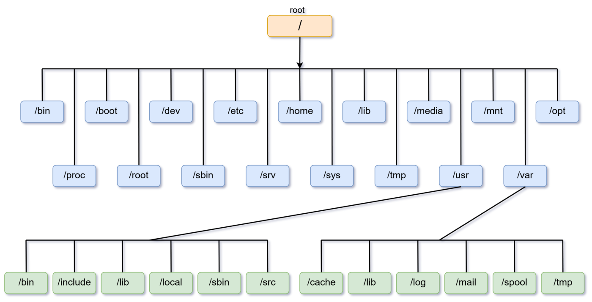

# Hệ thống file trong Linux

Cấu trúc thư mục trong hệ điều hành Linux tuân theo một hệ thống cấu trúc thư mục tiêu chuẩn, thường được gọi là cấu trúc thư mục FHS (Filesystem Hierarchy Standard). Cấu trúc này giúp tổ chức hệ thống một cách rõ ràng và dễ quản lý. 
- Trong hệ thống Linux , tất cả đều được cấu hình và coi như là file .Không chỉ bao gồm file text , ảnh , các chương trình biên dịch mà còn cả các thư mục , phân vùng và drive thiết bị phần cứng đầu được hệ thống nhìn nhận như một file 
- Tất cả file và thư mục đều xuất hiện trong thư mục root, kể cả khi các thư mục còn lại được lưu trong các thiết bị vật lý khác nhau ( trên ổ cứng khác , hoặc trên ổ cứng của máy tính khác )
- Với nhân Linux , hệ thống file là phẳng . Nghĩa là nó không à một cấu trúc phân cấp , phân biệt giữa các thư mục , tệp tin , hoặc các chương trình . Thay vào đó , kernel sử dụng khái niệm inode để đại diện cho từng file
- Mỗi inode chứa thông tin về một file bao gồm : số inode của nó ( nhận dạng duy nhất trong hệ thống ), các chủ sở hữu và nhóm liên kết với file , loại file ( file thông thường , hay file link liên kết hay thư mục ), quyền truy cập file , thời gian tạo file , kích thước tệp tin và địa chỉ nơi mà file được lưu trữ 
- Dùng câu lệnh `ls -li` để xem thông tin một inode

# 2.Cấu trúc thư mục trong Linux
Cấu trúc hệ thống file trên Centos được bố trí theo dạng hình cây (tree) như sau

Bắt đầu là thư mục gốc "/" , sau đó là các thư mục con ( hay còn gọi là nhánh ): bin, /sbin, /home, /mnt...
Mỗi thư mục con của thư mục gốc có các chức năng khác nhau 

- **/bin** : Chứa các file binary của các tập lệnh trong Linux
- **/sbin** : Tương tự như /bin , nhưng là những lệnhchir được dùng bởi quản trị hệ thống - tương đương root user
- **/boot** : Chứa các thư viện cần thiết cho quá trình khởi động 
- **/dev** : Chứa thông tin chứa các file thiêt bị . Trong Linux , mỗi thiết bị đều có file đại diện và được đặt tên theo 1 Logic nhất định
  - cdrom : đĩa CDRom/DVD
  - fd* : đĩa mềm
  - hd* : đĩa cứng IDE
  - sd* : đĩa cứng SCSI
  - st* : băng từ
  - tty* : cổng giao tiếp (COM)
  - eth* : card ethenet

- **/etc** : Chứa file cấu hình hệ thống và ứng dụng
- **/lib** : Chứa thư viện chia sẻ được dùng bởi các tiến trình, các lệnh boot, lệnh hệ thống như trong /bin và /sbin
- **/lib64** : Tương tự nhu lib nhưng dành cho 64 bit
- **/opt** : Nơi dành riêng cho các tiện ích chương trình được cài đặt
- **/media** : Thư mục có vài trò như đích đến của quá trình mount point . Khi gắn 1 thiết bị lưu trữ bên ngoài , để sử dụng , cần mount thiết bị này vào /media , từ đó các thư mục , tập tin sẽ được chuyển vào đây
- **/run** : 
- **/root** : Thư mục home của user root
- **/home** : Thư mục chứa các thư mục home của các user được tạo 
- **/sys** : 
- **/srv** chứa dữ liệu , các file của csc dịch vụ trên hệ thống 
- **/mnt** : Thư mục này được dùng để gắn các hệ thống tập tin tạm thời ( mounted filesystems)
- **/proc** : Lưu các thông tin về trạng thái của hệ thống 

# 3.Các kiểu file trong Linux

Trên linux tất cả mọi thứ đều được xem dưới dạng file. Có 3 loại file : file thông thường (regular file) , file thư mục (directory file) , file đặc biệt ( special file) 
- File thông thường : Một chương trình , file text , library, file nhạc ....
- Thư mục : thành phần dùng để chứa các file khác (container)
- File đặc biệt : (device, socket, pipe, symbolic links....)

# 4.Đường dẫn file trong Linux
Đường dẫn là một trong những thành phần quan trọng khi sử dụng Linux, Có 3 loại đường dẫn 

- Đường dẫn tuyệt đối : bắt đầu bằng "/".

Ví dụ : /etc/sysconfig

- Đường dẫn tương đối : không bắt đầu bằng "/"

Ví dụ : etc/sysconfig

- Đường dẫn đặc biệt :  
".." thư mục cha 
"." thư mục hiện tại 