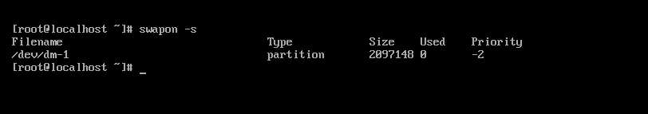

# 1.Swap memory là gì 
## 1.1.Khái niệm

Swap memory là một tệp hoặc một phân vùng trên ổ đĩa , nơi dữ liệu được lưu trữ trong ram có thể được di chuyển tạm thời khi có nhu cầu về bộ nhớ nhiều hơn mức mà máy tính có sắn
Swap file hay phần vùng swap được lưu trữ trên một trong các ổ đĩa cục bộ của máy tính , ổ cứng hoặc SSD. Dung lượng ổ đĩa trống này được gọi là "swap memory" hoặc "swap space" . Nó được gọi là bộ nhớ ảo , bộ nhớ này được sử dụng như một phần bổ sung cho bộ nhớ vật lý(RAM) , khi cần nhiều RAM hơn mức có sẵn

Trong Linux, bạn có thể kiểm tra tình trạng swap space bằng lệnh `swapon -s`. Lệnh này sẽ liệt kê tất cả các swap file hoặc swap partition đang được sử dụng trên hệ thống của bạn.

## 1.2.Cách hoạt động

Để sử dụng swap memory khi cần , dữ liệu ít quan trọng hơn sẽ được sao chép vào ổ đĩa, giải phóng bộ nhớ vật lý cho các chương trình và dữ liệu đang hoạt động . Dữ liệu này đưuojc chuyển sang SWAP được cho là đã bị hoán đổi. Nếu cần lại dữ liệu , nó sẽ được hoán đổi lại vào bộ nhớ thông thường bằng cách độc dữ liệu từ ổ đĩa . Điều này cho phép máy tính chạy trơn tru ngay cả khi cần nhiều bộ nhớ hơn một chút so với khẳ năng của máy tính 

## 1.3.Các loại swap memory
Có hai loại swap memory 
- Swap partition : là loại swap memory mặc định của hệ thống . Khi đó , một phần vùng của ổ cứng sẽ được dành cho việc swapping . Loại swap này có thể được tạo từ lúc cài đạt HĐH và tự động mount vào sử dụng khi khởi động 
- Swap file : là loại swap memory do ta tự tạo ra . Trong trường hợp ổ cứng không đủ dung lượng để tạo một phân vùng mới dành cho swap , ta có thể tự tạo một file swap dùng cho việc swapping . Loại swap này có thể được tạo sau khi cài đặt HDH, và không được tự động mount mà phải mount tay hoặc mount qua fstab

Cách check xem swap của ban là loại nào bằng cach chạy lệnh sau : `swapon -s`

# 2.Cấu hình Swap 
## 2.1.Swap partition

- Xác định partition nào sẽ lấy làm swap

`fdisk -l`

- Tạo hệ thống file swap cho nó

`mkswap /dev/sda9`

- Kích hoạt
  
`swapon /dev/sda9`

- Update config để swap space tự động apply khi reboot hệ thống . Thêm 1 dòng tương tự như bên dưới file /etc/fstab

`/dev/sda9 swap swap defaults 0 0`

## 2.1.Swap file

- Xem dung lượng của máy tính để phân bổ lượng swap hợp lý 

`df -h`

- Tạo hệ thống file swap file và chuyển quyền cho nó 

`sudo fallocate -l 512M /swapfile`
`sudo chmod 600 /swapfile`
`ls -lh /swapfile` 
 
- Kích hoạt 

`sudo mkswap /swapfile`
`sudo swapon /swapfile`

- Update config để swap space tự động apply khi reboot hệ thống . Thêm 1 dòng tương tự như bên dưới vào file /etc/fstab

*Tài liệu tham khảo*

[1] [https://viblo.asia/p/swap-eW65GWBJ5DO](https://viblo.asia/p/swap-eW65GWBJ5DO)

[2] [https://blog.vinahost.vn/swap-memory-la-gi/](https://blog.vinahost.vn/swap-memory-la-gi/)

