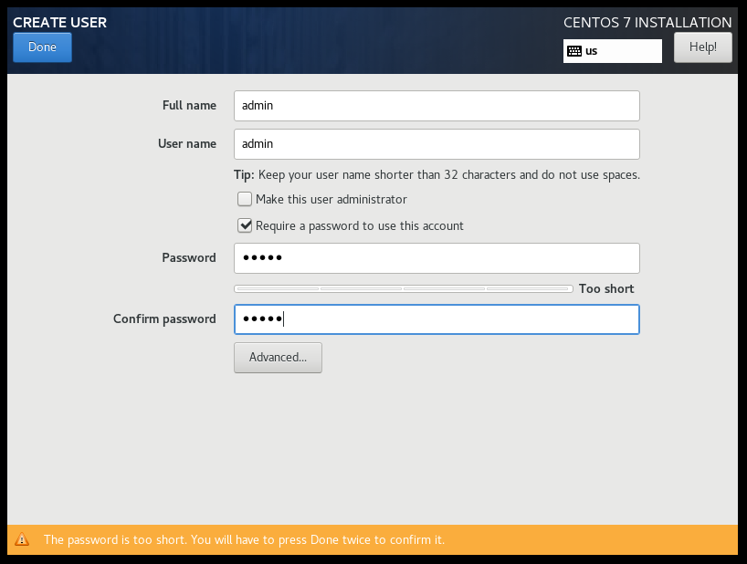

# 1. Tải bản ISO centos 7 
Truy cập đường link : [https://www.centos.org/download/](https://www.centos.org/download/)

Sau khi truy cập , chọn mục Centos Linux , chọn X86_64

Giao diện chuyển đến các đường link lưu trữ

Ở đây sẽ xuất hiện các phiên bản cài đặt , ta sẽ chọn bản đầy đủ 

# 2. Cài đặt 

Vào VMWare chọn file -> New virtual machine

Tiếp tục chọn Typical rồi bấm Next  

Chọn " I will install operating system later " rồi bấm Next

Tiếp tục chọn hệ điều hành Linux - phiên bản Centos 7 64-bit

Chọn thư mục lưu 

Chọn "Split virtual disk into multiple files" sau đó bấm Next

Tiếp tục bấm Finish

Sau khi thiết lập máy ảo ta sẽ thiết lập phần cứng 

Trong giao diện VMWare ta chọn "Edit virtual machine settings"

Ở mục CD/DVD(IDE) ta chọn Use ISO image file và chọn file Centos 7 đã tải về và bấm OK

Quay ra ngoài chọn Power on this virtual machine

Tại đây chọn ngôn ngữ 

Sau khi lựa chọn ngôn ngữ , ta sẽ cài đặt bên trong hệ điều hành , đầu tiên sẽ chỉnh lại thời gian ( date and time )

Ta chỉnh lại về múi giờ Asia - Ho Chi Minh rồi bấm Done

Trong mục software selection ta chọn mục minimal install

Trong mục installation destination , ta chọn ổ đĩa và bấm Done

Trong mục Network And Hostname ta chuyển trạng thái sang ON và bấm Done

Tiếp tục bấm Begin Installnation 

Giao diện hiện ra bao gồm Root password và user creation 

Ta sẽ vào phần Root password thiết lập mật khẩu 
Sau khi đặt password ta bấm Done

Tiếp tục vào phần user creation để tạo 

Sau khi thiết lập cài đặt xong ta bấm Reboot và để cho máy chạy 

Hoàn tất cài đặt 
