# 1. Tải bản ISO CentOS Stream 9 
Truy cập đường link :[https://centos.org/download/](https://centos.org/download/)

Sau khi truy cập , chọn mục CentOS Stream , chọn bản 9, chọn X86_64

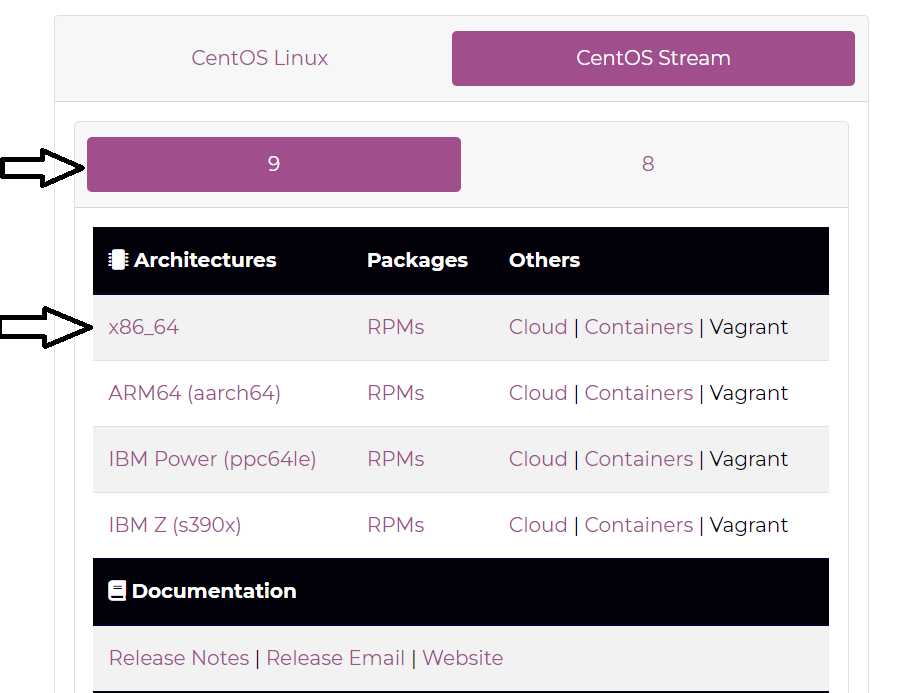

# 2. Cài đặt 

Vào VMWare chọn file -> New virtual machine
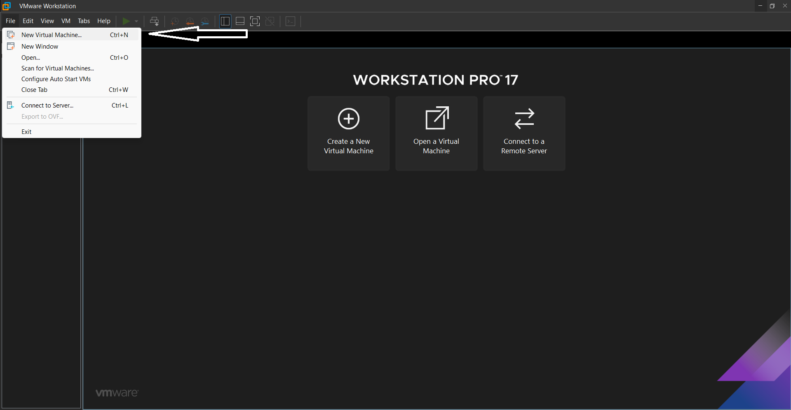

Tiếp tục chọn Typical rồi bấm Next  

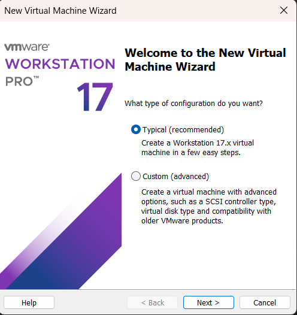

Chọn " I will install operating system later " rồi bấm Next 

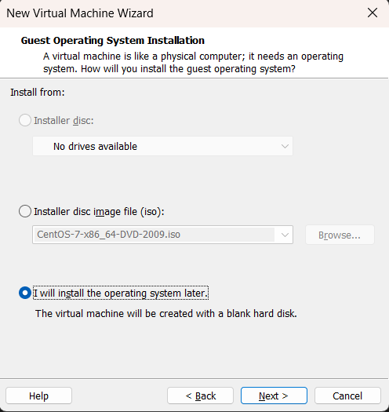

Tiếp tục chọn hệ điều hành Linux - phiên bản CentOS 8 64-bit 

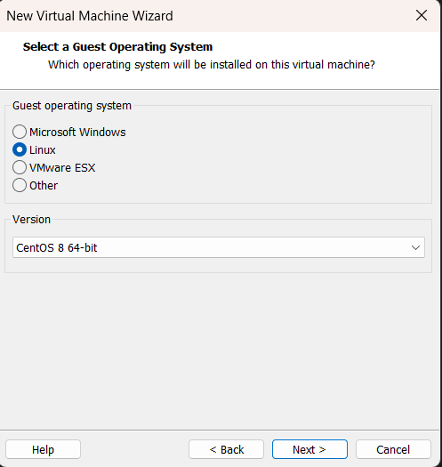

Đặt tên và chọn thư mục lưu

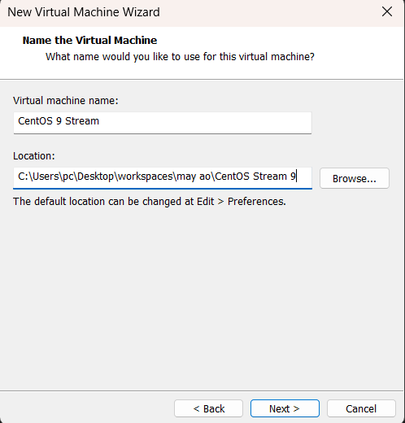

Chọn "Split virtual disk into multiple files" sau đó bấm Next

Tiếp tục bấm Finish

Sau khi thiết lập máy ảo ta sẽ thiết lập phần cứng  
Trong giao diện VMWare ta chọn "Edit virtual machine settings"

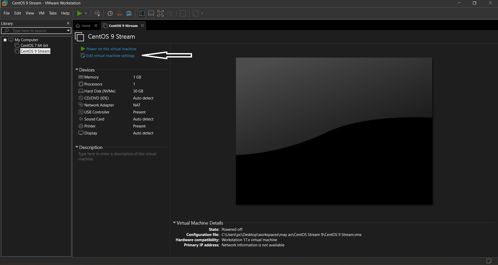

Ở mục CD/DVD(IDE) ta chọn Use ISO image file và chọn file CentOS 9 đã tải về và bấm OK

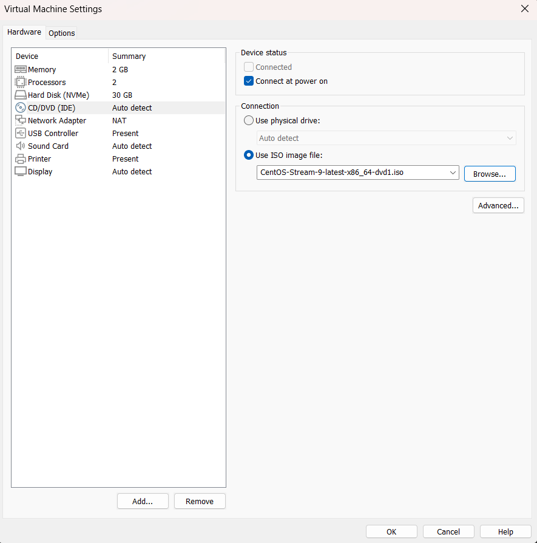

Quay ra ngoài chọn Power on this virtual machine

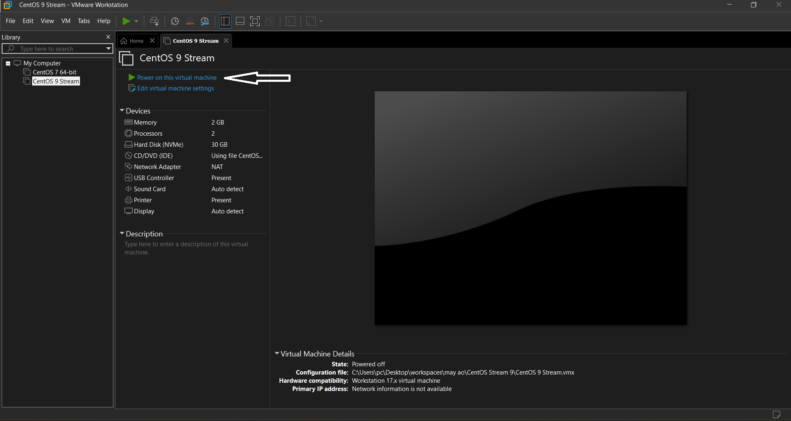

Tại đây chọn ngôn ngữ 

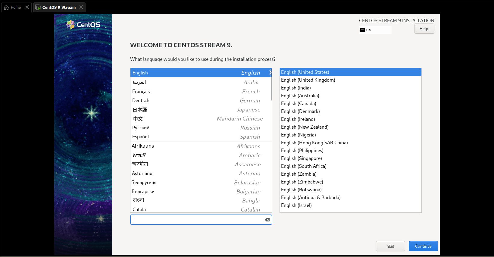

Sau khi lựa chọn ngôn ngữ , ta sẽ cài đặt bên trong hệ điều hành , đầu tiên sẽ chỉnh lại thời gian ( date and time )
Ta chỉnh lại về múi giờ Asia - Ho Chi Minh rồi bấm Done
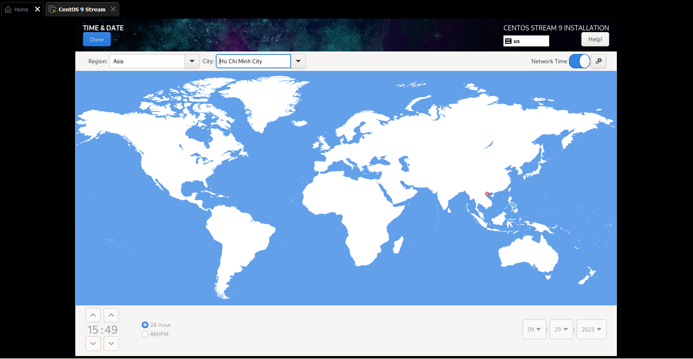

Trong mục software selection ta chọn mục minimal install
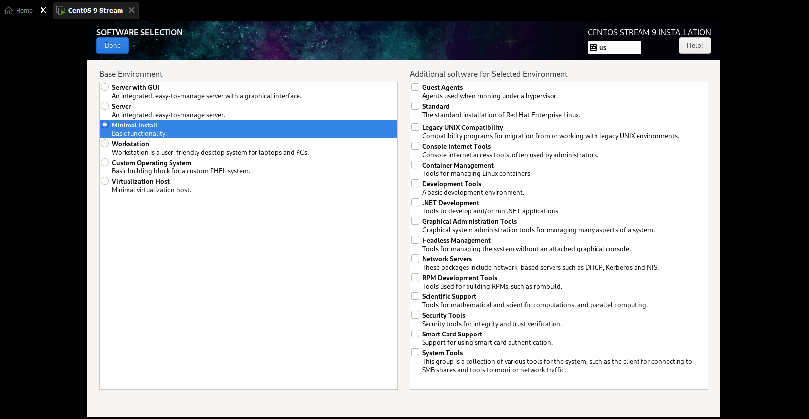

Ta vào mục Installation Destination để thiết lập 
Chọn mục Custom và bấm Done
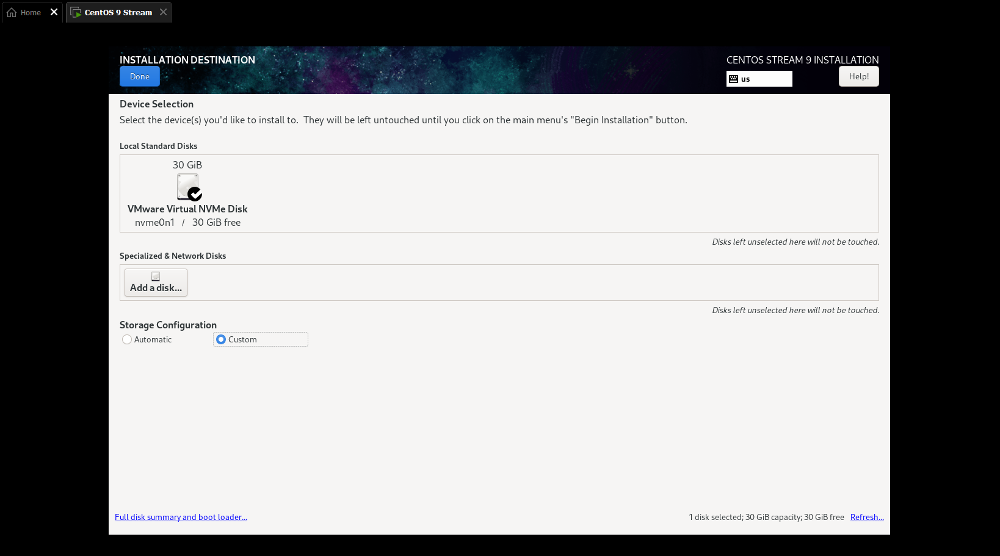

Bấm vào dấu cộng để thêm từng mục 
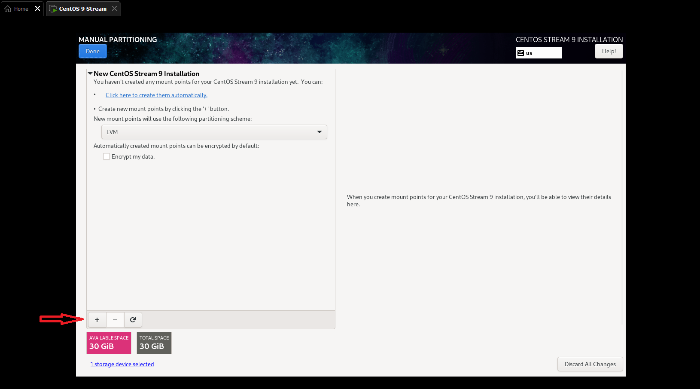

Vùng /boot ta để 500MB rồi bấm add mount point

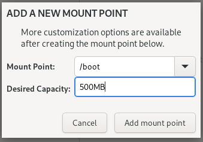

Vùng /home ta để 2GiB rồi bấm add mount point

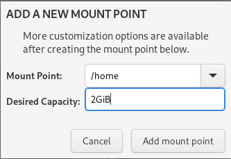

Vùng /swap ta để 2GiB rồi bấm add mount point

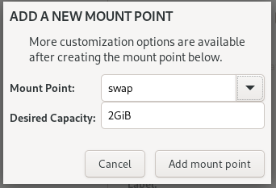

Vùng /var ta để 15GiB rồi bấm add mount point

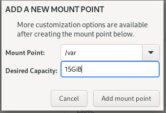

Thư mục gốc / để 10.5GiB rồi bấm add mount point

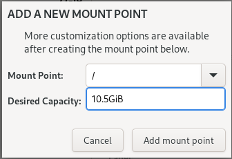

Sau khi thiết lập xong thì bấm Done hiện cửa sổ mới chọn Accept Changes
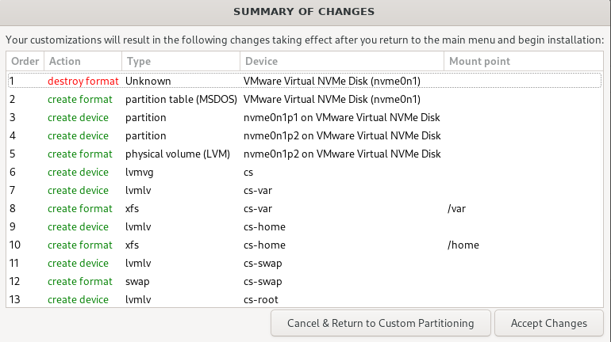

Tiếp theo ta vào đặt mật khẩu cho Root
Sau khi tạo password thì chọn Allow root SSH login with password và bấm Done

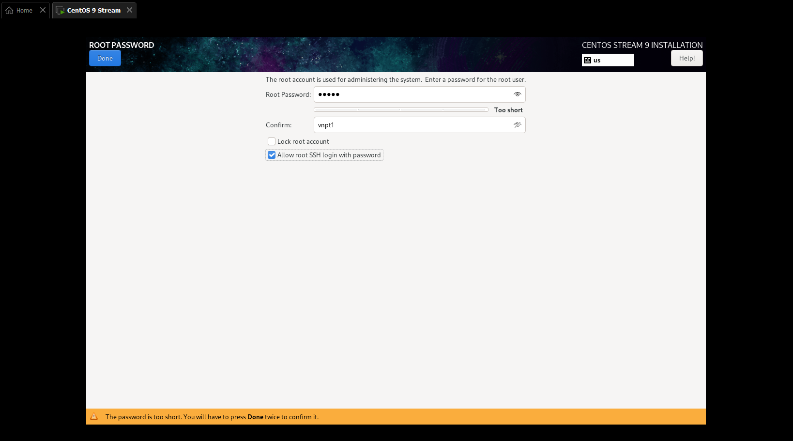

Tiếp tục vào phần user creation để tạo, sau khi tạo thông tin xong thì bấm Done

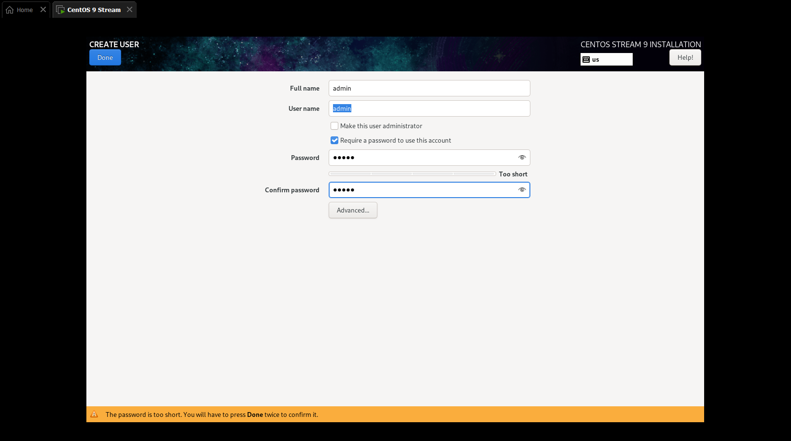

Sau khi khai báo thông tin và thiết lập thì bấm Begin installation 

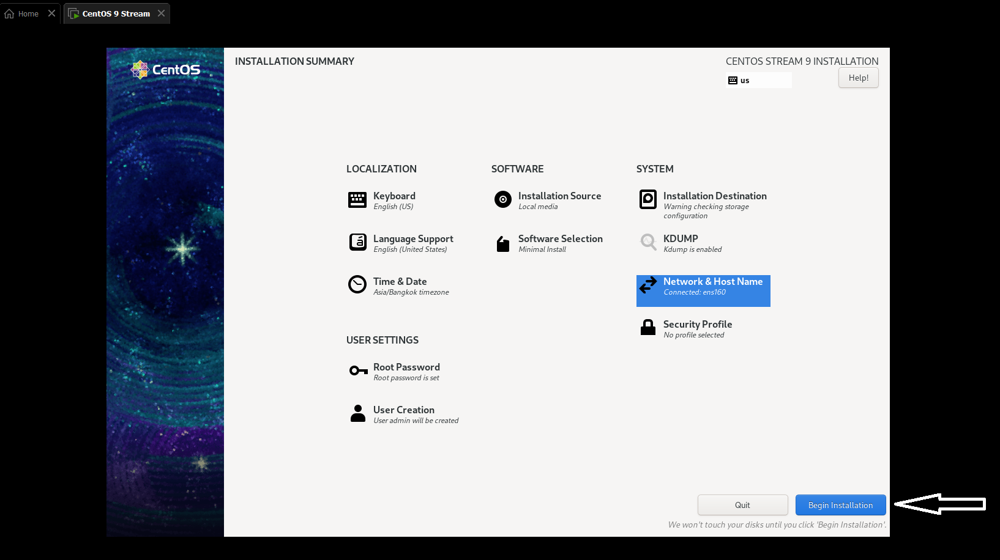

Cài đặt thành công 

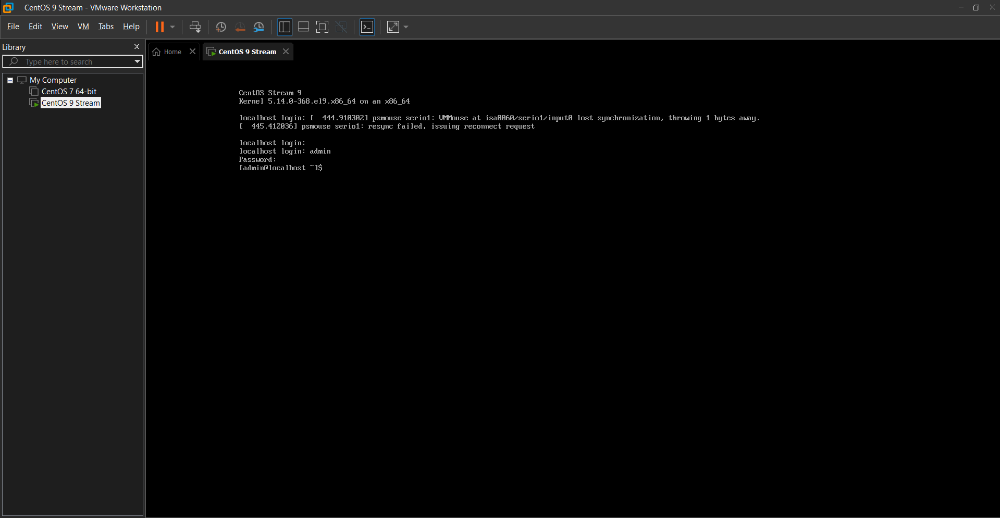