# 1. Tải bản Ubuntu 22.04
Truy cập đường link : [https://releases.ubuntu.com/jammy/](https://releases.ubuntu.com/jammy/)
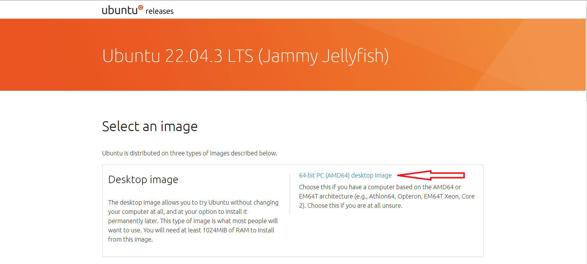

Chọn vào mục 64-bit PC (AMD64) desktop image để tải bộ cài đặt về máy 

# 2. Cài đặt 
Vào VMWare chọn file -> New virtual machine
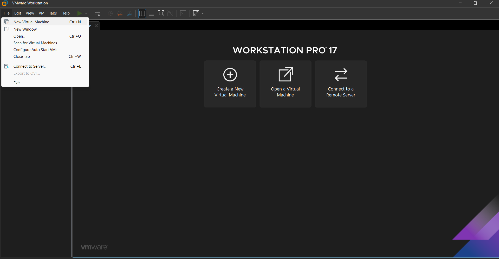

Tiếp tục chọn Typical rồi bấm Next

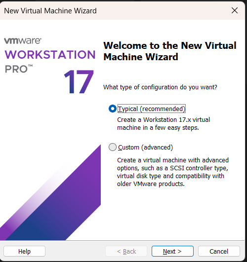

Chọn " Installer disc image file (iso) " , chọn bộ cài rồi bấm Next

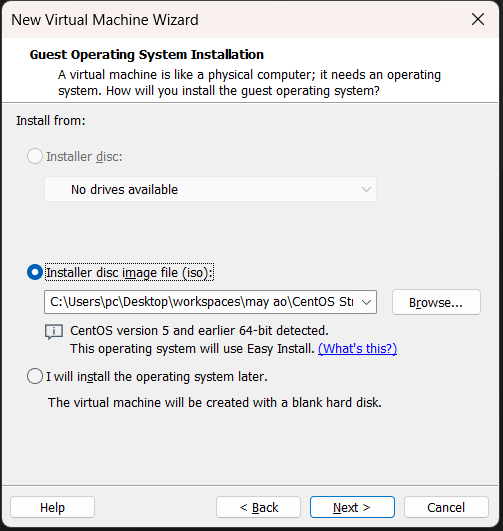

Ở cửa số tiếp theo , ta điền thông tin user và bấm next

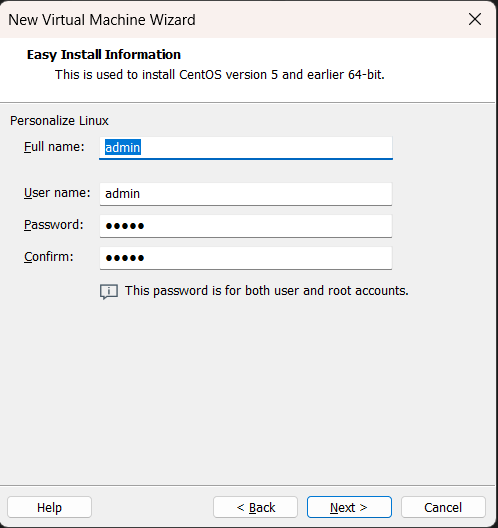

Cửa sổ tiếp theo ta có thể đặt tên và chọn thư mục để lưu sau khi cài đặt

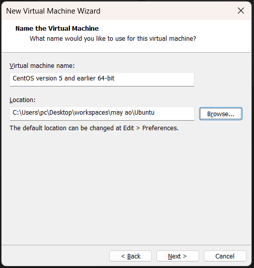

Chọn "Split virtual disk into multiple files" sau đó bấm Next

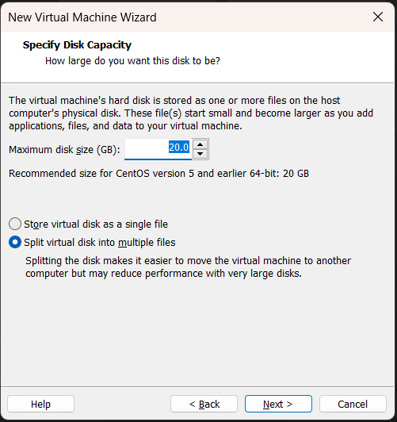

Ở cửa số mới ta chọn Customize Hardware để điều chỉnh cấu hình

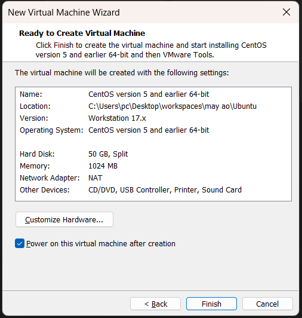

Tùy vào máy của bạn thì có thể điều chỉnh cấu hình của máy ảo , sau đó chọn bản cài và bấm close

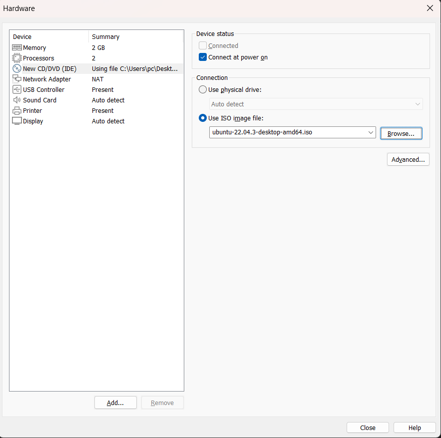

Tiếp tục bấm finish để bắt cầu cài đặt

Sau khi chạy 1 lúc màn hình hiện ra cửa sổ để ta chọn ngôn ngữ 

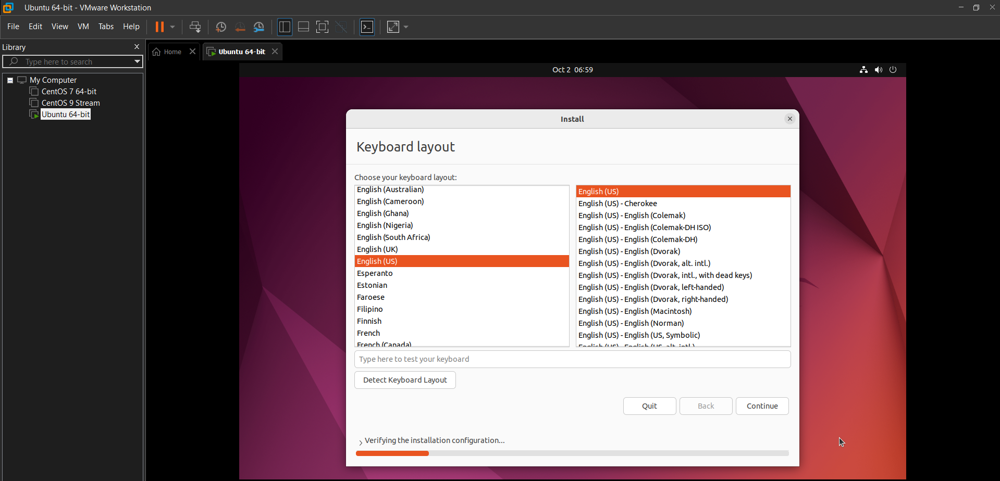

Chọn ngôn ngữ xong để tích ở Normal installation rồi bấm continue

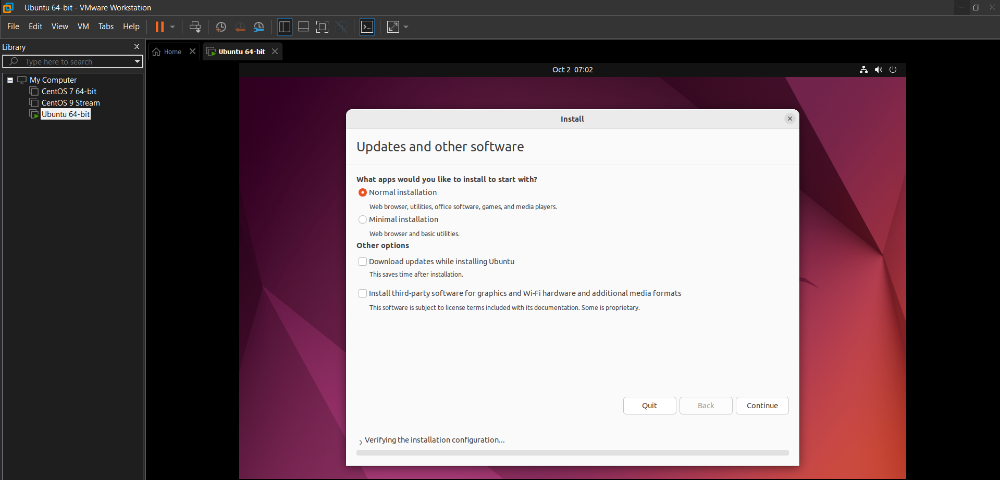

Chọn tích Erase disk and install rồi bấm install now

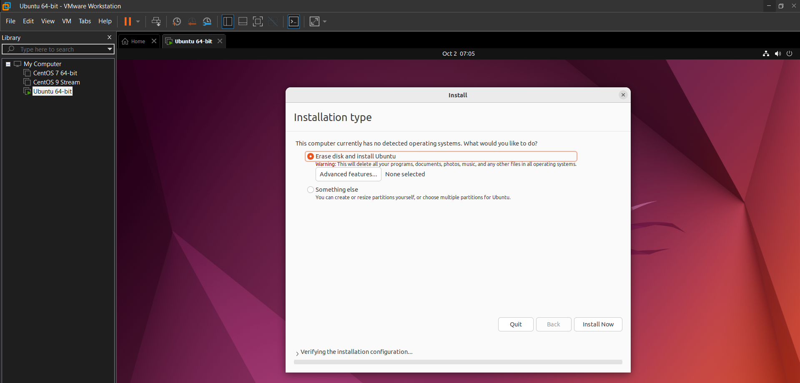

Cửa sổ tiếp tục hiện lên ta bấm Continue

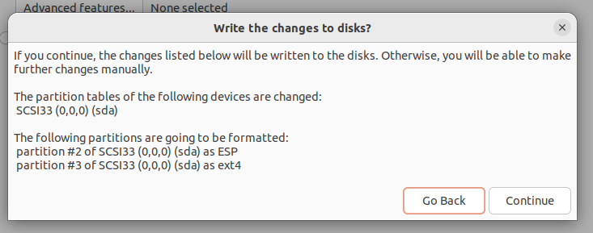

Tiếp tục ta sẽ cài đặt múi giờ sau đó bấm continue

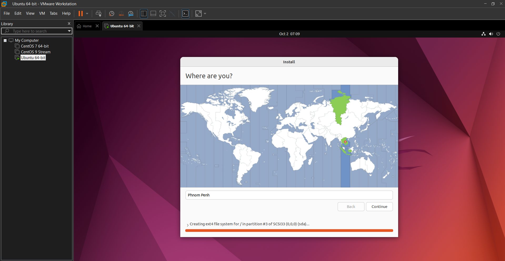

Cửa sổ chuyển đến ta điền thông tin user và password

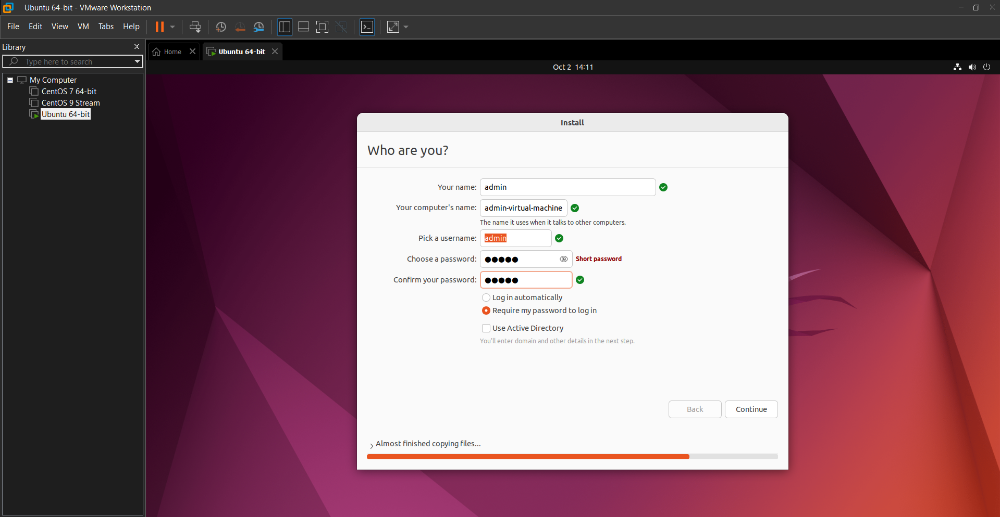

Sau  khi bấm continue chương trình tiếp tục chạy và hiện ra cửa sổ Restar Now

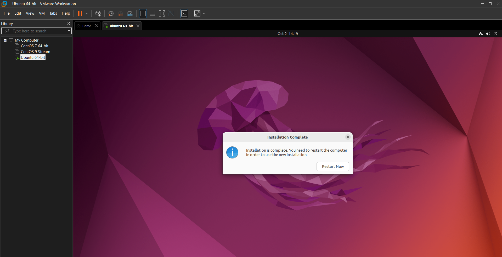

Sau khi restart ta đã cài đặt xong , màn hình sẽ hiện đăng nhập

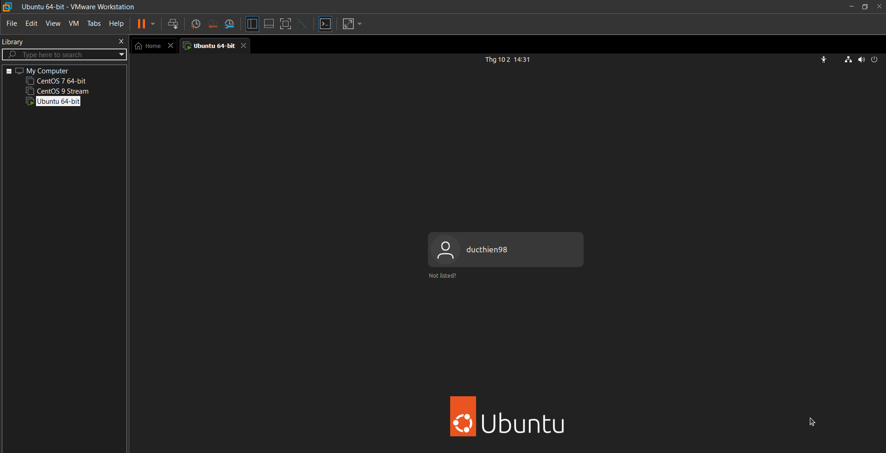

Sau khi login màn hình sẽ hiện 1 số cập nhật , ỏ đây ta bấm skip

Tiếp tục bấm next

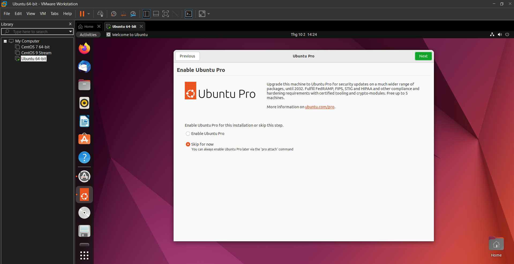

Chọn No và bấm Next

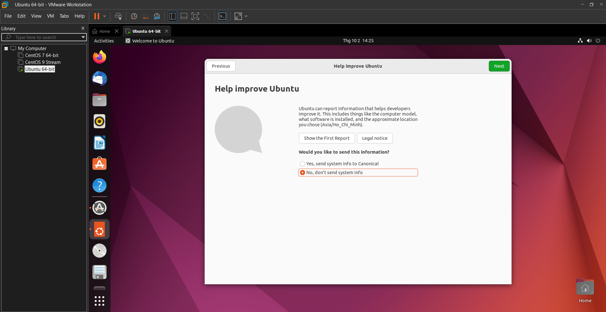

Chọn Location Service và bấm Next

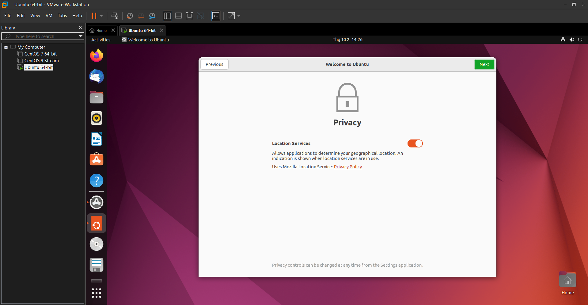

Cuối cùng bấm Done

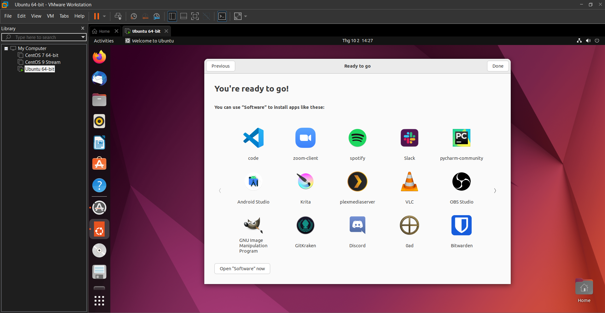

Như vậy là ta đã cài đặt xong Ubuntu bản 22.04