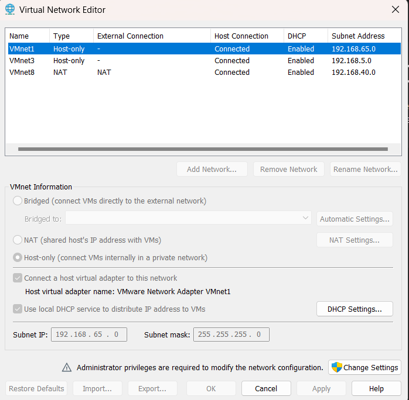
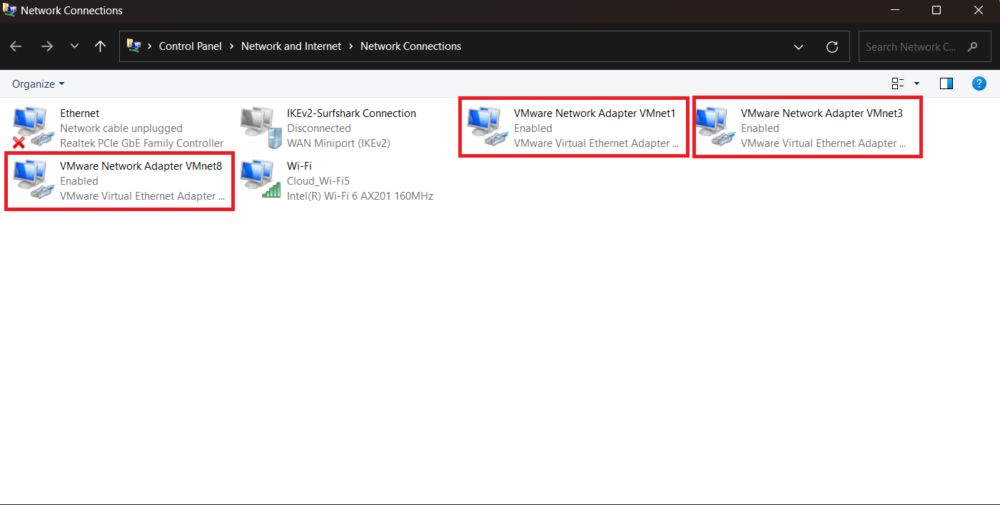
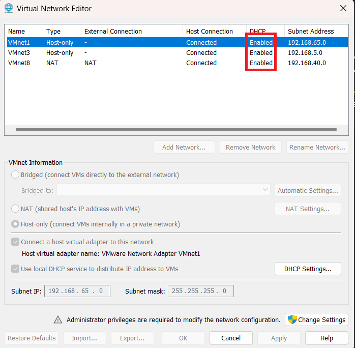
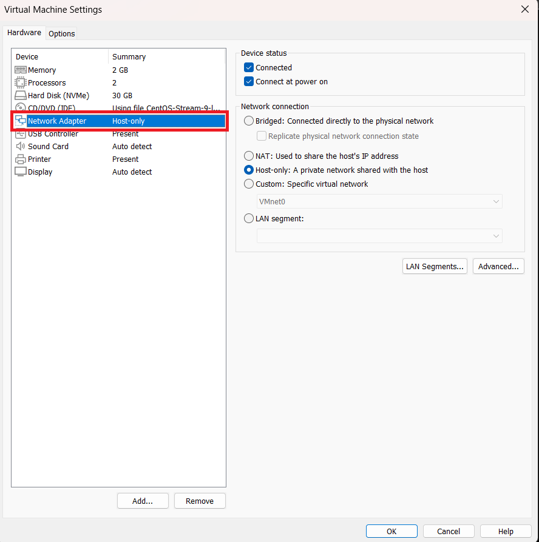
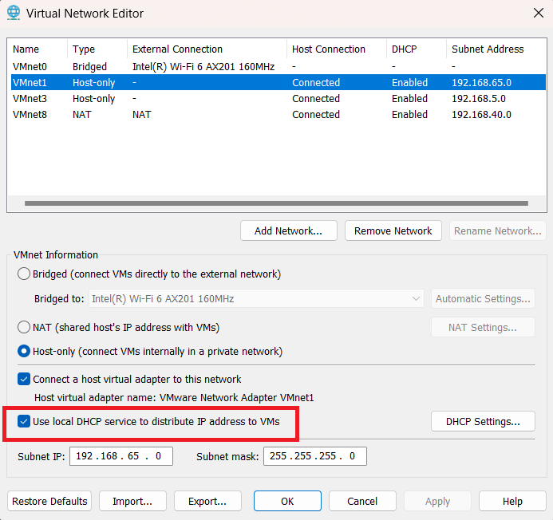
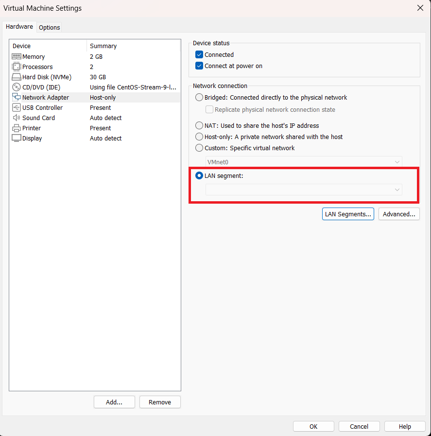
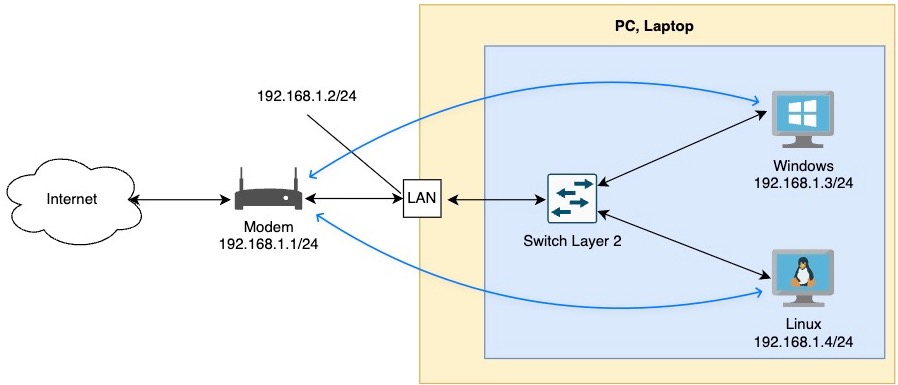
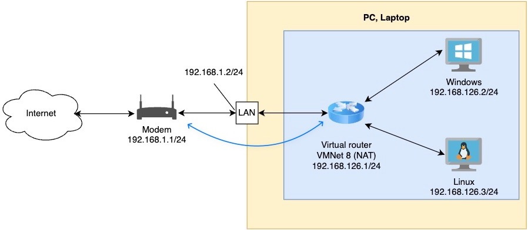
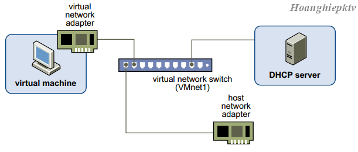

# PHÂN BIỆT 3 CHẾ ĐỘ NETWORK TRONG VMWARE : NAT , BRIDGE , HOT-ONLY

# 1.Switch ảo (Virtual Switch)

Cũng giống như switch vật lý, một Virtual Switch kết nối các thành phần mạng ảo lại với nhau. Những  switch ảo hay còn gọi là mạng ảo, chúng có tên là VMnet0, VMnet1, VMnet2… một số switch ảo được gắn vào mạng một cách mặc định. Mặc định khi ta cài Wmware thì có sẵn 3 Switch ảo như sau: VMnet0 chế độ Bridged (cầu nối), VMnet8 chế độ NAT và VMnet1 chế độ Host-only. (Ta có thể thêm, bớt, chỉnh các option của VMnet bằng cách vào menu Edit -> Virtual Network Editor…)

Khi ta tạo các VMnet, thì trên máy thật sẽ tạo ra những card mạng ảo tương ứng với VMnet đó, dùng để kết nối Virtual Switch với máy tính thật, giúp máy thật và máy ảo có thể liên lạc được với nhau. Riêng VMnet0 kết nối trực tiếp với card mạng vật lý thông qua cơ chế bắt cầu (bridged) nên không tạo ra card VMnet. VMnet8 mặc định sẽ sử dụng cơ chế NAT. Các VMnet khác khi được thêm vào sẽ là Host-Only.

Trong một số trường hợp, có thể card mạng ảo kết nối máy thật với các VMnet chưa được bật lên. Để bật các card này, trên Virtual Network Editor, bạn chọn VMnet cần bật card kết nối từ máy thật vào VMnet, chọn check vào ô Connect a host virtual adapter to this network.

## 1.1.Card mạng ảo trên máy ảo

Khi bạn tạo một máy ảo mới, card mạng được tạo ra cho máy ảo, những card mạng này hiển thị trên hệ điều hành máy ảo với tên thiết bị như là AMD PCNET PCI hay Intel Pro/1000 MT Server Adapter. Từ VMware Workstation 6.0 trở về sau này máy ảo có thể hổ trợ đến 10 card, các phiên bản trước bị giới hạn ở 3 card mạng. Thêm bớt card mạng bạn nhấn vào nút Add… hoặc Remove… trong Virtual Machine Setting

Khi copy một máy ảo thì chúng ta nên thay đổi địa chỉ MAC của nó. Như chúng ta đã biết, địa chỉ MAC là địa chỉ duy nhất, vì vậy chúng ta nên thay đổi địa chỉ MAC để tránh xảy ra lỗi khi làm việc với hệ thống máy ảo.

## 1.2.DHCP server ảo của VMnet

DHCP (Dynamic Host Configuration) server ảo đảm nhiệm việc cung cấp địa chỉ IP cho các máy ảo trong việc kết nối máy ảo vào các Switch ảo không có tính năng Bridged (VMnet0).  DHCP  server ảo cấp phát địa chỉ IP cho các máy ảo có kết nối với VMnet Host-only và NAT.

Nếu không muốn sử dụng  DHCP server ảo của VMnet , bạn chỉ cần bỏ dấu check tại Use local DHCP service to distribute IP address to VMs. Nếu bạn muốn tùy chỉnh lại DHCP,  bạn có thể chọn vào DHCP Setting, ở đây, bạn có thể chỉnh lại các tham số thời gian, tham số Scope IP (lưu ý: bạn chỉ có thể sửa lại vùng địa chỉ host chứ không được chỉnh lại vùng network).

## 1.3.LAN Segment
Các card mạng của máy ảo có thể gắn kết với nhau thành từng LAN Segment. Không giống như VMnet, LAN Segment chỉ kết nối các máy ảo được gán trong một LAN Segment lại với nhau mà không có những tính năng như DHCP và LAN Segment không thể kết nối ra máy thật như các Virtual Switch VMnet.

# 2.Cơ chế hoạt động của các loại card mạng 
## 2.1 Bridge
Ở chế độ này, card mạng trên máy ảo được gắn vào VMnet0, VMnet0 này liên kết trực tiếp với card mạng vật lý trên máy thật, máy ảo lúc này sẽ kết nối internet thông qua  card mạng vật lý và có chung lớp mạng với card mạng vật lý.

Switch ảo này chỉ làm cho máy ảo có khả năng giao tiếp trực tiếp với mạng vật lý, và nó không có khả năng định tuyến hoặc thay đổi bất kỳ gói tin nào. Máy ảo trong chế độ Bridge hoạt động giống như các thiết bị vật lý khác trong mạng vật lý và sẽ có địa chỉ IP trực tiếp từ mạng vật lý

## 2.2 NAT
Ở chế độ này, card mạng của máy ảo kết nối với VMnet8, VNnet8 cho phép máy ảo đi ra mạng vật lý bên ngoài internet thông qua cơ chế NAT (NAT device). Lúc này lớp mạng bên trong máy ảo khác hoàn toàn với lớp mạng của card vật lý bên ngoài, hai mạng hoàn toàn tách biệt. IP của card mạng máy ảo sẽ được cấp bởi DHCP của VMnet8, trong trường hợp bạn muốn thiết lập IP tĩnh cho card mạng máy ảo bạn phải đảm bảo chung lớp mạng với VNnet8 thì máy ảo mới có thể đi internet.

## 2.3.Cơ chế Host-only
Máy ảo được kết nối với VMnet có tính năng Host-only, trong trường hợp này là VMnet1 . VMnet Host-only kết nối với  một card mạng ảo tương ứng ngoài máy thật (như đã nói ở phần trên). Ở chế độ này,  các máy ảo không có kết nối vào mạng vật lý bên ngoài hay internet thông qua máy thật , có nghĩa là mạng VMnet Host-only và mạng vật lý hoàn toàn tách biệt. IP của máy ảo được cấp bởi DHCP của VMnet tương ứng. Trong nhiều trường hợp đặc biệt cần cấu hình riêng, ta có thể tắt DHCP trên VMnet và cấu hình IP bằng tay cho máy ảo.

# 3.Phân biệt ba chế độ Network
NAT, host-only và bridge là ba chế độ mạng được sử dụng trong các phần mềm ảo hóa như VMware, VirtualBox,... Mỗi chế độ mạng có những ưu điểm và nhược điểm riêng, phù hợp với các mục đích sử dụng khác nhau.

- NAT (Network Address Translation) là chế độ mạng phổ biến nhất. Chế độ này sẽ chuyển đổi địa chỉ IP của máy ảo thành một địa chỉ IP riêng, được sử dụng để truy cập internet. Điều này giúp bảo vệ địa chỉ IP thực của máy ảo khỏi bị lộ ra ngoài.

- Host-only là chế độ mạng chỉ cho phép máy ảo giao tiếp với máy chủ vật lý. Máy ảo không thể truy cập internet hoặc các máy tính khác trên mạng. Chế độ này thường được sử dụng để tạo môi trường thử nghiệm hoặc phát triển phần mềm.

- Bridge là chế độ mạng cho phép máy ảo giao tiếp với máy chủ vật lý và các máy tính khác trên mạng. Chế độ này thường được sử dụng để chạy các ứng dụng cần truy cập internet hoặc các máy tính khác trên mạng.

**Bảng so sánh NAT, Hot-only ,Bridge**

|Tính Năng | NAT | Host-only |Bridge|
|----------|-----|-----------|------|
|Truy cập internet|Có|Không|Có|
|Truy cập mạng|Có|Có|Có|
|Bảo mật|Trung bình|Cao|Thấp|
|Mục đích sử dụng|Chạy các ứng dụng cần truy cập internet|Tạo môi trường thử nghiệm|Chạy các ứng dụng cần truy cập mạng|

*Tài liệu tham khảo*

[1] [https://wiki.hoanghd.com/mang-nat-bridge-trong-vmware-va-virtualbox-tai-sao-khong-nen-su-dung-dhcp-doi-voi-server-chay-production/#:~:text=Ch%E1%BA%BF%20%C4%91%E1%BB%99%20NAT%20(Network%20Address%20Translation).&text=Khi%20b%E1%BA%A1n%20s%E1%BB%AD%20d%E1%BB%A5ng%20ch%E1%BA%BF,(Internet)%20v%C3%A0%20ng%C6%B0%E1%BB%A3c%20l%E1%BA%A1i.](https://wiki.hoanghd.com/mang-nat-bridge-trong-vmware-va-virtualbox-tai-sao-khong-nen-su-dung-dhcp-doi-voi-server-chay-production/#:~:text=Ch%E1%BA%BF%20%C4%91%E1%BB%99%20NAT%20(Network%20Address%20Translation).&text=Khi%20b%E1%BA%A1n%20s%E1%BB%AD%20d%E1%BB%A5ng%20ch%E1%BA%BF,(Internet)%20v%C3%A0%20ng%C6%B0%E1%BB%A3c%20l%E1%BA%A1i.)

[2] [https://www.engisv.info/?p=134](https://www.engisv.info/?p=134)