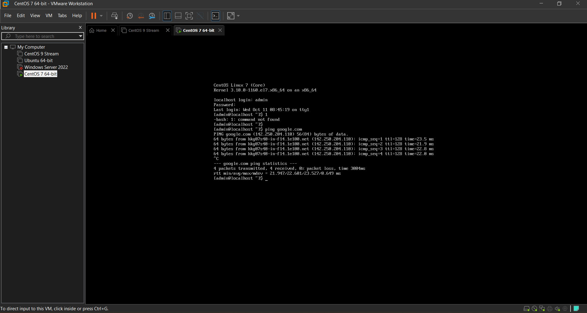
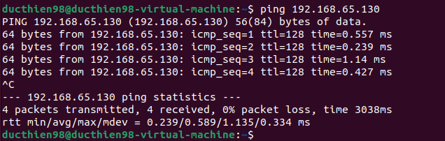
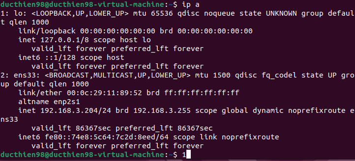

# 1.Sử dụng chế độ NAT cho các máy ảo để truy cập Internet
## 1.1 CentOS 7
Mở CentOS 7 trên VMWare và login

Mở Setting Network Addapter

Chọn NAT và bấm OK

Ta sẽ ping đến trang web Google.com

Như ta thấy 4 gói tin đã được gửi đi và không bị mất trong quá trình gửi , như vậy ta đã có thể kết nối Internet bằng NAT

## 1.2 CentOS 9

Mở CentOS 9 trên VMWare và login

Mở Setting Network Addapter

Chọn NAT và bấm OK

Ta sẽ ping đến trang web Google.com

Như ta thấy 4 gói tin đã được gửi đi và không bị mất trong quá trình gửi , như vậy ta đã có thể kết nối Internet bằng NAT

## 1.3 Ubuntu 22.04

Mở Ubuntu 22.04 trên VMware và login

Mở Setting Network Addapter

Chọn NAT và bấm OK

Ta mở Terminal trên ubuntu và ping thử đến trang web Google.com

Như ta thấy 4 gói tin đã được gửi đi và không bị mất trong quá trình gửi , như vậy ta đã có thể kết nối Internet bằng NAT

## 1.4 Window server 2022
Mở Window server 2022 trên VMware và login

Ta kiểm tra card mạng đổi sang chế độ NAT chưa

Mở terminal và ping thử đến Google.com

4 gói được gửi đi và không bị mất mát , như vậy ta đã kết nối thành công internet trên window server 2022
# 2.Sử dụng chế độ Host-only để ping giữa hai máy ảo với nhau 

## 2.1 Ping giữa CentOS 7 và CentOS 9

Trước tiên ta đổi chế độ card mạng sang Host-only tại phần Network Adapter Setting

Ở đây ta đổi sang Host-only và bấm OK

Lần lượt ta kiểm tra thông tin ip của 2 máy ảo 

CentOS 9 

CentOS 7

Tiến hành ping thử từ CentOS 9 sang CentOS 7 

Như tay thấy 4 tập tin được gửi đi và không có dấu hiệu bị mất mát

Tiếp tục ping ngược lại từ CentOS 7 sang CentOS 9

Như vậy ta đã ping thành công giữa 2 máy ảo CentOS 7 và CentOS 9

## 2.2 Ping giữa Ubuntu và Window server
Trước tiên ta đổi chế độ card mạng sang Host-only tại phần Network Adapter Setting

Ở đây ta đổi sang Host-only và bấm OK

Lần lượt ta kiểm tra thông tin ip của 2 máy ảo  
Window server

Ubuntu

Tiến hành ping thử từ window server đến Ubuntu

Tiếp tục ping thử từ Ubuntu đến window server

Như vậy ta đã ping thành công giữa 2 máy ảo Ubuntu và Window server
# 3.Sử dụng 1 card Bridge để từ máy ảo ping ra máy laptop cá nhân

## 3.1 Window server
Trước tiên ta đổi chế độ card mạng sang Bridge tại phần Network Adapter Setting

Ta kiểm tra thông tin ip trên window server và laptop

Window server

Laptop

Ta tiến hành ping thử từ Window server đến laptop

Tiếp tục ping thử từ laptop đến Window server

Các gói tin được gửi đi và không bị mất mát , như vậy ta đã ping được từ máy ảo ra thiết bị vật lý 

## 3.2 Ubuntu 

Trước tiên ta đổi chế độ card mạng sang Bridge tại phần Network Adapter Setting

Ta kiểm tra thông tin ip trên Ubuntu và laptop

Ubuntu

Laptop

Ta tiến hành ping thử từ Ubuntu đến laptop

Tiếp tục ping thử từ laptop đến Ubuntu

Các gói tin được gửi đi và không bị mất mát , như vậy ta đã ping được từ máy ảo ra thiết bị vật lý

## 3.3 CentOS 7
Trước tiên ta đổi chế độ card mạng sang Bridge tại phần Network Adapter Setting

Ta kiểm tra thông tin ip trên CentOS 7 và laptop

CentOS 7

Laptop

Ta tiến hành ping thử từ CentOS 7 đến Laptop

Tiếp tục ping thử từ laptop đến CentOS 7

Các gói tin được gửi đi và không bị mất mát , như vậy ta đã ping được từ máy ảo ra thiết bị vật lý

## 3.3 CentOS 9

Trước tiên ta đổi chế độ card mạng sang Bridge tại phần Network Adapter Setting

Ta kiểm tra thông tin ip trên CentOS 9 và laptop

CentOS 9

Laptop

Ta tiến hành ping thử từ CentOS 9 đến Laptop

Tiếp tục ping thử từ laptop đến CentOS 9

Các gói tin được gửi đi và không bị mất mát , như vậy ta đã ping được từ máy ảo ra thiết bị vật lý