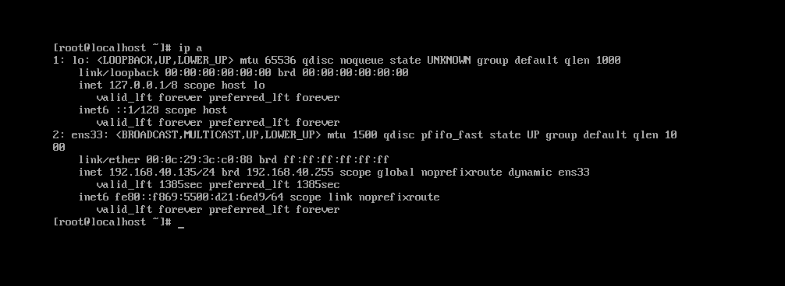
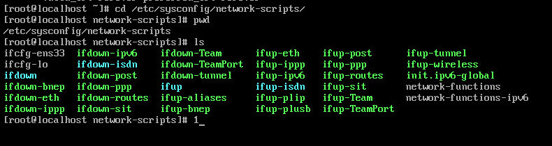
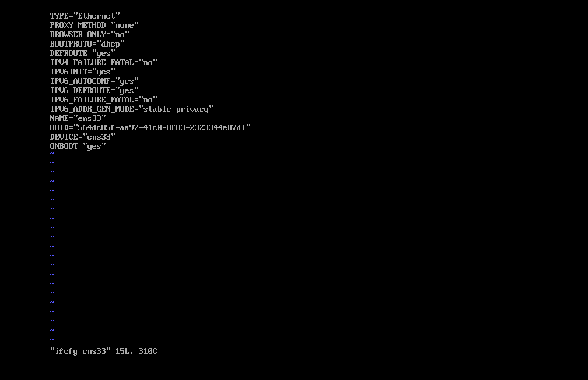
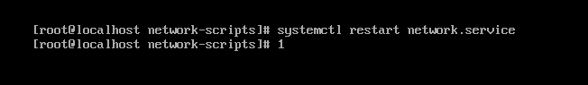
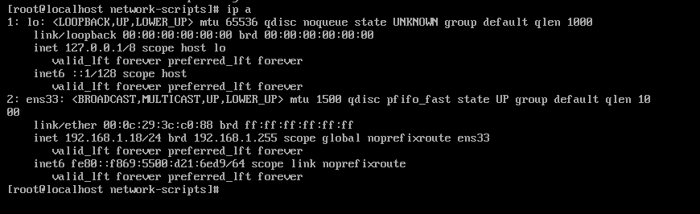
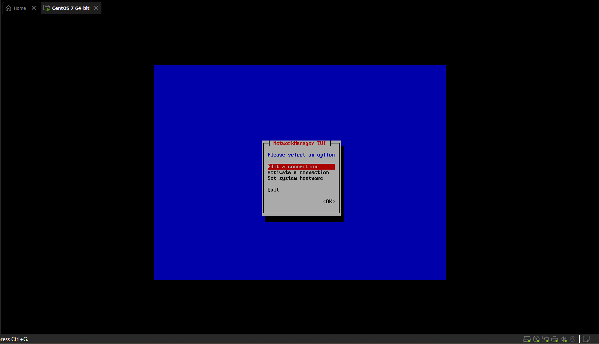
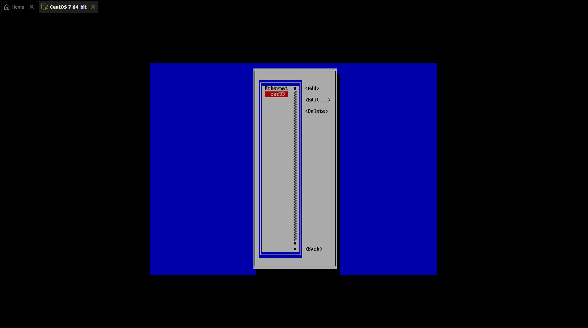
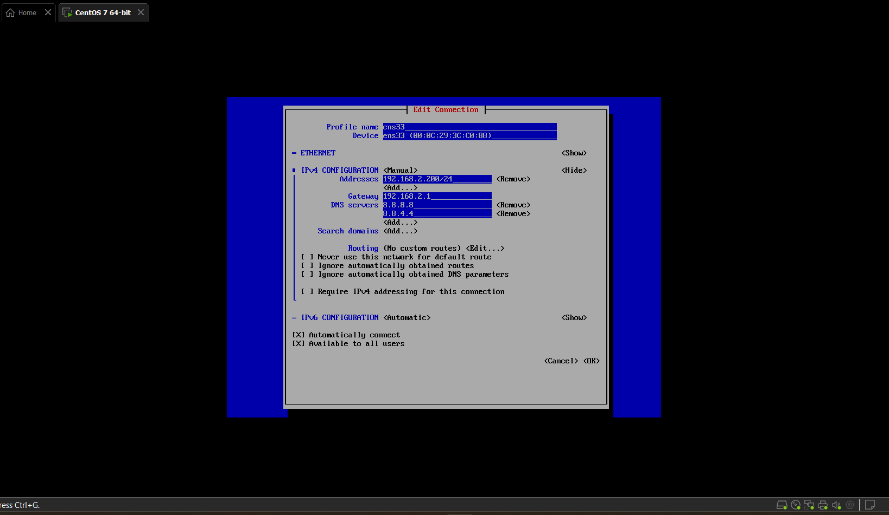
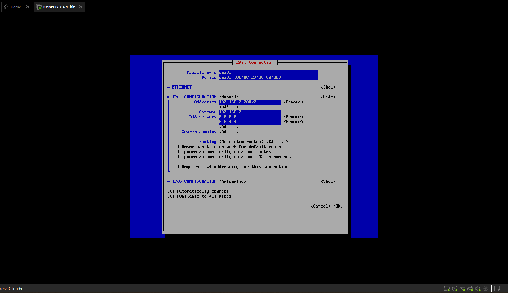
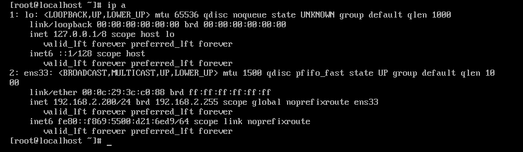

# Cấu hình IP tĩnh cho CentOS 7

## Cấu hình bằng sửa file 

Kiểm tra IP hiện tại của thiết bị 

Tiếp theo ta vào thư mục chứa card mạng 

`cd /etc/sysconfig/network-scripts/`

Mở file ifcfg-ens33

`vi ifcfg-ens33`

Sau khi truy cập file ta sửa dòng 
`BOOTPROTO="dhcp" -> BOOTPROTO="static"`
Thêm 4 dòng sau xuống dưới cuối
`IPADDR=192.168.1.18`
`GATEWAY=192.168.1.1`
`NETMASK=255.255.255.0`
`DNS1=8.8.8.8`
`DNS2=8.8.4.4`

Sau đó nhấn ESC và bấm :wq
Sau khi thoát ra khỏi file , ta restart lại mạng bằng câu lệnh 
`systemctl restart network.service`

Kiểm tra lại địa chỉ IP xem đã được Restart chưa 

## Cấu hình bằng giao diện

Ta dùng câu lệnh phía dưới để mở Network Manager

`nmtui`

Chọn Edit a connection và tab chọn OK

Tab chọn edit

Ta sửa địa chỉ IP như dưới hình sau đó tab OK

Dùng câu lệnh sau để restart lại ip

`systemctl restart network.service`

Như vậy ta đã cấu hình static ip thành công 

## Cấu hình bằng dòng lệnh nmcli

- Cấu hình địa chỉ mạng 

`nmcli con modify eth0 ipv4.addresses 192.168.40.99/24`

- Cấu hình gateway

`nmcli con modify eth0 ipv4.gateway 192.168.40.1`

- Cấu hình dns

`nmcli con modify eth0 ipv4.dns 8.8.8.8`

- Cấu hình ipv4 bằng phương pháp thủ công 

`nmcli con modify eth0 ipv4.method manual`

- Bật kết nối ipv4 mới đặt 

`nmcli con modify eth0 connection.autoconnect yes`

- Restart lại mạng để nhập dải ip mới 

`systemctl restart network.service`

