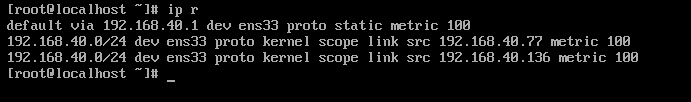

## Cấu hình bằng giao diện

Ta dùng câu lệnh phía dưới để mở Network Manager

`nmtui`

Chọn Edit a connection và tab chọn OK

Tab chọn ADD

Bảng mới hiện ra ta chọn Ethernet và tiếp tục

Ta sửa địa chỉ IP như dưới hình sau đó tab OK

Sau khi tạo mạng mới ta quay lại chọn Activate a connection

Chọn Deactivate và thoát 

Dùng câu lệnh sau để restart lại ip

`systemctl restart NetworkManager`

Như vậy ta đã cấu hình static ip thành công 

## Cấu hình bằng dòng lệnh nmcli

- Cấu hình địa chỉ mạng 

`nmcli con modify eth0 ipv4.addresses 192.168.40.99/24`

- Cấu hình gateway

`nmcli con modify eth0 ipv4.gateway 192.168.40.1`

- Cấu hình dns

`nmcli con modify eth0 ipv4.dns 8.8.8.8`

- Cấu hình ipv4 bằng phương pháp thủ công 

`nmcli con modify eth0 ipv4.method manual`

- Bật kết nối ipv4 mới đặt 

`nmcli con modify eth0 connection.autoconnect yes`

- Restart lại mạng để nhập dải ip mới 

`systemctl restart NetworkManager`

Như vậy ta đã cấu hình được ip tĩnh bằng dòng lệnh 

## Cấu hình bằng sửa file 

Kiểm tra IP hiện tại của thiết bị 

Tiếp theo ta vào thư mục chứa card mạng 

`vi /etc/NetworkManager/system-connection/ens33.nmconnection 1`

Dưới đây là file cấu hình mặc định dhcp ban đầu 

Ta sửa file như hình , thêm địa chỉ ipv4 để set static ip 

Ta thêm địa chỉ addresses kèm theo prefix, sau dấu phẩy là gateway
Ta thêm DNS , cách nhau bằng dấu ";"

Sau đó nhấn ESC và bấm :wq

Sau khi thoát ra khỏi file , ta restart lại mạng bằng câu lệnh 

`systemctl restart NetworkManager `

Kiểm tra lại địa chỉ IP xem đã được Restart chưa và ping lên internet

Đã set được static ip 

