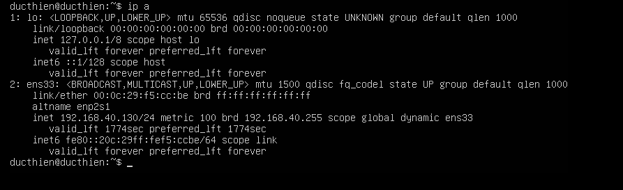
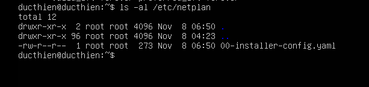
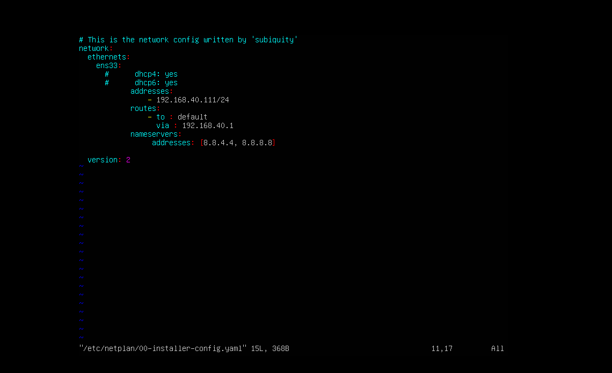
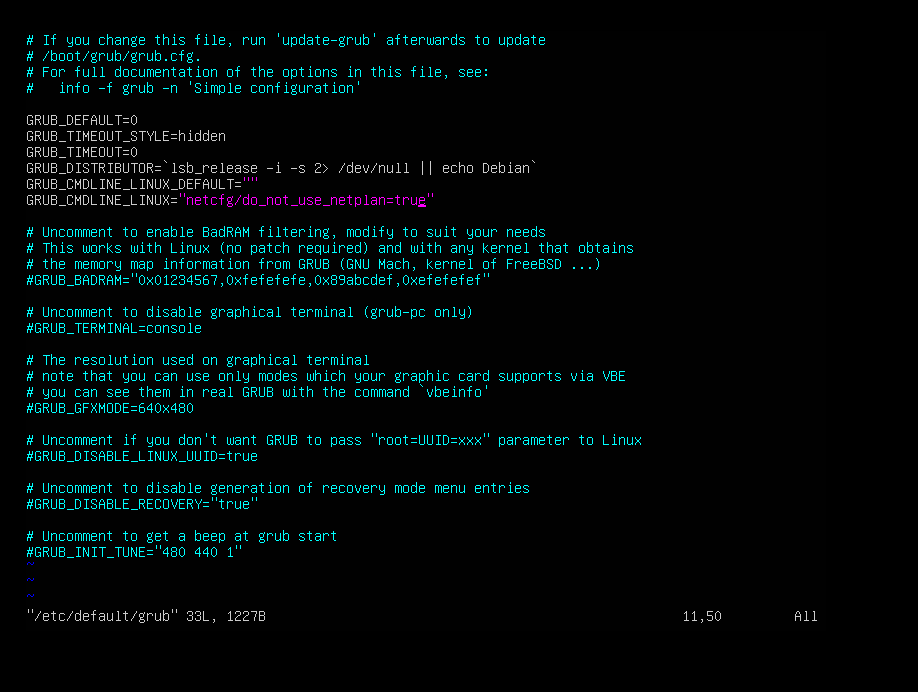
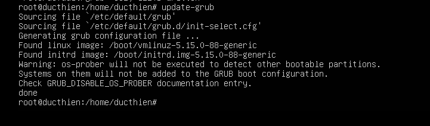
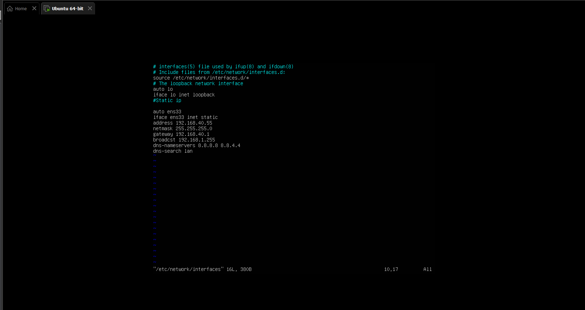

# Cấu hình Static IP trên Ubuntu 22.04

## Cấu hình bằng sửa file 

Kiểm tra card mạng và địa chỉ IP

`ip a`

Kiểm tra vị trí file config

`ls -al /etc/netplan/`

Tiến hành truy cập và sửa file config

`sudo vi /etc/netplan/01-network-manager-all.yaml`

Ở trong file cấu hình , ta sẽ xóa đi dòng

`dhcp:yes`

Thêm các dòng
`addresses:  `
        `- 192.168.1.111/24 `
      `routes:  `
       ` - to: default  `
          `via: 192.168.1.1 `
      `nameservers:  `
       ` addresses: [8.8.4.4, 8.8.8.8]  `

Sau khi thêm các nội dung trên ta bấm *ESC* và gõ *:wq* để lưu và thoát 
Dùng câu lệnh phía dưới để apply những gì vừa cài đặt

`sudo netplan apply`

như vậy là ta đã set static ip thành công 

## Cấu hình static IP bằng dòng lệnh 

Trước truy cập file /etc/default/grub và sửa dòng phía dưới để tắt chức năng của netplan

'GRUB_CMDLINE_LINUX = "netcfg/do_not_use_netplan = true"' >>

Sau khi sửa ta cập nhật lại grub bằng lệnh 

`sudo update-grub`

Cài đặt ifupdown thay thế netplan 
`sudo apt-get update`
`sudo apt-get install -y ifupdown`

Xóa netplan khỏi hệ thống
`sudo apt-get --purge remove netplan.io`

Xóa toàn bộ netplan khỏi hệ thống bằng lệnh 

`sudo rm -rf /usr/share/netplan`
`sudo rm -rf /etc/netplan`

Vào file interface bằng lệnh 
`vi /etc/network/interface`
Sau đó ta sửa file như hình phía dưới 

Sau khi lưu và thoát ra ngoài , ta restart lại mạng bằng lệnh 

`systemctl restart networking`

Như vậy ta đã cấu hình xong ip tĩnh cho ubuntu 22.04

