# Cài đặt OpenSSH trên CentOS7

**Đầu tiên nếu như server các bạn đang vô tình bị lỗi SSH vì bất cứ lý do nào đó (hacker tấn công, lỗi service SSH,…..) . Các bạn có thể xóa gỡ SSH thông qua lệnh sau**

`chkconfig sshd off`
`service sshd stop`
`yum erase openssh-server`

Hoàn tất Chúng Ta sẽ có thông báo đại loại như hình sau

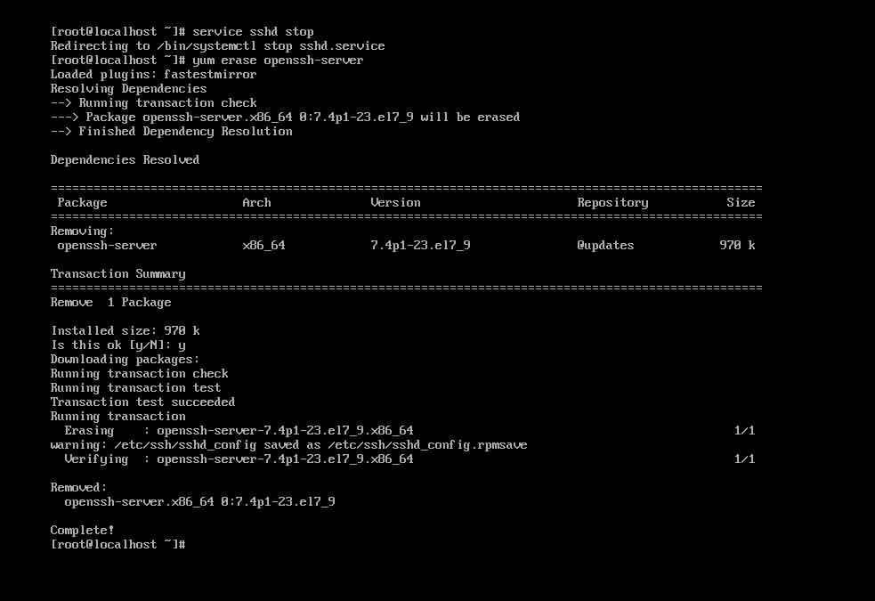

**Install SSH trên CentOS 7 và OS Linux khác**

Update server CentOS 7:

`yum update -y`

Install SSH Server bằng lệnh sau

`yum install -y openssh openssh-server openssh-clients openssl-libs`

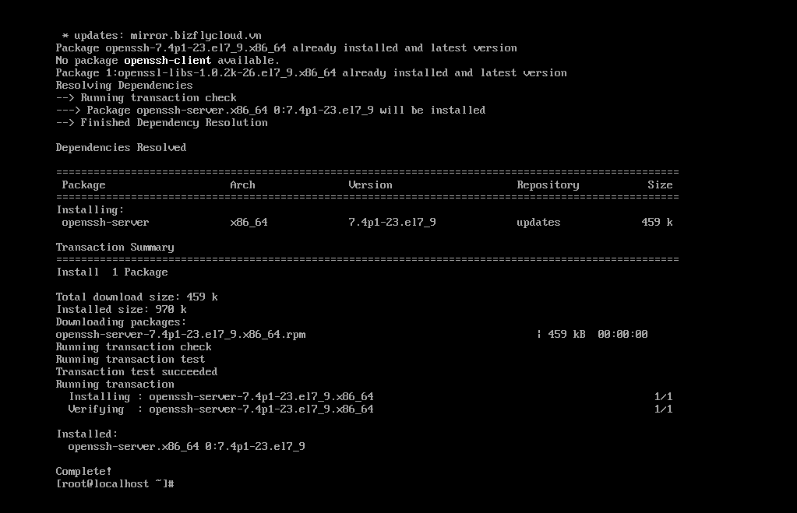

Khởi động dịch vụ SSH để kết nối

`systemctl start sshd`


## 1.1 SSH bằng password

Ta sử dụng phần mềm Mobaxterm để SSH vào VMware
Mở phần mềm lên trong mục Session ta chọn New session

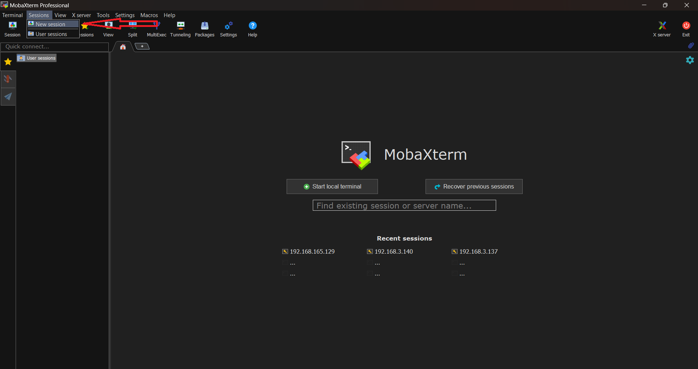

Chọn kết nối SSH và điền thông tin vào mục phía dưới và bấm ok

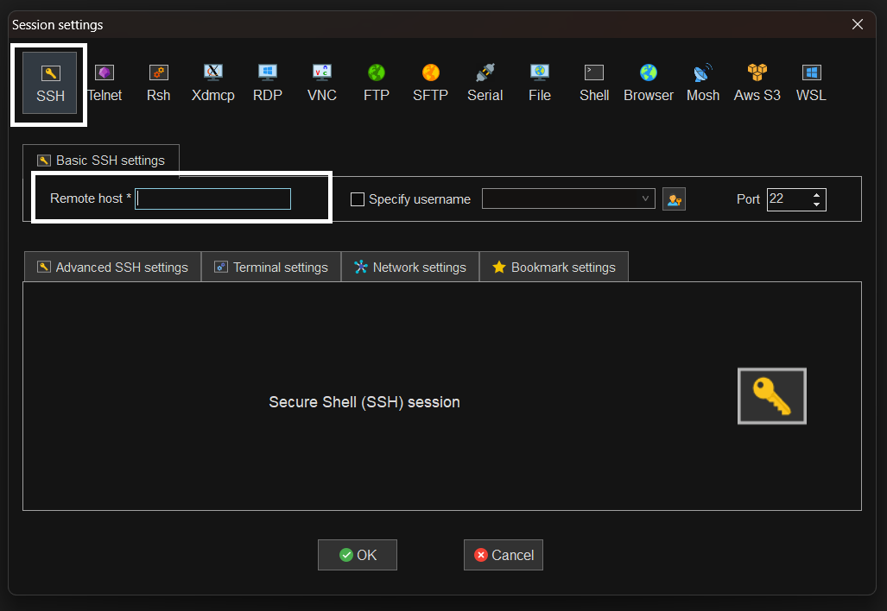

Phần mềm sẽ thông báo bạn có xác nhận để SSH đến server không và ta bấm chọn Accept

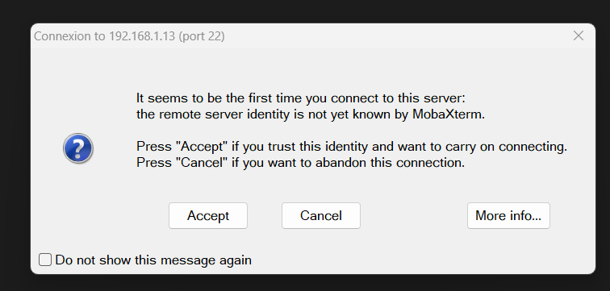

Sau khi điền tên đăng nhập và password là đã đăng nhập được vào Centos 7

## 1.2 SSH bằng Keypair
### 1.2.1 Cách 1 :
Ở phía server ta chạy lệnh phía dưới để tạo cặp keypair
`ssh-keygen -t rsa`

Đây là đường dẫn lưu Key,nhấn Enter và key sẽ lưu trong file mặc đinh: /root/.ssh/
Thông tin mật khẩu bảo mật cho Key. Có thể sử dụng mật khẩu này để đăng nhập nếu như không nhớ mật khẩu root.
Nhập lại mật khẩu passphrase.
Các key sẽ được tạo ra và lưu trữ trong /root/.ssh/ gồm có id_rsa và id_rsa.pub

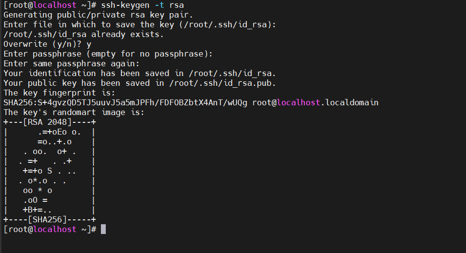

Copy file id_rsa về máy client , ta có thể dùng mobaxterm để coppy trực tiếp và lưu trên thiết bị khi đã ssh được bằng password

Ta dùng lệnh phía dưới để show file id_rsa
`cat /root/.ssh/id_rsa`

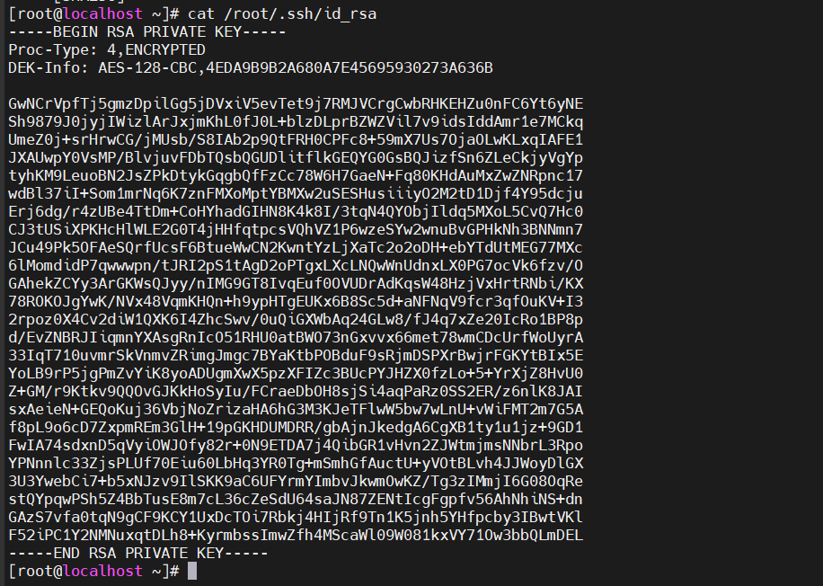


Sau khi coppy file id_rsa về máy client ,ta copy nội dung file Public_key sang cho file authorized_keys và xóa bỏ 2 file id_rsa và id_rsa.pub trên Server

`cp /root/.ssh/id_rsa.pub /root/.ssh/authorized_keys`
`rm -rf id_rsa & rm -rf id_rsa.pub`

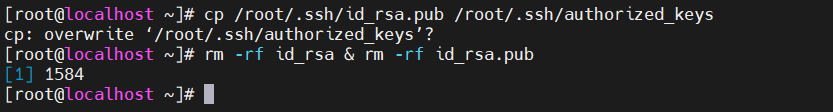

Chỉnh sửa cấu hình file sshd_config dùng lệnh 

`vi /etc/ssh/sshd_config`

Sửa dùng PasswordAuthentication yes ,thay no thành yes và bỏ # ở đầu dòng 

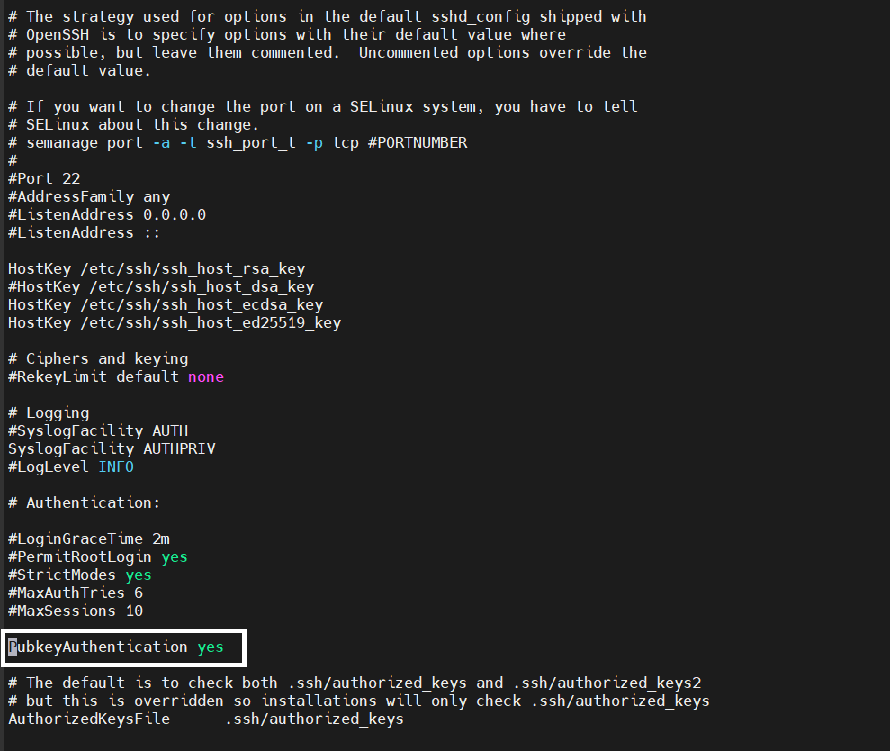

Phân quyền cho cặp key.

`chmod 600 /root/.ssh/authorized_keys`

`chmod 700 .ssh`

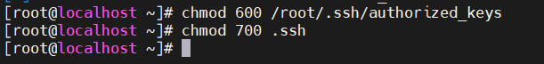

Khởi động lại cấu hình ssh

`systemctl restart sshd.service`

Sau khi khởi động lại cấu hình ssh ta sẽ kết nối ssh bằng keypair , như hình bên dưới ta vẫn điền ip , sau đó sẽ chọn mục Advanced SSH settings , ở mục use private key ta sẽ chọn file lúc trước đã tải về máy client , cuối cùng bấm ok

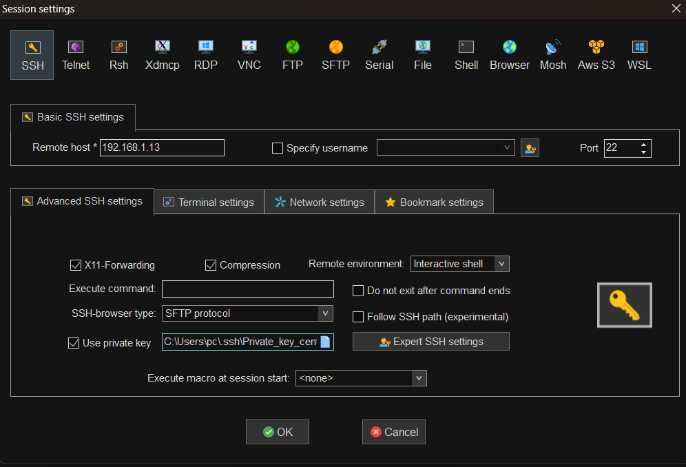

Mobaxterm sẽ yêu cầu nhập passphrase 

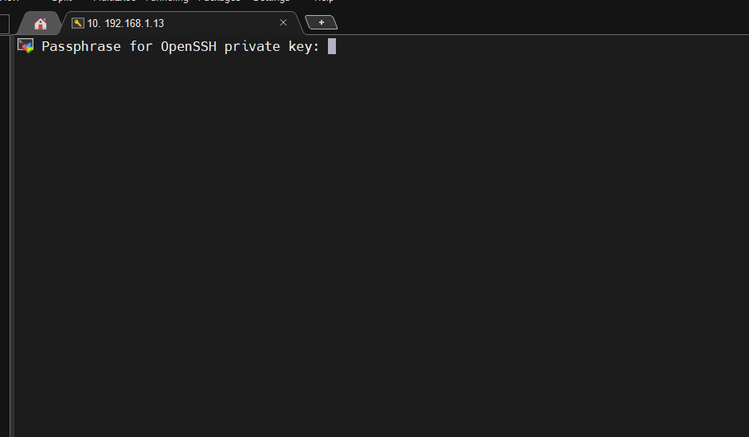

như vậy là ta đã ssh bằng keypair thành công 


### 1.2.1 Cách 1 :

**Phía server**

Tạo 1 cặp ssh keys
```
ssh-keygen -t rsa

```

Đây là đường dẫn lưu Key,nhấn Enter và key sẽ lưu trong file mặc đinh: /root/.ssh/
Thông tin mật khẩu bảo mật cho Key. Có thể sử dụng mật khẩu này để đăng nhập nếu như không nhớ mật khẩu root.
Nhập lại mật khẩu passphrase.
Các key sẽ được tạo ra và lưu trữ trong /root/.ssh/ gồm có id_rsa và id_rsa.pub

Phân quyền cho cặp key.
- Lưu ý: nếu bạn không chỉnh sửa cấu hình ssh thì bạn phải chuyển public keys tới thư mục mặc định (~/.ssh/authorized_keys) thì server mới có thể xác nhận.

``````
mv /root/.ssh/id_rsa.pub /root/.ssh/authorized_keys

chmod 600 /root/.ssh/authorized_keys

chmod 700 .ssh

``````

- Cấu hình file /etc/ssh/sshd_config để khai báo thư mục đặt key, cũng như cho phép user root login.

```
vi /etc/ssh/sshd_config

```

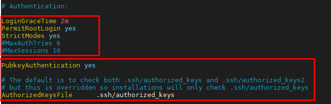

- Restart service ssh

```
systemctl restart sshd
```

**Phía Client**

- Nếu bạn sử dụng Windows để SSH đến, tiến hành copy file private key ra máy và load bằng PuTTY hoặc MobaXterm. Ở đây mình dùng MobaXterm để load private key.
- Trên MobaXterm, ta vào Tools -> MobaKeyGen
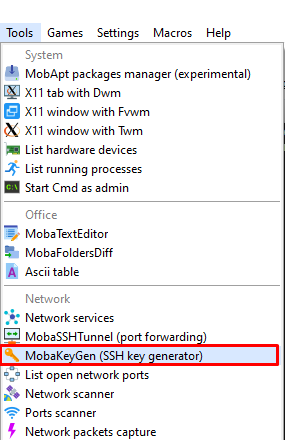


- Chọn file private key

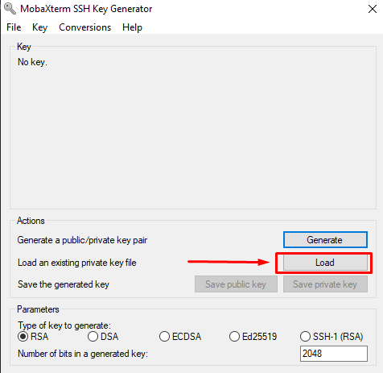

- Nhập passphrase

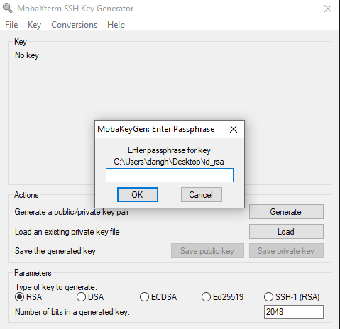

- Sau đó, lưu lại dưới dạng ppk

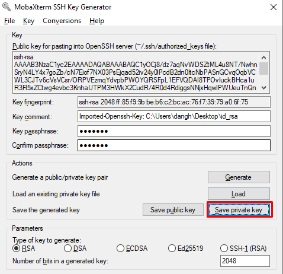

- SSH vào server 

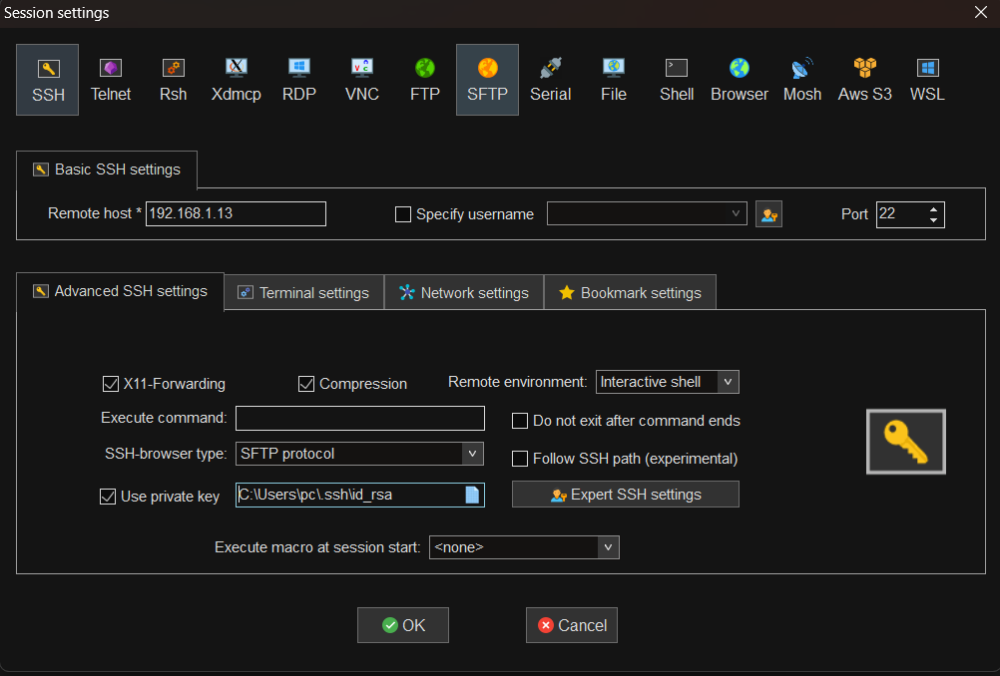


