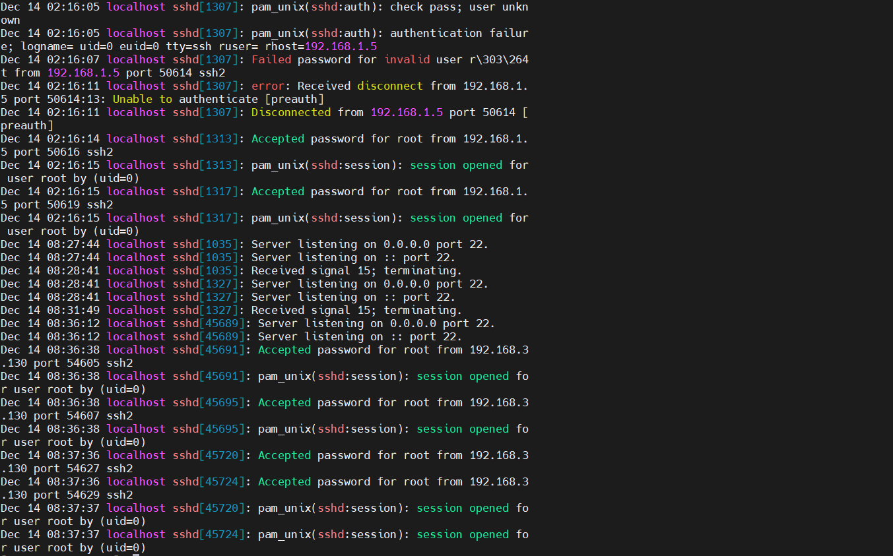
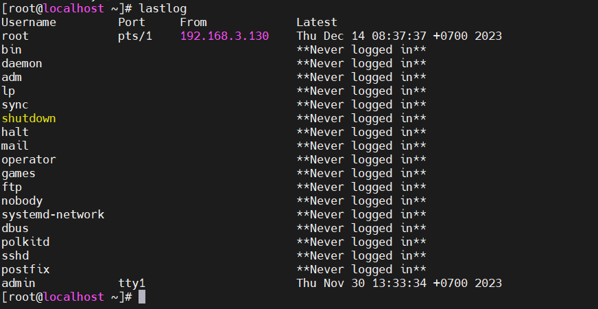
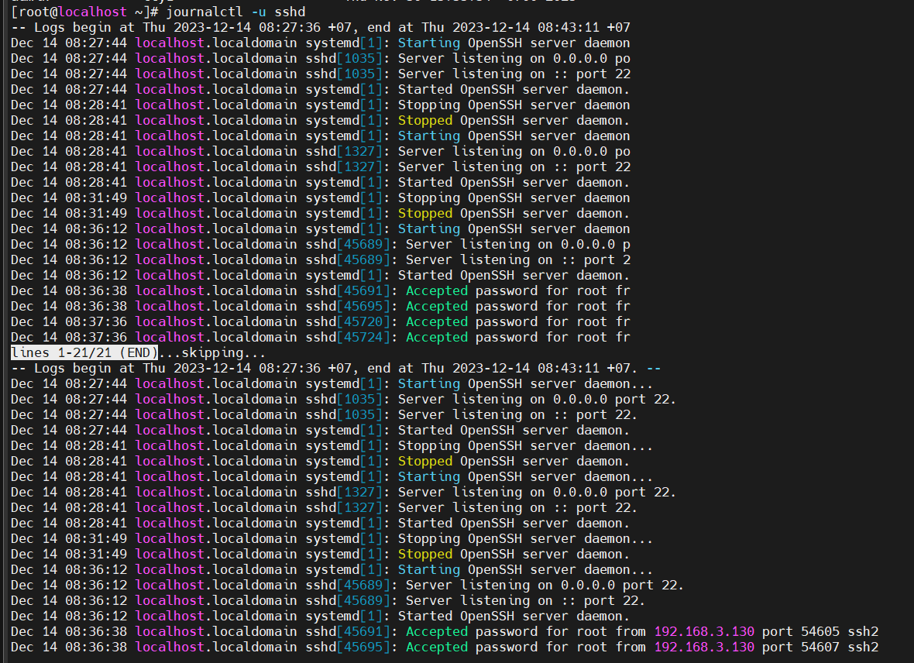

# File log SSH - Cách đọc file log SSH

SSH là viết tắt của Secure Shell Daemon của máy chủ OpenSSH. Nó quản lý các kết nối đến bằng cách sử dụng giao thức SSH làm máy chủ . Nó cũng cho phép người dùng truy cập các chi tiết như mã hóa , truyền tệp , kết nối đầu cuối và xác thực người dùng . sshd-logs xử lý các chi tiết xác thực người dùng , tức là các lần đăng nhập được ủy quyền/trái phép

# Các cách xem file log ssh

## 1.Sử dụng auth.log
Sshd logs nằm trong tập tin auth.log nằm trong thư mục /vả/log. Nó lưu trữ các chi tết về nỗ lực ủy quyền của hệ thống như thông tn đăng nhập của người dùng , cơ chế được ủy quyền đã sử dụng và nhật ký sshd
Chạy "Grep" để lọc chi tiết sshd log từ tệp /var/log/auth.log

`grep ‘sshd’ /var/log/secure`

Đầu ra hiển thị tất cả các chi tiết về phiên “sshd” như ngày, tên máy chủ, tên đăng nhập, số cổng và nhiều thông tin khác có ID tiến trình "45724".

## 2.Sử dụng lệnh “lastlog

Tiện ích dòng lệnh lastlog là một chương trình hiển thị chi tiết các lần thử đăng nhập cuối cùng của tài khoản hệ thống . Chi tiết đăng nhập bao gồm cổng , tên đăng nhập , lần đăng nhập cuối cùng và cả nhật ký sshd

## 3.Sử dụng lệnh “journalctl”
“journalctl” là một công cụ dòng lệnh khác cung cấp chi tiết nhật ký (bao gồm cả nhật ký sshd) của hệ thống ghi nhật ký systemd. Nó cung cấp dịch vụ thu thập nhật ký systemd và systemd cũng như nhận các thông báo từ kernel.

Sử dụng lệnh “ journalctl ” theo sau là“ -u (chỉ định đơn vị “systemd”)” để hiển thị “nhật ký sshd” trong thiết bị đầu cuối:

*Tài liệu tham khảo*

[1] [https://itslinuxfoss.com/sshd-logs-linux/](https://itslinuxfoss.com/sshd-logs-linux/)
