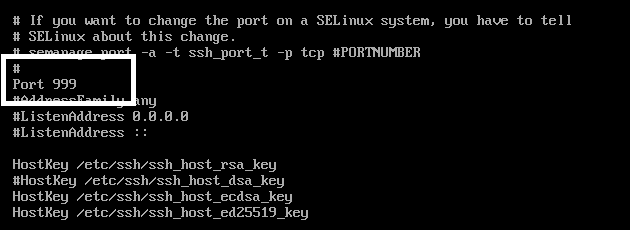
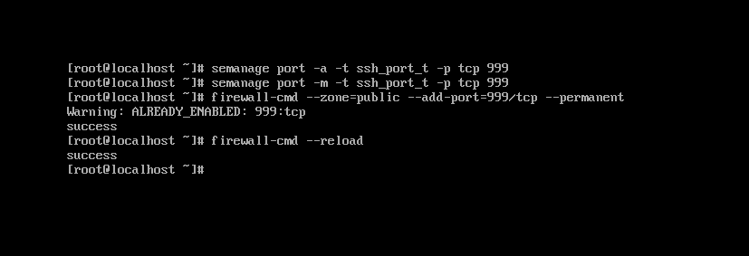
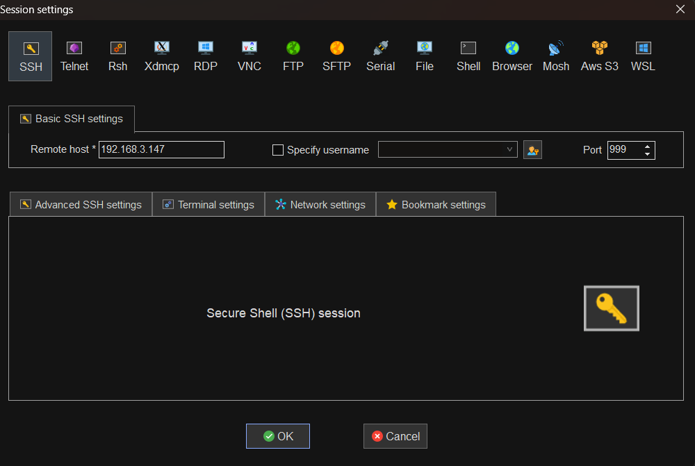
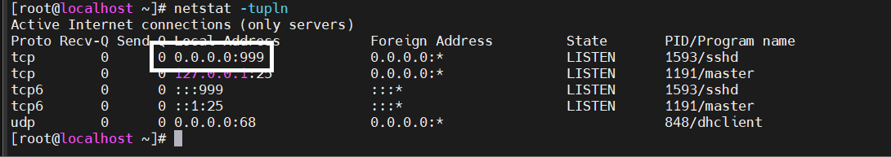

# Đổi port ssh. Sử dụng port khác để ssh vào máy chủ

Ta vào file config SSH để đổi port
`vi /etc/ssh/sshd_config`

Mặc định là port 22 bạn sửa thành port mong muốn, ở đây ra sẽ sửa thành port 999

Cài đặt gói Policycoreutils để liên kết daemon SSH với cổng SSH mới bằng cách sử dụng lệnh sau

`yum install -y policycoreutils-python`

thêm các quy tắc sau để đảm bảo rằng daemon SSH liên kết với cổng được chỉ định

`semanage port -a -t ssh_port_t -p tcp 999`
`semanage port -m -t ssh_port_t -p tcp 999`

Mở port mới cho dịch vụ SSH trên Firewall
`firewall-cmd --permanent --add-port=999/tcp`
Khởi động lại Firewall để có hiệu lực
`firewall-cmd --reload`

Ta sẽ đổi Port trên Mobaxterm và SSH lại vào server

Kiểm tra các cổng đang mở.

`netstat -tupln`

Như vậy ta đã đổi port thành công 
