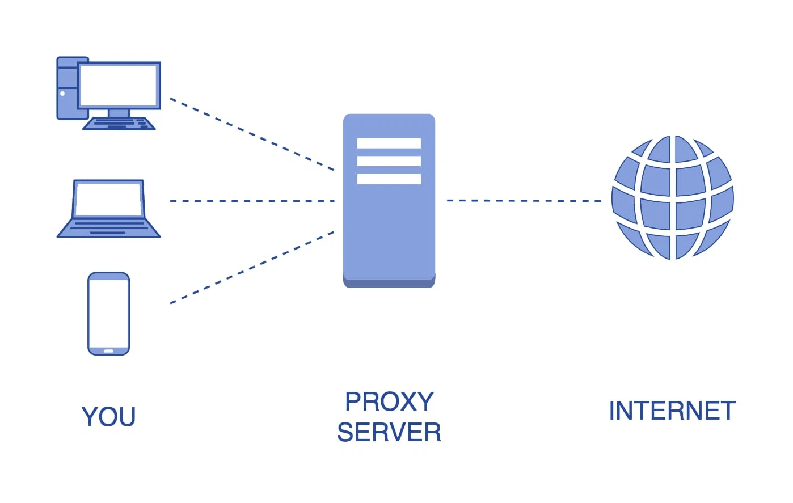
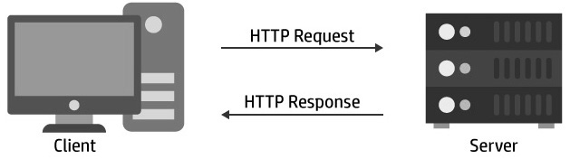
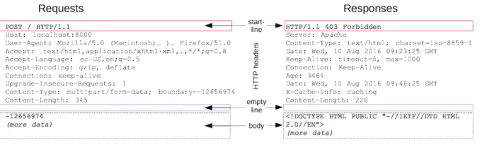
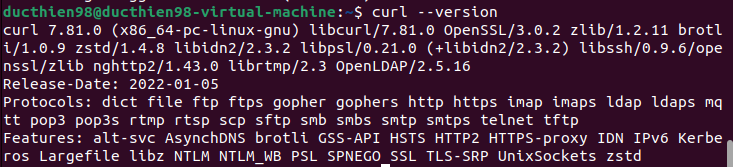
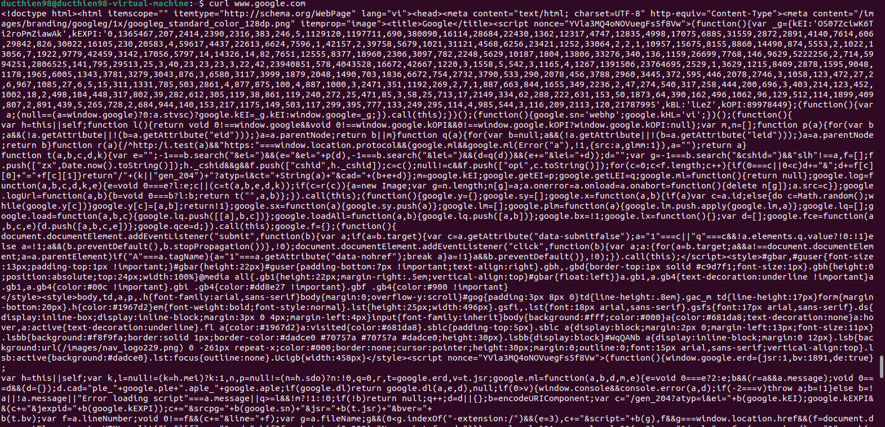
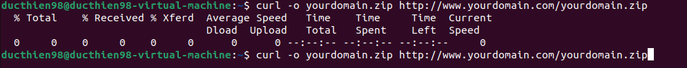
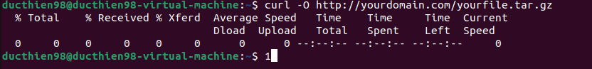
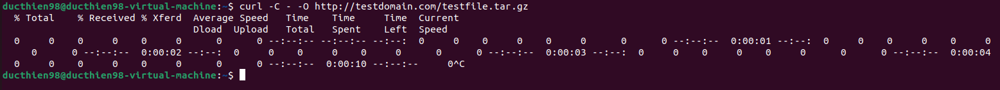
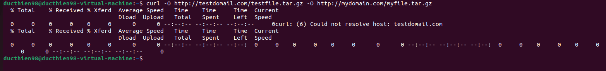
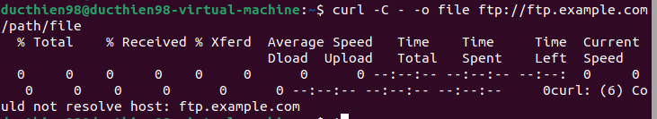

# 1. Tìm hiểu về giao thức HTTP
## 1.1.HTTP là gì
HTTP (hypertext transfer protocol) là giao thức truyền tải siêu văn bản .Đây là giao thức tiêu chuẩn cho World Wide Web (www) để truyền tải dữ liệu dưới dạng văn bản , âm thanh , hình ảnh, video từ Web server tới trình duyệt web của người dùng và ngược lại

HTTP hoạt động theo mô hình Client (máy khách) – Server (máy chủ). Việc truy cập website được tiến hành dựa trên các giao tiếp giữa 2 đối tượng trên. Khi bạn truy cập một trang web qua giao thức HTTP, trình duyệt sẽ thực hiện các phiên kết nối đến server của trang web đó thông qua địa chỉ IP do hệ thống phân giải tên miền DNS cung cấp. Máy chủ sau khi nhận lệnh, sẽ trả về lệnh tương ứng giúp hiển thị website, bao gồm các nội dung như: văn bản, ảnh, video, âm thanh,…

Trong quá trình kết nối và trao đổi thông tin, trình duyệt của bạn sẽ mặc nhiên thừa nhận địa chỉ IP đó đến từ server của chính website mà bạn muốn truy cập mà không hề có biện pháp xác thực nào. Các thông tin được gửi đi qua giao thức HTTP (bao gồm địa chỉ IP, các thông tin mà bạn nhập vào website…) cũng không hề được mã hóa và bảo mật. Đây chính là kẽ hở mà nhiều hacker đã lợi dụng để đánh cắp thông tin người dùng, thường được gọi là tấn công sniffing.

## 1.2.Các đặc trưng của HTTP

- Kết nối không liên tục : Quy trình xử lý , phản hồi yêu cầu của HTTP là Client tạo yêu cầu  -> dừng kết nối với Server để đợi phản hồi -> Server tiến hành xử lý yêu cầu  -> thiết lập kết nối tới Client và gửi phản hồi 
- Độc lập: Đặc trưng cơ bản thứ hai của HTTP là tính độc lập. Bạn có thể gửi mọi loại dữ liệu qua HTTP miễn sao máy chủ và Client có biện pháp kiểm soát các nội dung của dữ liệu. Client và Server cần xác định nội dung gửi đi thuộc kiểu gì để lựa chọn MIME phù hợp.
- HTTP là stateless: Là connectionless nên đặc trưng thứ ba của HTTP là Stateless. Máy chủ và Client chỉ biết nhau trong yêu cầu của hiện tại, ngay sau đó, chúng sẽ quên. Ngoài ra, Cả máy khách và server đều có thể lưu lại thông tin về những yêu cầu giữ các website.

## 1.3 Cấu trúc của HTTP

Cấu trúc của HTTP bao gồm 2 đối tượng là Client và Server . Có thể coi HTTP như giao thức gửi các yêu cầu và phản hồi giữa Client - Server .Tại giao thức này , mọi thiết bị tìm kiếm hay trình duyệt web sẽ đóng vai trò như máy khách , còn máy củ web có vai trò như server 
- **Client**: Client gửi yêu cầu cụ thể đến Server theo mẫu phương thức yêu cầu -> Các phiên bản giao thức cùng với URI gửi thông báo MIME ( gồm thông tin máy khách , nội dung của đối tượng , bộ chỉnh sửa ) đến server qua kết nối TCP/IP .
- **Server**: Server nhận các yêu cầu -> Phản hồi lại bằng một dòng trạng thái qua thông báo MIME có chứa thông tin máy chủ , thông tin về nội dung của đối tượng và thực thể của đa phương tiện .

## 1.4.URL
Một URL (Uniform Reource Locator) đuợc sử dụng để xác định duy nhất một tài nguyên trên Web . Một URL có cấu trúc như sau 

`scheme://hostname[:port]/path?query#fragment`

Trong một URL có 4 thành phần :

- Scheme: Là phương thức mà trình duyệt web của bạn dùng để giao tiếp với server. Các scheme phổ biến bao gồm:
    - http: Giao thức truyền tải siêu văn bản (HyperText Transfer Protocol).
    - https: Giao thức truyền tải siêu văn bản an toàn (HyperText Transfer Protocol Secure).
    - ftp: Giao thức truyền tệp (File Transfer Protocol).
    -mailto: Địa chỉ email.
    - tel: Số điện thoại.
- Hostname: Là tên của máy chủ lưu trữ tài nguyên.
- Port: Là cổng kết nối giữa trình duyệt và máy chủ.
- Path: Là đường dẫn đến tài nguyên.
- Query: Là các tham số truy vấn.
- Fragment: Là một phần của URL có thể được sử dụng để đánh dấu vị trí của một phần cụ thể trong tài nguyên. 

## 1.5.Session
Trong giao thức HTTP, mỗi session bao gồm 3 giai đoạn(bắt tay 3 bước TCP)

- Client thiết lập kết nối TCP tới Server (hoặc 1 kết nối thích hợp khác nếu tầng vận chuyển không sử dụng TCP)
- Client gửi request và đợi phản hồi
- Server nhận được request sẽ phản hồi lại cho Client cung cấp status code và dữ liệu phù hợp.

Session được lưu trên máy Server. Nó chứa dữ liệu người sử dụng web vào 1 file trên server.

## 1.6.Proxy
Proxy được hiểu đơn giản là sợi dây liên kết giữa người truy cập Internet và Internet, dùng để thực hiện chuyển tiếp thông tin và kiểm soát sự an toàn cho người dùng. Có thể nói, cách thức hoạt động của Proxy như một tường lửa (firewall), hoặc là một bộ lọc truy cập web.

- Cấu trúc proxy trong HTTP bao gồm 3 thành phần chính:

    - Client: là trình duyệt web hoặc ứng dụng HTTP khác.
    - Proxy server: là máy chủ trung gian giữa client và server web.
    - Server web: là máy chủ lưu trữ tài nguyên web.

- Cách hoạt động của proxy trong HTTP như sau:

    - Client gửi yêu cầu HTTP đến proxy server.
    - Proxy server nhận yêu cầu và chuyển tiếp yêu cầu đến server web.
    - Server web xử lý yêu cầu và gửi phản hồi đến proxy server.
    - Proxy server nhận phản hồi và chuyển tiếp phản hồi đến client.

### 1.6.1.Transparent Proxy (Proxy minh bạch)

Proxy minh bạch là loại Proxy sử dụng IP của bạn để xác nhận yêu cầu truy cập trang web. Loại Proxy này thường được những nơi công cộng như thư viện, nhà sách, trường học, công viên, siêu thị sử dụng. Lý do là bởi vì chúng khá dễ lọc nội dung truy cập do dễ dàng lập tên máy chủ và máy khách.

### 1.6.2.Incognito Proxy( Proxy ẩn danh)

Proxy ẩn danh nó hoạt động giống như trang web ẩn danh mà bạn hay dùng với mục đích cá nhân. Thay vì lấy IP của bạn để truy cập web thì Proxy ẩn danh sẽ không lấy. Nhưng nó vẫn cho phép bạn truy cập web, điều này giúp bạn bảo mật thông tin của mình, và không để lại dấu vết gì khi vào những trang web khác. 

Duyệt web ẩn danh còn giúp bạn ngăn chặn sự đánh cấp dữ liệu cho các nhà tiếp thị. Vì vậy mà bạn sẽ ít thấy các quảng cáo, các chiêu trò tiếp thị. Tuy nhiên, điều này không phải lúc nào cũng hoạt động tốt, đôi khi bạn vẫn thấy quảng cáo. 

### 1.6.3.Distorting Proxy (Proxy mạo danh) 
Proxy mạo danh hoạt động như 1 máy chủ không tên, nó lấy IP và sửa thành một IP mạo danh. Điều này có thể giúp bạn truy cập vào các trang web đã bị chặn một cách dễ dàng. 

### 1.6.4.High Anonymity Proxy (Proxy ẩn danh cao)
Với việc thay đổi định kỳ IP của bạn để truy cập vào máy chủ trang web. Điều này khiến cho việc kiểm soát lưu lượng truy cập của trang web trở nên khó khăn hơn. Proxy ẩn danh cao có lợi hơn Proxy ẩn danh là nó giúp bạn truy cập Internet an toàn và bảo mật hơn rất nhiều lần.

## 1.7.HTTP Message

**HTTP Message** (Thông điệp HTTP) là các thông tin được trao đổi qua lại giữa client và server. Có hai kiểu HTTP Message: **HTTP Request Message (Request)** được gửi đi bởi client tới server - khi server nhận được nó biết phải thực hiện nhiệm vụ nào đó, **HTTP Response Message (Response)** là trả lời từ server về cho client.

## 1.8.Request & Response

`Http request và response có chung cấu trúc như sau:`

**Start-line**: miêu tả request để thực hiện (GET, POST, PUT, …), trạng thái thành công hay thất bại (qua các mã code)
**HTTP headers**: có thể có hoặc không, chứa các thông tin của request (host, content-length, encoding, …) hoặc miêu tả phần body của message
**Dòng kẻ trống**: là phần phần tách giữa header vs body
**Body**: Phần thân tùy chọn chứa dữ liệu được liên kết với request (như nội dung của biểu mẫu HTML) hoặc tài liệu được liên kết với reponse.

### 1.8.1.HTTP - Requests
HTTP Request Method: Là phương thức để chỉ ra hành động mong muốn được thực hiện trên tài nguyên đã xác định.

|Method|Hoạt động |
|------|----------|
|Get|Được sử dụng để lấy lại thông tin từ server một tài nguyên xác định|
|Post|Yêu cầu máy chủ chấp nhận thực thể được đính kèm trong request được xác định bởi URL|
|Put|Nếu URL đề cập đến 1 tài nguyên đã có , nó sẽ bị sửa đổi ,Nếu URI không trỏ đến một tài nguyên hiện có , thì máy chủ có thể tạo ra tài nguyên với URL đó |
|Delete|Xóa bỏ toàn bộ các đại diện của tài nguyên được chỉ định bởi URL|
|Patch|Áp dụng cho việc sửa đổi một phần tài nguyên xác định |

### 1.8.2.HTTP - Response

HTTP response là một đơn vị dữ liệu được sử dụng để truyền thông tin từ server đến client trong giao thức HTTP. HTTP response bao gồm các phần sau:

**Status line**: Phần này xác định trạng thái của yêu cầu.
**Header fields**: Phần này chứa các thông tin bổ sung về phản hồi, chẳng hạn như thông tin về server, thông tin về nội dung của phản hồi,...
**Body**: Phần này chứa dữ liệu được trả về cùng với phản hồi.

Status line là phần đầu tiên của HTTP response. Status line xác định trạng thái của yêu cầu. Status line có cấu trúc như sau

`HTTP/1.1 <status code> <reason phrase>`

- HTTP/1.1 là phiên bản của giao thức HTTP.
- *status code* là mã trạng thái HTTP. Mã trạng thái HTTP là một số nguyên 3 chữ số xác định trạng thái của yêu cầu.
- *reason phrase* là một mô tả ngắn gọn về mã trạng thái HTTP.

Một số mã trạng thái HTTP phổ biến bao gồm:

- 200 OK: Yêu cầu được thực hiện thành công.
- 404 Not Found: Tài nguyên không tồn tại.
- 500 Internal Server Error: Lỗi máy chủ.

# 2.Tìm hiểu về CURL

## 2.1.CURL là gì
cURL viết tắt của Client URL. Đây là một công cụ dòng lệnh (command line tool) và thư viện dùng để kiểm tra kết nối từ URL và cho phép truyền dữ liệu thông qua nhiều giao thức khác nhau.

## 2.2.Các chức năng 

- Hỗ trợ nhiều giao thức mạng
- Hỗ trợ gửi và nhận dữ liệu dưới dạng POST và GET
- Hỗ trợ tải tập tin từ mạng
- Hỗ trợ mã hóa dữ liệu sử dụng SSL và TLS
- Hỗ trợ tùy chỉnh header gửi đi
- Hỗ trợ tùy chỉnh cookies

## 2.3.Cài đặt CURL trên Ubuntu

***Cập nhật hệ điều hành Ubuntu trước khi cài đặt CURL***
`sudo apt update && sudo apt upgrade`

Sau khi cập nhật hệ điều hành thì ta tiến hành cài đặt CURL

`sudo apt install curl`

Sau khi cài đặt xong ta kiểm tra thử phiên bản đã cài đặt 

`curl --version`

## 2.4.Sử dụng CURL

***1-In mã nguồn của một trang web bất kì***

`curl https://google.com`

***2-Lưu file tải về với tên tùy chọn***
-o sẽ giúp bạn lưu tên file theo ý muốn và thay đổi lại cả đường dẫn lưu file.
`curl -o yourdomain.zip http://www.yourdomain.com/yourdomain.zip`

-O sẽ lưu giống hệt tên file từ xa đó
`curl -O http://yourdomain.com/yourfile.tar.gz`

***3-Lệnh tiếp tục tải file***
Vì lý do nào đó file bạn tải bị dán đoạn trong quá trình tải thì lệnh dưới đây sẽ giúp bạn hoàn tất việc tải file đó về

`curl -C - -O http://testdomain.com/testfile.tar.gz`

***4-Lệnh tải nhiều file cùng lúc***

` curl -O http://testdomail.com/testfile.tar.gz -O http://mydomain.com/myfile.tar.gz`

***5-Tiếp tục chuyển tập tin***
Để tiếp tục quá trình truyền tệp ở nơi đã bị hủy trước đó, Curl hỗ trợ tiếp tục tải xuống HTTP(S) cũng như tải lên và tải xuống FTP.

- Tiếp tục tải xuống
`curl -C - -o file ftp://ftp.example.com/path/file`

- Tiếp tục tải lên
`curl -C - -T file ftp://ftp.example.com/path/file`

*Tài liệu tham khảo*

[1] [https://bizfly.vn/techblog/http-la-gi.html](https://bizfly.vn/techblog/http-la-gi.html)
[2] [https://fptshop.com.vn/tin-tuc/danh-gia/proxy-la-gi-nhung-dieu-huu-ich-ban-can-biet-ve-proxy-147017-147017](https://fptshop.com.vn/tin-tuc/danh-gia/proxy-la-gi-nhung-dieu-huu-ich-ban-can-biet-ve-proxy-147017-147017)
[3] [https://xuanthulab.net/giao-thuc-http-va-cau-truc-co-ban-cua-http-message.html](https://xuanthulab.net/giao-thuc-http-va-cau-truc-co-ban-cua-http-message.html)
[4] [https://curl.se/docs/tutorial.html](https://curl.se/docs/tutorial.html)