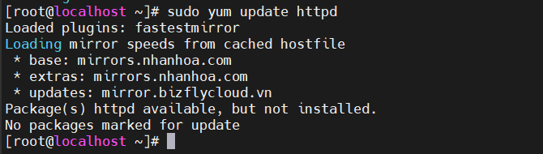
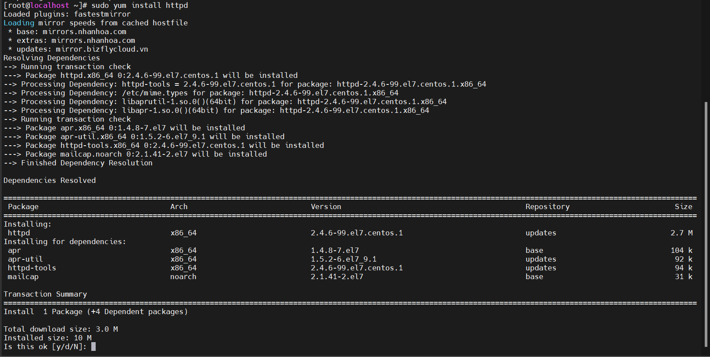
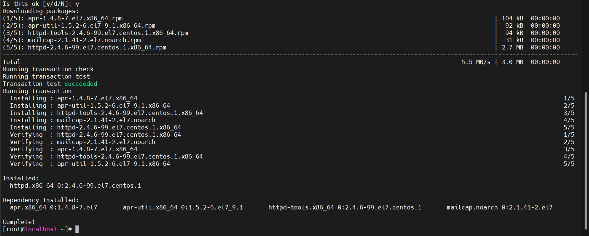
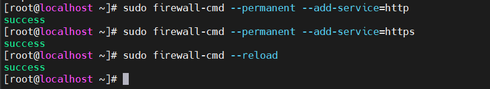
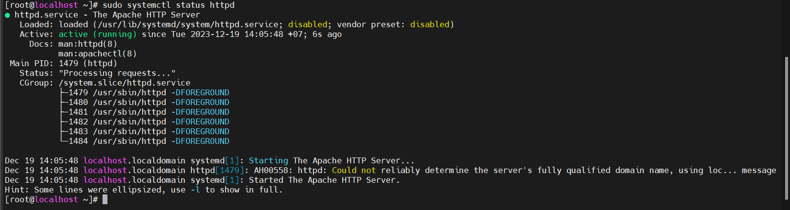
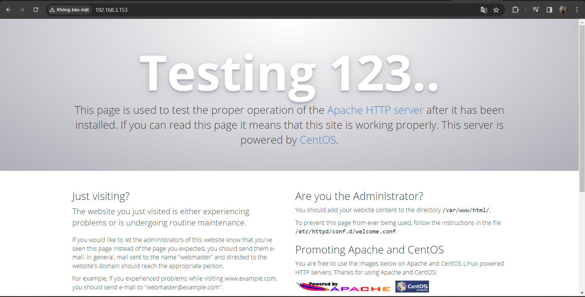
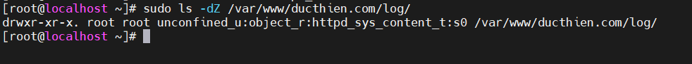
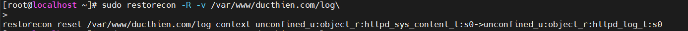
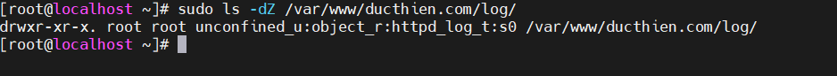
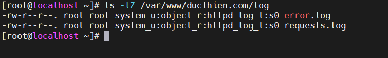

# Cài đặt web server Apache trên CentOS
## Bước 1: Cài đặt Apache

Cập nhật httpd package index cục bộ để nhận những thay đổi mới nhất:

```
sudo yum update httpd
```


Tiếp theo là cài đặt các gói:

```
sudo yum install httpd
```


Nhấn y để tiếp tục cài đặt , ta có kết quả như ảnh dưới 



Sau đó, bạn sẽ cài đặt firewalld trên server mình và cần mở cổng 80 để Apache phục vụ các request qua HTTP. Cụ thể, hãy bật dịch vụ http của firewalld bằng lệnh sau:

```
sudo firewall-cmd --permanent --add-service=http
```

Nếu bạn định cấu hình Apache để phục vụ nội dung HTTPs thì sẽ cần mở cổng 443 bằng cách bật dịch vụ https:
```
sudo firewall-cmd --permanent --add-service=https
```
Tiếp theo, tải lại tường lửa để các quy tắc này có hiệu lực:

```
sudo firewall-cmd --reload
```



## Bước 2 – Kiểm tra máy chủ Web

Apache không tự động khởi động trên CentOS sau khi hoàn tất quá trình cài đặt. Vì vậy, nó cần được khởi động theo cách thủ công để có thể tiếp tục cài đặt web server trên CentOS 7:

```
sudo systemctl start httpd
```

Xác minh rằng dịch vụ đang chạy bằng lệnh sau:
```
sudo systemctl status httpd
```

Bạn sẽ thấy trạng thái active khi dịch vụ đang chạy:




Bạn có thể truy cập trang đích Apache để xác nhận phần mềm đang chạy thông qua địa chỉ IP của bạn. 

```
http://your_server_ip
```

Ở đây server của mình có ip là `192.168.3.153`



## Bước 3 – Quản lý process Apache

Bước tiếp theo trong việc cài đặt web server trên CentOS 7 là thiết lập quy trình và chạy web server. Sau đây là một số lệnh quản lý cơ bản:

Để dừng máy chủ web của bạn, hãy nhập:

```
sudo systemctl stop httpd
```

Khởi động máy chủ web khi nó bị dừng:

```
sudo systemctl start httpd
```

Để dừng và bắt đầu lại dịch vụ:

```
sudo systemctl restart httpd
```

Nếu chỉ đơn giản là thay đổi cấu hình, Apache thường có thể tải lại mà không mất kết nối. Để làm điều này, hãy dùng lệnh sau:

```
sudo systemctl reload httpd
```

Theo mặc định, Apache được cấu hình để tự khởi động khi máy chủ khởi động. Nếu tắt nó thì hãy nhập lệnh sau:

```
sudo systemctl disable httpd
```

Để bật lại dịch vụ khởi động khi khởi động máy:

```
sudo systemctl enable httpd
```
## Bước 4: Thiết lập máy chủ ảo (virtual server)

Khi sử dụng máy chủ web Apache thì bạn có thể sử dụng virtual host để lưu trữ nhiều miền trên một máy. Trong bước này, bạn sẽ thiết lập một miền có tên là ducthien.com

**Cách thiết lập virtual server**

- Tạo folder virtual server

Tạo folder html cho `ducthien.com` như sau, sử dụng flag `-p` để tạo folder cần thiết:

```
sudo mkdir -p /var/www/ducthien.com/html
```

Lập một folder bổ sung để lưu trữ file log cho trang web:

```
sudo mkdir -p /var/www/ducthien.com/log
```

Tiếp theo, chỉ định quyền sở hữu folder html với biến $USER:

```
sudo chown -R $USER:$USER /var/www/ducthien.com/html
```

Đảm bảo rằng web của bạn có quyền mặc định.

```
sudo chmod -R 755 /var/www
```

Tiếp theo, tạo một trang index.html mẫu bằng vi hoặc trình soạn thảo:

```
sudo vi /var/www/ducthien.com/html/index.html
```

Nhấn i để chuyển sang chế độ INSERT và thêm HTML mẫu vào file:

```
/var/www/ducthien.com/html/index.html
```

```
<html>
  <head>
    <title>Welcome to ducthien.com!</title>
  </head>
  <body>
    <h1>Success! The ducthien.com virtual host is working!</h1>
  </body>
</html>
```

Lưu và đóng file bằng cách nhấn ESC, nhập :wq và nhấn ENTER.

Với directory web và file mẫu thì đủ để tạo virtual server. Các file virtual server chỉ định cấu hình của các trang web riêng biệt. Cho máy chủ web Apache biết cách phản hồi yêu cầu các tên miền khác nhau.

Trước khi tạo virtual server, cần tạo một directiry sites-available để lưu trữ chúng. Ngoài ra, bạn cũng cần tạo một directory sites-enabled. Directoiry này sẽ chứa các symbolic link cho các virual host mà ta muốn publish. Tạo cả hai directiry này bằng lệnh sau:

```
sudo mkdir /etc/httpd/sites-available /etc/httpd/sites-enabled
```

Tiếp theo, yêu cầu Apache tìm kiếm các virtual server trong directory sites-enabled. Để thực hiện điều này, hãy chỉnh sửa file cấu hình chính của Apache. Sau đó thêm một dòng khai báo directory cho các file cấu hình bổ sung:

```
sudo vi /etc/httpd/conf/httpd.conf
```

Thêm dòng này vào cuối file:

```
IncludeOptional sites-enabled/*.conf
```

Lưu và đóng file khi đã hoàn tất việc thêm dòng đó vào. Bây giờ các directory virtual server đã được tạo. Tiếp theo là tạo file virtual host.


- Tạo file virtual host

Đầu tiên tạo một file mới trong directory `sites-available:`
```
sudo vi /etc/httpd/sites-available/ducthien.com.conf
```

Ghi đoạn HTML sau vào file vừa tạo lưu và thoát 
```
<VirtualHost *:80>
    ServerName www.ducthien.com
    ServerAlias ducthien.com
    DocumentRoot /var/www/ducthien.com/html
    ErrorLog /var/www/ducthien.com/log/error.log
    CustomLog /var/www/ducthien.com/log/requests.log combined
</VirtualHost>
```

Thao tác này sẽ cho Apache biết nơi tìm root – lưu giữ các tài liệu web mà có thể được truy cập công khai. Ngoài ra, nói cũng cho biết nơi lưu trữ lỗi và request log cho trang web.
Bây giờ đã tạo các file virtual host. Hãy kích hoạt chúng để Apache biết để phục vụ cho khách truy cập. Để làm việc này, hãy tạo một liên kết cho virtual host trong directory site-enabled:

```
sudo ln -s /etc/httpd/sites-available/ducthien.com.conf /etc/httpd/sites-enabled/ducthien.com.conf

```

Bây giờ, virtual host đã được cấu hình và sẵn sàng cung cấp nội dung. Trước khi khởi động lại Apache, hãy đảm bảo rằng SELinux có các chính sách phù hợp cho virtual host của bạn. Tiếp theo, hãy điều chỉnh quyền của SELinux để tiếp tục việc cài đặt web server trên CentOS 7.


## Bước 5 – Điều chỉnh quyền SELinux cho virtual server

SELinux được cấu hình để hoạt động với Apache. Vì bạn đã thiết lập một custom log directory trong file config của virtual host. Nên có thể sẽ gặp lỗi nếu khởi động Apache. Để giải quyết vấn đề này, cần cập nhật các chính sách của SELinux. Điều này cho phép Apache ghi vào các file cần thiết. SELinux mang lại khả năng bảo mật cao hơn môi trường CentOS 7. Do đó không nên tắt toàn bộ các module kernel.
Có nhiều cách khác nhau để đặt chính sách. Vì SELinux cho phép bạn tùy chỉnh mức độ bảo mật của mình. Có hai phương pháp điều chỉnh chính sách Apache: trên phạm vị toàn bộ và trên directory cụ thể. Điều chỉnh trên directory thì sẽ an toàn hơn. Do vậy nó là cách tiếp cận được khuyến nghị cho người dùng.

- Điều chỉnh các chính sách Apache

Chạy lệnh sau để đặt một chính sách Apache chung:

```
sudo setsebool -P httpd_unified 1
```

Lệnh setsebool thay đổi giá trị boolean của SELinux. Flag -P sẽ cập nhật giá trị boot-time. Điều này làm các thay đổi vẫn giữ nguyên sau các lần khởi động lại. httpd_unified là boolean yêu cầu SELinux xử lý tất cả các quy trình thuộc cùng một loại. Vì vậy hãy bật nó với giá trị là 1.

- Điều chỉnh chính sách Apache trên directory

Đầu tiền kiểm tra context type mà SELinux đã cung cấp cho directory `/var/www/ducthien.com/log`
Lệnh này liệt kê và in cotext SELinux của directory. Bạn sẽ thấy output như sau:



Context hiện tại là httpd_sys_content_t. Điều này cho SELinux biết Apache chỉ có thể đọc các file được tạo trong directory này. Trong hướng dẫn này, bạn sẽ thay đổi context type của directory /var/www/ducthien.com/log thành httpd_log_t. Nó cho phép Apache tạo và nối các file log ứng dụng web lại với nhau:

```
sudo semanage fcontext -a -t httpd_log_t "/var/www/ducthien.com/log(/.*)?"
```

Tiếp theo, sử dụng lệnh restorecon để áp dụng các thay đổi này và để chúng tồn tại qua các lần khởi động lại:

```
sudo restorecon -R -v /var/www/ducthien.com/log
```

Flag -R chạy lệnh theo quy tắc đệ quy. Nghĩa là nó sẽ cập nhật mọi file hiện có thể sử dụng context mới. Flag -v sẽ in ra các thay đổi về context mà lệnh thực hiện. Kết quả:



Hãy liệt kê các ngữ cách một lần nữa để xem các thay đổi:

```
sudo ls -dZ /var/www/ducthien.com/log/
```

Output sẽ phản ánh các loại context được cập nhật:



## Bước 6 – Kiểm tra Virtual Host

Khi SELinux context đã được cập nhật, Apache sẽ có thể ghi vào directory /var/www/ducthien.com/log. Bây giờ bạn có thể khởi động lại Apache

```
sudo systemctl restart httpd
```

Liệt kê content của directory /var/www/ducthien.com/log để xem Apache có tạo các file hay không:


```
ls -lZ /var/www/ducthien.com/log
```
Bạn sẽ thấy Apache có thể tạo file error.log và request.log, các file này đã được chỉ định trong cấu hình virtual host:



Bây giờ virtual host và các quyền SELinux đã được cập nhật. Apache sẽ phục vụ tên miền của bạn. Kiểm tra điều này bằng cách truy cập http://ducthien.com, bạn sẽ thấy một thứ như sau:

Điều này xác nhận virtual server đã được cấu hình thành công. Lặp lại bước 4 và 5 để tạo virtual host mới với quyền SELinux cho miền bổ sung. Sau đó kết thúc việc cài đặt web server trên CentOS 7