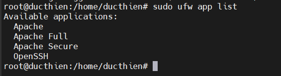
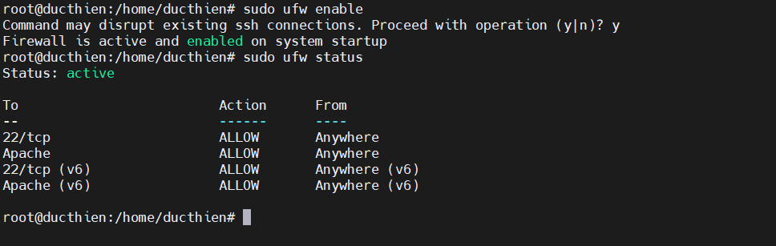
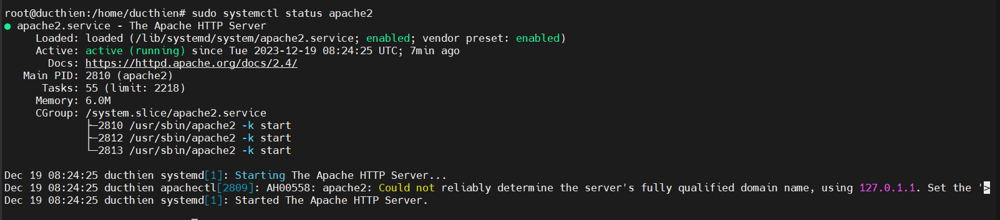
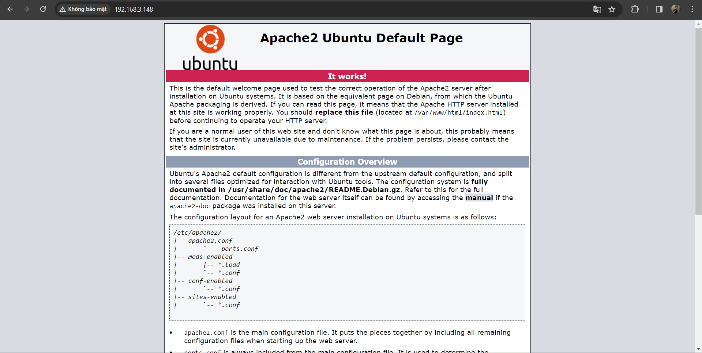
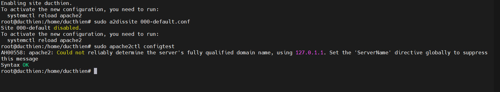
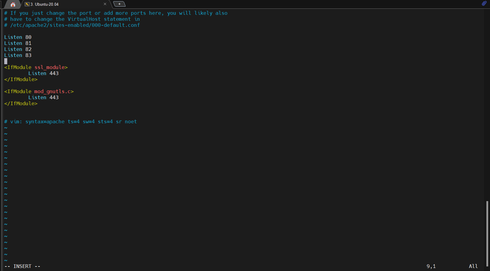

# Cài đặt web server Apache trên Ubuntu

## Bước 1: Cài đặt web server Apache

Apache có thể được cài đặt trực tiếp từ repo của Ubuntu. Trước tiên hãy cập nhật index gói local để áp dụng các thay đổi mới nhất (sẽ cần chờ trong thời gian ngắn tùy thuộc các gói cần thiết trạng thái phiên bản từng gói):

```
sudo apt update
```

au đó chạy lệnh dưới đây để cài đặt package apache2:

```
sudo apt install apache2
```

Bây giờ apt sẽ cài đặt apache và các dependency cần thiết.

## Bước 2: Thay đổi cài đặt tường lửa

Trước khi kiểm tra Apache, bạn cần chỉnh sửa một số cấu hình tường lửa để cho phép truy cập từ bên ngoài vào port mặc định của web. Ở dưới đây Vietnix sẽ đề cập việc tường lửa cấu hình bằng UFW.

Trong quá trình cài đặt, Apache sẽ tự đăng ký một số profile ứng dụng trong UFW để cho phép hoặc chặn quyền truy cập đến Apache qua tường lửa.

Bạn có thể dùng lệnh sau để xem các profile ufw hiện có:

```
sudo ufw app list
```

Output sẽ là danh sách các profile ứng dụng:



Theo như output thì có ba profile của Apache:

- Apache: Chỉ mở port 80 (lưu lượng không được mã hóa).
- Apache Full: Mở port 80 và port 443 (lưu lượng được mã hóa bằng TLS/SSL).
- Apache Secure: Chỉ mở port 443 (được mã hóa bằng TLS/SSL).
Đến bước này ta vẫn chưa cấu hình SSL cho server nên bạn chỉ cần cho phép các lưu lượng trên port 80:

```
sudo ufw allow 'Apache'
```

Sau đó kiểm tra thay đổi:

```
sudo ufw status
```

Output sẽ hiển thị danh sách lưu lượng HTTP được cho phép trên server:



## Bước 3: Kiểm tra web server

Sau khi cài đặt xong thì Ubuntu sẽ tự khởi động Apache. Bạn có thể kiểm tra trạng thái của dịch vụ bằng lệnh sau:

```
sudo systemctl status apache2
```



Bên cạnh đó, bạn cũng có thể thử truy cập landing page mặc định của Apache để xác nhận rằng phần mềm vẫn đang chạy bình thường qua địa chỉ IP của server
Hãy nhập vào trong thanh địa chỉ của trình duyệt web:

```
http://your_server_ip
```




## Bước 4: Quản lý tiến trình Apache

Sau khi cài đặt và khởi chạy web server, bạn có thể bắt đầu tìm hiểu một số lệnh quản lý cơ bản bằng công cụ systemctl ở trong bước này.

Chạy lệnh sau để dừng web server:

```
sudo systemctl stop apache2
```

Để khởi động server:

```
sudo systemctl start apache2
```

Để restart dịch vụ:

```
sudo systemctl restart apache2
```

Nếu bạn chỉ thực hiện các thay đổi cấu hình trên web server thì Apache có chế độ reload mà không cần ngắt kết nối bằng lệnh sau:

```
sudo systemctl reload apache2
```

Theo mặc định, Apache được cấu hình để tự khởi động mỗi khi server boot. Bạn có thể disable tính năng này bằng lệnh:

```
sudo systemctl disable apache2
```

Nếu muốn bật lại tính năng vừa rồi:

```
sudo systemctl enable apache2
```

## Bước 5: Thiết lập Virtual Host

Khi sử dụng web server Apache, bạn có thể sử dụng các virtual host (tương tự như các server block – khối server – trong Nginx) để đóng gói các chi tiết cấu hình và lưu trữ nhiều miền từ một server. Trong ví dụ này, chúng ta sẽ thiết lập một miền ducthien

Tạo thư mục cho ducthien như sau:

```
sudo mkdir /var/www/ducthien
```

Sau đó, gán quyền truy cập thư mục bằng biến môi trường $USER:

```
sudo chown -R $USER:$USER /var/www/ducthien
```

Quyền truy cập các root của web nên chính xác nếu bạn chưa thay đổi bất kỳ giá trị umask nào. Để đảm bảo cho phép chủ sở hữu quyền đọc, ghi và thực thi, đồng thời cho quyền đọc và thực thi đối với group và những user khác thì bạn có thể dùng lệnh sau:

```
sudo chmod -R 755 /var/www/ducthien
```

Sau đó tạo một trang mẫu index.html bằng một text editor bất kỳ:

```
sudo nano /var/www/ducthien/index.html
```
Ở bên trong, thêm đoạn HTML sau:
```
<html>
    <head>
        <title>Welcome to ducthien!</title>
    </head>
    <body>
        <h1>Success!  The ducthien virtual host is working!</h1>
    </body>
</html>
```

Sau đó lưu rồi đóng lại file.

Để Apache có thể cung cấp nội dung thì bạn cần tạo một file virtual host với các directive chính xác. Thay vì chỉnh sửa trực tiếp file cấu hình trong /etc/apache2/sites-available.000-default.conf thì bạn có thể tạo một file mới trong /etc/apache2/sites-available/ducthien.conf:

```
sudo nano /etc/apache2/sites-available/ducthien.conf
```
Sau đó paste đoạn code dưới đây:

```
<VirtualHost *:80>
    ServerAdmin webmaster@localhost
    ServerName ducthien.com
    ServerAlias www.ducthien.com
    DocumentRoot /var/www/ducthien
    ErrorLog ${APACHE_LOG_DIR}/error.log
    CustomLog ${APACHE_LOG_DIR}/access.log combined
</VirtualHost>
```

Trong đó DocumentRoot đã được cập nhật thành directory mới, còn ServerAdmin được đặt thành địa chỉ email và admin của trang vietnixtest được quyền truy cập. Bên cạnh đó ta cũng đã thêm hai directive: ServerName để thiết lập domain cơ sở khớp với định nghĩa virtual host, và ServerAlias dùng để định nghĩa các tên khác nên được khớp như những têm cơ sở.

Lưu và đóng lại file sau khi hoàn tất.

Bây giờ bạn có thể enable file bằng công cụ a2ensite:

```
sudo a2ensite ducthien.conf
```

Disable trang mặc định được định nghĩa trong 000-default.conf:

```
sudo a2dissite 000-default.conf
```

Sau đó kiểm tra lỗi cấu hình nếu có:

```
sudo apache2ctl configtest
```

Nếu output là Syntax OK thì không có lỗi gì xảy ra.



Cuối cùng là restart lại Apache để áp dụng các thay đổi:

```
sudo systemctl restart apache2
```

Bây giờ thì Apache đã bắt đầu cung cấp nội dung cho tên miền của bạn. Bạn có thể vào trang http://ducthien để kiểm tra.


# CẤU HÌNH NHIỀU VIRTUAL HOST TRÊN 1 SERVER

**1. Tạo thêm virtual host**
Tạo thư mục thứ 2 tên hanquoc như sau 

```
sudo mkdir /var/www/hanquoc
```

Sau đó, gán quyền truy cập thư mục bằng biến môi trường $USER: 

```
sudo chown -R $USER:$USER /var/www/hanquoc
```

Để đảm bảo cho phép chủ sở hữu quyền đọc, ghi và thực thi, đồng thời cho quyền đọc và thực thi đối với group và những user khác thì bạn có thể dùng lệnh sau:

```
sudo chmod -R 755 /var/www/hanquoc
```
Sau đó tạo một trang mẫu index.html bằng một text editor bất kỳ:

```
sudo nano /var/www/hanquoc/index.html
```
Ở bên trong, thêm đoạn HTML sau:

```
<html>
    <head>
        <title>Welcome to hanquoc!</title>
    </head>
    <body>
        <h1>Success!  The hanquoc virtual host is working!</h1>
    </body>
</html>
```

Tạo một file virtual host mới
```
sudo nano /etc/apache2/sites-available/ducthien.conf
```

Sau đó paste đoạn code dưới đây

```
<VirtualHost *:81>
    ServerAdmin webmaster@localhost
    ServerName hanquoc.com
    ServerAlias www.hanquoc.com
    DocumentRoot /var/www/hanquoc
    ErrorLog ${APACHE_LOG_DIR}/error.log
    CustomLog ${APACHE_LOG_DIR}/access.log combined
</VirtualHost>

```

Lưu ý port ở đây ta để là `81`

Bây giờ bạn có thể enable file bằng công cụ a2ensite

sudo a2ensite hanquoc.conf

Tạo tương tự các virtual host khac : vietnam , canada

**2.Truy cập file config và thêm port**

Chạy lệnh sau để mở tệp cấu hình máy chủ Apache

```
sudo vi /etc/apache2/ports.conf
```


Thêm các port mà virtual host đã tạo

Cấu hình tường lửa cho phép truy cập web qua port mới , ta chạy lệnh dưới 

```
sudo ufw allow 81
```
Restart lại dịch vụ apache web server

```
sudo systemctl restart apache2
```


Như vậy ta đã có thể truy cập nhiều virtual host trên 1 server qua các port khác nhau 


*Tài liệu tham khảo*
[1] [https://www.digitalocean.com/community/tutorials/how-to-set-up-a-firewall-with-ufw-on-ubuntu-22-04](https://www.digitalocean.com/community/tutorials/how-to-set-up-a-firewall-with-ufw-on-ubuntu-22-04)

[2] [https://ubiq.co/tech-blog/how-to-change-port-number-in-apache-in-ubuntu/](https://ubiq.co/tech-blog/how-to-change-port-number-in-apache-in-ubuntu/)

[3] [https://ubuntu.com/tutorials/install-and-configure-apache#5-activating-virtualhost-file](https://ubuntu.com/tutorials/install-and-configure-apache#5-activating-virtualhost-file)