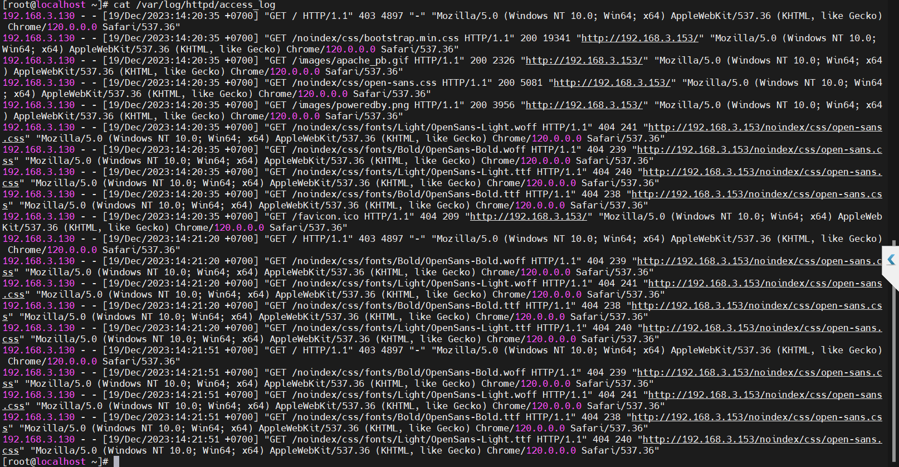
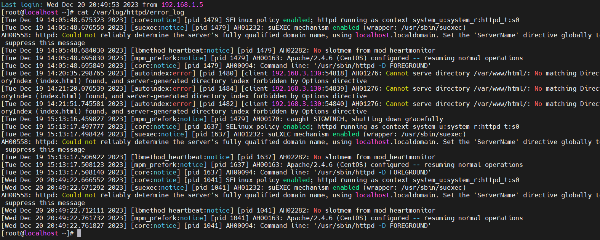
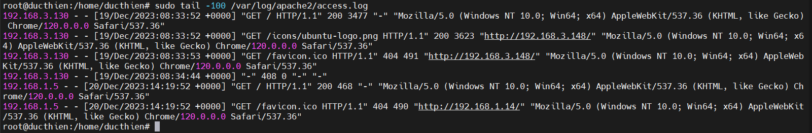
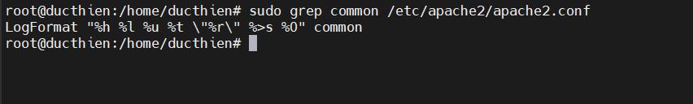
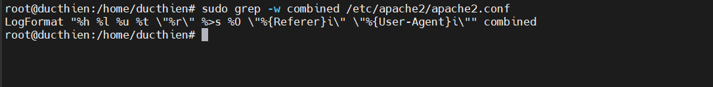

## Giới thiệu về log file của apache trên linux
Nhật ký Apache là các tệp ghi lại mọi thứ mà máy chủ web Apache đang thực hiện để quản trị viên máy chủ phân tích sau này. Bản ghi của tất cả các sự kiện Apache được đặt trong hai tệp văn bản khác nhau:

**Access Log**: file này lưu trữ thông tin về các yêu cầu gửi đến. Bạn sẽ tìm thấy thông tin chi tiết về từng yêu cầu như tài nguyên được yêu cầu, mã phản hồi, thời gian thực hiện để tạo phản hồi, địa chỉ IP của khách hàng...
**Error log**: file này chứa thông tin chẩn đoán về bất kỳ lỗi nào gặp phải trong khi xử lý yêu cầu.


# 1.Vị trí tệp 
## 1.1.Access log

Máy chủ Apache ghi lại tất cả các yêu cầu đến và tất cả các yêu cầu được xử lý vào một tệp nhật ký. Định dạng của nhật ký truy cập có khả năng cấu hình cao. Vị trí và nội dung của nhật ký truy cập được kiểm soát bởi lệnh CustomLog . Vị trí tệp nhật ký truy cập apache mặc định:

**Vị trí file log trên CentOs**: `/var/log/httpd/access_log`
**Vị trí file log trên Ubuntu**:`/var/log/apache2/access.log`



## 1.2.Error log

Tất cả các lỗi / thông tin chẩn đoán Apache, các lỗi khác được tìm thấy trong khi cung cấp yêu cầu đều được ghi vào tệp này. Vị trí của nhật ký lỗi được đặt bằng lệnh ErrorLog. Nếu có bất kỳ vấn đề gì, trước tiên bạn nên xem qua tệp này bằng cách sử dụng cat, grep hoặc bất kỳ tiện ích văn bản UNIX/Linux nào khác. Tệp nhật ký apache này thường chứa thông tin chi tiết về sự cố xảy ra và cách khắc phục . Vị trí tệp nhật ký lỗi mặc định

**Vị trí file log trên CentOs**:`/var/log/httpd/error_log`

**Vị trí file log trên Ubuntu**:` /var/log/apache2/error.log`



# 2.Xem file Log

Một trong những cách phổ biến nhất để xem tệp nhật ký Apache là thông qua `tail` lệnh in 100 dòng cuối cùng từ một tệp. Khi `-100` tùy chọn được cung cấp, lệnh sẽ xem tệp và xuất nội dung của nó theo thời gian thực.

```
sudo tail -100 /var/log/apache2/access.log
```


Để xem toàn bộ nội dung của tệp, bạn có thể sử dụng catlệnh hoặc mở tệp trong trình soạn thảo văn bản như `nano` hoặc `vim`:

```
cat /var/log/apache2/access.log
```

Bạn cũng có thể muốn lọc các mục nhật ký trong tệp nhật ký theo một thuật ngữ cụ thể. Trong những trường hợp như vậy, bạn nên sử dụng greplệnh. Đối số đầu tiên grep là thuật ngữ bạn muốn tìm kiếm, trong khi đối số thứ hai là tệp nhật ký sẽ được tìm kiếm. Trong ví dụ bên dưới, chúng tôi đang lọc tất cả các dòng có chứa từ GET:

```
sudo grep GET /var/log/apache2/access.log
```

# 3.Định dạng nhật ký truy cập 
Nhật ký truy cập ghi lại tất cả các yêu cầu được máy chủ xử lý. Bạn có thể xem những tài nguyên nào đang được yêu cầu, trạng thái của từng yêu cầu và thời gian xử lý phản hồi của chúng.

## 3.1.Định dạng nhật ký chung

Định dạng nhật ký chung là định dạng nhật ký truy cập được tiêu chuẩn hóa được nhiều máy chủ web sử dụng vì nó dễ đọc và dễ hiểu. Nó được lưu trong /etc/apache2/apache2.conf 

```
sudo grep common /etc/apache2/apache2.conf

```



Dưới đây là giải thích về thông tin có trong thông điệp tường trình ở trên:

- %h: tên máy chủ hoặc địa chỉ IP của máy khách đã thực hiện yêu cầu.
- %l :nhận dạng người dùng được xác định bởi identd (thường không SD vì không tin cậy)
- %u: tên người dùng từ xa (tên người dùng của người dùng đã đăng nhập).
- %t: ngày, giờ yêu cầu.
- %r:là yêu cầu từ người sử dụng (client)
- %>s: mã phản hồi.
- %O :kích thước của phản hồi tính bằng byte.


## 3.2.Định dạng nhật ký kết hợp

Định dạng nhật ký kết hợp  rất giống với định dạng nhật ký chung nhưng chứa một số thông tin bổ sung.

Nó cũng được lưu trong `/etc/apache2/apache2.conf`


```
sudo grep -w combined /etc/apache2/apache2.conf

```

Lưu ý rằng nó hoàn toàn giống với Định dạng nhật ký chung, có thêm hai trường bổ sung. Các mục được tạo ở định dạng này sẽ trông như thế này:

Dưới đây là giải thích về hai trường bổ sung không có ở định dạng Nhật ký chung:

- \"%{Referer}i\"→ "-": URL của người giới thiệu (nếu có, nếu không -thì sử dụng).
- \"%{User-Agent}i\"-> "Mozilla/5.0 (Windows NT 10.0; Win64; x64) AppleWebKit/537.36 (KHTML, like Gecko) Chrome/90.0.4430.93 Safari/537.36": thông tin chi tiết về tác nhân người dùng của khách hàng đã thực hiện yêu cầu.


*Tài liệu tham khảo*

[1] [https://betterstack.com/community/guides/logging/how-to-view-and-configure-apache-access-and-error-logs/](https://betterstack.com/community/guides/logging/how-to-view-and-configure-apache-access-and-error-logs/)