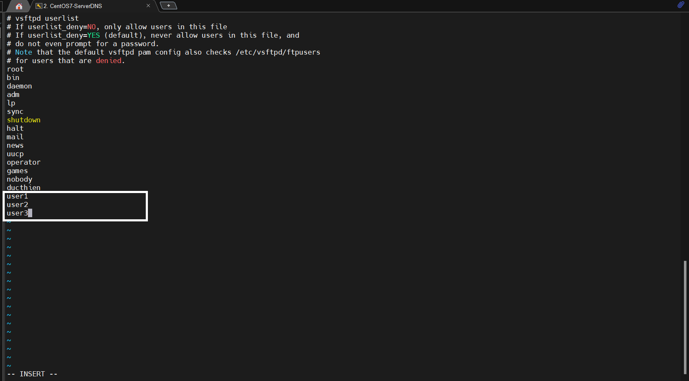
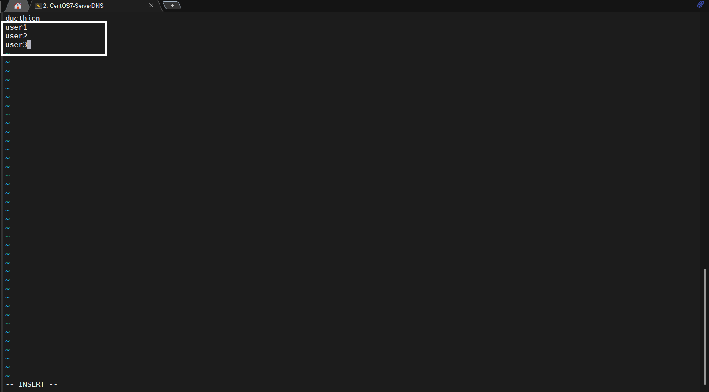
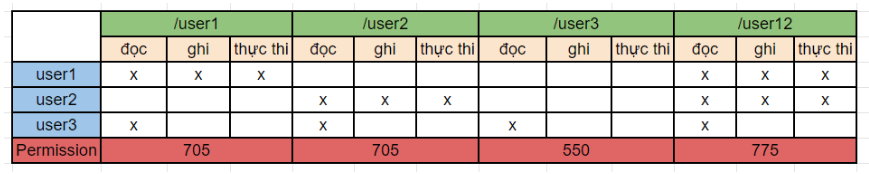
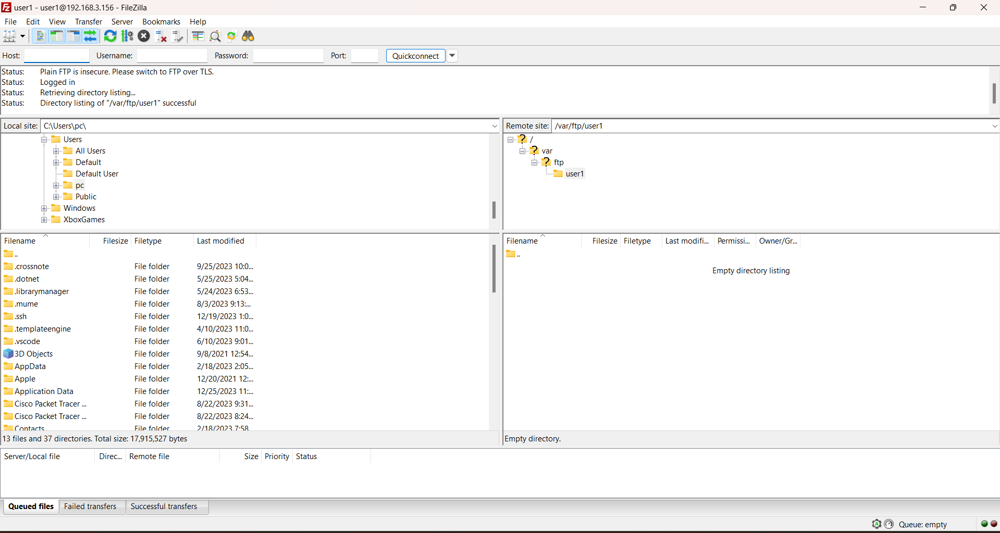
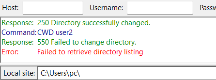
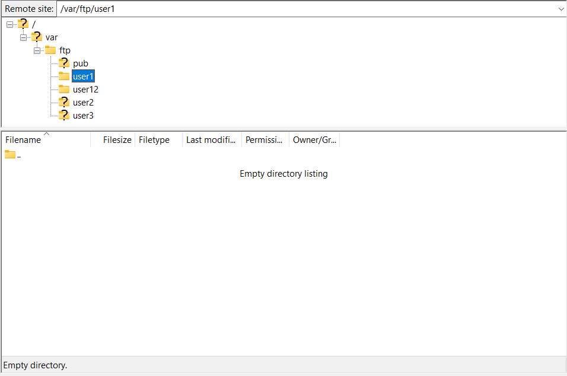
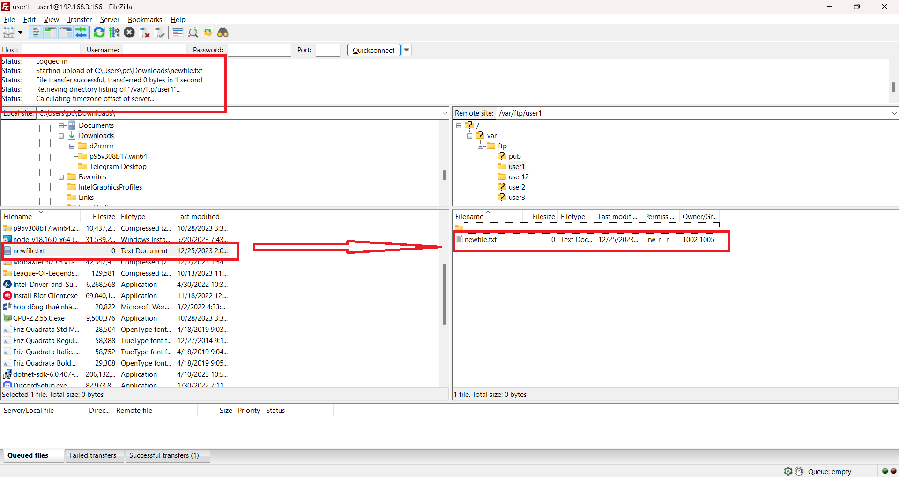

# Phân quyền User trong FTP server(CentOS-7)
# 1.Mô hình Lab

|  |OS|IP Address |User|
|--|--|--|--|
|FTP server|CentOS 7| 192.168.3.156 |Vsftpd|
|FTP client|Window 11|  |FileZilla|


- `user1` và `user2` chỉ được sử dụng các thư mục của chính nó (user1 : /user1 và user2 : /user2) và thư mục dùng chung(/user12)
- `user3` có thể truy cập tất cả các thư mục nhưng chỉ có quyền đọc, kể cả với chính thư mục của nó (/user3)

# 2.Cài đặt và cấu hình FTP server
## 2.1.Cài đặt Vsftpd

Cài đặt gói vsftpd

```
yum install vsftpd
```

Copy file cấu hình để backups: `/etc/vsftpd/vsftpd.conf`

```
cp /etc/vsftpd/vsftpd.conf /etc/vsftpd/vsftpd.conf.example
```

## 2.2.Cấu hình FTP server

- Chỉnh sửa file cấu hình

```
vi /etc/vsftpd/vsftpd.conf
```

```
# không cho user nặc danh truy cập ftp server
anonymous_enable=NO

# sử dụng local user
local_enable=YES

# cho phép local user upload, delete file
write_enable=YES

# chroot và tạo 1 file /etc/vsftpd/chroot_list chứa danh sách các local user không bị giới hạn bởi chroot
chroot_local_user=YES
allow_writeable_chroot=YES
chroot_list_enable=YES
chroot_list_file=/etc/vsftpd/chroot_list

# Ta chỉ sử dụng IPv4
listen=YES

# Không sử dụng IPv6
listen_ipv6=NO

# Chỉ cho các user có trong file /etc/vsftpd/user_list được truy cập FTP server
userlist_deny=NO
userlist_enable=YES
userlist_file=/etc/vsftpd/user_list

# Thư mục home của FTP Server
local_root=/var/ftp/

# Sử dụng thời gian của hệ thống
use_localtime=YES
```

- Khởi động vsftp

```
systemctl start vsftpd
systemctl enable vsftpd
```

- Cấu hình tường lửa

```
firewall-cmd --permanent --add-port=21/tcp
firewall-cmd --permanent --add-service=ftp
firewall-cmd --reload
```

- SELinux

```
setsebool -P ftpd_full_access on
```

# 3.Tạo user và phân quyền

## 3.1. Tạo các user và group

- Tạo 3 user: user1, user2, user3 và thay đổi Home directory của chúng như sau:

```
useradd -d /var/ftp/user1 user1
useradd -d /var/ftp/user2 user2
useradd -d /var/ftp/user3 user3
```

- Đặt mật khẩu cho các user vừa tạo. Ở đây, mình đặt mật khẩu của 3 user giống nhau là `vnpt1`

```
passwd user1
passwd user2
passwd user3
```
- Tạo 2 group
  - `ftp_basic` : user có quyền bình thường đối với thư mục của mình và thư mục dùng chung. Dùng cho `user1` và `user2`.
  - `ftp_onlyread` : user chỉ có quyền đọc. Dùng cho `user3`.

```
groupadd ftp_basic
groupadd ftp_onlyread
```

- Thêm các user vào 2 group vừa tạo:

```
usermod -g ftp_basic user1
usermod -g ftp_basic user2
usermod -g ftp_onlyread user3
```

## 3.2.Cấp quyền truy cập và phân quyền các user

- Cấp quyền truy cập FTP server cho các user vừa tạo bằng cách thêm vào file `/etc/vsftpd/user_list`, mỗi user trên một dòng và lưu lại.

```
 vi /etc/vsftpd/user_list
```



- Thêm vào danh sách không bị chroot giới hạn

```
vi /etc/vsftpd/chroot_list
```


- Tạo 1 thư mục dùng chung cho user1 và user2 tên là `/user12`:

```
mkdir /var/ftp/user12 
```

- Thay đổi quyền sở hữu thư mục:

```
chown -R user1:ftp_basic /var/ftp/user1
chown -R user2:ftp_basic /var/ftp/user2
chown -R user3:ftp_onlyread /var/ftp/user3
chown -R :ftp_basic /var/ftp/user12
```

- Thay đổi permission để kiểm soát truy cập của từng user đối với các thư mục

Quyền và permission của các user với các thư mục:



```
chmod 705 /var/ftp/user1
chmod 705 /var/ftp/user2
chmod 550 /var/ftp/user3
chmod 775 /var/ftp/user12
```

Như vậy ta đã phân quyền xong. Ta tiến hành restart lại dịch vụ `vsftpd`:

# 4.Sử dụng FileZilla để truy cập FTP server kiểm tra phân quyền

Ta sẽ sử dụng FileZilla Client để xem sau khi phân quyền, các user có quyền truy cập và thao tác trên FTP server đúng như ta đã đặt ra hay không.


## 4.1.user1 và user2

Đăng nhập vào FTP server, sau khi đăng nhập thành công sẽ có thông báo kết nối thành công và chuyển vào Home directory của FTP server.

Ở đây, mình sẽ thử với user1. (user2 hoàn toàn tương tự)



- Truy cập vào các thư mục không thuộc quyền sở hữu

Ta truy cập vào 2 thư mục /`user2` và /`user3` sẽ không thành công và hiện thông báo lỗi như hình:



- Truy cập vào thư mục cá nhân

Truy cập vào thư mục /user1: ta sẽ thấy các nội dung trong thư mục /user1



**Upload file:** Ta sẽ upload `file newfile.txt` từ local lên thư mục /user1 của FTP server. Ta sẽ thấy thông báo thành công và file hiển thị trên FTP server.



**Download file và xóa file cũng sẽ có thông báo tương tự** 

## 4.2.Truy cập thư mục chung /user12

Ở đây việc truy cập file , upload file , download file hay xóa file ta thao tác như ở user 1 

## 4.3.user3

user3 có thể truy cập tất cả các thư mục trên FTP server, tuy nhiên nó chỉ có thể xem nội dung và download mà không thể chỉnh sửa nội dung trên FTP server