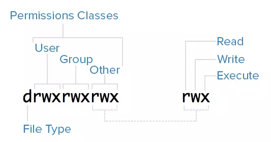
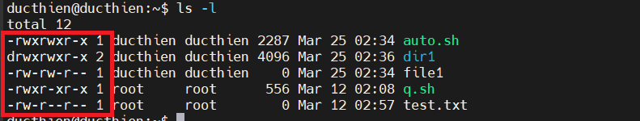
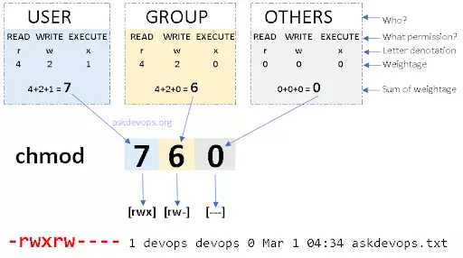

# CÁCH PHÂN QUYỀN TRONG LINUX
# 1.Ownership
Mỗi file trên Linux đều được gán bởi 3 loại chủ sở hữu là `user` , `group` và `other`

**User**
Mặc định trên Linux thì người tạo ra 1 file hay 1 thư mục sẽ là chủ sở hữu của chính nó

**Group**
Nhóm có thể chứa nhiều người dùng cùng 1 lúc .Tất cả người dùng của một nhóm sẽ có quyền truy cập vào một file hay thư mục nào đó .

**Other**
Other là bất kỳ người dùng nào không thuộc hai nhóm trên 

Để phân biệt 3 loại người dùng trên , giúp cho việc người dùng A và người dùng B không ảnh hưởng đến file và thư mục của nhau , ta cần đến `permissions` để quản lý quyền hành vi của mỗi người 

# 2.Permissions

Mỗi file hay thư mục đều có 3 quyền đọc , ghi , thực thi được xác định cho 3 chủ sở hữu trên 

**Đọc**
Nếu là 1 file thì quyền này cho phép bạn mở file đó lên đọc , còn nếu đó là 1 thư mục thì nó sẽ cho phép bạn liệt kê file trong thư mục hoặc liệt kê thư mục trong thư mục đó

**Ghi**
Quyền ghi cho phép bạn sửa nội dung file ,nếu là thư mục quyền này cho phép bạn `thêm` , `xóa` , `đổi tên` thư mục

**Thực thi**
Bạn không thể chạy 1 file nếu không có quyền thực thi , còn đối với thư mục bạn sẽ không có quyền truy cập (cd) nếu không có quyền thực thi


# 3.Cách phân quyền

## 3.1. Xem quyền

Để xem quyền và chủ sở hữu các file thư mục
```
ls -l
```


*Hình ảnh tổng quát về quyền trong Linux*


Ví dụ ta sẽ tạo ra 1 file tên là `file1` và 1 thư mục là `dir1`, mặc định chủ sở hữu là người tạo , nếu ta dùng account `ducthien` để tạo thì mặc định nó có user là `ducthien`. Vậy nhóm ở đâu , trên Linux sẽ mặc định thêm người dùng vào nhóm có cùng tên với người dùng đó , vì vậy `user` và `group` sẽ thuộc sở hữu của `ducthien`.




Với phần khoanh đỏ chính là permissions , cấu trúc sẽ được chia thành từng phần như sau : đầu tiên là file type phía sau là quyền của từng owner trong hệ thống


|file type|user|group|other|name|
|--|--|--|--|--|
|d   |rwx|rwx|r-x|dir1|
|-   |rw-|rw-|r--|file1|

Bảng trên đã chia các thành phần vào từng cột khác nhau 
Đầu tiên trong phần permission sẽ cho bạn biết đó là file hay thư mục

|Ký hiệu|Ý nghĩa|
|--|--|
|d | Thư mục|
|- | File|


Sau khi phân biệt được là file hay thư mục thì đến phần xem các quyền mình có thể làm đối với mỗi file hay thư mục đó. Nó được chia ra làm 3 phần là user,group, other. Ý nghĩa của r,w,x:

|Ký hiệu|Ý nghĩa|
|--|--|
|r | đọc |
|w | ghi |
|x | thực thi |
|- | không có quyền |


## 3.2.Thay đổi quyền với chmod

`chmod` là viết tắt `change mode` dùng để thay đổi quyền của một thư mục hoặc 1 file


**Phân quyền bằng số**

```
chmod <permissions-number> <filename>
```




Permissions-number bao gồm có 3 chữ số , ý nghĩa của từng số lần lượt là quyền user , quyền group , quyền other . Ý nghĩa của từng số ở đây 


|Số|Ký hiệu|Ý nghĩa|
|--|--|--|
|0 | --- | Không có quyền |
|1 | --x | Thực thi|
|2 | -w- | Ghi|
|3 | -wx | Ghi + Thực thi|
|4 | r-- | Đọc|
|5 | r-x | Đọc + Thực thi|
|6 | rw- | Đọc + Ghi|
|7 | rwx | Đọc + Ghi + Thực thi|

Giả sử bạn cần phân quyền cho một file có tên là file1 quyền rwxrw-r--. Nó có nghĩa là user có tất cả quyền đọc, ghi, thực thi. Group có quyền đọc và ghi và other thì chỉ có quyền đọc. Để làm điều này ta cần tính quyền cho từng chủ sở hữu.

- user: r + w +x = 4 + 2 + 1 = 7
- group: r + w = 4 + 2 = 6
- other: r = 4 = 4


Vậy quyền của cả file sẽ là 764, sau đó sử dụng lệnh sau để phân quyền:

```
chmod 764 file1
```

Ngoài ra ta có thể phần quyền bằng cách sau 

```
chmod u=rwx,g=rw,o=r <filename>
```

## 3.3.Thay đổi owner và group

Bạn có thể thay đổi quyền sở hữu của 1 file, với việc này ta cần có quyền sudo

**Để thay đổi user**

```
sudo chown <username> <filename>
```

**Để thay đổi quyền group**
```
sudo chgrp <groupname> <filename>
```

**Để thay đổi quyền cả user và group**
```
sudo chown <username>:<groupname> <filename>
```


*Tài liệu tham khảo *

[1] [https://viblo.asia/p/phan-quyen-trong-linux-yMnKMbDNZ7P](https://viblo.asia/p/phan-quyen-trong-linux-yMnKMbDNZ7P)