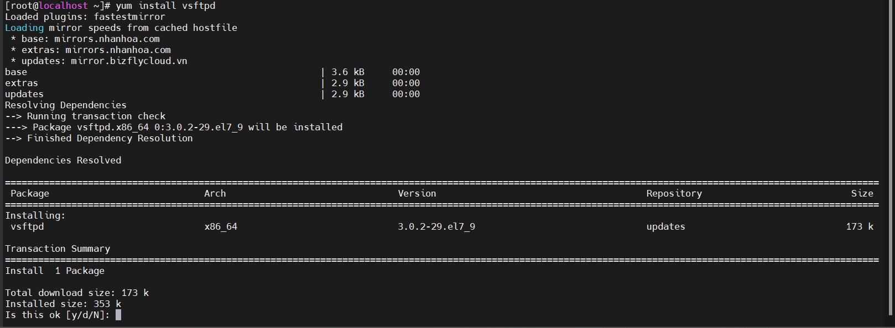
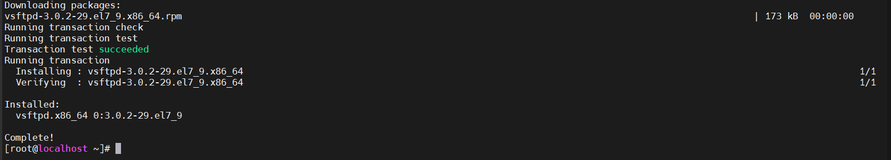
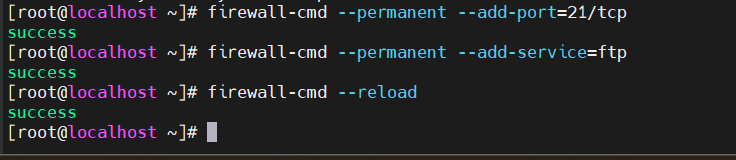
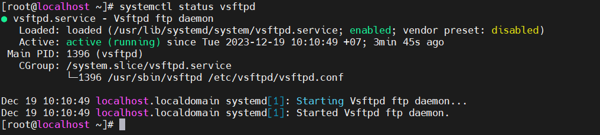
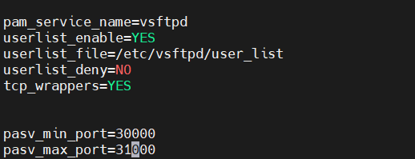
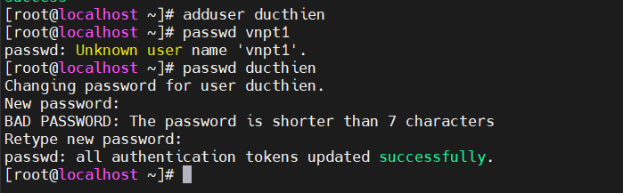
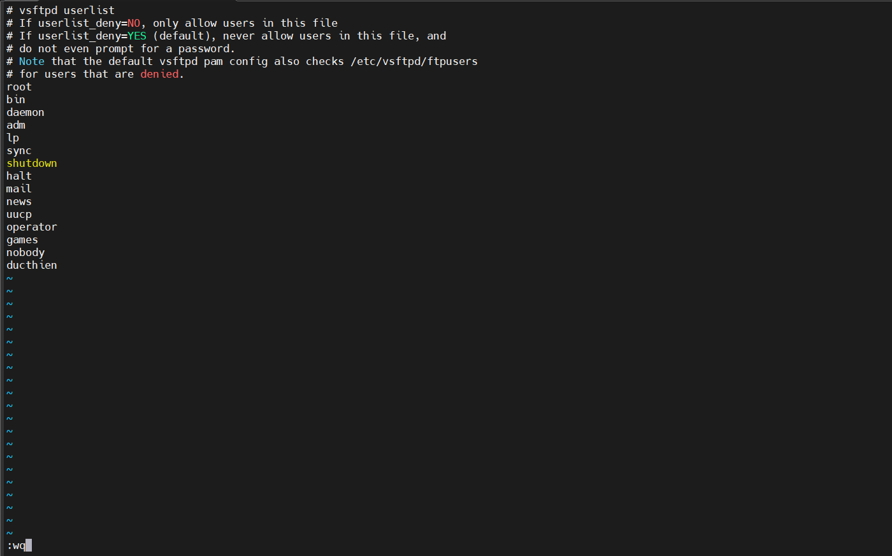
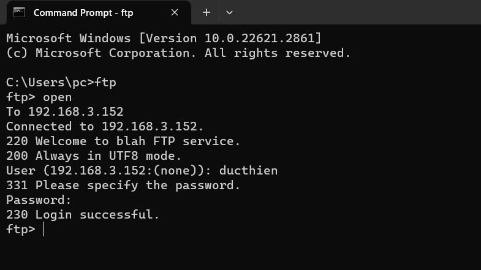
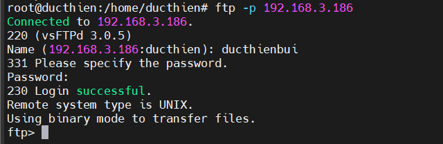
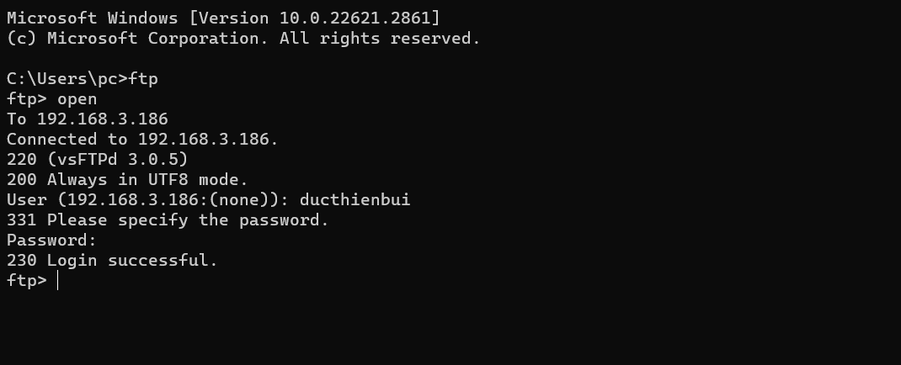

# CẤU HÌNH FTP Server TRÊN CentOS-7 VỚI VSFTPD
VSFTPD(Very Secure File Transport Protocol Daemon) là một FTP Server Stand Alone được phân phối bởi Red Hat Enterprise Linux .
Đây là phần mềm để tạo FTP Server với tốc độ nhanh, cấu hình đơn giản.

# 1.Cài đặt FTP Server
## 1.1.Cài đặt VSFTPD

Cài đặt gói `Vsftpd`:

```
# yum install vsftpd
```



Chọn `y` để tiếp tục 



Sau khi quá trình cài đặt hoàn tất, ta khởi động dịch vụ và cho phép nó khởi động cùng hệ thống.

```
# systemctl start vsftpd
# systemctl enable vsftpd
```


Cấu hình tường lửa cho dịch vụ FTP và port 21:

```
# firewall-cmd --permanent --add-port=21/tcp
success

# firewall-cmd --permanent --add-service=ftp
success

# firewall-cmd --reload
success

```


Kiểm tra trạng thái dịch vụ `vsftpd`:



## 1.2.Cấu hình VSFTPD

File cấu hình vsftpd nằm tại : `/etc/vsftpd/vsftpd.conf`
Copy file cấu hình để backup.

```
# cp /etc/vsftpd/vsftpd.conf /etc/vsftpd/vsftpd.conf.backup
```

Chỉnh sửa file cấu hình `vsftpd.conf`:

```
# vi /etc/vsftpd/vsftpd.conf
```

- **FTP Access**: Ta không cho kết nối nặc danh, mà chỉ cho kết nối cục bộ vào FTP server

```
anonymous_enable=NO    // Không cho kết nối nặc danh 
local_enable=YES        // Cho phép kết nối cục bộ
```

- **Enabling uploads**: Cho phép người dùng upload.

```
write_enable=YES        //Cho phép người dùng nội bộ tải lên
```

- **Chroot**: kỹ thuật giữ người dùng trong thư mục của họ, không cho phép. Tại đây ta sẽ chroot tất cả user, ngoại trừ các user trong file /etc/vsftpd/chroot_list


```
chroot_local_user=YES
allow_writeable_chroot=YES
chroot_list_enable=YES
chroot_list_file=/etc/vsftpd/chroot_list

```


- **Login banner FTP server**: banner khi người dùng login vào FTP server.


```
ftpd_banner="Welcome FTP Server"
```


- **Giới hạn cổng kết nối cho FTP thụ động**: Giới hạn khoảng các cổng sử dụng cho FTP passive


```
pasv_min_port=30000
pasv_max_port=31000

```




- **Giới hạn User được phép truy cập vào hệ thống**: Nếu muốn giới hạn các User local được đăng nhập vào hệ thống FTP server. Ta thêm vào các dòng sau. Khi đó, những User có trong file /etc/vsftpd/user_list mới được truy cập vào hệ thống.


```
userlist_enable=YES
userlist_file=/etc/vsftpd/user_list
userlist_deny=NO
```

- **Home directory**: ta có thể chỉ định thư mục home khi người dùng đăng nhập vào hệ thống

```
local_root=<đường_dẫn_thư_mục>
```

- **Thời gian hệ thống**: ta sử dụng thời gian local:

```
use_local_time-YES
```

## 1.3.Khởi động lại dịch vụ và cho phép các cổng FTP passive đi qua tường lửa

```
# systemctl restart vsftpd

# firewall-cmd --permanent --add-port=30000-31000/tcp
success

# firewall-cmd --reload
success
```


# 2.Truy cập FTP Server

Để truy cập FTP server, ta cần 1 tài khoản local và được cấp quyền truy cập vào FTP server.


## 2.1. Tạo user local

Tạo 1 local user là: `ducthien`với mật khẩu là `vnpt1`

```
# adduser ducthien
# passwd ducthien
```

Sau khi thêm xong thì thư mục mặc định của tài khoản này sẽ ở thư mục /home/ducthien/



## 2.2. Cấp quyền truy cập đến FTP server

Ta thêm user `ducthien` vào file `/etc/vsftpd/user_list` để có thể truy cập vào server.




Thêm vào file `/etc/vsftpd/chroot_list `(Nếu bạn sử dụng trong file cấu hình)

Sau đó restart lại dịch vụ `vsftpd`

## 2.3.Truy cập FTP server

Có nhiều cách để có thể truy cập FTP server như :

- lftp trên CentOS-7
- cmd trên Window
- FileZilla trên Window

Truy cập bằng CMD trên Window



# CẤU HÌNH FTP Server TRÊN Ubuntu 20.04 VỚI VSFTPD

# 1.Cài đặt FTP Server
## 1.1.Cài đặt vsfptd

**Cài đặt gói `Vsftpd`:**

```
sudo apt update
sudo apt install vsftpd
```

File cấu hình vsftpd nằm tại : `/etc/vsftpd/vsftpd.conf`
**Copy file cấu hình để backup.**

```
sudo cp /etc/vsftpd.conf /etc/vsftpd.conf.orig
```

**Cấu hình tưởng lửa cho vsftpd**

Bạn cần phải cấu hình UFW (công cụ tường lửa trên Ubuntu 20.04) để mở port cho FTP

Thực hiện mở các port 20 (FTP command port), 21 (FTP data port), 990 (TLS FTP data port) và dải port 35000-40000:

```
sudo ufw allow 20:21/tcp
sudo ufw allow 990/tcp
sudo ufw allow 35000:40000/tcp
sudo ufw status
```

## 1.2.Cấu hình VSFTPD
Tiếp theo bạn cần cấu hình vsftpd bằng cách mở và chỉnh sửa file cấu hình:

```
sudo nano /etc/vsftpd.conf
```

Để giới hạn chỉ cho người dùng nội bộ truy cập vào FTP thì bạn thêm dòng cấu hình sau:

```
anonymous_enable=NO
local_enable=YES
```

Bạn cần cho phép quyền ghi để có thể kích hoạt chức năng upload trên FTP Server. Để làm điều đó, uncomment dòng sau:


```
write_enable=YES
```

Tiếp theo cần giới hạn người dùng chỉ có thể thao tác trên thư mục cụ thể. Để làm điều đó, bạn cần uncomment dòng sau

```
chroot_local_user=YES
allow_writeable_chroot=YES
```

vsftpd có thể sử dụng bất kì port nào cho các kết nối passive FTP. Vi vậy nên chúng ta thực hiện cấu hình minimum port và maximum port với dòng cấu hình sau:

```
pasv_min_port=35000
pasv_max_port=40000
```

Cuối cùng là để giới hạn những người dùng nào có thể đăng nhập vào FTP Server, thêm đoạn cấu hình sau:

```
userlist_enable=YES
userlist_file=/etc/vsftpd.userlist
userlist_deny=NO
```
# 2.Truy cập FTP Server

## 2.1. Tạo user local

**Tạo người dùng mới:**

```
sudo adduser ducthienbui
```
**Tiếp theo bạn cần thêm người dùng mới tạo vào danh sách người dùng của FTP**
```
echo "ducthienbui" | sudo tee -a /etc/vsftpd.userlist
```
## 2.2. Cấp quyền truy cập đến FTP server
**Sau khi thêm vào danh sách, bạn hãy tạo thư mục cho người dùng đó:**

```
sudo mkdir /home/ducthienbui/ftp
sudo chown nobody:nogroup /home/ducthienbui/ftp
sudo chmod a-w /home/ducthienbui/ftp
```

**Sau khi tạo xong thư mục, kiểm tra lại quyền thư mục như sau**
```
sudo ls -al /home/ducthienbui/ftp
```
**Tiếp theo, bạn cần tạo thư mục có quyền write để có thể lưu các file tải lên**

```
sudo mkdir /home/ducthienbui/ftp/upload
sudo chown ducthienbui:ducthienbui /home/ducthienbui/ftp/upload
```
**Lúc đó, thư mục dành cho việc tải lên sẽ có quyền như bên dưới:**

```
sudo ls -al /home/ducthienbui/ftp
```
**Để tiện cho việc test thử, bạn nên tạo một file test.txt ttrong thư mục upload**

```
echo "vsftpd test file" | sudo tee /home/ducthienbui/ftp/upload/test.txt
```

## 2.3.Kiểm tra kết nối FTP

Sau khi cấu hình xong, bạn hãy thử kiểm tra kết nối FTP như sau

```
ftp -p 192.168.3.186
```



Thử truy cập ftp bằng cmd 



như vậy là ta đã cài đặt ftp thành công 


*Tài liệu tham khảo*

[1] [https://news.cloud365.vn/ftp-huong-dan-cau-hinh-ftp-server-tren-centos-7-voi-vsftpd/](https://news.cloud365.vn/ftp-huong-dan-cau-hinh-ftp-server-tren-centos-7-voi-vsftpd/s)

[2] [https://tel4vn.edu.vn/blog/how-to-install-ftp-server-use-vsftpd-with-ssl-tls/](https://tel4vn.edu.vn/blog/how-to-install-ftp-server-use-vsftpd-with-ssl-tls/)