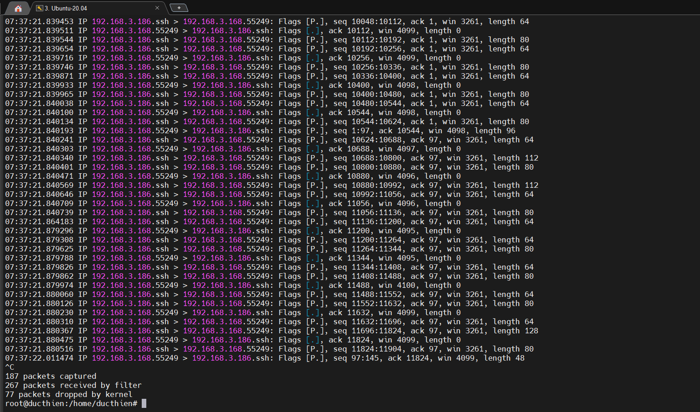
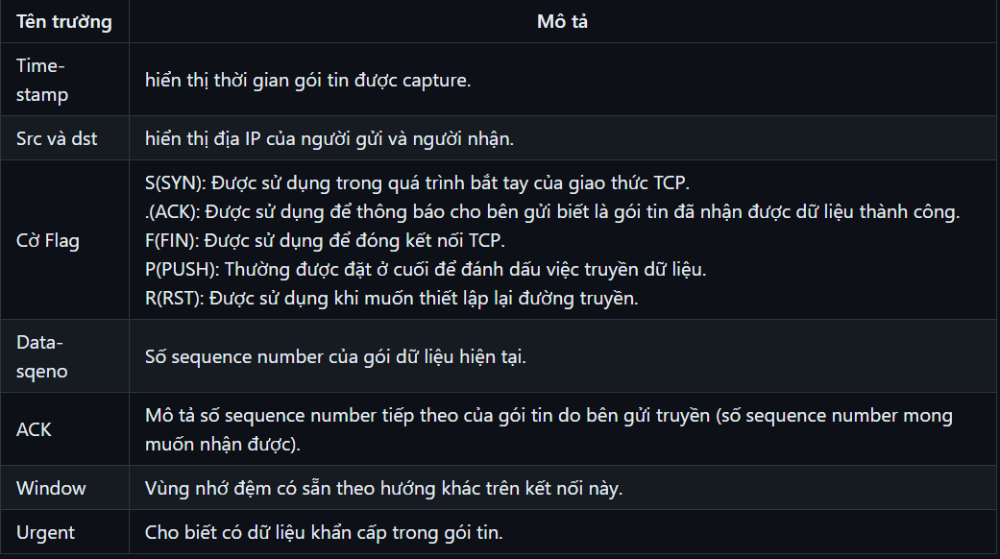
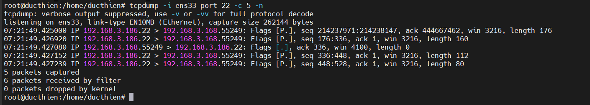
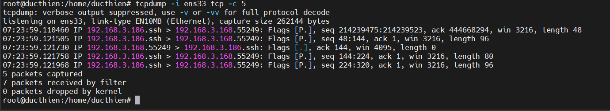
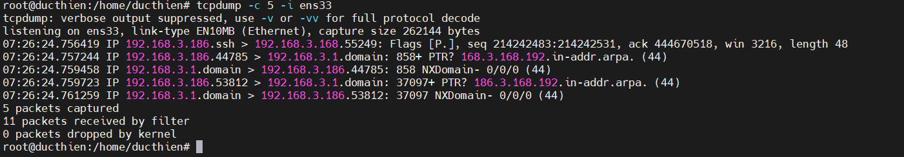
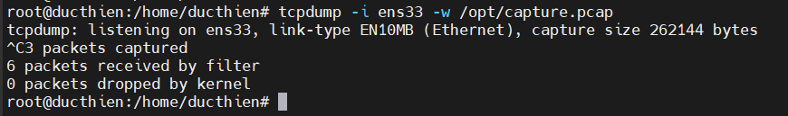
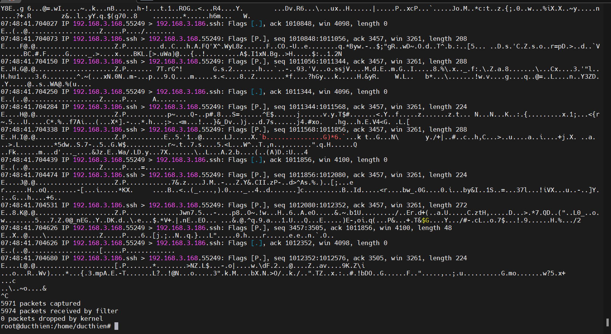
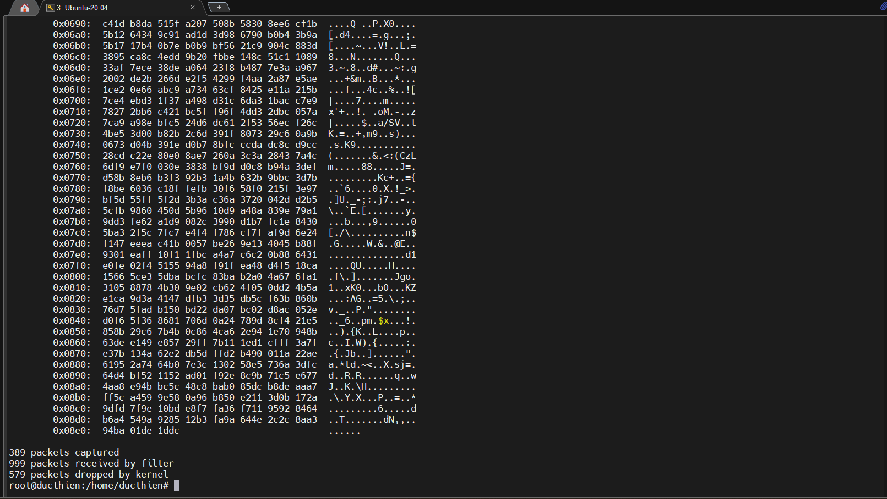

# TÌM HIỂU VỀ TCPDUMP VÀ CÁCH BẮT CÁC GÓI TIN 

# 1.Tcpdump là gì 
## 1.1.Khái niệm
Tcpdump là công cụ hỗ trợ phân tích các gói dữ liệu mạng theo dòng lệnh, cho phép khách hàng chặn và lọc các gói tin TCP/IP được truyền đi hoặc được nhận trên một mạng mà máy tính có tham gia. tcmpdump sẽ lưu lại những gói tin đã bắt được, sau đó dùng để phân tích.

Hiểu đơn giản, Tcmpdump là công cụ dò mạng tìm Netwwork,  có vai trò trong việc gỡ rối và kiểm tra các vấn đề liên quan đến bảo mật và kết nối mạng.

## 1.2.Tcpdump tồn tại ở hình thức nào?

Để lựa chọn gói tin phù hợp với biểu thức logic mà khách hàng nhập vào, tcmpdump sẽ xuất ra màn hình một gói tin chạy trên card mạng mà máy chủ đang lắng nghe.  

Tùy vào các lựa chọn khác nhau khashc hàng có thể xuất mô tả này ra một gói tin thành một file “pcap” để phân tích và có thể đọc nội dung “pcap” đó với option – r của lệnh tcpdump, hoặc sử dụng các phần mềm khác như là : Wireshark.

Đối với những trường hợp không có tùy chọn, lệnh tcpdump sẽ được chạy cho đến khi nhận được một tín hiệu ngắt từ khách hàng. Sau khi kết thúc việc bắt các gói tin, tcmpdump sẽ báo cáo các cột sau:

- Packet capture: số lượng gói tin bắt được và xử lý.
- Packet received by filter: số lượng gói tin được nhận bởi bộ lọc.
- Packet dropped by kernel: số lượng packet đã bị dropped bởi cơ chế bắt gói tin của hệ điều hành

## 1.3.Lợi ích sử dụng Tcpdump
Tcpdump sẽ giúp bạn phân các gói dữ liệu phù hợp với dòng lệnh mang theo, cụ thể:

- Bắt bản tin và lưu bằng định dạng PCAP (có thể đọc bởi wireshark)

- Nhìn thấy trực tiếp các bản tin điều khiển hệ thống Linux sử dụng wireshark, xem chi tiết remote packet capture using Wireshark và tcmpdump 

- Có thể nhìn thấy các bản tin trên DUMP trên terminal

- Tạo các bộ lọc Filter để bắt bản tin cần thiết như : http, ssh, fpt…

- Ngoài ra tcmpdump còn sử dụng nhiều option khác nhau nữa


# 2.Một số lệnh sử dụng Tcpdump cơ bản trên Linux
## 2.1.Cài đặt Tcpdump trên Linux 


Nếu muốn sử dụng được lệnh tcpdump trên Linux bạn phải cài một gói tin như dưới đây: 

- **Ubuntu**
```
sudo apt-get install tcpdump -y
```

- **CentOS**

```
yum install tcpdump -y
```

## 2.2.Một số lệnh cơ bản sử dụng tcmpdump trên Linux 

**Xem các interface đang hoạt động**

- Bắt gói tin trên interface

```
tcpdump -i <INTERFACE>
```


Bấm tổ hợp phím Ctrl + C để dừng.

Sau khi ta dừng, sẽ hiện ra một bảng với các thông số:

***Packet capture***: số lượng gói tin bắt được và xử lý.
***Packet received by filter***: số lượng gói tin được nhận bởi bộ lọc.
***Packet dropped by kernel***: số lượng packet đã bị dropped bởi cơ chế bắt gói tin của hệ điều hành.

Định dạng chung của một dòng giao thức tcpdump là:

```
time-stamp src > dst:  flags  data-seqno  ack  window urgent options
```



- Bắt các gói theo port

```
tcpdump -i ens33 port 22 -c 5 -n
```
( -n: Hiển thị số port thay cho tên giao thức, IP thay cho Hostname)



- Bắt theo các gói TCP giữa hai host

```
 tcpdump -i ens33 tcp -c 5
```



Ngoài ra còn có thể bắt theo  UDP, IMCP,...

- Bắt gói tin với tùy chọn -c
Mặc định, tcmpdump sẽ bắt liên tiếp các gói tin. Thao tác tổ hợp phím Ctrl + C. Nhưng với tùy chọn -c, chúng ta có thể chỉ cho tcpdump biết là "Tôi chỉ muốn bắt n gói."

n - là số gói tin cần bắt

Cú pháp như sau:`tcpdump -c n -i enp0s3`



- Đọc các gói tin nhỏ hơn N byte
Bạn có thể chỉ nhận những gói tin nhỏ hơn N byte thông qua bộ lọc “less”.
```
 tcpdump -w l_1024.pcap  less 1024
```

- Lưu file .pcap (Wireshark)

```
tcpdump -i ens33 -w /opt/capture.pcap
```


- Hiển thị các gói tin được bắt trong hệ ASCII thông qua Tcpdump -A

```
tcpdump -A -i ens33
```



- Hiển thị các gói tin được bắt dưới dạng HEX và ASCII thông qua Tcpdump -XX

```
tcpdump -XX -i ens33
```



- Đọc các gói tin từ một file thông qua Tcmpdump -r


*Tài liệu tham khảo*

[1] [https://nhanhoa.com/tin-tuc/tcpdump-la-gi.html](https://nhanhoa.com/tin-tuc/tcpdump-la-gi.html)

[2] [https://github.com/hoangdh/tcpdump](https://github.com/hoangdh/tcpdump)