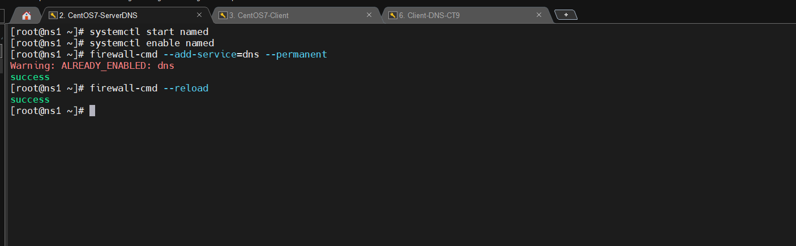

# Triển khai mô hình DNS Server trên Centos7

**Mô hình LAB**

`Máy chủ DNS chính:`

Hệ điều hành: CentOS 7 Minimal Server.
Tên máy chủ: ds1.ducthien.com
Địa chỉ IP: 192.168.3.211/24.


`Máy khách:`

Hệ điều hành: CentOS 7 Minimal Server.
Tên máy chủ: client.ducthien.com
Địa chỉ IP: 192.168.3.223/24.
## 1.Trên server
**1.Thay đổi tên máy chủ DNS Server**

```
hostnamectl set-hostname client.ducthien.com

```


**2.Disable SELINUX**
Ta truy cập file config của SELINUX và đổi thành disable

```
vi /etc/selinux/config
```


**3.Cài đặt DNS Server trên ds1**
```
yum install bind bind-utils -y

```

**4.Cấu hình tập tin named.conf**
Tiến hành copy backup file cấu hình

```
cp /etc/named.conf /etc/named.bak
```


Chỉnh sửa tập tin cấu hình của `Bind '/etc/named.conf'.`

```
vi /etc/named.conf
```
Ta sẽ thêm địa chỉ ip dns server sau dòng `listen-on port 53 { 127.0.0.1;`
Thêm dòng `forwarders {8.8.8.8;8.8.4.4;};`
Thêm dải mạng ở dòng `allow-query     { localhost;192.168.3.0/24; };`
Sau khi thêm sẽ được như hình dưới 


Xuống cuối file thêm `Foward Zone` 

```
#Forward Zone
zone "ducthien.com" IN {
type master;
file "ducthien.com.fwd";
allow-update {none;} ;
};
```

và `Reverse Zone`

```
#Reverses Zone
zone"3.168.192.in-addr.arpa" IN {
type master;
file "ducthien.com.rev";
allow-update {none;};
};
```


**Trong đó:**

- `type`: Quy định vai trò của server cho một zone(khu vực) cụ thể. Thuộc tính master cho biết đây là 1 server có thẩm quyền.
- `file`: chứa thông tin về file forward / reverse zone của domain.
- `allow-update`: Thuộc tính này xác định các host system có được phép chuyển tiếp cập nhật DNS động. Trong trường hợp này không.

**5.Tạo tập tin Forward.ducthien.com và Reverse.ducthien.com**
Ta tạo file Forward.ducthien.com 
`vi /var/named/ducthien.com.fwd`

Sau đó thêm nội dung phía dưới 
```
$TTL 86400
@ IN SOA ds1.ducthien.com. root.ducthien.com. (
                                      2020030500 ;Serial
                                      3600 ;Refresh
                                      1800 ;Retry
                                      604800 ;Expire
                                      86400 ;Minimum TTL
)

;Name Server Information
@ IN NS ds1.ducthien.com.

;IP Address for Name Server
ds1 IN A 192.168.3.211

;Mail Server MX (Mail exchanger) Record
ducthien.com. IN MX 10 mail.ducthien.com.

;A Record for the following Host name
www  IN   A   192.168.3.213
mail IN   A   192.168.3.214

;CNAME Record
ftp  IN   CNAME www.ducthien.com.

```


Ta tạo file Reverse.ducthien.com
`vi /var/named/ducthien.com.rev`

Sau đó thêm nội dung phía dưới
```
$TTL 86400
@ IN SOA ds1.ducthien.com. root.ducthien.com. (
                                2020030500 ;Serial
                                3600 ;Refresh
                                1800 ;Retry
                                604800 ;Expire
                                86400 ;Minimum TTL
)
;Name Server Information
@ IN NS ds1.ducthien.com.
ds1     IN      A       192.168.3.211

;Reverse lookup for Name Server
211 IN PTR ds1.ducthien.com.

;PTR Record IP address to Hostname
213      IN      PTR     www.ducthien.com
214      IN      PTR     mail.ducthien.com


```


**Trong đó:**

- `TTL`: là viết tắt của Time-To-Live là khoảng thời gian(hoặc hops) mà gói tin tồn tại trên mạng trước khi bị router loại bỏ.
- `IN`: là Internet
- `SOA`: là viết tắt của Start of Authority. Về cơ bản nó xác định name server có thẩm quyền, trong trường hợp này là dns-server.ducthien.com và thông tin liên lạc - admin.ducthien.com
- `NS`: là viết tắt của Name Server
- `A`: là bản ghi A. Nó trỏ 1 domain/subdomain tới địa chỉ IP
- `Serial`: áp dụng cho mọi dữ liệu trong zone và có định dạng YYYYMMDDNN với YYYY là năm, MM là tháng, DD là ngày, NN là số lần sửa đổi dữ liệu zone trong ngày. Luôn luôn phải tăng số này lên mỗi lần sửa đổi dữ liệu zone. Khi Slave DNS Server liên lạc với Master DNS Server, trước tiên nó sẽ hỏi số serial. Nếu số serial của Slave nhỏ hơn số serial của máy Master tức là dữ liệu zone trên Slave đã cũ và sau đó Slave sẽ sao chép dữ liệu mới từ Master thay cho dữ liệu đang có.
- `Refresh`: chỉ ra khoảng thời gian Slave DNS Server kiểm tra dữ liệu zone trên Master để cập nhật nếu cần. Giá trị này thay đổi tùy theo tuần suất thay đổi dữ liệu trong zone.
- `Retry`: nếu Slave DNS Server không kết nối được với Master DNS Server theo thời hạn mô tả trong refresh (ví dụ Master DNS Server bị shutdown vào lúc đó thì Slave DNS Server phải tìm cách kết nối lại với Master DNS Server theo một chu kỳ thời gian mô tả trong retry. Thông thường, giá trị này nhỏ hơn giá trị refresh).
- `Expire`: nếu sau khoảng thời gian này mà Slave DNS Server không kết nối được với Master DNS Server thì dữ liệu zone trên Slave sẽ bị quá hạn. Khi dữ liệu trên Slave bị quá hạn thì máy chủ này sẽ không trả lời mỗi truy vấn về zone này nữa. Giá trị expire này phải lớn hơn giá trị refresh và giá trị retry.
- `Minimum TTL`: chịu trách nhiệm thiết lập TTL tối thiểu cho 1 zone
- `MX`: đây là bản ghi Mail exchanger. Nó chỉ định server nhận và gửi mail
- `CNAME`: Là viết tắt của Canonical Name - tên miền chính. Nó sẽ map alias domain(tên miền phụ) tới tên miền khác.
- `PTR`: là viết tắt của Pointer. Thuộc tính này phân giải địa chỉ IP thành domain.

**6.Phân quyền cho 2 file vừa tạo**

```
chgrp named /var/named/ducthien.com.fwd
chgrp named /var/named/ducthien.com.rev
```

**7.Kiểm tra các file DNS zone lookup có gặp lỗi không, sử dụng các câu lệnh**
```
  named-checkconf
  named-checkzone ducthien.com /var/named/ducthien.com.db
  named-checkzone 192.168.3.211 /var/named/ducthien.com.rev
```


**8.Khởi động dịch vụ và cấu hình firewall**

Ta dùng lệnh sau 
```
systemctl enable named
systemctl start named
firewall-cmd --add-service=dns --permanent
firewall-cmd --reload
```



## 2.Trên client
**1.Thêm DNS server**

Chỉnh sửa file `vi /etc/resolv.conf` thêm vào nameserver vừa cấu hình

```
nameserver 192.168.3.211
```


Chỉnh sửa file cấu hình interface card mạng `vi /etc/sysconfig/network-scripts/ifcfg-eth0`. Trỏ DNS đến địa chỉ DNS server ta cấu hình bên trên

```
DNS1=192.168.3.211
```


Restart network

```
systemctl restart NetworkManager
```

**2.Kiểm tra hoạt động của Bind DNS server**

Cài đặt gói `bind-utils` để sử dụng lệnh `nslookup` và `dig`

```
yum install -y bind-utils
```


Kiểm tra bằng cách sử dụng các câu lệnh sau

```
nslookup ds1.ducthien.com
nslookup mail.ducthien.com
nslookup www.ducthien.com
nslookup ftp.ducthien.com
```


```
nslookup 10.10.34.161
```


Để chi tiết hơn, ta sử dụng lệnh `dig`.

```
dig www.ducthien.com
```


```
dig -x 192.168.3.211
```


*Tài liệu tham khảo*

[1] [https://news.cloud365.vn/dns-cau-hinh-dns-server-tren-centos-8/](https://news.cloud365.vn/dns-cau-hinh-dns-server-tren-centos-8/)
[2] [https://blog.cloud365.vn/linux/dns-bind-install/](https://blog.cloud365.vn/linux/dns-bind-install/)


# Triển khai mô hình DNS Server trên Ubuntu 20.04

**Mô hình LAB**

`Máy chủ DNS chính:`

Hệ điều hành: Ubuntu 20.04 Minimal Server.
Tên máy chủ: ds.ducthien.com
Địa chỉ IP: 192.168.3.186/24.


`Máy khách:`

Hệ điều hành: Ubuntu 20.04 Minimal Server.
Tên máy chủ: client.ducthien.com
Địa chỉ IP: 192.168.3.228/24.
## 1.Trên server
**1.Thay đổi tên máy chủ DNS Server**

```
hostnamectl set-hostname ds.ducthien.com

```
**2.Cài đặt DNS Server trên ds**
```
apt install bind9 bind9utils bind9-doc

```

Hãy thiết lập BIND sang chế độ IPv4

```
sudo nano /etc/default/named
```

Thêm `-4` vào cuối của dòng OPTIONS:


Khởi động lại BIND để áp dụng các thay đổi:

```
sudo systemctl restart bind9
```
**3.Cấu hình server DNS**
*Cấu hình tệp Options*

Trên server ds, mở file named.conf.options

```
vi /etc/bind/named.conf.options
```

Ở trên khối options, hãy tạo mới một khối ACL với tên trusted như dưới hình 

```
acl "trusted" {
        192.168.3.186;    # ds 
        192.168.3.228;    # client
};

options {
```


Bây giờ bạn đã có danh sách server DNS tin cậy, giờ thì hãy chỉnh sửa khối options:

```
options {
        directory "/var/cache/bind";
        
        recursion yes;                 # enables recursive queries
        allow-recursion { trusted; };  # allows recursive queries from "trusted" clients
        listen-on { 192.168.3.186; };   # ds private IP address - listen on private network only
        allow-transfer { none; };      # disable zone transfers by default

        forwarders {
                8.8.8.8;
                8.8.4.4;
        };

};
```


*Cấu hình tệp Local*

Trong ds, mở tệp named.conf.local để chỉnh sửa:

```
sudo nano /etc/bind/named.conf.local
```
Ngoại trừ một vài comments, tệp này sẽ trống. Ở đây bạn sẽ chỉ định các forward zones và reverse zones của mình


```
zone "ds.ducthien.com" {
    type primary;
    file "/etc/bind/zones/ds.ducthien.com.db"; # zone file path
};
zone "3.168.192.in-addr.arpa" {
     type master;
     file "/etc/bind/zones/rev.3.168.192.in-addr.arpa";
};
```


**4.Khởi tạo forward zone file**
Tạo một thư mục nơi chứa các zone file. Theo như tệp cấu hình named.conf.local, ví trí của zone file sẽ là `/etc/bind/zones:`

```
sudo mkdir /etc/bind/zones
```

Bạn sẽ dựa trên forward zone file tại mẫu db.local. Sao chép nó đến vị trí đúng bằng các lệnh sau:

```
sudo cp /etc/bind/db.local /etc/bind/zones/db.ds.ducthien.com
```

Tiếp đến, hãy chỉnh sửa forward zone file:

```
sudo nano /etc/bind/zones/db.ds.ducthien.com
```
Đây là file cấu hình defaul 


Ta sẽ sửa lại như dưới hình 


**5.Khởi tạo reverse zone file**

Tạo một reverse zone file.

```
sudo cp /etc/bind/db.127 /etc/bind/zones/db.192.168
```

Chỉnh sửa reverse zone file tương ứng với các reverse zones được xác định trong tệp `named.conf.local:`

```
sudo nano /etc/bind/zones/db.192.168
```

File mặc định sẽ như dưới hình 


Sau khi sửa file sẽ như dưới hình


**6.Kiểm tra cú pháp cấu hình BIND**

```
sudo named-checkconf
```
Lệnh `named-checkzone` có thể được sử dụng để kiểm tra tính chính xác của các zone file. Đối số đầu tiên chỉ định tên zone, và đối số thứ hai chỉ định zone file tương ứng, hai đối số này đều được xác định trong tệp named.conf.local.
Ví dụ, để kiểm tra cấu hình forward zone ds.ducthien.com, hãy chạy lệnh sau

```
sudo named-checkzone ds.ducthien.com /etc/bind/zones/db.ds.ducthien.com
```

Để kiểm tra cấu hình reverse zone 128.10.in-addr.arpa, hãy chạy lệnh sau

```
sudo named-checkzone 168.192.in-addr.arpa /etc/bind/zones/db.192.168

```


**7.Khởi động lại BIND**


Để khởi động lại BIND, thực hiện lệnh sau:

```
sudo systemctl restart bind9
```

## 2.Trên client

Tạo một tệp mới trong /etc/netplan gọi là 00-private-nameservers.yaml:

```
sudo nano /etc/netplan/00-private-nameservers.yaml
```

Ta sửa file như hình dưới 


Tiếp theo, cho Netplan sử dụng tệp cấu hình mới bằng cách sử dụng lệnh netplan try. Nếu có vấn đề gây mất kết nối mạng, Netplan sẽ tự động hoàn tác các thay đổi sau một khoảng thời gian chờ đợi:

