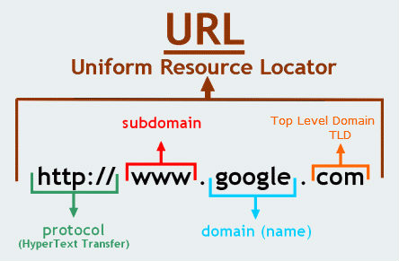
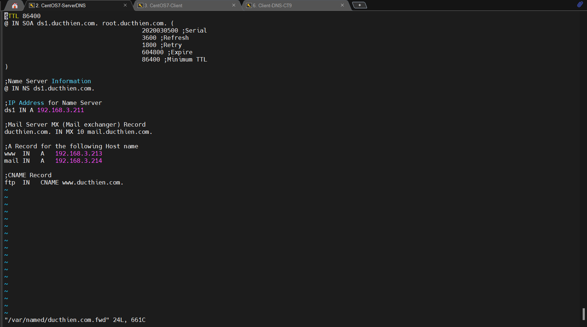

# TÌM HIỂU VỀ DNS
# 1.DNS là gì
## 1.1.Khái niệm
DNS (Domain Name System) – hệ thống tên miền – là một hệ thống cho phép thiết lập tương ứng giữa địa chỉ IP và tên miền trên Internet.
Toàn bộ máy tính trên Internet, từ smart phone, laptop, PC đến các server phục vụ các service như websites, mail,.. đều giao tiếp với nhau thông qua địa chỉ IP. Tuy nhiên, địa chỉ IP này đối với các website có thể khác nhau và khó ghi nhớ đối với người dùng.
Hệ thống DNS nắm vai trò như một cuốn “danh bạ” để đối chiếu với tên miền và trả lại cho người dùng IP của máy chủ.


Địa chỉ IP của một tên miền cụ thể có thể kiểm tra thông qua việc sử dụng lệnh ping trong cmd (Windows):\


Trong ví dụ, tên miền google.com có IP là 8.8.8.8

## 1.2.Tên miền


- Tên miền gốc (root domain): Nó là đỉnh của nhánh cây của tên miền. Nó có thể biểu diễn đơn giản chỉ là dấu chấm “.”
- Tên miền cấp cao nhất - Top-level domain (TLD) : Top-level domain nằm ở đầu phân cấp về tên miền. ICANN (Internet Corporation for Assigned Names and Numbers) là tổ chức được cấp quyền kiểm soát quản lý đối với các tên miền cấp cao nhất. Sau đó có thể phân phối tên miền bên dưới TLD, thường thông qua một công ty đăng ký tên miền (domain registrar). Top-level domain là phần xa nhất ở bên phải (được phân tách bằng dấu chấm). Các tên miền cấp cao phổ biến là “com”, “net”, “org”, “gov”, “edu”,..
  - Com: Tên miền này được dùng cho các tổ chức thương mại.
  - Edu: Tên miền này được dùng cho các cơ quan giáo dục, trường học.
  - Net: Tên miền này được dùng cho các tổ chức mạng lớn.
  - Gov: Tên miền này được dùng cho các tổ chức chính phủ.
  - Org: Tên miền này được dùng cho các tổ chức khác.
  - Info: Tên miền này dùng cho việc phục vụ thông tin.

- Host : Với tên miền, chủ sở hữu có thể tham chiếu đến các máy tính hoặc dịch vụ riêng biệt. Chẳng hạn, hầu hết chủ sở hữu tên miền làm cho máy chủ web của họ có thể truy cập được thông qua tên miền (cloud365.vn) và cũng thông qua định nghĩa “máy chủ” “www” (www.cloud365.vn).
- Tên miền con (Subdomain) : DNS hoạt động theo thứ bậc. TLD có thể có nhiều tên miền bên dưới. Chẳng hạn, TLD “com” có cả “google.com” và “nhanhoa.com” bên dưới nó. “Tên miền con” là tên miền thuộc một phần của tên miền lớn hơn. Trong trường hợp này, “nhanhoa.com” có thể được coi là tên miền con của “com”. Phần “nhanhoa” được gọi là SLD (second level domain), có nghĩa là tên miền cấp hai.



## 1.3.Chức năng của DNS

- Tất cả các thiết bị trên Internet có thể giao tiếp được với nhau là nhờ có địa chỉ IP(IPv4 và IPv6). Khi bạn muốn truy cập vào 1 trang web như facebook.com, github.com, dantri.com.vn,… thì bản chất thực sự của nó là truy cập vào địa chỉ IP của server chứa dữ liệu của các trang web này. Tuy nhiên không phải ai cũng có thể nhớ được đúng và nhớ được hết địa chỉ IP của các trang web, từ đó DNS đã xuất hiện.
- DNS đóng vai trò như 1 người phiên dịch, dịch giữa địa chỉ IP và tên miền chứ không có tác dụng thay thế hoàn toàn cho địa chỉ IP. Bạn cũng có thể tải 1 website bằng cách nhập trực tiếp địa chỉ IP thay vì dùng tên miền nếu bạn biết và nhớ địa chỉ IP của trang web đó. Ví dụ, khi bạn gõ “www.google.com” vào trình duyệt, máy chủ DNS sẽ lấy địa chỉ IP của máy chủ Google là “74.125.236.37”. Sau đó, bạn sẽ nhìn thấy trang chủ Google tải trang trên trình duyệt. Đó là quá trình phân giải DNS.
- Mỗi DNS còn có chức năng ghi nhớ những tên miền mà nó đã phân giải và ưu tiên sử dụng cho những lần truy cập sau.
- Nhờ DNS, bạn có thể sử dụng nhiều dịch vụ mạng như tìm kiếm thông tin, xem phim, chơi game, đăng nhập các website,…Có thể nói nếu không có DNS, con người không thể duyệt Internet nhanh chóng và dễ dàng như ngày nay.

## 1.4.Các thành phần của DNS
Dịch vụ DNS bao gồm 4 thành phần:

- DNS Cache
- Resolvers
- Name servers
- Name space

1. DNS cache

Thuật ngữ này thường bị nhầm lẫn do nó có ít nhất 2 ý nghĩa. Đầu tiên DNS Cache có thể là danh sách tên và địa chỉ IP mà bạn đã truy vấn và đã được giải quyết và được lưu vào bộ nhớ cache để không có lưu lượng truy cập mạng được tạo ra và truy cập nhanh hơn. Ý nghĩa thứ hai liên quan đến một DNS Server chỉ đơn giản là thực hiện các truy vấn đệ quy và bộ đệm ẩn mà không thực sự là một máy chủ có thẩm

2. Resolvers

Là bất kỳ host nào trên Internet cần dùng để tra cứu thông tin tên miền, giống như thiết bị bạn đang sử dụng để đọc trang web này.

3. Name servers

Những server này chứa cơ sở dữ liệu về tên và địa chỉ IP và phục vụ các yêu cầu DNS cho client.

4. Name space

Là cơ sở dữ liệu về địa chỉ IP và các tên liên quan của chúng.


# 2.Các loại DNS Servers

- `Primary DNS servers`: chứa các file cấu hình tên miền và phản hồi các truy vấn DNS
- `Secondary DNS server`: làm việc như một backup và load balancer server. Các Primary DNS server biết sự tồn tại của Secondary DNS server và sẽ gửi các bản cập nhật cho chúng.
- `Caching DNS server`: làm nhiệm vụ lưu trữ các phản hồi DNS nhờ vậy bạn sẽ không cần hỏi lại Primary DNS server trong lần thứ 2 truy cập vào website.

# 3.Cách hoạt động của DNS


Ví dụ bạn muốn truy cập vào google.com

1. Yêu cầu tìm kiếm địa chỉ IP ứng với tên miền google.com sẽ được gửi từ máy người dùng tới Name server cục bộ 
2. Máy chủ domain cục bộ sẽ tìm kiếm trong kho dữ liệu xem có cơ sở dữ liệu chuyển đổi từ tên miền sang địa chỉ IP của domain mà người dùng yêu cầu hay không .Nếu có thì cơ sở dữ liệu sẽ được gửi trả lại địa chỉ IP của máy có tên miền đó
3. Nếu không có cơ sở dữ liệu về domain yêu cầu , máy chủ tên miền cục bộ sẽ hỏi các máy chủ tên miền ở mức cao nhất (ROOT). Máy chỉ domain mức cao nhât (mức ROOT) sẽ chỉ cho máy chủ domain cục bộ mà nó quản lý có đuôi .com
4. Máy chủ doamin cục bộ gửi yêu cầu đến máy chủ quản lý domain ".com" - domain tổ chức thương mại để tìm tên Google.com
5. Máy chủ domain cục bộ hỏi máy chủ quản lý domain ".com" địa chỉ IP domain "google.com" => có => gửi trả 
6. Máy chủ domain cục bộ chuyển thông tin đến máy của người dùng 
7. Người dùng sẽ dùng địa chỉ IP này kết nối đến máy chủ chứ website có địa chỉ google.com


# 4.Các loại bản ghi trên DNS
## 4.1. SOA (Start of Authority)
Trong mỗi tập tin cơ sở dữ liệu DNS phải có một và chỉ một bản ghi SOA (Start of Authority). Bao gồm các thông tin về domain trên DNS Server, thông tin về zone transfer.



- `ds1.ducthien.com.` giá trị DNS chính của tên miền hoặc máy chủ.
- `root.ducthien.com.` chuyển đổi từ dạng admin@ducthien.com, thể hiện chủ thể sở hữu tên miền này.

  - `Serial` : áp dụng cho mọi dữ liệu trong zone và có định dạng `YYYYMMDDNN` với YYYY là năm, MM là tháng, DD là ngày, NN là số lần sửa đổi dữ liệu zone trong ngày. Luôn luôn phải tăng số này lên mỗi lần sửa đổi dữ liệu zone. Khi máy chủ Secondary liên lạc với máy chủ Primary, trước tiên nó sẽ hỏi số serial. Nếu số serial của máy Secondary nhỏ hơn số serial của máy Primary tức là dữ liệu zone trên Secondary đã cũ và sao đó máy Secondary sẽ sao chép dữ liệu mới từ máy Primary thay cho dữ liệu đang có.

  - `Refresh` : chỉ ra khoảng thời gian máy chủ Secondary kiểm tra sữ liệu zone trên máy Primary để cập nhật nếu cần. Giá trị này thay đổi tùy theo tuần suất thay đổi dữ liệu trong zone.

  - `Retry` : nếu máy chủ Secondary không kết nối được với máy chủ Primary theo thời hạn mô tả trong `refresh` (ví dụ máy chủ Primary bị shutdown vào lúc đó thì máy chủ Secondary phải tìm cách kết nối lại với máy chủ Primary theo một chu kỳ thời gian mô tả trong `retry`. Thông thường, giá trị này nhỏ hơn giá trị `refresh`).

  - `Expire` : nếu sau khoảng thời gian này mà máy chủ Secondary không kết nối được với máy chủ Primary thì dữ liệu zone trên máy Secondary sẽ bị quá hạn. Khi dữ liệu trên Secondary bị quá hạn thì máy chủ này sẽ không trả lời mỗi truy vấn về zone này nữa. Giá trị `expire` này phải lớn hơn giá trị `refresh` và giá trị `retry`.

  - `TTL` (time to live) : giá trị này áp dụng cho mọi record trong zone và được đính kèm trong thông tin trả lời một truy vấn. Mục đích của nó là chỉ ra thời gian mà các máy chủ name server khác cache lại thông tin trả lời.

## 4.2. NS (Name Server)

Record tiếp theo cần có trong zone là NS (name server) record. Mỗi name server cho zone sẽ có một NS record. Chứa địa chỉ IP của DNS Server cùng với các thông tin về domain đó.
*Ví dụ*
```
@ IN NS ds1.ducthien.com.
```


## 4.3. Record A

Là một record căn bản và quan trọng, dùng để ánh xạ từ một domain thành địa chỉ IP cho phép có thể truy cập website. Đây là chức năng cốt lõi của hệ thống DNS. Record A có dạng như sau:

```
ds1     IN      A       192.168.3.211
```

## 4.4. Record AAAA

Có nhiệm vụ tương tự như bản ghi A, nhưng thay vì địa chỉ IPv4 sẽ là địa chỉ IPv6.

## 4.5. Record PTR

Hệ thống tên miền thông thường cho phép chuyển đổi từ tên miền sang địa chỉ IP. Trong thực tế, một số dịch vụ Internet đòi hỏi hệ thống máy chủ DNS phải có chức năng chuyển đổi từ địa chỉ IP sang tên miền. Tên miền ngược thường được sử dụng trong một số trường hợp xác thực email gửi đi.

Ví dụ về dạng thức một bản ghi PTR như sau:

```
211.3.168.192.in-addr.arpa       IN PTR     ds1.ducthien.com. 
```

## 4.6. Record SRV

Bản ghi SRV được sử dụng để xác định vị trí các dịch vụ đặc biệt trong 1 domain, ví dụ tên máy chủ và số cổng của các máy chủ cho các dịch vụ được chỉ định. Ví dụ:
```
_ldap._tcp.example.com. 3600  IN  SRV  10  0  389  ldap01.example.com.
```

Một Client trong trường hợp này có thể nhờ DNS nhận ra rằng, trong tên miền example.com có LDAP Server ldap01, mà có thể liên lạc qua cổng TCP Port 389 .

- Các trường trong record SRV 
  - Tên dịch vụ service.
  - Giao thức sử dụng.
  - Tên miền (domain name).
  - TL: Thời gian RR được giữ trong cache
  - Class: standard DNS class, luôn là IN
  - Ưu tiên: ưu tiên của host, số càng nhỏ càng ưu tiên.
  - Trọng lượng: khi cùng bực ưu tiên, thì trọng lượng 3 so với trọng lượng 2 sẽ được lựa chọn 60% (hỗ trợ load balancing).
  - Port của dịch vụ (tcp hay udp).
  - Target chỉ định FQDN cho host hỗ trợ dịch vụ.


## 4.7. Record CNAME (Canonical Name)
Cho phép tên miền có nhiều bí danh khác nhau, khi truy cập các bí danh sẽ cũng về một địa chỉ tên miền. Để sử dụng bản ghi CNAME cần khai báo bản ghi A trước. Ví dụ bản ghi CNAME phổ biến nhất:

```
www   CNAME   example.com

mail CNAME example.com

example.com   A   192.168.3.186
```

Khi một yêu cầu đến địa chỉ www.example.com thì DNS sẽ tìm đến example thông qua bản ghi CNAME, một truy vấn DNS mới sẽ tiếp tục tìm đến địa chỉ IP: 103.101.161.201 thông qua bản ghi A.

## 4.8. Record MX
Bản ghi MX có tác dụng xác định, chuyển thư đến domain hoặc subdomain đích. Bản ghi MX có dạng

```
example.com    MX    10    mail.example.com.
mail.example.com    A    192.168.3.186
```
Độ ưu tiền càng cao thì số càng thấp.

```
example.com MX 10 mail_1.example.com
example.com MX 20 mail_2.example.com
example.com MX 30 mail_3.example.com
```

Bản ghi MX không nhất thiết phải trỏ đến hosting – VPS- Server của người dùng. Nếu người dùng đang sử dụng dịch vụ mail của bên thứ ba như Gmail thì cần sử dụng bản nghi MX do họ cung cấp.


## 4.9. Record TXT

Bản ghi TXT(text) được sử dụng để cung cấp khả năng liên kết văn bản tùy ý với máy chủ. Chủ yếu dùng trong mục đích xác thực máy chủ với tên miền

## 4.10. Record DKIM

Là bản ghi dùng để xác thực người gửi bằng cách mã hóa một phần email gửi bằng một chuỗi ký tự, xem như là chữ ký.

Khi email được gửi đi máy chủ mail sẽ kiểm so sánh với thông tin bản ghi đã được cấu hình trong DNS để xác nhận. Bản ghi DKIM có dạng:

```
  mail._domainkey.cloud365.vn     TXT  k=rsa;p=MIIBIjANBgkqhkiG9w0BA
```

## 4.11. Record SPF

Record SPF được tạo ra nhầm đảm bảo các máy chủ mail sẽ chấp nhận mail từ tên miền của khách hàng chỉ được gửi đi từ server của khách hàng. Sẽ giúp chống spam và giả mạo email. Bản ghi SPF thể hiện dưới dạng:

```
cloud365.vn   SPF     "v=spf1 ip4:103.101.162.0/24 -all" 3600
```

Tùy vào hệ thống DNS mà có thể hiển thị bản ghi SPF hoặc TXT Với bản ghi SPF, máy chủ tiếp nhận mail sẽ kiểm tra IP của máy chủ gửi và IP của máy chủ đã đăng kí bản ghi SPF example.com. Nếu Khách hàng có nhiều máy chủ mail nên liệt kê tất cả trong bản ghi SPF giúp đảm bảo thư đến được chính xác và đầy đủ.


*Tài liệu tham khảo*

[1] [https://blog.cloud365.vn/linux/dns-introduction/](https://blog.cloud365.vn/linux/dns-introduction/)
[2] [https://news.cloud365.vn/dns-va-cac-khai-niem-lien-quan/](https://news.cloud365.vn/dns-va-cac-khai-niem-lien-quan/)
[3] [https://www.bkns.vn/dns-la-gi.html#DNS_hoat_dong_nhu_the_nao](https://www.bkns.vn/dns-la-gi.html#DNS_hoat_dong_nhu_the_nao)
[4] [https://blog.cloud365.vn/linux/dns-record/](https://blog.cloud365.vn/linux/dns-record/)
[5] [https://news.cloud365.vn/dns-cac-loai-ban-ghi-tren-dns/](https://news.cloud365.vn/dns-cac-loai-ban-ghi-tren-dns/)