# Tìm hiểu về lệnh DIG

DNS là viết tắt của Domain Infomation Groper là một công cụ dòng lệnh quản trị mạng được dùng để truy vấn DNS names server .Với lệnh `dig` , bạn có thể truy vấn thông tin về các bản ghi DNS, bao gôm :*host address* , *mail exchanges*, và *name servers*.Đây là công cụ được các quản trị viên hệ thống sử dụng phổ biến nhất để khắc phục sự cố DNS vì tính linh hoạt và dễ sử dụng của nó . `dig` là một phần của bộ phần mềm BIND DNS .


# 1.Cài đặt Dig trên Linux

- Trên Ubuntu:

```
apt-get install dnsutils
```

- Trên Centos 7

```
yum install bind-utils
```

- Trên Centos 8

```
dns install bind-utils
```

Sau khi cài đặt xong , kiểm tra version của `dig`

```
dig-v
```

Output centos 7

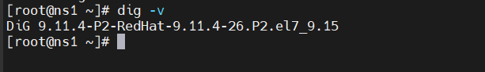

# 2.Cú pháp

- Ở dạng đơn giản nhất , cú pháp của câu lệnh `dig` sẽ có dạng :

```
dig [server] [name] [type]
```
  - `[server]` : Địa chỉ IP hoặc hostname của nameserver sẽ dùng đẻ thực hiện lệnh truy vấn 
    - Nếu bạn cung cấp cho đối số server thông tin về hostname thì nó sẽ giải quyết hostname trước khi tiếp tục truy vấn name server
    - Đây là tùy chọn nên bạn có thể không khai báo ở đây , trong trường hơp không khai báo thì `dig sex lấy thông tin này trong file `/etc/resolv.conf

  - `[name]` : tên của bản ghi resource sẽ được truy vấn.
  - `[type]` : loại truy vấn được yêu cầu bởi dig. Nó có thể là 1 trong số các bản ghi: A, MX, SOA,…Nếu không có bản ghi nào được chỉ định thì dig sẽ mặc định đó là bản ghi A.


# 3. Cách sử dụng câu lệnh DIG

Để tra cứu DNS cho 1 tên miền ta thực hiện dòng lệnh sau 

```
dig google.com
```

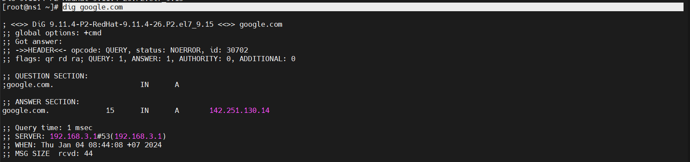

**Giải thích output**

- Dòng đầu tiên của đầu ra hiển thị version đã cài đặt và truy vấn được gọi. Dòng thứ hai hiển thị các tùy chọn(theo mặc định chỉ cmd).

```
; <<>> DiG 9.11.4-P2-RedHat-9.11.4-26.P2.el7_9.15 <<>> google.com
;; global options: +cmd

```

Nếu bạn không muốn những dòng này xuất hiện ở output, có thể sử dụng tùy chọn +nocmd ở ngay sau câu lệnh `dig`

- Phần tiếp theo, dòng đầu tiên của phần này là tiêu đề, bao gồm opcode và trạng thái của hành động. Trong trường hợp này, trạng thái NOERROR có nghĩa là yêu cầu truy vấn truy vấn DNS không gặp lỗi.

```
;; Got answer:
;; ->>HEADER<<- opcode: QUERY, status: NOERROR, id: 30702
;; flags: qr rd ra; QUERY: 1, ANSWER: 1, AUTHORITY: 0, ADDITIONAL: 0

```

Bạn cũng có thể cho phép không hiển thị phần này ở output bằng cách sử dụng tùy chọn +nocomments, đồng thời nó cũng sẽ disable output của 1 vài phần header khác.

- Phần "OPT" được hiển thị theo mặc định chỉ trên các phiên bản mới hơn.

```
;; OPT PSEUDOSECTION:
; EDNS: version: 0, flags:; udp: 512

```

- Phần "QUESTION" là phần mà lệnh dig hiển thị truy vấn của chúng ta. Theo mặc định, dig sẽ yêu cầu bản ghi A.

```
;; QUESTION SECTION:
;google.com.                    IN      A

```

Bạn có thể disable output của phần này bằng cách sử dụng tùy chọn +noquestion

- Phần ANSWER cung cấp cho chúng ta tên miền google.com. trỏ đến địa chỉ IP 142.251.222.206

```
;; ANSWER SECTION:
google.com.             256     IN      A       142.251.222.206

```

Disable phần output này với tùy chọn +noanswer nếu bạn cần.

- Phần "AUTHORITY" nói cho chúng ta biết những server nào là authority để trả lời truy vấn DNS về truy vấn tên miền.

```
;; AUTHORITY SECTION:
 google.com.             172799  IN      NS      ns3.google.com.
 google.com.             172799  IN      NS      ns4.google.com.
 google.com.             172799  IN      NS      ns1.google.com.
 google.com.             172799  IN      NS      ns2.google.com.
```

Disable nó bằng tùy chọn +noauthority

- Phần "ADDITIONAL" cho chúng ta thông tin về địa chỉ IP của các authoritative DNS server

```

 ;; ADDITIONAL SECTION:
 ns2.google.com.         172799  IN      A       216.239.34.10
 ns1.google.com.         172799  IN      A       216.239.32.10
 ns3.google.com.         172799  IN      A       216.239.36.10
 ns4.google.com.         172799  IN      A       216.239.38.10
 ns2.google.com.         172799  IN      AAAA    2001:4860:4802:34::a
 ns1.google.com.         172799  IN      AAAA    2001:4860:4802:32::a
 ns3.google.com.         172799  IN      AAAA    2001:4860:4802:36::a
 ns4.google.com.         172799  IN      AAAA    2001:4860:4802:38::a
```

- Phần cuối của OUTPUT bao gồm các số liệu đầu ra của truy vấn

```
;; Query time: 33 msec
;; SERVER: 192.168.3.1#53(192.168.3.1)
;; WHEN: Thu Jan 04 09:03:10 +07 2024
;; MSG SIZE  rcvd: 55

```

Bạn có thể disable phần này với tùy chọn +nostats


# 4.Sử dụng lệnh dig với các truy vấn ngắn
**Truy vấn lấy địa chỉ IP**

- Sử dụng dig với tùy chọn +short
```
dig google.com +short
```
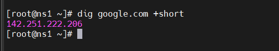

- Để có kết quả chi tiết hơn, bạn có thể sử dụng thêm 2 tùy chọn `+noall` và `+answer`

```
dig google.com +noall +answer
```
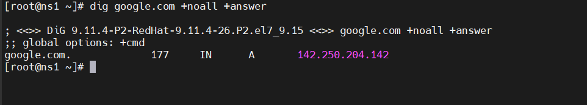

Trong đó:
+noall: tắt tất cả các section
+answer: chỉ mở với secion ANSWER

**Truy vấn với name server cụ thể**
- Theo mặc định nếu khi sử dụng lệnh dig mà không chỉ rõ name server nào thì server sẽ sử dụng name server được khai báo trong file `/etc/resolv.conf`
- Để chỉ định name server mà truy vấn sẽ thực hiện, sử dụng biểu tượng @ + địa chỉ IP/hostname

*Ví dụ: Truy vấn name server Google có địa chỉ là 8.8.8.8 để lấy thông tin về tên miền google.com*

```
dig google.com @8.8.8.8
```
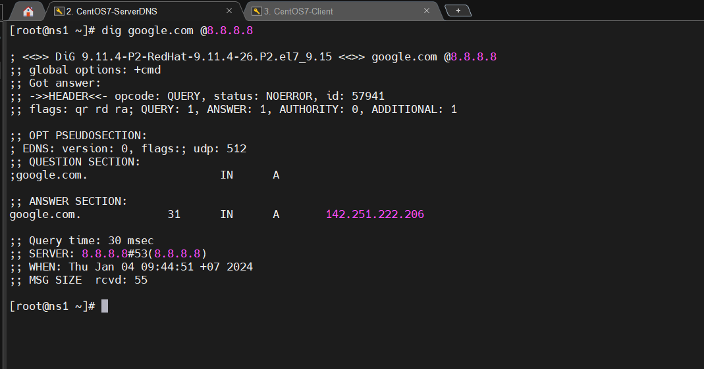


**Truy vấn theo bản ghi**

- Dig cho phép bạn thực hiện bất kỳ truy vấn hợp lệ nào bằng cách nối thêm loại bản ghi vào cuối truy vấn.

1. Truy vấn theo bản ghi A
   - Để có danh sách địa chỉ cho 1 tên miền, sử dụng tùy chọn `a`

```
 dig +nocmd google.com a +noall +answer
```
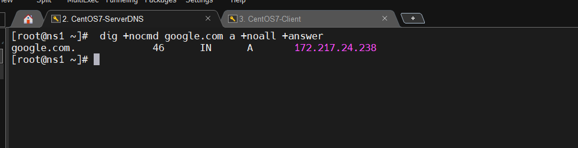

Tuy nhiên bạn cũng có cần sử dụng tùy chọn a vì theo mặc định nếu không có bản ghi nào được chọn, hệ thống sẽ mặc định truy vấn bản ghi A.

2. Truy vấn bản ghi CNAME

- Sử dụng tùy chọn `cname`

```
 dig +nocmd mail.google.com cname +noall +answer
```

3. Truy vấn bản ghi TXT

- Sử dụng tùy chọn txt

```
dig +nocmd google.com txt +noall +answer
```
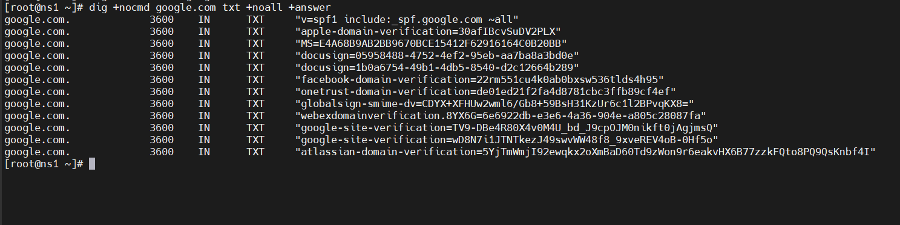

4. Truy vấn bản ghi MX

- Sử dụng tùy chọn mx

```
dig +nocmd google.com mx +noall +answer
```
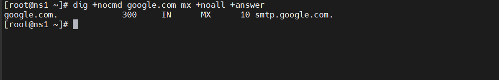

5. Truy vấn bản ghi NS

```
dig +nocmd google.com ns +noall +answer
```
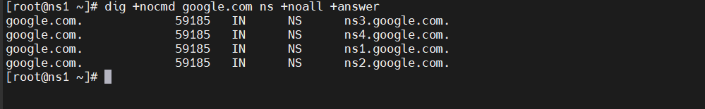

6. Truy vấn bản ghi SOA

- Sử dụng tùy chọn soa

```
dig +nocmd google.com soa +noall +answer
```

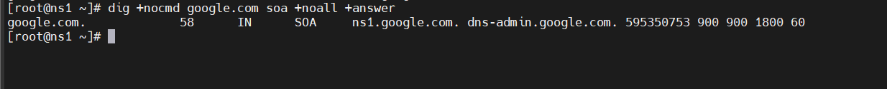

7. Truy vấn bản ghi TTL

- Sử dụng tùy chọn ttl

```
dig +nocmd google.com ttl +noall +answer 
```
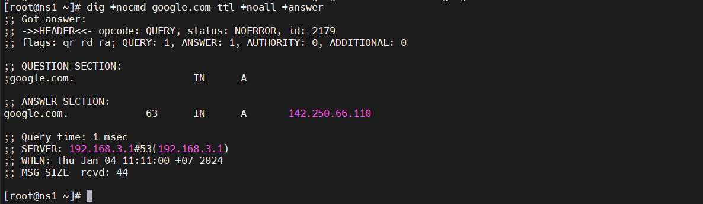

8.  Truy vấn tất cả bản ghi

- Sử dụng tùy chọn any

```
dig +nocmd google.com any +noall +answer
```
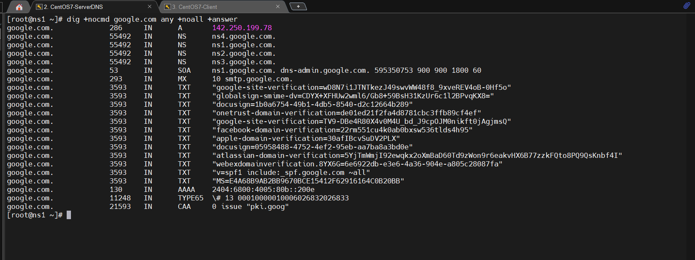


9. Tra cứu DNS ngược

- Để truy vấn tên máy chủ được liên kết với một địa chỉ IP cụ thể, hãy sử dụng tùy chọn `-x.`

*Ví dụ: Tra cứu địa chỉ IP 38.83.90.36 thành tên miền*

```
dig -x 38.83.90.36 +noall +answer
```

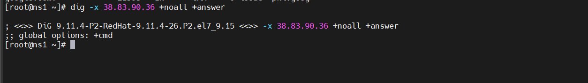

10. Truy vấn số lượng lớn tên miền

- Nếu bạn muốn truy vấn một số lượng lớn tên miền, bạn có thể thêm chúng vào một tệp và sử dụng tùy chọn -f để truy vấn.

*Trong ví dụ dưới đây, chúng tôi sẽ sử dụng các tên miền được liệt kê trong file domain.txt*s


11. Truy vấn DNS bằng TCP

- Theo mặc định thì lệnh dig truy vấn DNS qua udp, để có thể dùng lệnh dig truy vấn DNS qua tcp chúng ta thực hiện như sau:

```
dig +tcp [domain] 
```

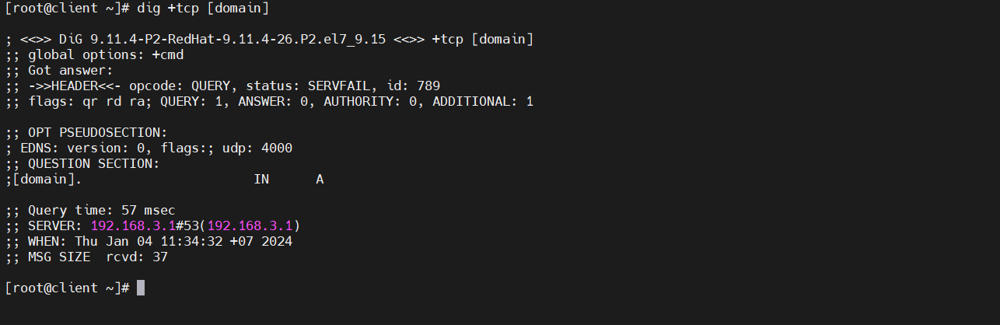

12. Điều chỉnh mặc định với tệp ~/.digrc

- Chúng ta có thể tạo tệp .digrc trong thư mục chính để bao gồm tùy chọn mà chúng ta muốn lệnh dig thực hiện. Chúng ta có thể chỉ định các tùy chọn khác nhau trong tệp ~/.digrc sẽ luôn tự động chạy khi sử dụng lệnh dig.
- Trong ví dụ dưới đây, chúng ta thêm tùy chọn +short vào ~/.digrc sau đó thực hiện lệnh dig:

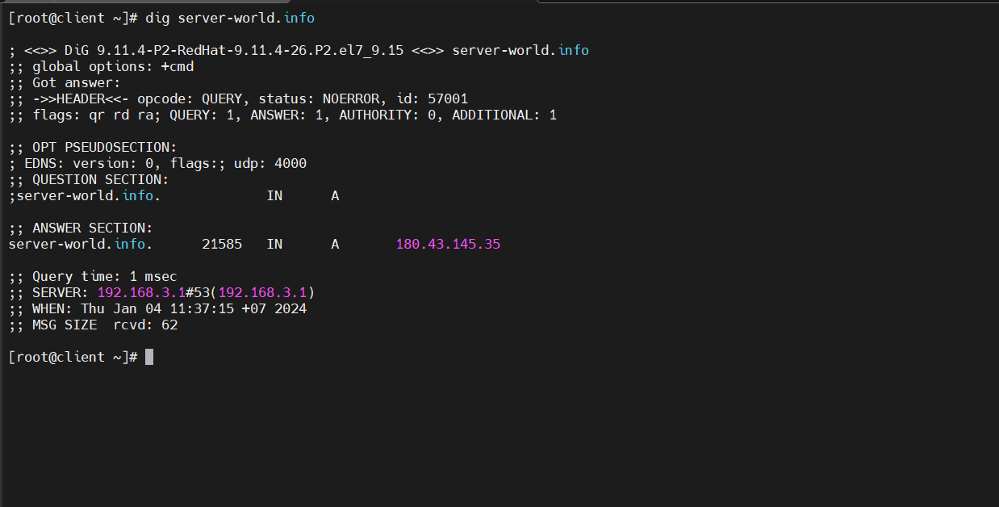


*Tài liệu tham khảo*

[1] [https://news.cloud365.vn/tim-hieu-ve-lenh-dig/](https://news.cloud365.vn/tim-hieu-ve-lenh-dig/)