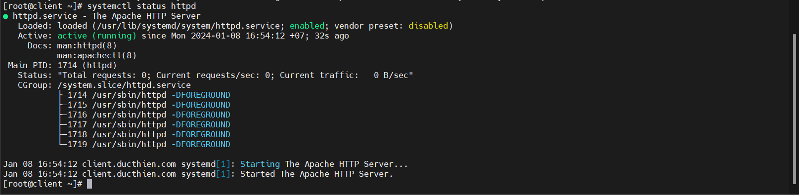
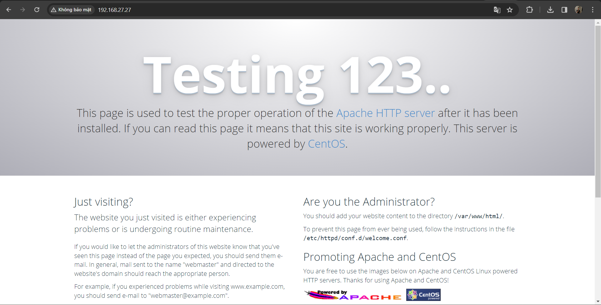
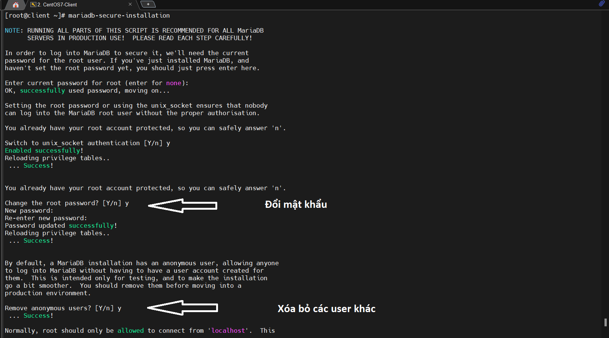
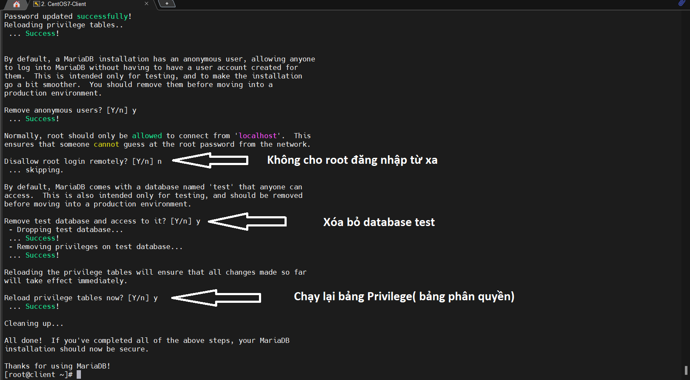
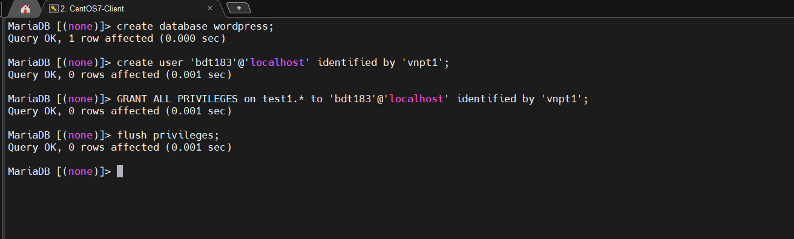
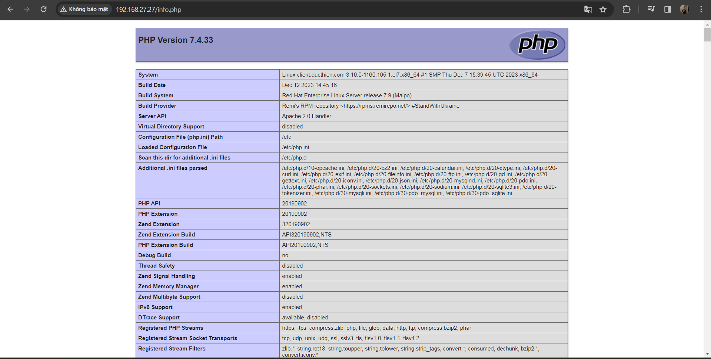
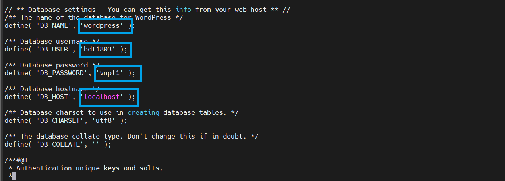
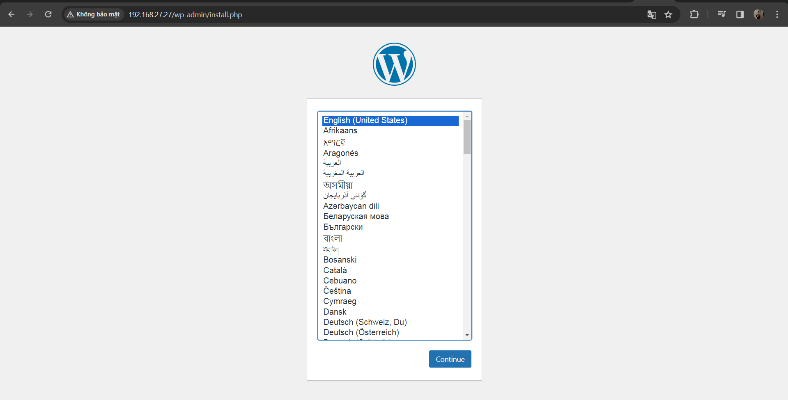
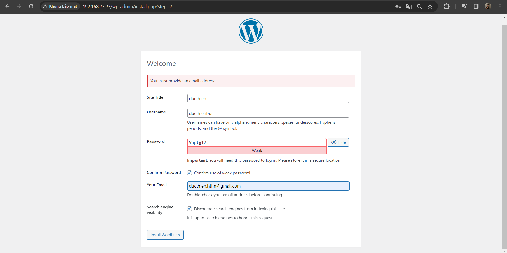
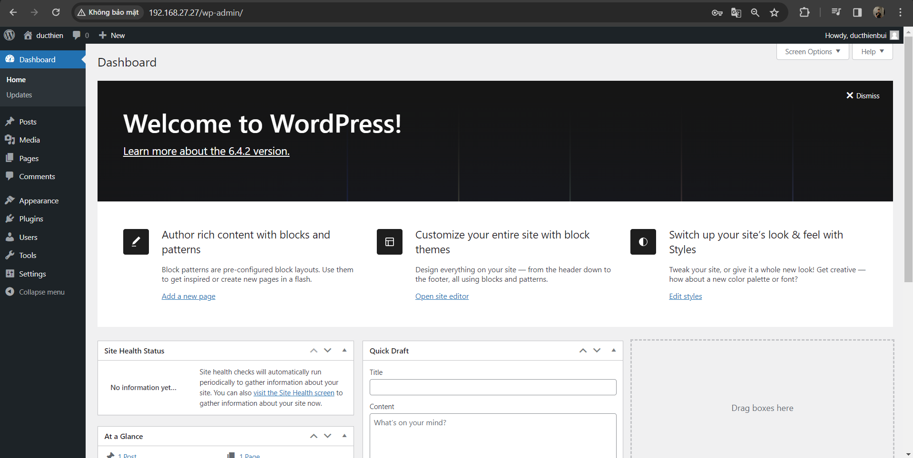

# Hướng dẫn cài đặt LAMP trên CentOS 7

LAMP là một hệ thống các phần mềm để tạo dựng môi trường máy chủ web có khả năng chứa và phân phối các trang web động được viết bằng PHP.


LAMP bao gồm:

- Linux: là hệ điều hành, cũng là phần mềm dùng để điều phối và quản lí các tài nguyên của hệ thống.
- Apache: là phần mềm máy chủ web, có thể thực hiện các request được gọi tới máy chủ thông qua giao thức HTTP
- Mysql/Mariadb: là hệ quản trị cơ sở dữ liệu giúp lưu trữ và truy xuất dữ liệu. Cả 2 hệ quản trị cơ sở dữ liệu này đều khá tương đồng với nhau (có thể tìm hiểu thêm tại đây)
- PHP: Là ngôn ngữ lập trình cho kịch bản hoạt động của máy chủ.

# 1.Tiến hành cài đặt

**Chuẩn bị**

*Cấu hình máy Server*
- Hệ điều hành: CentOS 7
- 1 CPU
- 512M RAM
- 2 interface

## 1.1.Cài đặt Apache

Để cài đặt, trên cửa sổ terminal gõ lệnh:

```
sudo yum -y install httpd
```

Cài xong, tiến hành khởi động lại service:

```
systemctl start httpd
systemctl enable httpd
```

Bạn có thể check lại trang thái hoạt động của service bằng cách gõ:

```
systemctl status httpd
```



Bạn cũng có thể kiểm tra trạng thái trên trình duyệt bằng cách gõ trên thanh url địa chỉ sau:

```
192.168.27.27
```



Nếu bạn sử dụng hệ điều hành trên máy ảo, bạn có thể tắt firewall để có thể truy cập trên browser của máy thực:

```
systemctl stop firewalld
```

Sau đó, gõ địa chỉ ip máy ảo trên thanh url cũng sẽ cho ra kết quả tương tự.


## 1.2.Cài đặt hệ quản lí cơ sở dữ liệu( MySQL-MariaDB)


Trên thực tế với LAMP, bạn có thể sử dụng mysql hoặc mariadb đều được, bài này mình sẽ hướng dẫn với Mysql

**Trên cửa sổ terminal, tiến hành cài đặt mariadb:**

```
wget http://repo.mysql.com/mysql-community-release-el7-5.noarch.rpm

rpm -ivh mysql-community-release-el7-5.noarch.rpm

yum install mysql-server
```

Tiến hành khởi động MySQL server:
```
systemctl start mysqld
```

Cài lại mật khẩu mật khẩu cho quyền root của cơ sở dữ liệu:

```
mysql_secure_installation
```

Lệnh này cho phép bạn cải thiện bảo mật cài đặt MariaDB theo các cách sau:

- Đặt mật khẩu cho tài khoản root .
- Xóa tài khoản root có thể truy cập từ bên ngoài localhost.
- Xóa tài khoản người dùng ẩn danh.
- Xóa cơ sở dữ liệu test (theo mặc định có thể được truy cập bởi tất cả người dùng, ngay cả người dùng ẩn danh) và các đặc quyền cho phép mọi người truy cập cơ sở dữ liệu có tên bắt đầu bằng test_.





**Tạo Database cho wordpress**

Đăng nhập vào MySQL với user root

```
mysql -u root -p
```

Tạo user và database để sử dụng cho wordpress

```
create database tên-database;

create user 'user'@'IP' identified by 'pass';

grant all privileges on tên-database to 'user'@'IP';

flush privileges;
```



Sau khi tạo Database ta có thể kiểm tra bằng 1 số lệnh sau 

```
SHOW DATABASES;
DROP DATABASE database_name;
Select user from mysql.user; 
SELECT User, Host FROM mysql.user;
DROP USER 'bdt1803'@'localhost';

```


## 1.3.Cài đặt php

Phiên bản có sẵn trong repo của CentOS đang là 5.4. Phiên bản này khá cũ và sẽ khiến bạn gặp một số vấn đề xảy ra khi tiến hành cài đặt wordpress. Vì vậy bạn cần phải cài đặt phiên bản 7x để khắc phục. Bạn cần tiến hành thêm kho vào Remi CentOS:

```
rpm -Uvh http://rpms.remirepo.net/enterprise/remi-release-7.rpm
```

Cài yum-utils vì chúng ta cần tiện ích yum-config-manager để cài đặt:
```
yum -y install yum-utils
```

Tiến hành cài đặt php. Ở đây ta cần lưu ý về phiên bản cài đặt như sau:

- Bản 7.0:

```
yum-config-manager --enable remi-php70
yum -y install php php-opcache php-mysql
```

- Bản 7.1:

```
yum-config-manager --enable remi-php71
yum -y install php php-opcache php-mysql
```

- Bản 7.2:

```
yum-config-manager --enable remi-php72
yum -y install php php-opcache php-mysql
```

- Bản 7.3:

```
yum-config-manager --enable remi-php73
yum -y install php php-opcache php-mysql
```

Trong bài này, mình cài phiên bản 7.2

Sau khi cài đặt xong, thực hiện restart lại apache:

```
systemctl restart httpd
```
Tiến hành kiểm tra kết quả. Ta thêm file sau:

```
echo "<?php phpinfo();?>" > /var/www/html/info.php
```
Sau đó restart lại apache:

```
systemctl restart httpd
```
Vào trình duyệt, gõ trên thanh url địa chỉ sau:

```
<địa chỉ ip>/info.php
```

Khi màn hình này xuất hiện, bạn đã thực hiện thành công!




## 1.4.CÀI WORDPRESS

Cài đặt công cụ download wget

```
yum install wget -y
```

Thay đổi thư mục hiện tại thành thư mục web:

```
cd /var/www/html
```

Tải xuống tệp WordPress mới nhất bằng cách chạy lệnh sau

```
wget https://wordpress.org/latest.tar.gz
```

Giải nén tệp WordPress trong thư mục hiện tại:

```
tar xvzf latest.tar.gz
```
Di chuyển các tệp từ thư mục wordpress vào thư mục web:

```
mv /var/www/html/wordpress/* /var/www/html
```

Thay đổi tệp cấu hình WordPress bằng cơ sở dữ liệu đã tạo.
```
mv wp-config-sample.php wp-config.php
```
Mở tệp wp-config.php:Chỉnh sửa các thông số cấu hình

```
vi wp-config.php
```



Hoàn thành quá trình cài đặt, ta truy cập lại đường link : `http://192.168.27.27`



Sau khi chọn ngôn ngữ ta chuyển sang giao diện cài đặt 



Hoàn thành thì sẽ chuyển đến phần đăng nhập

Và đây là kết quả sau khi cài đạt 




*Tài liệu tham khảo*

[1] [https://copyprogramming.com/howto/error-message-sudo-mysql-secure-installation-command-not-found](https://copyprogramming.com/howto/error-message-sudo-mysql-secure-installation-command-not-found)

[2] [https://news.cloud365.vn/huong-dan-cai-dat-lamp-tren-centos-7/](https://news.cloud365.vn/huong-dan-cai-dat-lamp-tren-centos-7/)

[3] [https://mariadb.com/resources/blog/installing-mariadb-10-on-centos-7-rhel-7/](https://mariadb.com/resources/blog/installing-mariadb-10-on-centos-7-rhel-7/)